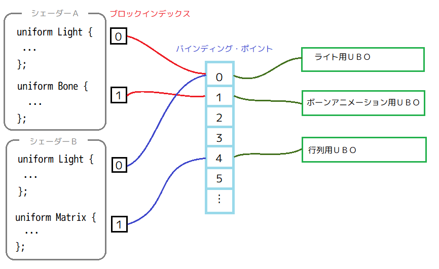

[OpenGL 3D 2019 後期 第01回]

# ライトがいっぱい

<br>

## 目標

* Uniform Buffer(ゆにふぉーむ・ばっふぁ)について理解する。
* GLSL(じーえるえすえる)のプログラミングについてのおさらい。
* 空間分割による検索を理解する。

## 1. GPUメモリをより汎用的に扱う方法

### 1.1 ユニフォーム変数の限界

ライトの位置やテクスチャといったデータをシェーダーに伝えるには「ユニフォーム変数(Uniform Variables)」を使います。定義できるユニフォーム変数の数には制限があり、どれだけの数を定義できるかはハードウェアやデバイス・ドライバによって違います。OpenGLの仕様では「シェーダーごとにfloat型換算で少なくとも1024個のユニフォーム変数が定義できなければならない」とされています(頂点シェーダーに1024個、フラグメントシェーダーに1024個といったように)。

1024という数を見て、思ったより余裕があると思ったかもしれません。しかし、例えばポイントライトを表すデータは「明るさ、位置」の２つが必要で、それぞれvec3型とすると6個のユニフォーム変数に相当します。スポットライトの場合は「明るさ、位置、方向、放射角」の４つが必要です。放射角をfloat型とすると、合計10個のユニフォーム変数を必要とします。２種類のライトが必要とするユニフォーム変数の数は平均8個ですから、1最大で1024/8=128個のライトを配置できることになります。128個もあれば十分すぎると感じるかもしれません。しかし、仮に現代の都市を舞台にしたゲームを作るとして、普段みなさんが目にするライトの数は128個で済むでしょうか？

また、実際にはテクスチャやアニメーションなどのデータも必要ですから、実際のライトとして使える数はせいぜい30～50個程度でしょう。実際、現代的なゲームでは数百のライトを取り扱いますから、全てのデータをユニフォーム変数だけでまかなうのは難しいと言わざるをえません。

さらもうひとつ、より重要な問題は「ユニフォーム変数はシェーダー・プログラムごとに独立している」という点です。このため、例えば同じライト・データを使うシェーダー・プログラムが４つあったとすると、ライトデータも４回コピーしなければなりません。同じデータを４つも持っておくのはメモリの無駄ですし、コピーに要する時間も無駄になります。

これらの問題を解決するため、OpenGL 3.1から「ユニフォーム・バッファ・オブジェクト(Uniform Buffer Object=UBO)」という機能が追加されました。

>［補足］近代的なGPUでは定義できるユニフォーム変数の数が4096に増加していますので、変数が足りなくなるということは起きにくくなっています。ただし、シェーダー・プログラムごとにコピーしなければならない点は一緒なので、ユニフォーム・バッファ・オブジェクトのほうが有利なことは変わりません。

### 1.2 ユニフォーム・バッファ・オブジェクト

ユニフォーム・バッファ・オブジェクトは英語では「Uniform Buffer Object」と書きます。名前が長いので、その略称である「UBO(ゆー・びー・おー)」で表記されることが多いです。本講義でも、以降はUBOと書くことにします。

UBOの役割は、GPUメモリの一部をユニフォーム変数として扱えるようにすることです。UBOのサイズはGPUメモリが許す限りどれだけ大きくても構いません。また、複数のUBOを作成することもできます。

ただし、シェーダープログラムはUBOの全ての領域を扱えるわけではありません。ハードウェアやデバイス・ドライバによりますが、通常はUBOの一部分をシェーダープログラムに割り当てることになります。一度に割り当てられるサイズの最大値は、OpenGLの仕様で「16キロバイト以上」と決められています。ユニフォーム変数の場合はfloat型で1024個で、これは4キロバイトになりますから、UBOのほうが4倍のデータを扱えるわけです。

>［補足］UBOのサイズも、近代的なGPUでは拡張されていて、IntelとNvidiaのGPUは「64キロバイト」、AMDのGPUは「メモリの許す限り(ほぼ無制限)」となっています。

### 1.3 インターフェイス・ブロック

シェーダーからUBOを扱うには「インターフェイス・ブロック」という機能を使用します。

Interface Blockは複数の変数をまとめる仕組みです。uniformだけでなくin/out変数にも使えるのですが、特にuniform変数では位置の取得やデータ転送をブロック単位で行えるため、とても便利です。Uniform変数をブロック化したものは「Uniform Block(ユニフォーム・ブロック)」と呼ばれます。

さて、Interface Blockは次のような構造をしています。

```c++
storage_qualifier block_name
{
  <block members…>
} instance_name;
```

「storage_qualifier(すとれーじ・くおりふぁいあ)」には、layout/uniform/in/outなど、ブロック全体の修飾子を指定します。「block_name(ぶろっく・ねーむ)」はブロックの名前です。アプリケーションからブロックの位置を取得する場合などに使います。中括弧の内側には1つ以上のブロックメンバ変数を定義します。閉じ中括弧の後にある「instance_name(いんすたんす・ねーむ)」はブロックをシェーダから参照するときの名前です。instance_nameは省略可能で、省略した場合は直接メンバ変数にアクセスできます。省略しない場合は「インスタンス名.メンバ変数名」でアクセスします。注意点として、instance_nameはアプリケーションからは見えません。アプリケーションからメンバ変数の位置を知りたいときは、「ブロック名::メンバ変数名」としなければなりません。

実際に書いてみましょう。目的は「スタティックメッシュを描画するときに、ライティングが行われるようにすること」とします。そういうわけですから、インターフェイス・ブロックを追加する対象は、StaticMesh.fragに書かれたシェーダー・プログラムになります。StaticMesh.fragを開き、ライト用の構造体とインターフェイス・ブロックを追加してください。

```diff
 out vec4 fragColor;

 uniform sampler2D texColor;
+
+struct AmbientLight {
+  vec4 color;
+};
+
+struct DirectionalLight {
+  vec4 color;
+  vec4 direction;
+};
+
+struct PointLight {
+  vec4 color;
+  vec4 position;
+};
+
+struct SpotLight {
+  vec4 color;
+  vec4 dirAndCutOff;
+  vec4 posAndInnerCutOff;
+};
+
+layout(std140) uniform LightUniformBlock
+{
+  AmbientLight ambientLight;
+  DirectionalLight directionalLight;
+  PointLight pointLight[100];
+  SpotLight spotLight[100];
+};
+
+uniform int pointLightCount; // ポイントライトの数.
+uniform int pointLightIndex[8];
+
+uniform int spotLightCount; // スポットライトの数.
+uniform int spotLightIndex[8];
+
 /**
 * スタティックメッシュ用フラグメントシェーダー.
```

「layout(std140) uniform LightUniformBlock」と書かれている部分がインターフェイス・ブロックです。ストレージ・クオリファイアにはlayoutとuniformが指定されています。layoutはシェーダーの間で変数の入出力先を決めるlocation修飾子を指定するときに使いましたね。今回出てきた「std140(えすてぃーでぃー・ひゃくよんじゅう)」というのは「メモリ・レイアウト」つまり「変数をメモリに配置する順序」を指定するための修飾子です。メモリ・レイアウト修飾子には以下の4種類があります。

* packed: 変数を実装依存の方法でメモリに配置します。変数がシェーダ内で使われていない場合、実装はその変数を削除することがあります。そのため、インターフェース・ブロック内で連続した変数であっても、それぞれ個別にglGetUniformLocation関数で位置を取得しなければなりません。これは、何も指定しない場合のデフォルトのメモリ・レイアウトです。
* shared: packedと同様に実装依存の方法で配置しますが、使われていない変数を削除することはありません。また、同じ定義を持つインターフェース・ブロックであれば、異なるプログラムオブジェクト間でも同じようにメモリに配置されることが保証されます(あるプログラムオブジェクトに対してglGetUniformLocation関数で取得した位置が、他のプログラムオブジェクトでも使える、ということです)。
* std140: このメモリ・レイアウトは実装非依存です。つまり、どのような実装であっても、全く同じようにメモリに配置されることが保証されています。そのため、インターフェイス・ブロックの先頭位置が分かれば、ブロック内の全ての変数の配置が分かります。実装によらない配置を保証するために、変数の型によっては間に余分なメモリ領域が挟み込まれる場合がありますが、これによってCPU側でデータを組み立てるプログラムでは、実装による違いを考慮する必要がなくなります。
* std430: std140から余分なメモリ領域の挟み込みを減らしたバージョンです。このメモリ・レイアウトはOpenGL 4.3で追加されたShader Storage Block専用なので、残念ながらUniform Blockでは使えません。

近代的なハードウェアを想定したプログラムでUBOを利用する場合、インターフェイス・ブロックには常にstd140修飾子を選んでおいて問題はないでしょう。

layout修飾子の次にあるuniform修飾子は、変数がアプリケーションから渡されるパラメータであることを示すのでした。uniformの次にくるのはブロック名です。ブロック名には任意の名前を付けることができますので、今回はライト用のブロックだということが分かるように「LightUniformBock(らいと・ゆにふぉーむ・ぶろっく)」という名前にしました。

ブロック名の直後の中括弧の内側が、インターフェイス・ブロックの内容になります。今回は環境光、ディレクショナルライト、ポイントライト、スポットライトの４つの変数を定義しています。環境光とディレクショナルライトはそれぞれ1個、ポイントライトとスポットライトは100個まで作れるようにしました。なぜ環境光とディレクショナルライトが1つだけかというと、まず環境光ですが、これは一般的にある空間ごとに一意の明るさを持つ事が多いので、モデルの種類や位置によらず一定の明るさになると考えられるからです。次にディレクショナルライトですが、これは一般的には太陽を模倣するためのライトですから、ひとつあれば十分です。

対して、ポイントライトやスポットライトは様々な用途で利用され、明るさもさまざまですから、たくさん用意できるようにしたわけです。また、このような光源は、モデルごとに影響を受けるライトが違ってきます。そこで、影響を受けるライトの個数と番号を受け取るようにしています。これがpointLightCount, pointLightIndex, spotLightCount, spotLightIndexの4つのユニフォーム変数の役割です。影響を受けるライトの個数はポイントライトとスポットライトでそれぞれ最大8個としました。影響するライトの個数少なすぎると、近くにライトがたくさんあっても反映されないため不自然になりますし、逆に多すぎると、今度は計算に時間がかかりすぎるからです。

>［補足］環境光は「GI(ぐろーばる・いるみねーしょん、大域照明)」という照明を大胆に近似したものです。現代的なゲームではより高度なテクニックによって置き換えられていますが、そのようなテクニックを習得するにはさまざまな前提知識が必要となり、本講義の範囲を超えてしまうため扱いません。興味のある方は「Sparse Voxel Octree」「Precomputed Radiance Transfer」「Light Propagation Volume」「Photon Mapping」などで検索してみてください。

>［補足］ライトの座標や色にvec3型ではなくvec4型を使っているのには理由があります。これらのパラメータで実際に使われるのはX,Y,ZあるいはR,G,Bの３要素だけなので、本来はvec3型を使うべきです。しかし、std140メモリ・レイアウトでは、vec3の代わりにvec4を使うことが推奨されています。これはOpenGLの発展における歴史的な事情によります。過去にさまざまな組織がstd140メモリ・レイアウトを実装していく中で、vec3型の扱い一致しない時期があったようです。そのため、移植性を考慮するならstd140ではvec3は一切使用しないほうが安全です。なお、floatやvec2については問題はなかったようです。現代のハードウェアとデバイス・ドライバでは「vec3の直後に見えないfloat型を追加してvec4と同じレイアウトにする」というルールが守られているので、vec3でも問題が起きることはまずありませんが、結局のところvec3にしたところでvec4と同じだけのメモリ領域を使ってしまうので、安全側に倒すほうがよいでしょう。

### 1.4 ライトの計算プログラムを追加する

続いて、ライトの計算を行うシェーダー・プログラムを書きましょう。StaticMesh.fragのmain関数を次のように変更してください。

```diff
 * スタティックメッシュ用フラグメントシェーダー.
 */
 void main()
 {
-  // 暫定でひとつの平行光源を置く.
-  vec3 vLight = normalize(vec3(1, -2, -1));
-  float power = max(dot(normalize(inNormal), -vLight), 0.0) + 0.2;
+  vec3 normal = normalize(inNormal);
+  vec3 lightColor = ambientLight.color.rgb;
+  float power = max(dot(normal, -directionalLight.direction.xyz), 0.0);
+  lightColor += directionalLight.color.rgb * power;
+
+  for (int i = 0; i < pointLightCount; ++i) {
+    int id = pointLightIndex[i];
+    vec3 lightVector = pointLight[id].position.xyz - inPosition;
+    vec3 lightDir = normalize(lightVector);
+    float cosTheta = clamp(dot(normal, lightDir), 0.0, 1.0);
+    float intensity = 1.0 / (1.0 + dot(lightVector, lightVector));
+    lightColor += pointLight[id].color.rgb * cosTheta * intensity;
+  }
+
+  for (int i = 0; i < spotLightCount; ++i) {
+    int id = spotLightIndex[i];
+    vec3 lightVector = spotLight[id].posAndInnerCutOff.xyz - inPosition;
+    vec3 lightDir = normalize(lightVector);
+    float cosTheta = clamp(dot(normal, lightDir), 0.0, 1.0);
+    float intensity = 1.0 / (1.0 + dot(lightVector, lightVector));
+    float spotCosTheta = dot(lightDir, -spotLight[id].dirAndCutOff.xyz);
+    float cutOff = smoothstep(spotLight[id].dirAndCutOff.w,
+      spotLight[id].posAndInnerCutOff.w, spotCosTheta);
+    lightColor += spotLight[id].color.rgb * cosTheta * intensity * cutOff;
+  }
+
   fragColor = texture(texColor, inTexCoord);
-  fragColor.rgb *= power;
+  fragColor.rgb *= lightColor;
 }
```

このプログラムは、lightColor(らいと・からー)という変数を定義して、全てのライトの計算結果を加算しています。環境光と平行光源は常にあるものとして計算し、ポイントライトとスポットライトについては個数をそれぞれpointLightCount, spotLightCountというユニフォーム変数で受け取って、for文を使って個数分の明るさを計算するようになっています。

シェーダー・プログラム側の準備はこれでおしまいです。

### 1.5 ライトデータ扱うプログラムを追加する

C++プログラムの側でもインターフェイス・ブロックと同じ構造体を定義していきます。実のところ、同じ構造にする必要はないのですが、構造を揃えておくとデータを設定するときに考える必要がなくなるという利点があります。

Srcフォルダに「Light.h」というファイルを追加して、次のプログラムを書き込んでください。

```c++
/**
* @file Light.h
*/
#ifndef LIGHT_H_INCLUDED
#define LIGHT_H_INCLUDED
#include <GL/glew.h>
#include "Shader.h"
#include "UniformBuffer.h"
#include "Actor.h"
#include <glm/glm.hpp>
#include <vector>
#include <math.h>

/**
* 環境光.
*/
struct AmbientLight
{
  glm::vec4 color = glm::vec4(0.1f, 0.05f, 0.15f, 1);
};

/**
* 指向性ライト.
*/
struct DirectionalLight
{
  glm::vec4 color = glm::vec4(1);
  glm::vec4 direction = glm::vec4(0, -1, 0, 1);
};

/**
* ポイントライト.
*/
struct PointLight
{
  glm::vec4 color = glm::vec4(1);
  glm::vec4 position = glm::vec4(0);
};

// スポットライト.
struct SpotLight
{
  glm::vec4 color = glm::vec4(1);
  glm::vec4 dirAndCutOff = glm::vec4(0, -1, 0, 0.9f);
  glm::vec4 posAndInnerCutOff = glm::vec4(0, 0, 0, 0.95f);
};

/**
* ライト用インターフェイス・ブロックに対応する構造体.
*/
struct LightUniformBlock
{
  AmbientLight ambientLight;
  DirectionalLight directionalLight;
  PointLight pointLight[100];
  SpotLight spotLight[100];
};

#endif // LIGHT_H_INCLUDED
```

C++のプログラムでは、LightUniformBlockは単なる構造体であって、インターフェイス・ブロックではない点に注意してください。

次に、ライトを制御するための仕組みを追加します。そういった機能を新しく作るのは面倒なので、アクターの仕組みを流用することにします。Actor::Update関数をオーバーライドすることで、明るさが変化したり、位置や向きが変わっていくようなライトを作ることができます。それでは、 LightBufferクラスの定義の下に、次のプログラムを追加してください。

```diff
   PointLight pointLight[100];
   SpotLight spotLight[100];
 };
+
+/**
+* ディレクショナルライトアクター.
+*/
+class DirectionalLightActor : public Actor
+{
+public:
+  DirectionalLightActor(const std::string& name, const glm::vec3& c,
+    const glm::vec3& d) : Actor(name, 1, glm::vec3(0)), color(c), direction(d)
+  {}
+  ~DirectionalLightActor() = default;
+
+public:
+  glm::vec3 color;
+  glm::vec3 direction;
+};
+using DirectionalLightActorPtr = std::shared_ptr<DirectionalLightActor>;
+
+/**
+* ポイントライトアクター.
+*/
+class PointLightActor : public Actor
+{
+public:
+  PointLightActor(const std::string& name, const glm::vec3& c,
+    const glm::vec3& p) : Actor(name, 1, p), color(c)
+  {}
+  ~PointLightActor() = default;
+
+public:
+  glm::vec3 color;
+  int index = -1;
+};
+using PointLightActorPtr = std::shared_ptr<PointLightActor>;
+
+/**
+* スポットライトアクター.
+*/
+class SpotLightActor : public Actor
+{
+public:
+  SpotLightActor(const std::string& name, const glm::vec3& c,
+    const glm::vec3& p, const glm::vec3& d, float cutOff, float innerCutOff) :
+    Actor(name, 1, p), color(c), direction(d),
+    cutOff(std::cos(cutOff)), innerCutOff(std::cos(innerCutOff))
+  {
+    position = p;
+  }
+  ~SpotLightActor() = default;
+
+public:
+  glm::vec3 color;
+  glm::vec3 direction;
+  float cutOff;
+  float innerCutOff;
+  int index = -1;
+};
+using SpotLightActorPtr = std::shared_ptr<SpotLightActor>;
```

続いて、ライトのデータをUBOにコピーするためのクラスを定義します。SpotLightActor構造体の定義の下に、次のプログラムを追加してください。

```diff
   float innerCutOff;
   int index = -1;
 };
 using SpotLightActorPtr = std::shared_ptr<SpotLightActor>;
+
+/**
+* UBOを利用してライトデータをGPUに転送するためのクラス.
+*/
+class LightBuffer
+{
+public:
+  LightBuffer() = default;
+  ~LightBuffer() = default;
+  bool Init(GLuint bindingPoint);
+  bool BindToShader(const Shader::ProgramPtr& program);
+  void Update(const ActorList& al, const glm::vec3& ambientColor);
+  void Upload();
+  void Bind();
+
+private:
+  LightUniformBlock data;
+  UniformBufferPtr ubo[2];
+  int currentUboIndex = 0; ///< UBOダブルバッファの書き込み側インデックス.
+};
```

LightBufferクラスはUBOを取り扱うUniformBufferクラスを通じてUBOを操作します。このクラスはスケルタルメッシュのプログラムのときに追加してもらったものです。

さて、LightBufferクラスは次のような使い方を想定しています。

1. Init関数でUBOを作成する.
2. BindToShader関数でUBOとシェーダーを結びつける.
3. Update関数でUBOにコピーするデータを作成し、ポイントライトとスポットライトのインデックスを更新する.
4. Upload関数でデータをUBOへコピーする.
5. Bind関数でUBOをGLコンテキストに結びつける.

上記の手順を実行するタイミングは、1,2はシーンの初期化関数で、3はシーンのUpdate関数で、4, 5はシーンのRender関数で実行することを想定しています。

### 1.6 LightBufferクラスのメンバ関数を定義する

それでは、LightBufferクラスのメンバ関数を定義していきましょう。SrcフォルダにLight.cppというファイルを追加します。追加したファイルを開き、次のプログラムを追加してください。

```c++
/**
* @file Light.cpp
*/
#include "Light.h"
#include <iostream>

namespace /* unnamed */ {

const char UniformBlockName[] = "LightUniformBlock";

} // unnamed namespace
```

最初は必要なヘッダファイルのインクルードと、インターフェイス・ブロックの名前の定義だけです。StaticMesh.fragに書いたインターフェイス・ブロックの名前と違っているとバインドに失敗するので注意してください。

続いて、Init関数を定義します。unnamed namespace(無名名前空間)の下に、次のプログラムを追加してください。

```diff
 const char LightUniformBlockName[] = "LightUniformBlock";

 } // unnamed namespace
+
+/**
+* ライト用ユニフォームバッファを作成する.
+*
+* @param bindingPoint ユニフォームバッファに割り当てる管理番号.
+*/
+bool LightBuffer::Init(GLuint bindingPoint)
+{
+  ubo[0] = UniformBuffer::Create(sizeof(data), bindingPoint, UniformBlockName);
+  ubo[1] = UniformBuffer::Create(sizeof(data), bindingPoint, UniformBlockName);
+  currentUboIndex = 0;
+
+  return ubo[0] && ubo[1];
+}
```

UBOとシェーダー・プログラムは、GLコンテキストにある「バインディング・ポイント」という場所を介して結び付けられる仕組みになっています。OpenGLでは、オブジェクト同士を結びつけることを「バインドする」といいます。GLコンテキストには複数のバインディング・ポイントが用意されていて、0から順番に番号が付けられています。この関数の引数はどのバインディング・ポイントを使うかを決めるためのものです。バインディング・ポイントの番号の最大値は環境依存ですが、OpenGL 4.3では少なくとも72個(つまり0～71)は使えることになっています。正確な最大値を知るにはglGetIntegerv関数の引数にGL_MAX_UNIFORM_BUFFER_BINDINGSを指定します。

UniformBuffer::Create関数は、UBOを作成する関数です。2個のUBOを作成しているのは「ダブル・バッファ」というテクニックを使うためです。CPUとGPUは並列に動作します。もしGPUが参照している途中のデータを、CPU側でうっかり買い替えてしまうと、おかしな画像が描かれてしまうことがあります。そこで、CPUとGPUが見てるUBOを分離し、CPUがすべてのデータを更新したUBOをGPUから参照してもらい、次はGPUが参照していないほうのUBOを更新する、というように、2つのバッファを用意して、交互に使うようにします。これが「ダブル・バッファ」というテクニックです。currentUboIndex(かれんと・ゆーびーおー・いんでっくす)という変数は、CPUがどちらのUBOを利用するかを決めるために使います。

<div style="text-align: center;width: 100%;">

</div>

BindToShader(ばいんど・とぅ・しぇーだー)関数は、UBOとシェーダー・プログラムを結びつけます。Init関数の定義の下に、次のプログラムを追加してください。

```diff
   return ubo[0] && ubo[1];
 }
+
+/**
+* シェーダープログラムにスケルタルメッシュの制御用データのバインディングポイントを設定する.
+*
+* @param program バインディングポイント設定先のシェーダープログラム.
+*
+* @retval true  設定成功.
+* @retval false 設定失敗.
+*/
+bool LightBuffer::BindToShader(const Shader::ProgramPtr& program)
+{
+  const GLuint id = program->Get();
+  const GLuint blockIndex = glGetUniformBlockIndex(id, UniformBlockName);
+  if (blockIndex == GL_INVALID_INDEX) {
+    std::cerr << "[エラー] Uniformブロック'" << UniformBlockName << "'が見つかりません\n";
+    return false;
+  }
+  glUniformBlockBinding(id, blockIndex, ubo[0]->BindingPoint());
+  const GLenum result = glGetError();
+  if (result != GL_NO_ERROR) {
+    std::cerr << "[エラー] Uniformブロック'" << UniformBlockName << "'のバインドに失敗\n";
+    return false;
+  }
+  return true;
+}
```

シェーダー・プログラムをバインディング・ポイントにバインドするには、まずglGetUniformBlockIndex関数でバインドしたいインターフェイス・ブロックのインデックスを取得し、次にglUniformBlockBinding関数でそのインデックスをバインディング・ポイントにバインドします。

glGetUniformBlockIndexは、Uniform Blockの位置を取得する関数です。位置は0以上の値かGL_INVALID_INDEXのいずれかになります。GL_INVALID_INDEXだった場合は第2引数で与えたブロック名のUniform Blockが見つからなかったことを示します。この場合、指定したブロック名の綴りが間違っている可能性がありますので、UniformBlockName変数の定義を確認してください。

glUniformBlockBindingは「バインディング・ポイント」にインターフェイス・ブロックを結びつけます。最初の引数はインターフェイス・ブロックを所有するプログラムオブジェクトです。2つめの引数は、割り当てるインターフェイス・ブロックのインデックスで、最後の引数はバインディング・ポイントの番号です。

この関数を実行することで、シェーダー・プログラムのインターフェイス・ブロックがバインディング・ポイントに結び付けられます。残りの「UBOとバインディング・ポイントを結びつける」処理は、あとから実装するLightBuffer::Bind関数で行います。

LightBuffer::Update関数はUBOに設定するためのデータを作成します。BindToShader関数の定義の下に、次のプログラムを追加してください。

```diff
     return false;
   }
   return true;
 }
+
+/**
+* GPUへ転送するライトデータを更新する.
+*
+* @param al           ライトのアクターリスト.
+* @param ambientColor 環境光の明るさ.
+*/
+void LightBuffer::Update(const ActorList& al, const glm::vec3& ambientColor)
+{
+  data.ambientLight.color = glm::vec4(ambientColor, 0);
+
+  int pointLightCount = 0;
+  int spotLightCount = 0;
+  for (auto i = al.begin(); i != al.end(); ++i) {
+    if (DirectionalLightActorPtr p =
+      std::dynamic_pointer_cast<DirectionalLightActor>(*i)) {
+      data.directionalLight.color = glm::vec4(p->color, 0);
+      data.directionalLight.direction = glm::vec4(p->direction, 0);
+    } else if (PointLightActorPtr p = std::dynamic_pointer_cast<PointLightActor>(*i)) {
+      if (pointLightCount < 100) {
+        p->index = pointLightCount;
+        PointLight& light = data.pointLight[pointLightCount];
+        light.color = glm::vec4(p->color, 1);
+        light.position = glm::vec4(p->position, 1);
+        ++pointLightCount;
+      }
+    } else if (SpotLightActorPtr p = std::dynamic_pointer_cast<SpotLightActor>(*i)) {
+      if (spotLightCount < 100) {
+        p->index = spotLightCount;
+        SpotLight& light = data.spotLight[spotLightCount];
+        light.color = glm::vec4(p->color, 1);
+        light.dirAndCutOff = glm::vec4(p->direction, p->cutOff);
+        light.posAndInnerCutOff = glm::vec4(p->position, p->innerCutOff);
+        ++spotLightCount;
+      }
+    }
+  }
+}
```

この関数はライトアクターを含むアクターリストから、UBOに設定するデータを作成します。ただ、ActorList型が保持するのはActorPtrなので、そのままではライトアクターかどうかは分かりません。そこで、std::dynamic_pointer_castというC++標準ライブラリの関数を使っています。この関数は、ポインタが指すオブジェクトの実体が、指定された型であるか、またはその型を継承している場合にのみ、型の変換に成功します。つまり、

`PointLightActorPtr p = std::dynamic_pointer_cast<PointLightActor>(*i)`

と書いたとき、`*i`が実際にPointLightActorを指していればpには型変換されたポインタが格納されます。しかし、`*i`がStaticMeshActorを指している場合は変換に失敗し、pにはnullptrが格納されます。つまり、std::dynamic_pointer_cast関数を使えば、ポインタが実際に指しているオブジェクトの種類が分かるわけです。

ポインタが得られれば、あとはライトに応じた方法でdata変数にデータをコピーしていくだけです。

LightBuffer::Upload関数は、Update関数で作成したライトデータをUBOにコピーします。LightBuffer::Updata関数の定義の下に、次のプログラムを追加してください。

```diff
         ++spotLightCount;
       }
     }
   }
 }
+
+/**
+* ライトデータをGPUメモリに転送する.
+*/
+void LightBuffer::Upload()
+{
+  UniformBufferPtr pUbo = ubo[currentUboIndex];
+  pUbo->BufferSubData(&data, 0, sizeof(data));
+  currentUboIndex = !currentUboIndex;
+}
```

UBOにデータをコピーするにはUniformBufferクラスのBufferSubData(ばっふぁー・さぶ・でーた)関数を使います。最初の引数はコピーするデータのポインタです。2つめの引数はどの位置からコピーするかを示す値です。今回は全体をコピーしたいので0を指定しています。3つめの引数はコピーするバイト数です。

コピーが済んだら「！演算子」を用いてcurrentUboIndexの値を反転しています。「！演算子」は「対象の真偽値を反転する」ので、currentUboIndexが0のときはtrue、それ以外のときはfalseが返されます。そして、trueは1、falseは0に変換できるので、currentUboIndex変数の値はこの関数を実行するたびに0→1、1→0と交互に切り替わることになるのです。そして、この関数の1行目でcurrentUboIndexを使ってコピーするUBOを決めています。こうして、２つのバッファを交互に切り替えているわけです。

LightBuffer::Bind関数は、UBOをGLコンテキストに結びつけます。LightBuffer::Upload関数の定義の下に、次のプログラムを追加してください。

```diff
   currentUboIndex = !currentUboIndex;
 }
+
+/**
+* ライト用UBOをGLコンテキストのUBO用バインディングポイントに割り当てる.
+*/
+void LightBuffer::Bind()
+{
+  ubo[!currentUboIndex]->BindBufferRange(0, sizeof(data));
+}
```

UBOをバインディング・ポイントにバインドするには「glBindBufferRange(じーえる・ばいんど・ばっふぁ・れんじ)」という関数を使います。glBindBufferRangeはバインディング・ポイントの指定と、バインドするメモリの範囲を指定する関数です。割り当てるUBOを選択するとき「！演算子」を用いることでGPU用のUBOを選んでいる点に注目してください。このように、CPU用のUBOを選ぶときは「currentUboIndex」、GPU用のUBOを選ぶときは「!currentUboIndex」とすることで、２つのUBOを使い分けています。

LightBufferの利用手順どおりに実行されている場合、既にBindToShader関数でインターフェイス・ブロックとバインディング・ポイントを結びつけていますので、この関数をもってUBO-バインディング・ポイント-インターフェイス・ブロックという接続が確立することになります。

<div style="page-break-after: always"></div>

## 2. Shaderクラスの変更

### 2.1 古いライト用のプログラムを削除する

ライトの仕組みを新しくしたので、以前のプログラムで利用していたライト用の変数や関数は不要です。残しておいてもじゃまになるため消してしまいましょう。Shader.hを開き、次のようにライトに関する構造体を削除してください。

```diff
 GLuint Build(const GLchar* vsCode, const GLchar* fsCode);
 GLuint BuildFromFile(const char* vsPath, const char* fsPath);
-
-/**
-* 環境光
-*/
-struct AmbientLight
-{
-
-...省略...
-
-struct LightList
-{
-  AmbientLight ambient;
-  DirectionalLight directional;
-  PointLight point;
-  SpotLight spot;
-
-  void Init();
-};

 /**
 * シェーダー・プログラム
 */
 class Program {
```

同様に、メンバ関数とメンバ変数も削除してください。

```diff
   void BindTexture(GLuint, GLuint);
-  void SetLightList(const LightList&);
   void SetViewProjectionMatrix(const glm::mat4&);
   void SetModelMatrix(const glm::mat4&);

   /// プログラムIDを取得する.
   GLuint Get() const { return id; }

 private:
   GLuint id = 0; //プログラムID

   //// uniform変数の位置
   GLint locMatMVP = -1;
   GLint locMatModel = -1;
-  GLint locPointLightPos = -1;
-  GLint locPointLightCol = -1;
-  GLint locDirLightDir = -1;
-  GLint locDirLightCol = -1;
-  GLint locAmbLightCol = -1;
-  GLint locSpotLightDir = -1;
-  GLint locSpotLightPos = -1;
-  GLint locSpotLightCol = -1;

   glm::mat4 matVP = glm::mat4(1); //ビュー・プロジェクション行列
-  LightList lights;
 };
```

Shader.cppを開き、次のようにライトに関するプログラムを削除してください。

```diff
   const std::vector<GLchar> fsCode = ReadFile(fsPath);
   return Build(vsCode.data(), fsCode.data());
 }
-
-/**
-* ライトリストを初期化する.
-*
-* 全ての光源の明るさを０にする.
-*/
-void LightList::Init()
-{
-  ambient.color = glm::vec3(0);
-  directional.color = glm::vec3(0);
-  for (int i = 0; i < 8; ++i) {
-    point.color[i] = glm::vec3(0);
-  }
-  for (int i = 0; i < 4; ++i) {
-    spot.color[i] = glm::vec3(0);
-  }
-}

 /**
 * コンストラクタ
 */
 Program::Program()
 {
-  lights.Init();
 }
```

```diff
 void Program::Reset(GLuint programId)
 {
   glDeleteProgram(id);
   id = programId;
   if (id == 0) {
     locMatMVP = -1;
     locMatModel = -1;
-    locPointLightPos = -1;
-    locPointLightCol = -1;
-    locDirLightDir = -1;
-    locDirLightCol = -1;
-    locAmbLightCol = -1;
-    locSpotLightDir = -1;
-    locSpotLightPos = -1;
-    locSpotLightCol = -1;
     return;
   }

   locMatMVP = glGetUniformLocation(id, "matMVP");
   locMatModel = glGetUniformLocation(id, "matModel");
-  locPointLightPos = glGetUniformLocation(id, "pointLight.position");
-  locPointLightCol = glGetUniformLocation(id, "pointLight.color");
-  locDirLightDir = glGetUniformLocation(id, "directionalLight.direction");
-  locDirLightCol = glGetUniformLocation(id, "directionalLight.color");
-  locAmbLightCol = glGetUniformLocation(id, "ambientLight.color");
-  locSpotLightPos = glGetUniformLocation(id, "spotLight.posAndInnerCutOff");
-  locSpotLightDir = glGetUniformLocation(id, "spotLight.dirAndCutOff");
-  locSpotLightCol = glGetUniformLocation(id, "spotLight.color");

  const GLint texColorLoc = glGetUniformLocation(id, "texColor");
  if (texColorLoc >= 0) {
```

```diff
   glActiveTexture(GL_TEXTURE0 + unitNo);
   glBindTexture(GL_TEXTURE_2D, texId);
 }
-
-/**
-* 描画に使われるライトを設定する
-*
-* @param lights 設定する
-*/
-void Program::SetLightList(const LightList& lights)
-{
-  this->lights = lights;
-
-  //ライトの色情報をGPUメモリに転送する
-  if (locAmbLightCol >= 0) {
-    glUniform3fv(locAmbLightCol, 1, &lights.ambient.color.x);
-  }
-  if (locDirLightCol >= 0) {
-    glUniform3fv(locDirLightCol, 1, &lights.directional.color.x);
-  }
-  if (locPointLightCol >= 0) {
-    glUniform3fv(locPointLightCol, 8, &lights.point.color[0].x);
-  }
-  if (locSpotLightCol >= 0) {
-    glUniform3fv(locSpotLightCol, 4, &lights.spot.color[0].x);
-  }
-}

 /**
 * 描画に使われるビュー・プロジェクション行列を設定する.
```

これで古いライト用のプログラムは削除されました。

### 2.2 新しいライト用のプログラムを追加する

それでは、新しいライト用のプログラムを追加していきましょう。Shader.hを開き、Programクラスに次のプログラムを追加してください。

```diff
   void SetViewProjectionMatrix(const glm::mat4&);
   void SetModelMatrix(const glm::mat4&);
+  void SetPointLightIndex(int count, const int* indexList);
+  void SetSpotLightIndex(int count, const int* indexList);

   /// プログラムIDを取得する.
   GLuint Get() const { return id; }

 private:
   GLuint id = 0; //プログラムID

   //// uniform変数の位置
   GLint locMatMVP = -1;
   GLint locMatModel = -1;
+  GLint locPointLightCount = -1;
+  GLint locPointLightIndex = -1;
+  GLint locSpotLightCount = -1;
+  GLint locSpotLightIndex = -1;

   glm::mat4 matVP = glm::mat4(1); //ビュー・プロジェクション行列
 };
```

続いてShader.cppを開き、Program::Reset関数に次のプログラムを追加してください。

```diff
 void Program::Reset(GLuint programId)
 {
   glDeleteProgram(id);
   id = programId;
   if (id == 0) {
     locMatMVP = -1;
     locMatModel = -1;
+    locPointLightCount = -1;
+    locPointLightIndex = -1;
+    locSpotLightCount = -1;
+    locSpotLightIndex = -1;
     return;
   }

   locMatMVP = glGetUniformLocation(id, "matMVP");
   locMatModel = glGetUniformLocation(id, "matModel");
+  locPointLightCount = glGetUniformLocation(id, "pointLightCount");
+  locPointLightIndex = glGetUniformLocation(id, "pointLightIndex");
+  locSpotLightCount = glGetUniformLocation(id, "spotLightCount");
+  locSpotLightIndex = glGetUniformLocation(id, "spotLightIndex");

   const GLint texColorLoc = glGetUniformLocation(id, "texColor");
   if (texColorLoc >= 0) {
```

続いて、Program::SetModelMatrix関数の定義の下に、次のプログラムを追加してください。

```diff
     glUniformMatrix4fv(locMatModel, 1, GL_FALSE, &m[0][0]);
   }
 }
+
+/**
+*
+* @param count      描画に使用するポイントライトの数(0～8).
+* @param indexList  描画に使用するポイントライト番号の配列.
+*/
+void Program::SetPointLightIndex(int count, const int* indexList)
+{
+  if (locPointLightCount >= 0) {
+    glUniform1i(locPointLightCount, count);
+  }
+  if (locPointLightIndex >= 0 && count > 0) {
+    glUniform1iv(locPointLightIndex, count, indexList);
+  }
+}
+
+/**
+* 描画に使われるライトを設定する
+*
+* @param count      描画に使用するスポットライトの数(0～8).
+* @param indexList  描画に使用するスポットライト番号の配列.
+*/
+void Program::SetSpotLightIndex(int count, const int* indexList)
+{
+  if (locSpotLightCount >= 0) {
+    glUniform1i(locSpotLightCount, count);
+  }
+  if (locSpotLightIndex >= 0 && count > 0) {
+    glUniform1iv(locSpotLightIndex, count, indexList);
+  }
+}

 /**
 * プログラムオブジェクトを作成する.
```

SetPointLightIndexとSetSpotLightIndexの２つの関数は、それぞれ描画に使用するポイントライトとスポットライトを指定するための関数です。これでShader::Programの変更は完了です。

<div style="page-break-after: always"></div>

## 3. StaticMeshActorクラスの変更

### 3.1 StaticMeshActorクラスにライトに関する機能を追加する

Shader::Programクラスに加えた機能は、描画に使用するポイントライトとスポットライトのインデックスをユニフォーム変数に設定するものです。設定するためには元になるデータが必要です。このデータをStaticMeshActorに追加しましょう。Actor.hを開き、StaticMeshActorクラスに次のプログラムを追加してください。

```diff
   virtual void Draw() override;

   const Mesh::FilePtr& GetMesh() const { return mesh; }
+  void SetPointLightList(const std::vector<int>& v);
+  void SetSpotLightList(const std::vector<int>& v);

 private:
   Mesh::FilePtr mesh;
+
+  int pointLightCount = 0;
+  int pointLightIndex[8] = {};
+  int spotLightCount = 0;
+  int spotLightIndex[8] = {};
 };
 using StaticMeshActorPtr = std::shared_ptr<StaticMeshActor>;
```

Actor.cppを開き、次のようにヘッダファイルのインクルード文を追加してください。

```diff
 /**
 * @file Actor.cpp
 */
 #include "Actor.h"
 #include <glm/gtc/matrix_transform.hpp>
+#include <algorithm>

 /**
 * コンストラクタ.
```

次は、使用するライトのインデックスをユニフォーム変数にコピーします。StaticMeshActor::Draw関数に、次のプログラムを追加してください。

```diff
     const glm::mat4 matS = glm::scale(glm::mat4(1), scale);
     const glm::mat4 matModel = matT * matR_XZY * matS;
+
+    if (!mesh->materials.empty()) {
+      const Shader::ProgramPtr p = mesh->materials[0].program;
+      if (p) {
+        p->Use();
+        p->SetPointLightIndex(pointLightCount, pointLightIndex);
+        p->SetSpotLightIndex(spotLightCount, spotLightIndex);
+      }
       Mesh::Draw(mesh, matModel);
+    }
   }
 }
```

使用するライトのインデックスを設定する関数を定義します。StaticMeshActor::Draw関数の定義の下に、次のプログラムを追加してください。

```diff
     Mesh::Draw(mesh, matModel);
   }
 }
+
+/**
+* アクターに影響するポイントライトのインデックスを設定する.
+*
+* @param v ポイントライトのインデックス配列.
+*/
+void StaticMeshActor::SetPointLightList(const std::vector<int>& v)
+{
+  pointLightCount = v.size();
+  for (int i = 0; i < 8 && i < static_cast<int>(v.size()); ++i) {
+    pointLightIndex[i] = v[i];
+  }
+}
+
+/**
+* アクターに影響するスポットライトのインデックスを設定する.
+*
+* @param v スポットライトのインデックス配列.
+*/
+void StaticMeshActor::SetSpotLightList(const std::vector<int>& v)
+{
+  spotLightCount = v.size();
+  for (int i = 0; i < 8 && i < static_cast<int>(v.size()); ++i) {
+    spotLightIndex[i] = v[i];
+  }
+}

 /**
 * 格納可能なアクター数を確保する.
```

これらの関数は、ライトのインデックスをstd::vector型で受け取って、自分自身のメンバ変数にコピーします。

### 3.2 アクターを素早く検索する

ここからは、アクターリストから指定された座標の近くにあるアクターを検索する機能を追加していきます。Actor.hを開き、ActorListクラスの次のプログラムを追加してください。

```diff
   const_iterator begin() const { return actors.begin(); }
   const_iterator end() const { return actors.end(); }
+
+  std::vector<ActorPtr> FindNearbyActors(const glm::vec3& pos, float maxDistance) const;

 private:
   std::vector<ActorPtr> actors;
+
+  static const int mapGridSizeX = 10;
+  static const int mapGridSizeY = 10;
+  static const int sepalationSizeY = 20;
+  static const int sepalationSizeX = 20;
+  std::vector<ActorPtr> grid[sepalationSizeY][sepalationSizeX];
+  glm::ivec2 CalcMapIndex(const glm::vec3& pos) const;
};
```

アクターに近いライトほどより強く影響を及ぼすと考えられます。そこで、アクターを照らすライトはアクターからの距離が近いものを選ぶことにします。問題は、アクターもライトも数が多いという点です。全てのアクターについて、全てのライトまでの距離を計算していたのでは、時間がいくらあっても足りません。そこで、空間を格子状に区切り、各ライトをそれぞれの格子に割り当てます。格子の大きさを適切に設定すれば、あるアクターがどこかの格子の内側に存在する場合、そのアクターに強く影響を及ぼすのは、同じ格子かその周辺の格子に割り当てられたライトだけに限ることができます。この工夫によって、ほとんどの場合は近くの格子を調べるだけで必要なライトを選ぶことができます。

この格子状のデータは、２次元配列や３次元配列で表すことが可能です。今回は、平面的なマップを扱っていますので３次元的な配置はあまり考えなくてもいいはずです。そういうわけで、grid(ぐりっど)という名前の２次元配列を定義しました。

まずはアクターがどの格子に対応するのかを計算する関数を作りましょう。Actor.cppを開き、ActorList::Remove関数の定義の下に、次のプログラムを追加してください。

```diff
   return false;
}
+
+/**
+* 指定された座標に対応する格子のインデックスを取得する.
+*
+* @param pos インデックスの元になる位置.
+*
+* @return posに対応する格子のインデックス.
+*/
+glm::ivec2 ActorList::CalcMapIndex(const glm::vec3& pos) const
+{
+  const int x = std::max(0,
+    std::min(sepalationSizeX - 1, static_cast<int>(pos.x / mapGridSizeX)));
+  const int y = std::max(0,
+    std::min(sepalationSizeY - 1, static_cast<int>(pos.z / mapGridSizeY)));
+  return glm::ivec2(x, y);
+}

 /**
 * アクターの状態を更新する.
```

この関数は、指定された座標が格子のどの位置に当たるかを計算します。基本的には座標を格子の大きさで割るだけです。座標によっては格子の範囲外になる可能性があるので、格子の最小値(=0)と最大値(=sepalationSizeX - 1, sepalationSizeY - 1)の範囲に限定するようにしておきます。std::maxは２つの引数のうち大きい方を返します。これによって最小値を指定できます。std::minは２つの引数のうち小さい方を返します。同様に、最大値を指定するために使うことができます。std::maxとstd::minを使って最小値、最大値を制限する手法は便利なので覚えておいてください。

次に、格子にアクターを割り当てる機能を追加しましょう。ActorList::Update関数に、次のプログラムを追加してください。

```diff
       i = actors.erase(i);
     } else {
       ++i;
     }
   }
+
+  // 格子状空間にアクターを割り当てる.
+  for (int y = 0; y < sepalationSizeY; ++y) {
+    for (int x = 0; x < sepalationSizeX; ++x) {
+      grid[y][x].clear();
+    }
+  }
+  for (auto i = actors.begin(); i != actors.end(); ++i) {
+    const glm::ivec2 mapIndex = CalcMapIndex((*i)->position);
+    grid[mapIndex.y][mapIndex.x].push_back(*i);
+  }
 }

 /**
 * アクターの描画データを更新する.
```

アクターリストに含まれる全てのアクターについて、現在の座標を元に対応する格子に割り当てます。

最後に、アクターを検索する機能を定義します。ActorList::Draw関数の定義の下に、次のプログラムを追加してください。

```diff
       e->Draw();
     }
   }
 }
+
+/**
+* 指定された座標の近傍にあるアクターのリストを取得する.
+*
+* @param pos         検索の基点となる座標.
+* @param maxDistance 近傍とみなす最大距離(m).
+*
+* @return Actor::positionがposから半径maxDistance以内にあるアクターの配列.
+*/
+std::vector<ActorPtr> ActorList::FindNearbyActors(
+  const glm::vec3& pos, float maxDistance) const
+{
+  std::vector<std::pair<float, ActorPtr>> buffer;
+  buffer.reserve(1000);
+
+  const glm::ivec2 mapIndex = CalcMapIndex(pos);
+  const glm::ivec2 min = glm::max(mapIndex - 1, 0);
+  const glm::ivec2 max = glm::min(
+    mapIndex + 1, glm::ivec2(sepalationSizeX - 1, sepalationSizeY - 1));
+  for (int y = min.y; y <= max.y; ++y) {
+    for (int x = min.x; x <= max.x; ++x) {
+      const std::vector<ActorPtr>& list = grid[y][x];
+      for (auto actor : list) {
+        const float distance = glm::distance(glm::vec3(actor->position), pos);
+        buffer.push_back(std::make_pair(distance, actor));
+      }
+    }
+  }
+
+  std::vector<ActorPtr> result;
+  result.reserve(100);
+  for (const auto& e : buffer) {
+    if (e.first <= maxDistance) {
+      result.push_back(e.second);
+    }
+  }
+  return result;
+}

 /**
 * 衝突判定を行う.
```

この関数は座標posおよびその周辺の９個の格子に含まれるアクターのうち、指定された距離より近いアクターのリストを返します。

これでアクターリストの変更は完了です。

<div style="page-break-after: always"></div>

## 4. ライトを追加する

### 4.1 MeshBufferクラスにシェーダープログラムを取得する関数を追加する

シェーダー・プログラムをバインディング・ポイントにバインドするには、シェーダー・プログラムを取得できなければなりません。スタティックメッシュ用のシェーダーはMeshBufferクラスが管理しているので、そこから取得できるようにします。Mesh.hを開き、MeshBufferクラスに次のプログラムを追加してください。

```diff
   bool LoadSkeletalMesh(const char* path);
   SkeletalMeshPtr GetSkeletalMesh(const char* meshName) const;

+  const Shader::ProgramPtr& GetStaticMeshShader() const { return progStaticMesh; }

 private:
   BufferObject vbo;
   BufferObject ibo;
```

ひととおりの準備が整ったので、これからライトを用意していきます。まずはLightBufferとライトアクター用のActorListを追加しましょう。MainGameScene.hを開き、インクルード文を追加してください。

```diff
 #include "PlayerActor.h"
 #include "JizoActor.h"
+#include "Light.h"
 #include <random>
 #include <vector>
```

次に、MainGameSceneクラスに次のプログラムを追加してください。

```diff
   ActorList trees;
   ActorList objects;
+
+  LightBuffer lightBuffer;
+  ActorList lights;
 }
```

続いて、MainGameScene.cppを開き、MainGameScene::Initialize関数に次のプログラムを追加してください。

```diff

   meshBuffer.Init(1'000'000 * sizeof(Mesh::Vertex), 3'000'000 * sizeof(GLushort));
+  lightBuffer.Init(1);
+  lightBuffer.BindToShader(meshBuffer.GetStaticMeshShader());
+
   meshBuffer.LoadMesh("Res/red_pine_tree.gltf");
   meshBuffer.LoadMesh("Res/jizo_statue.gltf");
```

メッシュバッファが保持するシェーダーをバインドしたいので、メッシュバッファを初期化してからライトバッファを初期化するようにしています。

初期化が済んだらライトを配置しましょう。乱数を初期化するプログラムの下に、次のプログラムを追加してください。

```diff
   rand.seed(0);
+
+  // ライトを配置
+  lights.Add(std::make_shared<DirectionalLightActor>(
+    "DirectionalLight", glm::vec3(0.2f), glm::normalize(glm::vec3(1, -2, -1))));
+  for (int i = 0; i < 50; ++i) {
+    glm::vec3 color(1, 0.8f, 0.5f);
+    glm::vec3 position(0);
+    position.x = static_cast<float>(std::uniform_int_distribution<>(80, 120)(rand));
+    position.z = static_cast<float>(std::uniform_int_distribution<>(80, 120)(rand));
+    position.y = heightMap.Height(position) + 1;
+    lights.Add(std::make_shared<PointLightActor>("PointLight", color, position));
+  }

   // お地蔵様を配置
   for (int i = 0; i < 4; ++i) {
```

このプログラムでは、地形に応じた高さにライトを配置するために、地形の高さ情報を必要とします。ですから、heightMap変数の初期化よりあとに書くようにしてください。

次はライトアクターの更新をします。MainGameScene::Update関数に次のプログラムを追加してください。

```diff
   player->Update(deltaTime);
   enemies.Update(deltaTime);
   trees.Update(deltaTime);
   objects.Update(deltaTime);
+  lights.Update(deltaTime);

   DetectCollision(player, enemies);
   DetectCollision(player, trees);
```

続いて、ライトバッファを更新します。その後、各アクターがどのライトから影響を受けるかを決めなければなりません。とりあえず木のアクターについてのみライトインデックスを設定していきます。敵を消す処理の下に、次のプログラムを追加してください。

```diff
         mesh->Play("Wait");
       }
     }
   }
+
+  // ライトの更新.
+  glm::vec3 ambientColor(0.1f, 0.05f, 0.15f);
+  lightBuffer.Update(lights, ambientColor);
+  for (auto e : trees) {
+    const std::vector<ActorPtr> neighborhood = lights.FindNearbyActors(e->position, 20);
+    std::vector<int> pointLightIndex;
+    std::vector<int> spotLightIndex;
+    pointLightIndex.reserve(neighborhood.size());
+    spotLightIndex.reserve(neighborhood.size());
+    for (auto light : neighborhood) {
+      if (PointLightActorPtr p = std::dynamic_pointer_cast<PointLightActor>(light)) {
+        if (pointLightIndex.size() < 8) {
+          pointLightIndex.push_back(p->index);
+        }
+      } else if (
+        SpotLightActorPtr p = std::dynamic_pointer_cast<SpotLightActor>(light)) {
+        if (spotLightIndex.size() < 8) {
+          spotLightIndex.push_back(p->index);
+        }
+      }
+    }
+    StaticMeshActorPtr p = std::static_pointer_cast<StaticMeshActor>(e);
+    p->SetPointLightList(pointLightIndex);
+    p->SetSpotLightList(spotLightIndex);
+  }

   // 敵を全滅させたら目的達成フラグをtrueにする.
   if (jizoId >= 0) {
```

最後に、ライト用のUBOをGPUにコピーして、描画用にバインドします。MainGameScene::Render関数に、次のプログラムを追加してください。

```diff
   const glm::vec2 screenSize(window.Width(), window.Height());
   spriteRenderer.Draw(screenSize);

   glEnable(GL_DEPTH_TEST);
+
+  lightBuffer.Upload();
+  lightBuffer.Bind();

   const glm::mat4 matView = glm::lookAt(camera.position, camera.target, camera.up);
   const float aspectRatio =
```

これで全てのプログラムが完成しました。ビルドして実行してください。いくつかの木にライトが反映されていたら成功です。

<div style="border:solid 1px; background:#f0e4cd; margin: 1rem; padding: 1rem; border-radius: 10px">
<strong>［課題01］</strong><br>
ポイントライトと同じようにして、スポットライトを追加してください。
</div>

<div style="page-break-after: always"></div>

## C言語練習問題

1. トランプのカードの組を表すデータ構造を作成してください。ジョーカーは考慮しなくて構いません。
2. ジョーカーを除いた52枚のカードを表す配列を定義し、それをシャッフルしてください。
3. シャッフルした配列の0～5番目のカードの内容を表示してください。
