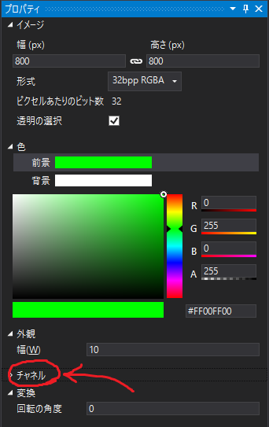
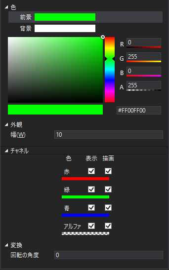

[OpenGL 3D 2019 後期 第02回]

# TERRAIN-TERRAIN

<br>

## 目標

* シェーダーで複数のテクスチャを扱う方法を学習する。
* バッファ・テクスチャの使い方を学習する。

## 1. 地形にテクスチャを貼る

### 1.1 マテリアル構造体が扱えるテクスチャを増やす

現在わたしたちの作っている小さな世界は、まだ灰色一色でしかありません。このままだと、あまり楽しそうな風景ではないので、いくつかテクスチャを貼り付けて見栄えを良くしていきましょう。

今回は4枚のテクスチャを使っていきます。このうち3枚が実際に表示されるテクスチャで、それぞれ土、岩、草を表すテクスチャになります。残りの1枚は、土、岩、草を合成する割合を決めるために使用します。

さて、メッシュの表示に使うテクスチャはMaterial構造体が管理しています。現在は1枚のテクスチャしか扱えないので、まずは枚数を増やしましょう。Mesh.hを開き、Material構造体を次のように変更してください。

```diff
 struct Material
 {
   glm::vec4 baseColor = glm::vec4(1);
-  Texture::Image2DPtr texture;
+  Texture::Image2DPtr texture[8];
   Shader::ProgramPtr program;
   Shader::ProgramPtr progSkeletalMesh; // スケルタルメッシュ用のシェーダー.
 };
```

ご覧のとおり、テクスチャを8要素の配列しました。近代的なGPUであれば、一度の描画で16～32枚程度のテクスチャを同時に扱うことができます。しかし、テクスチャを多く使うということは、それだけ処理に時間がかかることを意味しますので、その全てを利用することはまれです。そこで、今回は最大8枚まで使えるようにしてみました。直近で必要とするのは4枚だけですが、後々追加で利用する予定なので余裕をもたせて8枚としています。なお、同時に扱えるテクスチャの枚数は`GL_MAX_TEXTURE_IMAGE_UNITS`で調べることができます。

Material構造体の変更に合わせるために、いくつかのプログラムを修正しなければなりません。Mesh.cppを開き、Buffer::CreateMaterial関数を次のように変更してください。

```diff
 Material Buffer::CreateMaterial(
   const glm::vec4& color, Texture::Image2DPtr texture) const
 {
   Material m;
   m.baseColor = color;
-  m.texture = texture;
+  m.texture[0] = texture;
   m.program = progStaticMesh;
   m.progSkeletalMesh = progSkeletalMesh;
   return m;
 }
```

もう一箇所、Mesh::Draw関数を次のように変更してください。

```diff
   m.program->Use();
   m.program->SetModelMatrix(matM);
-  glActiveTexture(GL_TEXTURE0);

   // テクスチャがあるときは、そのテクスチャIDを設定する. ないときは0を設定する.
+  for (int i = 0; i < sizeof(m.texture)/sizeof(m.texture[0]); ++i) {
+    glActiveTexture(GL_TEXTURE0 + i);
-  if (m.texture) {
-    glBindTexture(GL_TEXTURE_2D, m.texture->Get());
+    if (m.texture[i]) {
+      glBindTexture(GL_TEXTURE_2D, m.texture[i]->Get());
     } else {
       glBindTexture(GL_TEXTURE_2D, 0);
     }
+  }

   glDrawElementsBaseVertex(p.mode, p.count, p.type, p.indices, p.baseVertex);
   p.vao->Unbind();
```

同様に、SkeletalMesh.cppを開き、SkeletalMesh::Draw関数を次のように変更してください。

```diff
      if (!m.progSkeletalMesh) {
        continue;
      }
      m.progSkeletalMesh->Use();
-     if (m.texture) {
-       const GLuint texId = m.texture[0]->Get();
-       if (prevTexId != texId) {
-         m.progSkeletalMesh->BindTexture(0, texId);
-         prevTexId = texId;
-       }
-     }
+     for (int i = 0; i < sizeof(m.texture) / sizeof(m.texture[0]); ++i) {
+       glActiveTexture(GL_TEXTURE0 + i);
+       if (m.texture[i]) {
+         glBindTexture(GL_TEXTURE_2D, m.texture[i]->Get());
+       } else {
+         glBindTexture(GL_TEXTURE_2D, 0);
+       }
+     }
      const GLint locMaterialColor = glGetUniformLocation(m.progSkeletalMesh->Get(), "materialColor");
      if (locMaterialColor >= 0) {
```

これで、Material構造体に最大8枚のテクスチャを設定できるようになりました。

### 1.2 シェーダーが扱えるテクスチャを増やす

マテリアルを変更しただけでは、複数のテクスチャを表示することはできません。実際にテクスチャを読み込むのはシェーダーなので、そちらも変更をしていきます。Shader.cppを開き、Program::Reset関数を次のように変更してください。

```diff
  locSpotLightCount = glGetUniformLocation(id, "spotLightCount");
  locSpotLightIndex = glGetUniformLocation(id, "spotLightIndex");

+  glUseProgram(id);
   const GLint texColorLoc = glGetUniformLocation(id, "texColor");
   if (texColorLoc >= 0) {
-    glUseProgram(id);
     glUniform1i(texColorLoc, 0);
-    glUseProgram(0);
   }
+  for (int i = 0; i < 8; ++i) {
+    std::string name("texColorArray[");
+    name += static_cast<char>('0' + i);
+    name += ']';
+    const GLint texColorLoc = glGetUniformLocation(id, name.c_str());
+    if (texColorLoc >= 0) {
+      glUniform1i(texColorLoc, i);
+    }
+  }
+  glUseProgram(0);
 }

/**
* プログラム・オブジェクトが設定されているか調べる.
```

OpenGLコンテキストには「テクスチャ・イメージ・ユニット」という機能があります。テクスチャサンプラーとテクスチャはこのユニットを介して結び付けられます(ユニフォーム・ブロックと同様の仕組みです)。

ユニフォーム変数の配列は、実際には個々に独立した変数になります。例えば`uniform sampler2D texColorArray[3]`と定義した場合、実際には`texColorArray[0]`, `texColorArray[1]`, `texColorArray[2]`という変数を定義したとして扱われるのです。こうなっているのは、OpenGLがシェーダーをビルドするときに未使用の変数を除去してもよいことになっているからです。つまり、たとえ8要素の配列を定義したとしても、シェーダー・プログラムで使っているのがそのうちの3つだけだった場合、残りの5つは除去されてロケーション番号が割り当てられない可能性があるわけです。

これはテクスチャを割り当てる側としてははなはだ不便です。というのも、デバッグのために変数を一時的に使わないようにしただけでも、ロケーション番号が変わってしまうかもしれないからです。そこで、上記のプログラムでは配列の個々の変数名を作成してロケーション番号を取得し、常に配列のインデックスと一致するテクスチャ・イメージ・ユニットの番号を割り当てるようにしています。

なお、glUseProgramをif文の外に出したのは、今回のプログラムではシェーダー・プログラムをバインドするタイミングが不定になるので、いっそ外で常にバインドした方が簡潔に書けると考えたからです。

とにかく、これでシェーダー・プログラムの準備はおしまいです。

>［補足］配列変数とそうでない変数で名前を変えているのは、一部のグラフィックドライバがこの２つを区別しない場合があったためです。このようなドライバでは、例えば`texColor`という配列ではない変数があったとき、glGetUniformLocation関数に`texColor[0]`や`texColor[1]`といった名前を指定すると`texColor`と同じロケーション番号が返されます。つまり、配列ではないのに配列のような(間違った)結果を返しているわけです。これは、配列とそうでない変数の名前を分けることで対応できます。

### 1.3 地形用のシェーダーを作成する

地形用のシェーダー・プログラムを作成します。Resフォルダに`Terrain.vert`という名前のファイルを追加してください。追加したファイルを開き、次のプログラムを追加してください。といっても、この頂点シェーダーの内容は`StaticMesh.vert`と全く同じなので、「コピー＆貼り付け」で作るとよいでしょう。

```c++
/**
* @file Terrain.vert
*/
#version 430

layout(location=0) in vec3 vPosition;
layout(location=1) in vec2 vTexCoord;
layout(location=2) in vec3 vNormal;

layout(location=0) out vec3 outPosition;
layout(location=1) out vec2 outTexCoord;
layout(location=2) out vec3 outNormal;

uniform mat4 matMVP;
uniform mat4 matModel;

/**
* Terrain vertex shader.
*/
void main()
{
  mat3 matNormal = transpose(inverse(mat3(matModel)));

  outTexCoord = vTexCoord;
  outNormal = normalize(matNormal * vNormal);
  outPosition = vec3(matModel * vec4(vPosition, 1.0));
  gl_Position = matMVP * (matModel * vec4(vPosition, 1.0));
}
```

続いてフラグメントシェーダーを作成します。Resフォルダに`Terrain.frag`という名前のファイルを追加してください。こちらも基本的な部分は`StaticMesh.frag`と同じなので、「コピー＆貼り付け」で作ります。コメント行に含まれる`StaticMesh`という部分を`Terrain`に変更するのを忘れないでください。例えば`@file StaticMesh.frag`を`@file Terrain.frag`に変更します。

それでは地形描画のための変更をしていきましょう。まずはテクスチャの枚数を増やします。次のようにTerrain.fragにある`texColor`ユニフォーム変数を4要素の配列にしてください。

```diff
 layout(location=0) in vec3 inPosition;
 layout(location=1) in vec2 inTexCoord;
 layout(location=2) in vec3 inNormal;

 out vec4 fragColor;

-uniform sampler2D texColor;
+uniform sampler2D texColorArray[4];

 uniform int pointLightCount;
 uniform int pointLightIndex[8];

 uniform int spotLightCount;
 uniform int spotLightIndex[8];
```

次にテクスチャを読み込む処理を変更します。`Terrain.frag`のmain関数を次のように変更してください。

```diff
     lightColor += spotLight[id].color.rgb * cosTheta * intensity * cutOff;
   }

-  fragColor = texture(texColor, inTexCoord);
+  // 地形テクスチャを合成.
+  vec4 ratio = texture(texColorArray[0], inTexCoord);
+  float baseRatio = max(0.0, 1.0 - ratio.r - ratio.g);
+  vec2 uv= inTexCoord * 10.0;
+  fragColor.rgb = texture(texColorArray[1], uv).rgb * baseRatio;
+  fragColor.rgb += texture(texColorArray[2], uv).rgb * ratio.r;
+  fragColor.rgb += texture(texColorArray[3], uv).rgb * ratio.g;
+  fragColor.a = 1.0;
+
   fragColor.rgb *= lightColor;
 }
```

このシェーダー・プログラムでは、`texColorArray[0]`に設定されたテクスチャの赤と緑の要素を合成比率とみなして、残りのテクスチャの色を合成しています。地形用のシェーダー・プログラムはこれで完成です。

### 1.4 地形用のシェーダー・プログラムを読み込む

作成したシェーダー・プログラムを読み込んで使えるようにしましょう。Mesh.hを開き、次のプログラムを追加してください。

```diff
   SkeletalMeshPtr GetSkeletalMesh(const char* meshName) const;

   const Shader::ProgramPtr& GetStaticMeshShader() const { return progStaticMesh; }
+ const Shader::ProgramPtr& GetTerrainShader() const { return progTerrain; }

 private:
   BufferObject vbo;
   BufferObject ibo;
   GLintptr vboEnd = 0;
   GLintptr iboEnd = 0;
   std::unordered_map<std::string, FilePtr> files;
   Shader::ProgramPtr progStaticMesh;
+  Shader::ProgramPtr progTerrain;

   // スケルタル・アニメーションに対応したメッシュを保持するメンバ変数.
   Shader::ProgramPtr progSkeletalMesh;
```

続いて、progTerrain変数にシェーダー・プログラムを読み込みます。Mesh.cppを開き、Buffer::Init関数に次のプログラムを追加してください。

```diff
   if (progSkeletalMesh->IsNull()) {
     return false;
   }
   SkeletalAnimation::BindUniformBlock(progSkeletalMesh);
+
+  progTerrain = Shader::Program::Create("Res/Terrain.vert", "Res/Terrain.frag");
+  if (progTerrain->IsNull()) {
+    return false;
+  }

   vboEnd = 0;
   iboEnd = 0;
   files.reserve(100);
```

それから、Buffer::SetViewProjectionMatrix関数に次のプログラムを追加してください。

```diff
 void Buffer::SetViewProjectionMatrix(const glm::mat4& matVP) const
 {
   progStaticMesh->Use();
   progStaticMesh->SetViewProjectionMatrix(matVP);
   progSkeletalMesh->Use();
   progSkeletalMesh->SetViewProjectionMatrix(matVP);
+  progTerrain->Use();
+  progTerrain->SetViewProjectionMatrix(matVP);
   glUseProgram(0);
 }
```

これでシェーダー・プログラムの読み込みは完成です。

### 1.5 地形メッシュに地形用シェーダーとテクスチャを設定する

それでは、地形用のシェーダーを設定しましょう。Terrain.cppを開き、HeightMap::CreateMesh関数に次のプログラムを追加してください。

```diff
   // 頂点データとインデックスデータからメッシュを作成.
   Mesh::Primitive p =
     meshBuffer.CreatePrimitive(indices.size(), GL_UNSIGNED_INT, iOffset, vOffset);
   Mesh::Material m = meshBuffer.CreateMaterial(glm::vec4(1), nullptr);
-  if (texName) {
-    m.texture = Texture::Image2D::Create(texName);
-  } else {
-    m.texture = Texture::Image2D::Create(name.c_str());
-  }
+  m.texture[0] = Texture::Image2D::Create("Res/Terrain_Ratio.tga");
+  m.texture[1] = Texture::Image2D::Create("Res/Terrain_Soil.tga");
+  m.texture[2] = Texture::Image2D::Create("Res/Terrain_Rock.tga");
+  m.texture[3] = Texture::Image2D::Create("Res/Terrain_Plant.tga");
+  m.program = meshBuffer.GetTerrainShader();
   meshBuffer.AddMesh(meshName, p, m);

   return true;
 }
```

### 1.6 地形用シェーダーにライトのユニフォーム・バッファをバインドする

地形用シェーダーでもライトは必要ですから、ライト用のユニフォーム・バッファをバインドしなければなりません。MainGameScene.cppを開き、MainGameScene::Initialzie関数に次のプログラムを追加してください。

```diff
   lightBuffer.Init(1);
   lightBuffer.BindToShader(meshBuffer.GetStaticMeshShader());
+  lightBuffer.BindToShader(meshBuffer.GetTerrainShader());

   glm::vec3 startPos(100, 0, 100);
   startPos.y = heightMap.Height(startPos);
```

これで、地形用のシェーダーとテクスチャの設定は完成です。プログラムが書けたらビルドして、エラーが無いことを確認してください。

### 1.6 地形比率画像を作成する

1.5で作成したプログラムのうち、`Terrain_Ratio.tga`(てれいん・れしお・てぃーじーえー)が地形の合成比率を決める画像です。こういった特殊な用途の画像を作成するときは、PhotoShopやGIMPのようなツールを使うほうが便利です。画像作成ツールを使うと「チャンネル」(あるいは「チャネル」)という機能で赤、緑、青を塗り分けることが可能です。

Visual Studioの画像編集機能を使う場合、描画ツールを選んだ状態だとプロパティウィンドウに「チャネル」という項目が表示され、左側の三角形をクリックすることで項目の内容が開き、表示・描画する色を選択できるようになっています。この機能を駆使して目的の画像を編集することは可能ですが、癖が強くて使いにくいため、画像作成ツールを使うほうがよいでしょう。

<div style="text-align: center;width: 100%;">

<br>
<div style="white-space: pre;">[左: チャネル項目    右: チャネル項目を開いたところ]</div>
</div>

合成比率を決める画像のサイズはあまり大きくなくて構いません。細かくするほど地形の微妙な変化を表現できますが、今回の場合は高さ画像と同じ200x200ドットで十分でしょう。

とりあえず真っ黒に塗りつぶし、そのあと、何箇所か赤い部分と緑の部分を作ったら、`Terrain_Ratio.tga`という名前でResフォルダに保存してください。

>［補足］合成比率画像を作るときのコツは、最初に黒で塗りつぶすことです。真っ黒の状態は比率でいうと0%なので、まず黒くしてから必要な部分に赤や緑を加えていきます。チャンネル機能で赤だけ(あるいは緑だけ)が表示される状態にして、その色を使って比率を調整します。赤も緑も0%なら「土」になり、赤が100%なら「岩」になり、緑が100%なら「草」になります。これは、テクスチャの指定順と合成を行うプログラムをそのように書いたからです。

次に、土と岩と草の画像を用意して、それぞれ`Terrain_Soil.tga`、`Terrain_Rock.tga`、`Terrain_Plant.tga`という名前でResフォルダに保存してください。

4枚の画像が用意できたら準備完了です。プログラムを実行してください。合成比率テクスチャで赤くした部分に岩のテクスチャが、緑の部分に草のテクスチャが表示され、残りの部分は土のテクスチャが表示されていれば成功です。

>［補足］もしテクスチャが引き伸ばされたように見える場合、CreateImage2D関数の中でテクスチャのラップモード(`GL_TEXTURE_WRAP_S`と`GL_TEXTURE_WRAP_T`)に`GL_CLAMP_TO_EDGE`が指定されている可能性があります。もしそうなっていたら、両方のラップモードを`GL_REPEAT`に変更してください。

<div style="page-break-after: always"></div>

## 2. ライトを地面に当てる

### 2.1 バッファ・テクスチャとは

ライトを地面に当てるには、素直に考えれば全てのピクセルについて、全ライトの影響を計算する必要があります。しかし、ほとんどのピクセルは近くにあるライトからの影響しか受けませんから、全ライトについて計算するのは時間の無駄でしかありません。ですから、アクターと同様に影響するライトの数を制限することになります。

>［補足］もちろん、物理的に考えれば、実際には全てのライトからの影響を受けうるでしょう。しかし、ほとんどのライトは目で見てもわからない程度の影響しか及ぼさないため、無視しても見た目で分かる違いはありません。

今回は、地面の1x1メートルごとに、最大4つのポイントライトと4つのスポットライトを指定できるようにしていこうと思います。

>［補足］XBOX360やPS3の頃までは、ライトの大半は実際には地面を照らしていませんでした。どうしていたかというと、3Dツール等を使って明るさをテクスチャに書き込んでいました。このテクスチャは「ライトマップ」と呼ばれ、ライトの計算が不要になるので非常に高速です。ではなぜ今回ライトマップを使わないかというと、作成が面倒だからです。3Dツールを使いこなすことができ、ライトの管理も3Dツールで行っているなら簡単な作業ですが、皆さんの手には余るでしょう。大抵のゲームエンジンにはライトマップを作成する機能が備わっていますから、そちらで効果を体験してみるのがよいと思います。

200x200mの空間を1x1mで分割すると、その数は4万になります。これくらいになると、ユニフォーム・バッファはそろそろ限界です。そこで、「バッファ・テクスチャ」というものを使うことにします。

バッファ・テクスチャはバッファオブジェクトをテクスチャとして利用できるようにする機能です。これまでバッファオブジェクトといえばVBOやIBOが登場していますが、これらをテクスチャとして読み出せるようにするのがバッファ・テクスチャの目的です。本物のテクスチャとくらべると多少効率は落ちますが、CPUから制御できる巨大なデータを扱うことが可能となります。

ただし、バッファ・テクスチャが直接扱えるのはcharやfloatやvec4といった比較的単純なデータ型のひとつに限られます。ユニフォーム・バッファのようにさまざまなデータ型を組み合わせることはできませんし、配列としての次元数も1次元に制限されています。そのため、複雑なデータ型や2次元以上の配列を扱う場合は、シェーダー側で工夫する必要があります。

### 2.2 テクスチャ操作インターフェイスクラスを定義する

さて、バッファ・テクスチャはテクスチャの一種なので、Texture.hとTexture.cppに追加していくことにします。Texture.hを開き、次のプログラムを追加してください。

```diff
 #include <GL/glew.h>
+#include "BufferObject.h"
 #include <glm/glm.hpp>
 #include <vector>
 #include <memory>

 namespace Texture {

+class Interface;
+using InterfacePtr = std::shared_ptr<Interface>;
 class Image2D;
 using Image2DPtr = std::shared_ptr<Image2D>;
+class Buffer;
+using BufferPtr = std::shared_ptr<Buffer>;

 /**
 * 画像データ.
```

今回はバッファ・テクスチャを追加するわけですが、種類が違っても、テクスチャとしての利用方法は重なる点が多いです。そこで、共通の機能を「Interface(いんたーふぇいす)」というクラスで定義し、Image2DやBufferとったクラスはそれを継承・実装することにします。これによって、テクスチャを利用する側では実際の種類にかかわらず共通の関数を呼び出すことができます。

それでは、Interfaceクラスを定義しましょう。LoadImage2D関数の宣言の下に、次のプログラムを追加してください。

```diff
 GLuint LoadImage2D(const char* path);
 bool LoadImage2D(const char* path, ImageData* imageData);
+
+/**
+* テクスチャ操作インターフェイス.
+*/
+class Interface
+{
+public:
+  Interface() = default;
+  virtual ~Interface() = default;
+  virtual bool IsNull() const = 0;
+  virtual GLuint Get() const = 0;
+  virtual GLint Width() const = 0;
+  virtual GLint Height() const = 0;
+  virtual GLenum Target() const = 0;
+};

 /**
 * 2Dテクスチャ
```

### 2.3 Image2DをInterfaceの派生クラスにする

次に、2DテクスチャをInterfaceの派生クラスにします。Image2Dクラスの定義を次のように変更してください。

```diff
 /**
 * 2Dテクスチャ
 */
-class Image2D
+class Image2D : public Interface
 {
 public:
   static Image2DPtr Create(const char*);
   Image2D() = default;
   explicit Image2D(GLuint texId);
-  ~Image2D();
+  virtual ~Image2D();

   void Reset(GLuint texId);
-  bool IsNull() const;
-  GLuint Get() const;
-  GLint Width() const { return width; }
-  GLint Height() const { return height; }
+  virtual bool IsNull() const override;
+  virtual GLuint Get() const override;
+  virtual GLint Width() const override { return width; }
+  virtual GLint Height() const override { return height; }
+  virtual GLenum Target() const override { return GL_TEXTURE_2D; }

private:
  GLuint id = 0;
  GLint width = 0;
  GLint height = 0;
};
```

### 2.4 バッファ・テクスチャクラスを定義する

それではバッファ・テクスチャを定義しましょう。Image2Dクラスの定義の下に、次のプログラムを追加してください。

```diff
   GLint width = 0;
   GLint height = 0;
 };
+
+/**
+* バッファ・テクスチャ.
+*/
+class Buffer : public Interface
+{
+public:
+  static BufferPtr Create(GLenum internalFormat, GLsizeiptr size,
+    const GLvoid* data = nullptr, GLenum usage = GL_STATIC_DRAW);
+  Buffer() = default;
+  virtual ~Buffer();
+
+  virtual bool IsNull() const override { return !id; }
+  virtual GLuint Get() const override { return id; }
+  virtual GLint Width() const override { return bo.Size(); }
+  virtual GLint Height() const override { return 1; }
+  virtual GLenum Target() const override { return GL_TEXTURE_BUFFER; }
+
+  bool BufferSubData(GLintptr offset, GLsizeiptr size, const GLvoid* data);
+  GLuint BufferId() const { return bo.Id(); }
+  GLsizeiptr Size() const { return bo.Size(); }
+
+private:
+  GLuint id = 0;
+  BufferObject bo;
+};

 } // namespace Texture
```

### 2.5 Buffer::Create関数を定義する

続いて、Texture.cppを開き、Image2D::Craete関数の定義の下に、次のプログラムを追加してください。

```diff
 Image2DPtr Image2D::Create(const char* path)
 {
   return std::make_shared<Image2D>(LoadImage2D(path));
 }
+
+/**
+* バッファ・テクスチャを作成する.
+*
+* @param internalFormat バッファのデータ形式.
+* @param size           バッファのサイズ.
+* @param data           バッファに転送するデータ.
+* @param usage          バッファのアクセスタイプ.
+*
+* @return 作成したテクスチャオブジェクト.
+*/
+BufferPtr Buffer::Create(GLenum internalFormat, GLsizeiptr size,
+  const GLvoid* data, GLenum usage)
+{
+  BufferPtr buffer = std::make_shared<Buffer>();
+  if (!buffer->bo.Create(GL_TEXTURE_BUFFER, size, data, usage)) {
+    return false;
+  }
+  glGenTextures(1, &buffer->id);
+  glBindTexture(GL_TEXTURE_BUFFER, buffer->id);
+  glTexBuffer(GL_TEXTURE_BUFFER, internalFormat, buffer->bo.Id());
+  glBindTexture(GL_TEXTURE_BUFFER, 0);
+
+  return buffer;
+}

 } // namespace Texture
```

このプログラムでは最初にBufferObject::Create関数でバッファオブジェクトを作成しています。その次にテクスチャを作成します。ここはImage2Dの作成とほぼ同じで、ターゲットを`GL_TEXTURE_BUFFER`にしている点が違っています。
バッファ・テクスチャを操作するときはこのターゲットにバインドする事になっているからです。

バッファオブジェクトをテクスチャに関連付けるには、glTexBuffer関数を使います。この関数の第2引数はバッファのデータ形式で、第3引数はバッファオブジェクトのIDです。

### 2.6 デストラクタを定義する

続いてデストラクタを定義します。Buffer::Create関数の定義の下に、次のプログラムを追加してください。

```diff
   glBindTexture(GL_TEXTURE_BUFFER, 0);

   return buffer;
 }
+
+/**
+* デストラクタ.
+*/
+Buffer::~Buffer()
+{
+  glDeleteTextures(1, &id);
+}

 } // namespace Texture
```

デストラクタではテクスチャを破棄するだけです。バッファオブジェクトは、それ自身のデストラクタが自動的に破棄してくれるので、ここでは何もする必要はありません。

### 2.7 Buffer::BufferSubData関数を定義する

バッファ・テクスチャ定義の最後は、データ転送関数です。デストラクタの定義の下に、次のプログラムを追加してください。

```diff
   glDeleteTextures(1, &id);
 }
+
+/**
+* バッファにデータを転送する.
+*
+* @param offset 転送開始位置(バイト単位).
+* @param size   転送するバイト数.
+* @param data   転送するデータへのポインタ.
+*
+* @retval true  転送成功.
+* @retval false 転送失敗.
+*/
+bool Buffer::BufferSubData(GLintptr offset, GLsizeiptr size, const GLvoid* data)
+{
+  return bo.BufferSubData(offset, size, data);
+}

} // namespace Texture
```

データ転送処理自体はバッファオブジェクトに定義済みなので、同名の関数を呼び出すだけでおしまいです。

### 2.8 マテリアルがテクスチャ・インターフェイスを使うようにする

マテリアルのImage2DPtrをInterfacePtrに変更します。これによって、種類の違うテクスチャでも設定できるようになります。Mesh.hを開き、Material構造体の定義を次のように変更してください。

```diff
 struct Material
 {
   glm::vec4 baseColor = glm::vec4(1);
-  Texture::Image2DPtr texture[8];
+  Texture::InterfacePtr texture[8];
   Shader::ProgramPtr program;
   Shader::ProgramPtr progSkeletalMesh; // スケルタルメッシュ用のシェーダー.
 };
```

次にMesh.cppを開き、Mesh::Draw関数を次のように変更してください。

```diff
      for (int i = 0; i < sizeof(m.texture) / sizeof(m.texture[0]); ++i) {
        glActiveTexture(GL_TEXTURE0 + i);
        if (m.texture[i]) {
-         glBindTexture(GL_TEXTURE_2D, m.texture[i]->Get());
+         glBindTexture(m.texture[i]->Target(), m.texture[i]->Get());
        } else {
          glBindTexture(GL_TEXTURE_2D, 0);
        }
      }
```

さらに、これと全く同じ修正を、SkeletalMesh.cppにあるSkeletalMesh::Draw関数にも行ってください。この変更によって、テクスチャの種類に応じて適切なバインディング・ポイントが設定されるようになります。

### 2.9 地形シェーダーを修正する

続いて、シェーダー・プログラムを修正していきます。地形にライトを当てるために、ライトのインデックスが必要なのはもちろんですが、そもそもピクセルがどの1x1mブロックに属しているかという情報がなければインデックスを選びようがありません。これは結局、座標変換前の頂点座標にほかならないわけですが、現在のフラグメントシェーダーにはこの情報が伝わっていません。そこで、頂点の座標をTerrain.vertからTerrain.fragに送るようにします。

Terrain.vertを開き、次のプログラムを追加してください。

```diff
 layout(location=0) out vec3 outPosition;
 layout(location=1) out vec2 outTexCoord;
 layout(location=2) out vec3 outNormal;
+layout(location=3) out vec3 outRawPosition;

 uniform mat4 matMVP;
 uniform mat4 matModel;

 /**
 * Terrain vertex shader.
 */
 void main()
 {
   mat3 matNormal = transpose(inverse(mat3(matModel)));

   outTexCoord = vTexCoord;
   outNormal = normalize(matNormal * vNormal);
   outPosition = vec3(matModel * vec4(vPosition, 1.0));
+  outRawPosition = vPosition;
   gl_Position = matMVP * (matModel * vec4(vPosition, 1.0));
 }
```

「Raw(ろー)」は「生(なま)の」という意味の英単語で、ここでは未処理の座標をであることを示します。

続いてフラグメントシェーダーを修正します。Terrain.fragを開き、次のプログラムを追加してください。

```diff
 layout(location=0) in vec3 inPosition;
 layout(location=1) in vec2 inTexCoord;
 layout(location=2) in vec3 inNormal;
+layout(location=3) in vec3 inRawPosition;

 out vec4 fragColor;

 uniform sampler2D texColorArray[4];
+uniform isamplerBuffer texPointLightIndex;
+uniform isamplerBuffer texSpotLightIndex;
+
+const ivec2 mapSize = ivec2(200, 200);
-
-uniform int pointLightCount;
-uniform int pointLightIndex[8];
-
-uniform int spotLightCount;
-uniform int spotLightIndex[8];

struct AmbientLight
 {
   vec4 color;
```

バッファ・テクスチャを読み込むには`sampler2D`ではなく`samplerBuffer`を使います。また、今回扱うライトインデックスはint型です。int型で読み取りたい場合、サンプラー名の前に「i」をつて`isamplerBuffer`のようにします。
同時に追加したmapSize変数は、名前の通りマップの大きさを表します。この変数は、バッファ・テクスチャを擬似的に2次元配列をとして扱うために使用します。また、アクターで使用していたポイントライトとスポットライトのインデックスは使わないので削除しておきます。

次に、ポイントライトの処理方法を変更します。ポイントライトを処理するプログラムを次のように変更してください。

```diff
+  int offset = int(inRawPosition.z) * mapSize.x + int(inRawPosition.x);
+  ivec4 pointLightIndex = texelFetch(texPointLightIndex, offset);
-  for (int i = 0; i < pointLightCount; ++i) {
+  for (int i = 0; i < 4; ++i) {
     int id = pointLightIndex[i];
+    if (id >= 0) {
       vec3 lightVector = pointLight[id].position.xyz - inPosition;
       vec3 lightDir = normalize(lightVector);
       float cosTheta = clamp(dot(normal, lightDir), 0.0, 1.0);
       float intensity = 1.0 / (1.0 + dot(lightVector, lightVector));
       lightColor += pointLight[id].color.rgb * cosTheta * intensity;
+    }
   }

   for (int i = 0; i < spotLightCount; ++i) {
```

主な変更点はインデックスの取得方法です。バッファ・テクスチャからデータを取り出すには「texelFetch(てくせる・ふぇっち)」という関数を使います。先に説明したように、バッファ・テクスチャは１次元配列ですが、マップデータは2次元です。そのため、offset変数の計算では頂点のZ座標にmapSize.xを掛けた値をたすことで、擬似的に2次元配列と同様のアクセスを実現しています。

また、バッファ・テクスチャを使う場合はいくつのライトインデックスが有効なのかが分かりませんので、インデックスが負数だった場合は無効なインデックスとみなすことで対処しています。いくつのデータがあるか分からない場合に、個数を使うか、無効なことを示すデータを使うかは、データの種類と用途によって使い分けます。今回のように総数が少ない場合はどちらでも問題はありませんが、データ数が多いときは個数を使うほうが効率的なことが多いです。無効なデータかどうかを調べる回数が馬鹿にならないからです。

同様に、スポットライトの処理も変更します。

```diff
       lightColor += pointLight[id].color.rgb * cosTheta * intensity;
     }
   }

+  ivec4 spotLightIndex = texelFetch(texSpotLightIndex, offset);
-  for (int i = 0; i < spotLightCount; ++i) {
+  for (int i = 0; i < 4; ++i) {
     int id = spotLightIndex[i];
+    if (id >= 0) {
       vec3 lightVector = spotLight[id].posAndInnerCutOff.xyz - inPosition;
       vec3 lightDir = normalize(lightVector);
       float cosTheta = clamp(dot(normal, lightDir), 0.0, 1.0);
       float intensity = 1.0 / (1.0 + dot(lightVector, lightVector));
       float spotCosTheta = dot(lightDir, -spotLight[id].dirAndCutOff.xyz);
       float cutOff = smoothstep(spotLight[id].dirAndCutOff.w, spotLight[id].posAndInnerCutOff.w, spotCosTheta);
       lightColor += spotLight[id].color.rgb * cosTheta * intensity * cutOff;
+    }
   }

   vec4 terrain = texture(texTerrain, inTexCoord);
```

### 2.10 Terrain.hの修正

HeightMapクラスに、バッファ・テクスチャを扱う機能を追加していきます。Terrain.hを開き、ヘッダーファイルのインクルードを追加してください。

```diff
 #ifndef TERRAIN_H_INCLUDED
 #define TERRAIN_H_INCLUDED
 #include "Mesh.h"
+#include "Texture.h"
+#include "Light.h"
 #include <glm/glm.hpp>
 #include <string>
 #include <vector>

 namespace Terrain {
```

次に、HeightMapクラスに次のプログラムを追加してください。

```diff
   bool CreateMesh(Mesh::Buffer& meshBuffer,
     const char* meshName, const char* texName = nullptr) const;
+  void UpdateLightIndex(const ActorList& lights);

 private:
   std::string name;                ///< 元になった画像ファイル名.
   glm::ivec2 size = glm::ivec2(0); ///< ハイトマップの大きさ.
   std::vector<float> heights;      ///< 高さデータ.
+  Texture::BufferPtr lightIndex[2];

   glm::vec3 CalcNormal(int x, int z) const;
 };
```

追加した変数の初期化は、LoadFromFile関数で行います。Terrain.cppを開き、HeightMap::LoadFromFile関数に次のプログラムを追加してください。

```diff
       heights[offsetY * size.x + x] = (color.r - baseLevel) * scale;
     }
   }
+
+  for (int i = 0; i < 2; ++i) {
+    lightIndex[i] = Texture::Buffer::Create(GL_RGBA8I, size.x * size.y * 4, nullptr, GL_DYNAMIC_DRAW);
+    if (!lightIndex[i]) {
+      return false;
+    }
+  }

   return true;
 }
```

データ形式は`GL_RGBA8I`を選びました。これはRGBAの4要素からなる8ビットの符号付き整数を表します。このデータ型は-128～127までの数値を表現できます。ライトインデックスの最大値は99ですからこれで十分です。なお、バッファ・テクスチャで利用可能なデータ形式については、`https://www.khronos.org/opengl/wiki/Buffer_Texture`を参照してください。

>［補足］バッファ・テクスチャの最大サイズは`GL_MAX_TEXTURE_BUFFER_SIZE`で取得できますが、これはテクセルサイズであってバイト数ではありません。実際の最大バイト数は、最大のデータ形式である`GL_RGBA32`のバイト数(16)を掛けた値になります。

続いて、バッファ・テクスチャをマテリアルに設定して、描画の際に使ってもらえるようにしましょう。HeighMap::CreateMesh関数に、次のプログラムを追加してください。

```diff
   m.texture[2] = Texture::Image2D::Create("Res/Terrain_Rock.tga");
   m.texture[3] = Texture::Image2D::Create("Res/Terrain_Plant.tga");
+  m.texture[4] = lightIndex[0];
+  m.texture[5] = lightIndex[1];
   m.program = meshBuffer.GetTerrainShader();
   meshBuffer.AddMesh(meshName, p, m);

```

### 2.11 HeightMap::UpdateLightIndex関数を定義する

UpdateLightIndex(あっぷでーと・らいと・いんでっくす）は、バッファ・テクスチャにライトインデックスを設定する関数です。HeightMap::CreateMesh関数の定義の下に、次のプログラムを追加してください。

```diff
   meshBuffer.AddMesh(meshName, p, m);

   return true;
 }
+
+/**
+* ライトインデックスを更新する.
+*
+* @param lights ライトアクターのリスト.
+*/
+void HeightMap::UpdateLightIndex(const ActorList& lights)
+{
+  std::vector<glm::i8vec4> pointLightIndex;
+  std::vector<glm::i8vec4> spotLightIndex;
+  pointLightIndex.resize(size.x * size.y, glm::i8vec4(-1));
+  spotLightIndex.resize(size.x * size.y, glm::i8vec4(-1));
+  for (int y = 0; y < size.y; ++y) {
+    for (int x = 0; x < size.x; ++x) {
+      std::vector<ActorPtr> neiborhood = lights.FindNearbyActors(glm::vec3(x + 0.5f, 0, y + 0.5f), 20);
+      int pointLightCount = 0;
+      glm::i8vec4& pointLight = pointLightIndex[y * size.x + x];
+      int spotLightCount = 0;
+      glm::i8vec4& spotLight = spotLightIndex[y * size.x + x];
+      for (auto light : neiborhood) {
+        if (PointLightActorPtr p = std::dynamic_pointer_cast<PointLightActor>(light)) {
+          if (pointLightCount < 4) {
+            pointLight[pointLightCount] = p->index;
+            ++pointLightCount;
+          }
+        } else if (SpotLightActorPtr p = std::dynamic_pointer_cast<SpotLightActor>(light)) {
+          if (spotLightCount < 4) {
+            spotLight[spotLightCount] = p->index;
+            ++spotLightCount;
+          }
+        }
+      }
+    }
+  }
+  lightIndex[0]->BufferSubData(0, pointLightIndex.size() * 4, pointLightIndex.data());
+  lightIndex[1]->BufferSubData(0, spotLightIndex.size() * 4, spotLightIndex.data());
+}

 /**
 * 高さ情報から法線を計算する.
```

ライトインデックスの取得方法は、アクターのときと全く同じです。違いは、データをマップの1m単位で収集していることです。

>［補足］影響を及ぼすライトの判定については、本来であれば距離だけでなくライトの明るさも考慮するべきです。また、スポットライトのような形状では影響する範囲が球とは異なるはずです。しかし、今回はプログラムを簡単にするために明るさや形状については無視しています。

### 2.12 バッファ・テクスチャをテクスチャ・イメージ・ユニットにバインドする

シェーダー・プログラムに追加したバッファ・テクスチャも、テクスチャ・イメージ・ユニットにバインドしなければなりません。Shader.cppを開き、Program::Reset関数に次のプログラムを追加してください。

```diff
     if (texColorLoc >= 0) {
       glUniform1i(texColorLoc, i);
     }
   }
+  const GLint locTexPointLightIndex = glGetUniformLocation(id, "texPointLightIndex");
+  if (locTexPointLightIndex >= 0) {
+    glUniform1i(locTexPointLightIndex, 4);
+  }
+  const GLint locTexSpotLightIndex = glGetUniformLocation(id, "texSpotLightIndex");;
+  if (locTexSpotLightIndex >= 0) {
+    glUniform1i(locTexSpotLightIndex, 5);
+  }
   glUseProgram(0);
 }
```

今回は決め打ちでポイントライト用を4番目のユニット、スポットライト用を5番目のユニットにバインドしました。今回作成したプログラムの場合、バインドするユニットの番号は、マテリアルのテクスチャ配列のインデックスと一致させる必要があります。一見無関係なデータを暗黙に結びつけると、後々見つけにくいバグを引き起こしかねないためあまり良くないのですが、今回はプログラムを簡単にするためあえてそうしています。

### 2.13 BufferObject::BufferSubData関数のバグを直す

実はBufferObjectのBufferSubData関数にバグがありました。BufferObject.cppを開き、BufferObject::BufferSubData関数を次のように修正してください。

```diff
 bool BufferObject::BufferSubData(GLintptr offset, GLsizeiptr size, const GLvoid* data)
 {
-  if (offset + size >= this->size) {
+  if (offset + size > this->size) {
     std::cerr << "[警告] " << __func__ << ": 転送先領域がバッファサイズを越えています.\n"
```

見ておわかりのように、エラーの内容は「sizeピッタリの場合はエラーではないのに、条件のミスによってエラーだと判定されてしまっていた」ことです。こうした境界値付近のバグはよくあることなので、みなさんも気をつけてください。

### 2.14 地形にライトインデックスを設定する

最後に、ライトインデックスを作成して実際に使ってみます。MainGameScene.cppを開き、MainGameScene::Initialize関数のライトを設定するプログラムの下に、次のプログラムを追加してください。

```diff
     lights.Add(std::make_shared<SpotLightActor>("SpotLight", color, position, direction
       , glm::radians(20.0f), glm::radians(15.0f)));
   }
+  lights.Update(0);
+  lightBuffer.Update(lights, glm::vec3(0.1f, 0.05f, 0.15f));
+  heightMap.UpdateLightIndex(lights);

   // お地蔵様を配置
   for (int i = 0; i < 4; ++i) {
     glm::vec3 position(0);
```

プログラムが書けたらビルドして実行してください。地形にライトが当たっていれば成功です。

<div style="page-break-after: always"></div>

## 3. C言語練習問題

C言語のプログラムに置いて、論理演算子(&&や||)が使われるのは、if文を簡潔にしたい場合が多い。例えば以下の複合if文は、

```c++
if (a > 0) {
  if (b > 0) {
    func();
  }
}
```

次のように&&演算子によってひとつのif文に置き換えられる。

```c++
if (a > 0 && b > 0) {
  func();
}
```

つまり、内包するif文の条件は、&&演算子を使って上位のif文にまとめることができる。

同様に、以下の複合if文は、

```c++
if (a > 0) {
  func();
} else if (b > 0) {
  func();
}
```

次のように||演算子によってひとつのif文に置き換えられる。

```c++
if (a > 0 || b > 0) {
  func();
}
```

このように、else if文の条件は、||演算子を使って手前のif文にまとめることができる。ただし、実行する内容が異なる場合はまとめられないことに注意すること。

より複雑なif文であっても、括弧を使うことでまとめられる場合がある。例えば、

```c++
if (p != 0) {
  if (a + c > 0) {
    func();
  } else if (b + d > 0) {
    func();
  }
}
```

は、

```c++
if (p != 0 && (a + c > 0 || b + d > 0)) {
  func();
}
```

のようにまとめることができる。内側のif文に相当する条件を括弧でくくっている点に注目。括弧によって、条件を処理する際の優先順を制御している。

1.以下の複合if文を単一のif文で置き換えなさい。

```c++
if (a == 0) {
  if (b != 0) {
    func();
  }
}
```

2.以下の複合if文を単一のif文で置き換えなさい。

```c++
if (x > 5) {
  func();
} else if (y > 5) {
  func();
}
```

3.以下の複合if文を単一のif文で置き換えなさい。

```c++
if (p0) {
  if (p1) {
    func();
  } else if (p2) {
    func();
  }
}
```

4.以下の複合if文を単一のif文で置き換えなさい。

```c++
if (a < 5) {
  if (c + d > 0) {
    func();
  }
} else if (a + d < b + c) {
  func();
}
```
