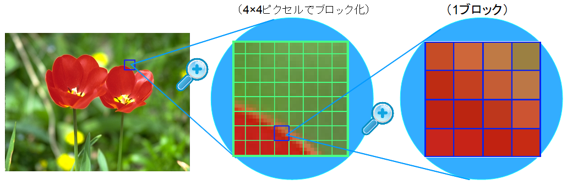
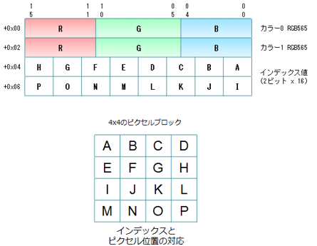
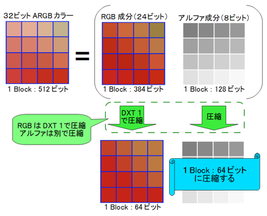
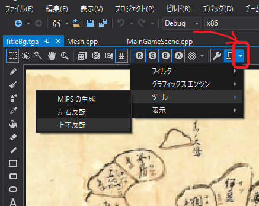
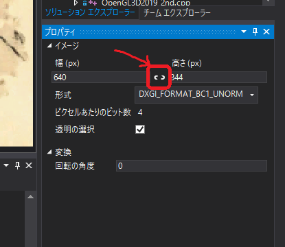
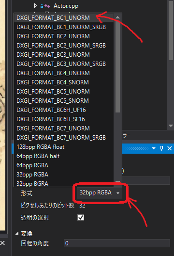
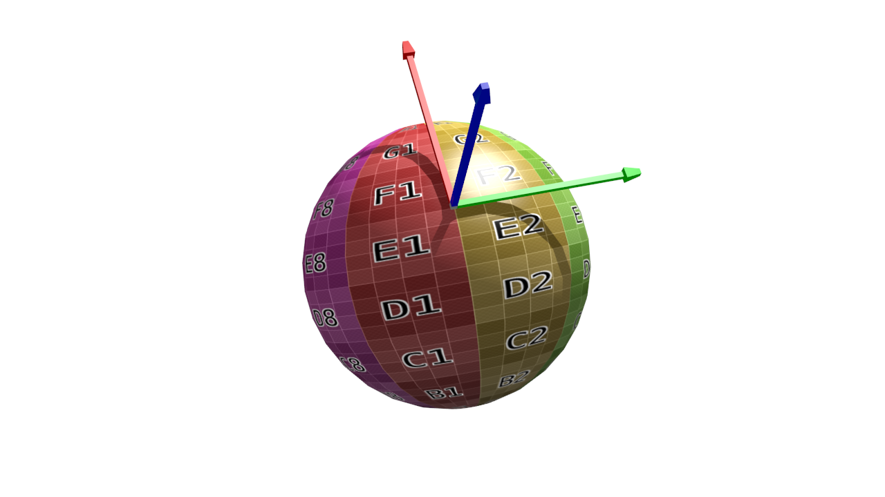

[OpenGL 3D 2019 後期 第03回]

# 小さなメモリと大きな画像

## 目標

* 圧縮テクスチャについて理解する。
* ノーマルマッピングの使い方を学習する。

## 1. 新しい画像フォーマット

### 1.1 テクスチャ容量を減らすには

これまで、テクスチャにはTGAファイルを使用してきました。TGAは半透明も扱うことができる便利な画像形式ですが、ファイルサイズが大きくなりがちなところが欠点です。データを圧縮するモードもありますが、TGAの圧縮形式はGPUが直接扱うことが難しいタイプのものなので、テクスチャとして使うためには圧縮を解除しなければなりません。そのため、必要なGPUメモリは圧縮していない場合と変わりません。

ファイルサイズだけでなくGPUメモリの必要量も削減するには、GPUが直接扱える圧縮形式を使う必要があります。そのような形式の一つが「DDS形式」です。

### 1.2 DDS(Direct Draw Surface)形式

DDSは「Direct Draw Surface(だいれくと・どろー・さーふぇす)」の頭文字を取ったものです。「ダイレクト・ドロー」というのは、DirectXが2Dと3Dで機能が分かれていた頃の2D側のライブラリの名前です。つまり、DDSはDirectXのためのデータ形式として誕生したのです。しかし、登場から時を経た現在、主にPC向け3Dグラフィックスの標準的な画像圧縮形式として普及しており、OpenGLでも利用することができます。

DDSの特徴は、一定の圧縮性能を保ちつつ、GPUが直接扱えるように工夫された形式である点です。DDSに対応しているGPUでは、圧縮を解除せずそのままGPUメモリにコピーすることができます。圧縮を解除する手間がなくなるうえ、コピーするデータ量も少なくなります。さらに、必要なGPUメモリが小さくなることで、より多くのテクスチャ、あるいはより大きなテクスチャをメモリに置くことができます。また、大抵のGPUにおいて、テクスチャ処理にかかる時間は、テクスチャが使用するメモリが多くなるほど遅くなります。圧縮テクスチャは少ないメモリしか使わないので処理が早くなるわけです。

いいことずくめのようですが、圧縮形式には欠点もあります。JPGファイルと同様に、画像の品質が劣化する場合があるのです。画像を表示してみて「これはちょっと…」というくらい劣化を感じる場合は、無圧縮形式を選択することになります。

さて、DDSが対応している圧縮形式は下記のとおりです。

|圧縮形式の名前|保存できるデータ|1ピクセル当たりのバイト数|
|:-:|:--|:-:|
|DXT1/BC1|RGBまたはRGBA(1bitアルファ)|0.5|
|DXT2/BC2|RGBA(4bitアルファ)|1|
|DXT3/BC2|RGBA(4bitアルファ)|1|
|DXT4/BC3|RGBA(多階調アルファ)|1|
|DXT5/BC3|RGBA(多階調アルファ)|1|
|BC4|Rのみ|0.5|
|BC5|RGのみ|1|
|BC6|RGBのみ(16bit浮動小数点数)|1|
|BC7|RGBまたはRGBA(多階調アルファ)|1|

この表にはDXTで始まる名前とBCで始まる名前があります。DXTというのは「DirectX Texture」の略称で、DirectX 9まではこの名前が使わえれていました。BCは「Block Compression」の略称で、DirectX 10以降はこちらの名前が使われています。つまり、BC1からBC3は、DXT1からDXT5の名前を変えただけです。今回はこの表のうち、DXT1からBC5までの圧縮形式に対応していきます。BC6とBC7はDirectX 11で追加されたより複雑なファイル形式なので、今回は実装を見送ります。

それでは、実際にどのように圧縮されているかを簡単に見ていきます。例えば「DXT1(でぃーえっくすてぃー・わん)」は次のように4x4ピクセル単位で画像を圧縮しています。

<div style="text-align: center;width: 100%;">

<div style="white-space: pre;">[DDSの圧縮単位]</div>
</div>

4x4ピクセルは次のような圧縮データに変換されて格納されます。

<div style="text-align: center;width: 100%;">

<div style="white-space: pre;">[圧縮データの形式]</div>
</div>

DXT1ではまず4x4ピクセルから主要な2色を選び、それを16ビットカラーとして保存します。各ピクセルには主要2色とその中間色2色のうち、いずれかの色が割り当てられます。このような仕組みになっているため、4x4の中に主要な色が3色以上含まれていると正しい色を復元できなくなってしまいます。また、16ビットカラーのため微妙な色合いの再現は苦手です。

DXT2～DXT5は、DXT1に加えてアルファ成分にも対応しています。

<div style="text-align: center;width: 100%;">

<div style="white-space: pre;">[アルファ付きデータの圧縮方法]</div>
</div>

アルファも色と同様の方法で圧縮されます。しかし、色はRGBの3要素をまとめて圧縮しなければならないのに対して、アルファは1要素だけです。そのため、比較的劣化しにくいです。

>［補足］上記の画像は以下のサイトからの転載です。これらのサイトを読めば、DDSについてより詳しく知ることができるでしょう。<br>`https://www.webtech.co.jp/blog/optpix_labs/format/4013/`<br>`https://www.webtech.co.jp/blog/optpix_labs/format/4569/`

### 1.3 FOURCCマクロを定義する

それではDDSファイルの読み込みを実装していきましょう。DDSファイルもTGAファイルと同様に、ファイルの先頭部分に画像情報が格納されています。まずはこの情報を取得し、画像フォーマットを識別するための準備をしなくてはなりません。

まず、FOURCCという、フォーマットを識別するためのデータを作成するマクロを定義します。
Texture.cppを開き、Texture名前空間の開き括弧の下に、次のプログラムを追加してください。

```diff
 /// テクスチャ関連の関数やクラスを格納する名前空間
 namespace Texture {
+
+/**
+* FOURCCを作成する.
+*/
+#define MAKE_FOURCC(a, b, c, d) \
+  static_cast<uint32_t>(a + (b << 8) + (c << 16) + (d << 24))

 /**
 * 色データを取得する.
```

FOURCCは「Four Character Code(ふぉー・きゃらくたー・こーど)」、つまり「4文字の識別子」を意味する文章の頭文字です。FOURCCは、ファイルがどんな情報を持っているのかを識別するために使われます。DDSでは、画像が圧縮されているかどうか、どのように圧縮されているか、を識別するために使われています。

>［補足］FOURCCに決まった読み方はないようで、「ふぉーく」や「えふ・おー・ゆー・あーる・しー・しー」、あるいは原文と同じ「ふぉー・きゃらくたー・こーど」などと呼ばれているようです。

### 1.4 データ配列から数値を取得する

現代の多くのコンピューターは、処理を高速にするために、データを扱いやすいアドレスに「整列」して配置する決まりになっています。これを「アラインメント」と言います(「直線、直線状に並べる」といった意味です)。アラインメントは変数の型によって違います。PCで使われるIntel社やAMD社のCPUの場合、charは1バイト単位、intは4バイト単位で整列するのが一般的です。このため、例えば以下のような構造体では

```c++
struct A {
  char c;
  int i;
};
```

メンバ変数cが0バイト目に配置されたとき、メンバ変数iは1バイト目ではなく、4バイト目に配置されます。また、構造体やクラスのアラインメントは、最も大きいアラインメントを持つメンバ変数と同じになります。上記の構造体Aのアラインメントは4バイトになります。

一方で、ファイルに書き込まれたデータにはアラインメントはありません。どんなコンピューターが利用するか分からないのにアラインメントを決めても仕方がないからです。そのため、構造体を定義してそこにデータを一気に読み込む、という方法は使えません。ファイルからデータを取得するときは、バイト単位で複数のデータを読み取り、それをまとめて本来の数値に復元する必要があります。

データを読み取るたびに数値復元を行うのは面倒なので、関数として定義しましょう。FOURCCマクロの定義の下に、次のプログラムを追加してください。

```diff
 #define MAKE_FOURCC(a, b, c, d) \
   static_cast<uint32_t>(a + (b << 8) + (c << 16) + (d << 24))
+
+/**
+* バイト列から数値を復元する.
+*
+* @param p      バイト列へのポインタ.
+* @param offset 数値のオフセット.
+* @param size   数値のバイト数(1～4).
+*
+* @return 復元した数値.
+*/
+uint32_t Get(const uint8_t* p, size_t offset, size_t size)
+{
+  uint32_t result = 0;
+  p += offset;
+  for (size_t i = 0; i < size; ++i) {
+    result += p[i] << (i * 8);
+  }
+  return result;
+}

 /**
 * 色データを取得する.
```

### 1.4 DDSファイルヘッダを定義する

続いて、DDSファイルのヘッダ情報と画像情報を格納する構造体を定義します。まずは画像情報から定義していきましょう。Get関数の定義の下に、次のプログラムを追加してください。

```diff
     result += p[i] << (i * 8);
   }
   return result;
 }
+
+/**
+* DDS画像情報.
+*/
+struct DDSPixelFormat
+{
+  uint32_t size; ///< この構造体のバイト数(32).
+  uint32_t flgas; ///< 画像に含まれるデータの種類を示すフラグ.
+  uint32_t fourCC; ///< 画像フォーマットを示すFOURCC.
+  uint32_t rgbBitCount; ///< 1ピクセルのビット数.
+  uint32_t redBitMask; ///< 赤要素が使う部分を示すビット.
+  uint32_t greenBitMask; ///< 緑要素が使う部分を示すビット.
+  uint32_t blueBitMask; ///< 青要素が使う部分を示すビット.
+  uint32_t alphaBitMask; ///< 透明要素が使う部分を示すビット.
+};

 /**
 * 色データを取得する.
```

DDSPixelFormat構造体はDDSヘッダ情報の一部です。そのため、DDSヘッダ構造体より前に定義しておく必要があります。

続いて、データから画像情報を取得する関数を定義します。DDSPixelFormat構造体の定義の下に、次のプログラムを追加してください。

```diff
   uint32_t blueBitMask; ///< 青要素が使う部分を示すビット.
   uint32_t alphaBitMask; ///< 透明要素が使う部分を示すビット.
 };
+
+/**
+* バッファからDDS画像情報を読み出す.
+*
+* @param buf 読み出し元バッファ.
+*
+* @return 読み出したDDS画像情報.
+*/
+DDSPixelFormat ReadDDSPixelFormat(const uint8_t* buf)
+{
+  DDSPixelFormat tmp;
+  tmp.size = Get(buf, 0, 4);
+  tmp.flgas = Get(buf, 4, 4);
+  tmp.fourCC = Get(buf, 8, 4);
+  tmp.rgbBitCount = Get(buf, 12, 4);
+  tmp.redBitMask = Get(buf, 16, 4);
+  tmp.greenBitMask = Get(buf, 20, 4);
+  tmp.blueBitMask = Get(buf, 24, 4);
+  tmp.alphaBitMask = Get(buf, 28, 4);
+  return tmp;
+}

 /**
 * 色データを取得する.
```

次にDDSヘッダ構造体を定義します。ReadDDSPixelFormat関数定義の下に、次のプログラムを追加してください。

```diff
   tmp.alphaBitMask = Get(buf, 28, 4);
   return tmp;
 }
+
+/**
+* DDSファイルヘッダ.
+*/
+struct DDSHeader
+{
+  uint32_t size;  ///< この構造体のバイト数(124).
+  uint32_t flags; ///< どのパラメータが有効かを示すフラグ.
+  uint32_t height; ///< 画像の高さ(ピクセル数).
+  uint32_t width; ///< 画像の幅(ピクセル数).
+  uint32_t pitchOrLinearSize; ///< 横のバイト数または画像1枚のバイト数.
+  uint32_t depth; ///< 画像の奥行き(枚数)(3次元テクスチャ等で使用).
+  uint32_t mipMapCount; ///< 含まれているミップマップレベル数.
+  uint32_t reserved1[11]; ///< (将来のために予約されている).
+  DDSPixelFormat ddspf; ///< DDS画像情報.
+  uint32_t caps[4]; ///< 含まれている画像の種類.
+  uint32_t reserved2; ///< (将来のために予約されている).
+};

 /**
 * 色データを取得する.
```

DDSヘッダはDDSファイルの先頭にあるデータです。これを構造体として定義したものがDDSHeader構造体です。続いて、このデータを読み取る関数を作りましょう。DDSHeader構造体の定義の下に、次のプログラムを追加してください。

```diff
   uint32_t caps[4]; ///< 含まれている画像の種類.
   uint32_t reserved2; ///< (将来のために予約されている).
 };
+
+/**
+* バッファからDDSファイルヘッダを読み出す.
+*
+* @param buf 読み出し元バッファ.
+*
+* @return 読み出したDDSファイルヘッダ.
+*/
+DDSHeader ReadDDSHeader(const uint8_t* buf)
+{
+  DDSHeader tmp = {};
+  tmp.size = Get(buf, 0, 4);
+  tmp.flags = Get(buf, 4, 4);
+  tmp.height = Get(buf, 8, 4);
+  tmp.width = Get(buf, 12, 4);
+  tmp.pitchOrLinearSize = Get(buf, 16, 4);
+  tmp.depth = Get(buf, 20, 4);
+  tmp.mipMapCount = Get(buf, 24, 4);
+  tmp.ddspf = ReadDDSPixelFormat(buf + 28 + 4 * 11);
+  for (int i = 0; i < 4; ++i) {
+    tmp.caps[i] = Get(buf, 28 + 4 * 11 + 32 + i * 4, 4);
+  }
+  return tmp;
+}

 /**
 * 色データを取得する.
```

これで、DDSファイルのヘッダ部分を読み取る準備が整いました。

### 1.5 DDSファイルからテクスチャを作成する

ここからはDDSファイル全体を読み込んでテクスチャを作成していきます。ちょっと長い関数になるので、空っぽの関数からはじめて少しずつプログラムを追加していくことにします。それでは、ReadDDSHeader関数定義の下に、次のプログラムを追加してください。

```diff
   }
   return tmp;
 }
+
+/**
+* DDSファイルからテクスチャを作成する.
+*
+* @param filename DDSファイル名.
+*
+* @retval 0以外 作成したテクスチャID.
+* @retval 0     作成失敗.
+*/
+GLuint LoadDDS(const char* filename)
+{
+}

 /**
 * 色データを取得する.
```

まずはDDSヘッダーを読み込み、指定されたファイルが本当にDDSファイルなのかを確認します。LoadDDS関数の先頭に、次のプログラムを追加してください。

```diff
 GLuint LoadDDS(const char* filename)
 {
+  std::basic_ifstream<uint8_t> ifs(filename, std::ios_base::binary);
+  if (!ifs) {
+    std::cerr << "[エラー] " << filename << "を開けません.\n";
+    return 0;
+  }
+  //１メガバイトのメモリを割り当てて、一度にたくさん読み込めるようにする
+  std::vector<uint8_t> readBuffer(1'000'000);
+  ifs.rdbuf()->pubsetbuf(readBuffer.data(), readBuffer.size());
+
+  // DDSヘッダーを読み込む.
+  std::vector<uint8_t> buf(128);
+  ifs.read(buf.data(), 128);
+  if (ifs.eof()) {
+    return 0;
+  }
+  if (buf[0] != 'D' || buf[1] != 'D' || buf[2] != 'S' || buf[3] != ' ') {
+    return 0;
+  }
+  const DDSHeader header = ReadDDSHeader(buf.data() + 4);
+  if (header.size != 124) {
+    std::cerr << "[警告] " << filename << "は未対応のDDSファイルです.\n";
+    return 0;
+  }
 }

 /**
 * 色データを取得する.
```

DDSファイルの先頭には「'D’, ’D’, ’S’, ’ ’」という4文字が格納されており、その直後に124バイトのヘッダが続きます。つまり、ファイルサイズが128バイトに満たない場合はDDSファイルではありません。また、DDSヘッダのサイズ情報が124でない場合もDDSファイルではありませんから読み込めません。

続いて、画像フォーマットに対応するOpenGLのフォーマットを選択します。 DDSヘッダーを読み込むプログラムの下に、次のプログラムを追加してください。

```diff
   if (header.size != 124) {
     std::cerr << "[警告] " << filename << "は未対応のDDSファイルです.\n";
     return 0;
   }
+
+  // ファイルのDDS形式に対応するOpenGLのフォーマットを選択する.
+  GLenum iformat= GL_RGBA8;
+  GLenum format = GL_RGBA;
+  uint32_t blockSize = 16;
+  bool isCompressed = false;
+  if (header.ddspf.flgas & 0x04) {
+    // 圧縮フォーマット
+    switch (header.ddspf.fourCC) {
+    case MAKE_FOURCC('D', 'X', 'T', '1'):
+      iformat = GL_COMPRESSED_RGBA_S3TC_DXT1_EXT;
+      blockSize = 8;
+      break;
+    case MAKE_FOURCC('D', 'X', 'T', '2'):
+    case MAKE_FOURCC('D', 'X', 'T', '3'):
+      iformat = GL_COMPRESSED_RGBA_S3TC_DXT3_EXT;
+      break;
+    case MAKE_FOURCC('D', 'X', 'T', '4'):
+    case MAKE_FOURCC('D', 'X', 'T', '5'):
+      iformat = GL_COMPRESSED_RGBA_S3TC_DXT5_EXT;
+      break;
+    case MAKE_FOURCC('B', 'C', '4', 'U'):
+      iformat = GL_COMPRESSED_RED_RGTC1;
+      break;
+    case MAKE_FOURCC('B', 'C', '4', 'S'):
+      iformat = GL_COMPRESSED_SIGNED_RED_RGTC1;
+      break;
+    case MAKE_FOURCC('B', 'C', '5', 'U'):
+      iformat = GL_COMPRESSED_RG_RGTC2;
+      break;
+    case MAKE_FOURCC('B', 'C', '5', 'S'):
+      iformat = GL_COMPRESSED_SIGNED_RG_RGTC2;
+      break;
+    default:
+      std::cerr << "[警告] " << filename << "は未対応のDDSファイルです.\n";
+      return 0;
+    }
+    isCompressed = true;
+  } else if (header.ddspf.flgas & 0x40) {
+    // 無圧縮フォーマット
+    if (header.ddspf.redBitMask == 0xff) {
+      iformat = header.ddspf.alphaBitMask ? GL_RGBA8 : GL_RGB8;
+      format = header.ddspf.alphaBitMask ? GL_RGBA : GL_RGB;
+    } else if (header.ddspf.blueBitMask == 0xff) {
+      iformat = header.ddspf.alphaBitMask ? GL_RGBA8 : GL_RGB8;
+      format = header.ddspf.alphaBitMask ? GL_BGRA : GL_BGR;
+    } else {
+      std::cerr << "[警告] " << filename << "は未対応のDDSファイルです.\n";
+      return 0;
+    }
+  } else {
+    std::cerr << "[警告] " << filename << "は未対応のDDSファイルです.\n";
+    return 0;
+  }
 }

 /**
 * 色データを取得する.
```

iformat変数にはGPUがテクスチャを読み取るときの形式、format変数には実際のデータの形式を格納します。blockSize変数は圧縮フォーマットのデータ格納単位となるバイト数です。基本的には16ですが、一部のフォーマットでは8になります。 isCompressed変数には、ファイルが圧縮形式かどうかを格納します。圧縮フォーマットならtrue、無圧縮ならfalseです。

圧縮形式かどうかは、DDSPixelFormat::flagsの第2ビット(0x04)で判定します。このビットが1の場合は圧縮形式です。どの圧縮形式なのかはFOURCCによって定義されています。上記のプログラムでは、ファイルに格納されているFOURCCが、MAKE_FOURCCマクロによって作成したFOURCCと一致したなら、対応するフォーマットを変数に格納しています。また、DXT1形式の場合はブロックサイズは8になりますので、これも変数に格納しています。DXT1はアルファ要素を持たないため、その分データが少ないのです。

OpenGLの圧縮フォーマットにはGL_COMPRESSED_????(じーえる・こんぷれすど・？？？？)という名前が付けられています。DDSPixelFormat::fragsの第2ビットが0で、代わりに第6ビットが1の場合、画像は無圧縮フォーマットで、その詳細はビットマスクによって定義されています。ビットマスクは「その色がピクセルデータのどのビットを使用するか」を定義するパラメータです。プログラムを簡単にするため、今回は各色8ビットのフォーマットのみ対応することにします。また、ほとんどのGPUでは色の並び順はRGBAかBGRAのいずれかしか対応していません。そのため、赤と青の順序だけを気にすればよいことになります。つまり、ピクセルの下位8ビットが赤の場合はRGBA、逆に下位8ビットが青の場合はBGRAの順序になるわけです。それ以外だった場合は未対応のフォーマットなので0を返して終了します。

次に、DDSファイルが格納している画像の枚数についての情報を取得します。
OpenGLのフォーマットを選択するプログラムの下に、次のプログラムを追加してください。

```diff
     std::cerr << "[警告] " << filename << "は未対応のDDSファイルです.\n";
     return 0;
   }
+
+  // 画像枚数を取得する.
+  const bool isCubemap = header.caps[1] & 0x200;
+  const GLenum target = isCubemap ? GL_TEXTURE_CUBE_MAP_POSITIVE_X : GL_TEXTURE_2D;
+  const int faceCount = isCubemap ? 6 : 1;
 }

 /**
 * 色データを取得する.
```

isCubemap変数はキューブマップを格納している場合にtrueになります。キューブマップは直方体の6面をテクスチャとして定義したもので、周囲の景色の映り込みを表現するためなどに使われます。target変数は、テクスチャ作成時に使うOpenGLコンテキストのバインド対象です。キューブマップを作成する場合は専用のバインド対象を使わなければなりません。faceCountはファイルに格納されている面数です。キューブマップなら6つのテクスチャが必要なので、面数は6になります。もちろん、ふつうのテクスチャは1です。

これでようやく画像を読み込んでテクスチャを作成できます。画像枚数を取得するプログラムの下に、次のプログラムを追加してください。

```diff
   const GLenum target = isCubemap ? GL_TEXTURE_CUBE_MAP_POSITIVE_X : GL_TEXTURE_2D;
   const int faceCount = isCubemap ? 6 : 1;
+
+  // 画像を読み込んでGPUメモリに転送.
+  buf.resize(header.width * header.height * 4);
+  GLuint texId;
+  glGenTextures(1, &texId);
+  glBindTexture(isCubemap ? GL_TEXTURE_CUBE_MAP : GL_TEXTURE_2D, texId);
+  for (int faceIndex = 0; faceIndex < faceCount; ++faceIndex) {
+    GLsizei curWidth = header.width;
+    GLsizei curHeight = header.height;
+    for (int mipLevel = 0; mipLevel < static_cast<int>(header.mipMapCount);
+      ++mipLevel) {
+      if (isCompressed) {
+        // 圧縮形式の場合.
+        const uint32_t imageBytes =
+          ((curWidth + 3) / 4) * ((curHeight + 3) / 4) * blockSize;
+        ifs.read(buf.data(), imageBytes);
+        glCompressedTexImage2D(target + faceIndex, mipLevel, iformat,
+          curWidth, curHeight, 0, imageBytes, buf.data());
+      } else {
+        // 無圧縮形式の場合.
+        const uint32_t imageBytes = curWidth * curHeight * 4;
+        ifs.read(buf.data(), imageBytes);
+        glTexImage2D(target + faceIndex, mipLevel, iformat,
+          curWidth, curHeight, 0, format, GL_UNSIGNED_BYTE, buf.data());
+      }
+      const GLenum result = glGetError();
+      if (result != GL_NO_ERROR) {
+        std::cerr << "[警告] " << filename << "の読み込みに失敗(" <<
+          std::hex << result << ").\n";
+      }
+      curWidth = std::max(1, curWidth / 2);
+      curHeight = std::max(1, curHeight / 2);
+    }
+  }
 }

 /**
 * 色データを取得する.
```

DDSファイルに格納されているデータから適切なテクスチャを作成するには、面数とミップマップという2つの情報が必要です。面数は通常のテクスチャが1、キューブマップなら6でしたね。「ミップマップ」というのは、画像の縮小時に不自然に見えないようにする技術です。大きな画像を適切に縮小表示するにはとても時間がかかるので、ほとんどのGPUはかなり簡略化された方法で縮小を行っています。そのため、縮小した画像が綺麗に表示されることはめったにありません。そこで、あらかじめ何段階かの縮小画像を作っておき、縮小度合いに応じて対応する画像を使うという方法が考え出されました。それがミップマップです。ミップマップのための縮小画像の数は、DDSヘッダのmipMapCountを見れば分かります。

また、キューブマップの場合はそれぞれの面に縮小画像が存在します。そのため、外側のfor文で面数だけループし、内側のfor文ではミップマップ数だけループさせています。

圧縮テクスチャを作成するにはglTexImage2D関数のかわりに「glCompressedTexImage2D(じーえる・こんぷれすど・てっくす・いめーじ・つーでぃ)」関数を使います。このとき、ターゲットに面数を足していますが、これはキューブマップの場合に各面のターゲットが1ずつずれた番号で定義されているからです。キューブマップではない場合、面数は常に1です。ということはfaceIndexも常に0になりますから、ターゲットはGL_TEXTURE_2Dから変化しません。

先に説明したように、圧縮テクスチャは4x4ピクセル毎に圧縮されています。この4x4をブロックと呼びます。画像の幅や高さが4の倍数でない場合、詰め物を追加して4x4にしてから圧縮されます。そのため、画像データの総ブロック数は幅および高さを4の倍数で切り上げてから掛けたものになります。こうして計算した総ブロック数にブロックサイズを掛けたものが画像のバイト数で、上記のプログラムではimageBytes変数になります。

無圧縮テクスチャの作成には、これまでと同じくglTexImage2D関数を使います。今回対応するのは32ビット形式だけなので、バイト数を得るには総ピクセル数に4を掛けるだけです。

テクスチャの作成に成功したら、次のミップマップ段階のために画像サイズを小さくします。ミップマップは段階ごとに半分のサイズの画像を持つと決められているので、もとの値を2で割るだけです。ただし、既に1になっていた場合は2で割ると0になってしまいますから、std::max関数を使って最小値が1になるようにしています。

最後に、テクスチャ・パラメーターを設定します。
画像を読み込むプログラムの下に、次のプログラムを追加してください。

```diff
       curWidth = std::max(1, curWidth / 2);
       curHeight = std::max(1, curHeight / 2);
     }
   }
+
+  // テクスチャ・パラメーターを設定する.
+  glTexParameteri(GL_TEXTURE_2D, GL_TEXTURE_MAX_LEVEL, header.mipMapCount - 1);
+  glTexParameteri(GL_TEXTURE_2D, GL_TEXTURE_MIN_FILTER,
+    header.mipMapCount <= 1 ? GL_LINEAR : GL_LINEAR_MIPMAP_NEAREST);
+  glTexParameteri(GL_TEXTURE_2D, GL_TEXTURE_MAG_FILTER, GL_LINEAR);
+  glTexParameteri(GL_TEXTURE_2D, GL_TEXTURE_WRAP_S, GL_REPEAT);
+  glTexParameteri(GL_TEXTURE_2D, GL_TEXTURE_WRAP_T, GL_REPEAT);
+
+  glBindTexture(GL_TEXTURE_2D, 0);
+  return texId;
 }

 /**
 * 色データを取得する.
```

テクスチャ・パラメーターの設定は、TGAファイルを作成したときとほぼ同じです。違いはミップマップの最大レベルを設定していること(レベルは0から始まるので、ミップマップ数から1を引いた値を使っています)、それから、ミップマップが存在する場合は、縮小フィルタの種類をGL_LINEAR_MIPMAP_NEARESTにしていることです。縮小フィルタはミップマップの有無に応じて種類を変更する必要があり、ミップマップを持たないのにミップマップ用のフィルタ・タイプを指定すると、テクスチャが表示されなくなってしまいます。逆に、ミップマップに対して普通のフィルタを指定した場合、画像は表示されますがミップマップは全く使われず、メモリの無駄になってしまいます。

拡大フィルタはミップマップを考慮する必要はありません。拡大が起こるのは一番大きな(つまり元の)画像だけなので、ミップマップは使われないからです。

最後に、作成したテクスチャIDを返します。これでDDSフォーマットのテクスチャ作成関数は完成です。

### 1.6 LoadImage2D関数をDDSファイルに対応させる

作成したLoadDDS関数を使って、LoadImage2D関数をDDSに対応させましょう。今回は、拡張子が「.dds」だった場合のみDDSファイルとして読み込むことにします。LoadImage2D関数に次のプログラムを追加してください。

```diff
 GLuint LoadImage2D(const char* path)
 {
+  const size_t len = strlen(path);
+  if (_stricmp(path + (len - 4), ".dds") == 0) {
+    const GLuint id = LoadDDS(path);
+    if (id) {
+      return id;
+    }
+  }
+
   ImageData imageData;
   if (!LoadImage2D(path, &imageData)) {
```

strlen(すとりんぐ・れんぐす、すとれん)関数は、文字列の長さ(=含まれる文字数)を計算します。拡張子はファイル名の末尾にあるので、名前の長さが必要になります。

_stricmp(すとりんぐ・あい・こんぺあ、すとらいこんぷ)関数は2つの文字列を比較します。このとき、大文字小文字は無視されます(`a`と`A`は同じだと判定される)。結果を戻り値で返され、等しければ0です。今回はファイル名の末尾の4文字を調べたいので、(長さ-4)番目の位置から調べています。

これでLoadImage2D関数がDDSファイルを読み込めるようになりました。

>［補足］実は_stricmp関数はC標準ライブラリの一員ではありません。大文字小文字を無視する比較というのは出番が多いのですが、標準ライブラリには含まれていないのです。そうはいっても、あったほうが便利なことには違いないため、ライブラリ提供者が独自に追加しているのです。そのため、Microsoftは_stricmpという名前で追加しましたが、他の提供者はstrcasecmpなど、別の名前で追加しています。

### 1.7 DDSファイルを使ってみる

早速DDSファイルを読み込んで使ってみましょう。DDSファイルの作成にはVisual Studioを使います。タイトル画面の画像をVisualStudioで開いてください。開いたら、ウィンドウの左上にツールパレットが並んでいると思います。その右端にある下向き矢印をクリックし、「ツール->上下反転」を選択してください。すると、画像の上下が反転します。

<div style="text-align: center;width: 100%;">

<div style="white-space: pre;">[画像を上下反転させる]</div>
</div>

TGAファイルの画像データの格納方法が「上から下」と「下から上」の2パターンあり、必要に応じて画像の上下を反転させることができました。しかし、DDSファイルは「上から下」の1種類だけです。OpenGLのテクスチャは「下から上」になっている必要があるため、DDSファイルの場合は常に上下を反転させなければなりません。問題は、DDSファイルは圧縮されているかもしれないことです。圧縮形式を保ったまま上下反転させるには、圧縮方法について十分な理解が必要となります。しかし、DDS形式の詳細に踏み込むには時間が足りないため、今回は画像を作る段階で上下反転させて対処することにしました。

>［補足］実際問題、必ず上下反転しなければならないのなら、事前に処理しておくことは理にかなっています。プログラムで処理すると読み込み時間がのびてしまうからです。

次に、ファイルメニューを開いて「名前をつけてTitleBg.tgaを保存」を選択してください。すると、ファイルの保存ダイアログが開きます。その下の方に「ファイルの種類」という項目があり、クリックするとファイルの種類がリスト表示されます。リストの中から「Direct Draw Surface(*.dds)」を選択して、保存してください。このとき、ファイルの拡張子は自動的に「.dds」に変更されます。これでDDSファイルを作成することができました。

変換したばかりのDDSファイルは無圧縮形式なので、圧縮形式に変更しましょう。「表示」メニューから「プロパティウィンドウ」を選ぶかF4キーを押すとプロパティウィンドウが表示されます。

Visual Studioの画像ツールには、圧縮テクスチャのサイズが4の倍数でなければならないという独自のルールがあります(DXT形式の仕様では1ピクセル単位でサイズを指定できますから、これはMicrosoftの怠慢です)。プロパティウィンドウの画像の幅と高さを確認して、4の倍数でなかったら、4の倍数になるように数値を増減してください。ただし、幅と高さの間の鎖アイコンがつながった状態だと、幅と高さは連動して変化してしまいます。連動を解除するために、鎖アイコンをクリックして下図のように鎖が切れた状態してください。幅と高さを個別に変更できるようになります。

<div style="text-align: center;width: 100%;">

<div style="white-space: pre;">[鎖アイコン(切れた状態)]</div>
</div>

サイズを調整したら次は圧縮形式を選択します。プロパティウィンドウの形式の横にある「32bpp RGBA」の部分をクリックすると、画像形式の一覧が表示されます。リストをスクロールさせて、一番上にある「DXGI_FORMAT_BC1_UNORM」を選択してください。これがDXT1形式に当たります。ただし、もしタイトル画像にアルファ成分が含まれている(半透明な部分がある)場合は「DXGI_FORMAT_BC3_UNORM」を選択してください。

<div style="text-align: center;width: 100%;">

<div style="white-space: pre;">[形式の選択]</div>
</div>

画像形式を変更したら、忘れずにファイルを保存してください。保存したらエクスプローラーなどでResフォルダを開き、TGA形式と圧縮されたDDS形式のファイルサイズが違うことを確認してください。TGAに比べて1/6から1/8のサイズになっていると思います。つまり、圧縮形式では通常の画像と比べて6倍から8倍のテクスチャを置けるようになる、ということです。

次に、TitleScene.cppを開き、TitleScene::Initialize関数を次のように変更してください。

```diff
 bool TitleScene::Initialize()
 {
   spriteRenderer.Init(1000, "Res/Sprite.vert", "Res/Sprite.frag");
   sprites.reserve(100);
-  Sprite spr(Texture::Image2D::Create("Res/TitleBg.tga"));
+  Sprite spr(Texture::Image2D::Create("Res/TitleBg.dds"));
   spr.Scale(glm::vec2(2));
   sprites.push_back(spr);
```

変更したらビルドして実行してください。タイトル画像が表示されたら成功です。

>［補足］テクスチャ形式は、一般的にはアーティストが目的に応じて適切なものを選択します。もちろん、プログラムで特別な用途で使う、描画速度が目標に届かない、といった技術的な理由からプログラマが指定する場合もあります。

<div style="page-break-after: always"></div>

## 2. バンプマッピング

### 2.1 細かい<ruby>凹凸<rt>おうとつ</rt></ruby>を表現するには

ゲームに登場するポリゴンモデルには、リベットの打たれた鉄板やアスファルトで舗装された路面、石造りの壁、大木の樹皮といった、おおむね平坦でありながら間近に見ると複雑な<ruby>凹凸<rt>おうとつ</rt></ruby>を持つものがよく登場します。現実感のある世界を作るには、このような微細な形状も再現してあげなければなりません。

現実感を与える最も単純な方法は、必要なだけポリゴンを費やし、モデルのあらゆる凹凸を再現することです。しかし、CG映画ならともかく、リアルタイムで動作するゲームではそんな大量のポリゴンは許容できません。そこで、凹凸をテクスチャによって表現する方法が使われます。

例えば、凹凸によって生じるであろう陰影をカラーテクスチャに書き込みます。光源も視点も固定して動かさないかぎり、これでもそれなりに現実感のあるモデルに見えます。しかし、光源あるいは視点が動くと、すぐに不自然さが目立つようになってしまいます。光源や視点が動いても自然な見た目を得るには、バンプマッピング(bump=「隆起、凹凸」という意味)という方法を使います。

### 2.2 バンプマッピングの種類

バンプマッピングは1978年にJames F. Blinn(ジム・ブリン)というコンピュータ科学者が考案した技法です。「バンプ」という名前が示すように、凹凸をポリゴンに貼り付ける技法の総称です。主な技法には、エンボスバンプマッピング、環境マップバンプマッピング、ノーマルマッピングがあります。それぞれの技法の概要を次に示します。

* エンボスバンプマッピング:<br>エンボスバンプマッピングは、モデル表面の起伏を高低差として表現した「ハイト(height=高さ)マップテクスチャ」を使います。このテクスチャを、光の当たる方向にずらして加算合成し、さらに影の方向にずらして減算合成を行うことで起伏の明暗を表現します。これはエンボス画像の作成と同じ方法です(光が正面から当たっているなら、加算と減算は打ち消し合い、明るさは変わりません)。単純な技法であり、テクスチャ機能があるおよそ全てのハードウェアで実現可能です。

* 環境マップバンプマッピング:<br>環境マップバンプマッピング(EMBM)は、「環境マッピング」と呼ばれる技法を拡張したものです。環境マッピングでは、視線ベクトルを表面で反射させたベクトルを、周囲の風景を書き込んだ環境テクスチャの座標に変換することで、周囲の風景があたかもモデル表面で反射しているように見せかけます。環境マップバンプマッピングでは、環境テクスチャに加えて、変換後の座標をどの程度ずらすかを書き込んだバンプテクスチャを使います。反射ベクトルをテクスチャ座標に変換するときに、バンプマップテクスチャを参照して座標を変化させるのです。これによって、表面に起伏があるかのような反射を再現するわけです。この技法は、GPUにテクスチャ座標を変化させる機能が備わっている場合に利用可能です。

* ノーマルマッピング:<br>ノーマルマッピングは、モデル表面の法線を書き込んだノーマルマップ・テクスチャを用意し、その情報を使うことで起伏を再現します。ハードウェアが対応している必要がありますが、最も汎用的なバンプマッピング技法です。ノーマルマッピングは、GPUがベクトルの正規化、内積などに対応している必要があります。2019年現在において最も一般的なバンプマッピング技法です。

本講義では、現在最も一般的なバンプマップ技法である「ノーマルマッピング」をプログラムしていきます。

### 2.3 ノーマルマップテクスチャ

ノーマルマッピングで使用する「ノーマルマップテクスチャ」は、「ノーマル」つまり日本語では「法線」という名前が表すとおり、法線情報を格納したものです。法線とは面や頂点から垂直に伸びる単位ベクトルで、「ある面や点がどの方向を向いているか」ということを表します。

これまで作成してきたプログラムでは、法線は頂点にだけ存在し、頂点と頂点の間の法線はGPUによる線形補間によって作り出されていました。ノーマルマッピングでは、線形補間によって作られた法線をノーマルマップテクスチャに書き込まれた法線で置き換えることで、ライティング結果を変化させ、見かけ上は起伏があるかのように見せることができます。

### 2.4 タンジェント空間ノーマルマップ

ノーマルマッピングには2種類の手法が存在します。ひとつは「オブジェクト空間ノーマルマップ」で、モデルの法線を直接書き込んだテクスチャを使います。もうひとつは「タンジェント空間ノーマルマップ」で、こちらはモデルを平面に展開した状態の法線を書き込んだテクスチャを使います。後述する理由から、タンジェント空間は「テクスチャ空間」とも呼ばれます。

オブジェクト空間ノーマルマップでは、基本的にはメッシュ表面の各点とテクセルが1対1で対応しています。このため、形状の異なる部分には異なるテクセルを割り当てる必要があります。タンジェント空間ノーマルマップの場合、ノーマルマップ・テクスチャとメッシュは「タンジェント空間」というものを通じて間接的に結びついています。このおかげで、形状の異なる部分であっても同じテクスチャを割り当てることが可能になります。

例えば地形のメッシュは場所によって傾斜が異なります。オブジェクト空間ノーマルマップでは、全体を覆う巨大なテクスチャを用意しなければなりません。対して、タンジェント空間ノーマルマップであれば、地形の傾斜を考慮しなくてもよくなるため、小さなテクスチャを繰り返し貼り付けることができます。こうして節約されたメモリは、より詳細なテクスチャを読み込むために使うことができます。

「タンジェント空間」は日本語では「接空間(せつくうかん)」と呼ばれます。「接空間」は、接線(曲面と一点で接する線)や接平面(曲面と1点で接する平面)を3次元に拡張したもので、「曲面と一点で接する空間」を表しています。

モデル上のあらゆる点には対応する接平面が存在します(例えば、球状の物体の表面のどの点においても固有の接平面が定義できるでしょう)。この接平面に垂直な軸を加えたものが「接空間」、つまりタンジェント空間です。タンジェント空間はX, Y, Zの3つの軸(ベクトル)として定義されます。一般的に、X軸とY軸は接平面と平行なベクトルとして定義され、Z軸は接平面に垂直なベクトルとして定義されます。このため、タンジェント空間のZ軸は法線ベクトルと一致します。X軸は「タンジェント・ベクトル」と呼ばれ、これは接線の向きです。Y軸は「バイノーマル・ベクトル」と呼ばれ、X軸とZ軸(つまり法線ベクトルとタンジェント・ベクトル)に垂直なベクトルになります。

<div style="text-align: center;width: 100%;">

<div style="white-space: pre;">[青:法線ベクトル 赤:接ベクトル 緑:従法線ベクトル]</div>
</div>

タンジェント空間はメッシュ上の点ごとに異なります。しかし、テクスチャ座標は頂点単位で定義することから、同じ軸を持つタンジェント空間も頂点単位で定義すれば十分です。頂点の間のタンジェント空間は、GPUに計算してもらうことができます。

>［補足］数学的には、タンジェント空間のX軸とY軸は接平面と平行であることだけが条件です。つまり、向きは決まっていません。しかし、点によってタンジェント空間の定義がまちまちだと、法線の変換結果に一貫性がなくなってしまいます。それは困るので、なんらかのルールに基づいてタンジェント空間を定義する必要があります。3Dグラフィックスでは、接ベクトルと従法線ベクトルがテクスチャのU軸とV軸と一致するように定義します。結果として、テクスチャ空間とタンジェント空間は等しくなります。つまり、同じものだと考えることができるのです。

<br>

>［補足］数学におけるタンジェント空間(接空間)は、「多様体」という概念のうえに構築されています。しかし、ノーマルマッピングにおける接空間は「他にいい呼び名がなかったので数学ですでに存在する用語を借りてきた」程度に考えてもらって差し支えありません。

### 2.5 Terrain.vertにタンジェント空間作成プロうグラムを追加する

ここからは、地形にノーマルマッピングを追加していきます。一般的には、タンジェント空間のデータはモデルデータに格納されるか、モデルデータを読み込んだときに作成して追加します。しかし、地形の場合はメッシュが単純なので、頂点シェーダーにちょっとしたプログラムを加えるだけで作成できます。

Terrain.vertを開き、次のプログラムを追加してください。

```diff
 layout(location=0) out vec3 outPosition;
 layout(location=1) out vec2 outTexCoord;
-layout(location=2) out vec3 outNormal;
-layout(location=3) out vec3 outRawPosition;
+layout(location=2) out vec3 outTBN[3];
+layout(location=5) out vec3 outRawPosition;

 uniform mat4 matMVP;
 uniform mat4 matModel;

 /**
 * Terrain vertex shader.
 */
 void main()
 {
+  mat3 matNormal = transpose(inverse(mat3(matModel)));
+  vec3 b = matNormal * vec3(0.0, 0.0, -1.0);
+  vec3 n = matNormal * vNormal;
+  vec3 t = normalize(cross(b, n));
+  b = normalize(cross(t, n));
+  outTBN[0] = t;
+  outTBN[1] = b;
+  outTBN[2] = n;
+
   outTexCoord = vTexCoord;
-  outNormal = normalize(matNormal * vNormal);
   outPosition = vec3(matModel * vec4(vPosition, 1.0));
   outRawPosition = vPosition;
   gl_Position = matMVP * (matModel * vec4(vPosition, 1.0));
 }
```

主な変更点は、`outNormal`が`outTBN[3]`に置き換わったところです。TBNはタンジェント空間を表す行列で、その名前は空間を定義する3つのベクトルTangent(たんじぇんと), Binormal(ばいのーまる), Normal(のーまる)の頭文字を取ったものです。`outNormal`は`outTBN[0]`として存在していますから、実際の変更はT(接ベクトル)とB(従法線ベクトル)の計算を追加したことです。

また、outIndexのロケーションが3から5に変化していることにも注意してください。配列や行列は、そのサイズ分だけ追加のロケーションが必要になるからです。outTBN配列のサイズは3なので、outIndexのロケーションは`2+3`で5になるわけです。

main関数に追加したのがタンジェント空間の計算です。Terrain.cppに地形メッシュ作成プログラムを書いたとき、メッシュはXZ平面上に作り、テクスチャ座標もXZ軸に平行に設定されるようにしたことを思い出してください(覚えていなければ、今すぐTerrain::CreateMesh関数を確認してください……いいですか、今すぐ確認するんですよ。だって覚えてないんでしょう？)。このことから、接ベクトルはおおよそ+X方向、従法線ベクトルはおおよそ-Z方向を指します。実際にはY方向の起伏がありますから、正確なベクトルは計算する必要があります。

そこで、仮に従法線ベクトルを(0, 0, -1)として定義します。法線ベクトルはおおよそ+Y方向を向いていますから、従法線ベクトルと法線ベクトルの外積は、それらと直角をなすベクトル、つまり接ベクトルになります。こうして接ベクトルが得られたら、今度は接ベクトルと法線ベクトルの外積を計算します。すると、正しい従法線ベクトルが得られます。

### 2.6 Terrain.fragをタンジェント空間に対応させる

次は、フラグメントシェーダーを接ベクトルに対応させましょう。まずはタンジェント空間とノーマルマップ用のテクスチャ変数を追加します。

```diff
 layout(location=0) in vec3 inPosition;
 layout(location=1) in vec2 inTexCoord;
-layout(location=2) in vec3 inNormal;
-layout(location=3) in vec3 inRawPosition;
+layout(location=2) in vec3 inTBN[3];
+layout(location=5) in vec3 inRawPosition;

 out vec4 fragColor;

 uniform sampler2D texColorArray[4];
+uniform sampler2D texNormalArray[3];
 uniform isamplerBuffer texPointLightIndex; // use texelFetch
 uniform isamplerBuffer texSpotLightIndex; // use texelFetch

 const ivec2 mapSize = ivec2(200, 200);
```

texColorArrayの0番目は合成比率テクスチャ用です。このテクスチャにノーマルマップは必要ありませんので、ノーマルマップ用のテクスチャ配列のサイズは、合成比率テクスチャを除いた3にしています。

これから法線の計算をしていきますが、その前に、地形テクスチャを合成するプログラムの位置をmain関数の先頭に移動しようと思います。地形の合成比率は法線の計算にも必要になるためです。まず、main関数の末尾にある地形テクスチャ合成プログラムをコピーし、main関数の先頭に貼り付けてください。

```diff
void main()
{
+  // 地形テクスチャを合成.
+  vec4 ratio = texture(texColorArray[0], inTexCoord);
+  float baseRatio = max(0.0, 1.0 - ratio.r - ratio.g);
+  vec2 uv= inTexCoord * 10.0;
+  fragColor.rgb = texture(texColorArray[1], uv).rgb * baseRatio;
+  fragColor.rgb += texture(texColorArray[2], uv).rgb * ratio.r;
+  fragColor.rgb += texture(texColorArray[3], uv).rgb * ratio.g;
+  fragColor.a = 1.0;
+
   vec3 normal = normalize(inNormal);
   vec3 lightColor = ambientLight.color.rgb;
```

次にコピー元を削除します。main関数の末尾にある地形テクスチャ合成プログラムを削除してください。

```diff
     lightColor += spotLight[id].color.rgb * cosTheta * intensity * cutOff;
   }
-
-  // 地形テクスチャを合成.
-  vec4 ratio = texture(texColorArray[0], inTexCoord);
-  float baseRatio = max(0.0, 1.0 - ratio.r - ratio.g);
-  vec2 uv= inTexCoord * 10.0;
-  fragColor.rgb = texture(texColorArray[1], uv).rgb * baseRatio;
-  fragColor.rgb += texture(texColorArray[2], uv).rgb * ratio.r;
-  fragColor.rgb += texture(texColorArray[3], uv).rgb * ratio.g;
-  fragColor.a = 1.0;

   fragColor.rgb *= lightColor;
 }
```

それでは法線を計算していきましょう。法線の計算を次のように変更してください。

```diff
   fragColor.rgb += texture(texColorArray[3], uv).rgb * ratio.g;
   fragColor.a = 1.0;

-  vec3 normal = normalize(inNormal);
+  mat3 matTBN = mat3(normalize(inTBN[0]), normalize(inTBN[1]), normalize(inTBN[2]));
+  vec3 normal = matTBN * (texture(texNormalArray[0], uv).rgb * 2.0 - 1.0) * baseRatio;
+  normal += matTBN * (texture(texNormalArray[1], uv).rgb * 2.0 - 1.0) * ratio.r;
+  normal += matTBN * (texture(texNormalArray[2], uv).rgb * 2.0 - 1.0) * ratio.g;
+  normal = normalize(normal);
+
   vec3 lightColor = ambientLight.color.rgb;

```

このプログラムでは、まずタンジェント空間のベクトルを正規化して再構成しています。ベクトルを頂点シェーダーからフラグメントシェーダーに送ると、GPUは線形補間を行って頂点間のフラグメント用のベクトルを作り出します。問題は、線形補間は色ベク取りに対しては適切でも、方向ベクトルについては不適切だということです。方向ベクトルを線形補間すると方向だけでなく長さまで変化してしまうからです。そこで、normalize関数を使って正規化することで長さを1に戻してやります。こうして、タンジェント空間を表すTBN行列を作ることができます。

TBN行列が得られたら、あとはノーマルマップから法線を取り出して掛けるだけです。しかし、ここにも問題が潜んでいます。ノーマルマップ・テクスチャといえども、実際に格納されているのは色データに過ぎません。そのため、各要素が取りうる値は0.0～1.0になります。しかし、法線は色ではなく向きですからマイナス方向も含めた-1.0～+1.0の値を取れなければなりません。そこで、色を2倍して1を引くことによって、0.0～1.0を-1.0～+1.0の範囲に変換します。そして、法線をノーマルマップ・テクスチャに格納するときは、1を足して2で割った値を格納するようにします。こうして得られた値にTBN行列を掛けて、さらに合成比率を掛けて合成していきます。例によって合成結果の長さが1であるとは限らないため、最後に正規化をします。これで法線の計算は完了です。

>［補足］TBNの各ベクトルは、タンジェント空間にある法線のXYZ軸をワールド空間に変換するための変化率です。言い換えると、Tベクトル(あるいはB, Nベクトル)は、タンジェント空間にある法線のX座標(あるいはY, Z座標)をワールド空間に写したとき、ワールド空間の3つの軸にどの程度の割合で分解されるかを示す値だということです。例えば法線が(0.3, 0.9, 0.3)、Tベクトルが(0.7, 0.7, 0.1)だった場合、法線のXは、ワールド空間のX軸方向に0.21、Y軸方向に0.21、Z軸方向に0.03の割合で分解されます。

### 2.7 Material構造体が扱えるテクスチャを増やす

地形メッシュは既に6個のテクスチャを使っています。このうち3つがカラーテクスチャなので、ノーマルマップテクスチャも3つ必要です。ノーマルマップテクスチャを格納するには、Material構造体のtexture配列のサイズが足りないので、まずはこれを増やしましょう。

Mesh.hを開き、Material構造体を次のように変更してください。

```diff
 struct Material
 {
   glm::vec4 baseColor = glm::vec4(1);
-  Texture::InterfacePtr texture[8];
+  Texture::InterfacePtr texture[16];
   Shader::ProgramPtr program;
   Shader::ProgramPtr progSkeletalMesh; // スケルタルメッシュ用のシェーダー.
 };
```

今回の場合は配列サイズを9にすれば足りるのですが、今後さらにテクスチャを使う可能性を考え、けちくさいことは言わず16個に増やしました。

### 2.6 ノーマルマップ用のユニフォーム変数をテクスチャ・イメージ・ユニットに割り当てる

シェーダーにノーマルマップ用のユニフォーム変数を追加したので、それらをテクスチャ・イメージ・ユニットにバインドしなければなりません。Shader.cppを開き、Program::Reset関数に、次のプログラムを追加してください。

```diff
     if (texColorLoc >= 0) {
       glUniform1i(texColorLoc, i);
     }
   }
+  for (GLint i = 0; i < 8; ++i) {
+    std::string name("texNormalArray[");
+    name += static_cast<char>('0' + i);
+    name += ']';
+    const GLint texColorLoc = glGetUniformLocation(id, name.c_str());
+    if (texColorLoc >= 0) {
+      glUniform1i(texColorLoc, i + 8);
+    }
+  }

   const GLint locTexPointLightIndex = glGetUniformLocation(id, "texPointLightIndex");
```

カラーテクスチャが最大8個のユニットを使用するので、ノーマルマップテクスチャはユニット8番以降にバインドするようにしてみました。

### 2.7 地形にノーマルマップ・テクスチャを設定する

Terrain.cppを開き、HeightMap::CreateMesh関数に次のプログラムを追加してください。

```diff
   m.texture[0] = Texture::Image2D::Create("Res/Terrain_Ratio.tga");
   m.texture[1] = Texture::Image2D::Create("Res/Terrain_Soil.tga");
   m.texture[2] = Texture::Image2D::Create("Res/Terrain_Rock.tga");
   m.texture[3] = Texture::Image2D::Create("Res/Terrain_Plant.tga");
   m.texture[4] = lightIndex[0];
   m.texture[5] = lightIndex[1];
+  m.texture[8] = Texture::Image2D::Create("Res/Terrain_Soil_Normal.tga");
+  m.texture[9] = Texture::Image2D::Create("Res/Terrain_Rock_Normal.tga");
+  m.texture[10] = Texture::Image2D::Create("Res/Terrain_Plant_Normal.tga");
   m.program = meshBuffer.GetTerrainShader();
   meshBuffer.AddMesh(meshName, p, m);
```

これでプログラムの変更は完了しました。上記のプログラムで設定したノーマルマップ画像ファイルをResフォルダに用意して、ビルドして実行するだけです。サンプルのノーマルマップは以下のURLからダウンロードできます。

`https://github.com/tn-mai/OpenGL3D2019_2nd/tree/master/Res`

ノーマルマップを自分で作成する場合、PhotoShopには最初から「法線マップを作成」フィルタが用意されています。GIMPの場合は`gimp-normalmap`というプラグインを追加する必要があります。これは以下のURLから取得できます。

`https://code.google.com/archive/p/gimp-normalmap/`

Blenderの場合、レンダータブに「ベイク」という項目があり、これを使うことでノーマルマップを作成できます。また、テクスチャの作成を得意とする「サブスタンス」というソフトウェアを使う方法もあります。いずれの方法を使うにしても、作成方法の詳細はウェブブラウザで検索してください。

ノーマルマップをResフォルダにコピーしたら、プログラムを実行してください。地形に細かな凹凸が追加されていたら成功です。

<div style="page-break-after: always"></div>

## 3. C言語練習問題

以下に「じゃんけんゲーム」のプログラムがある。`/* 1. */`から`/* 5. */`の部分にプログラムを追加し、じゃんけんゲームを完成させなさい。

この問題は宿題です。

```c++
#include <stdio.h>
#include <random>

int main()
{
  std::mt19937 random(std::random_device{}());
  const int max_play_count = 5;
  int win = 0;
  int lose = 0;

  printf("じゃんけんゲーム\n");

  for (int play_count = 0; play_count < max_play_count; ++play_count) {
    int player_hand = 0;
    printf("[%d戦目]手を選択してください(0=グー 1=チョキ 2=パー):", /* 1.対戦回数を表示 */);
    scanf(/* 2.プレイヤーの手を入力 */);

    int cpu_hand = /* 3.乱数を使ってCPUの手を選択 */

    if (player_hand == 2 && cpu_hand == 0) {
      printf("あなたの勝ち\n");
      ++win;
    }
    /* 4.全ての勝敗の結果を表示し、勝敗回数を記録 */
  }
  printf("勝ち=%d 負け=%d 引き分け=%d\n", win ,lose, max_play_count - win - lose);
  if (win > lose) {
    printf("あなたの勝ちです\n");
  } else if (/* 5.負ける場合の条件 */) {
    printf("あなたの負けです\n");
  } else {
    printf("引き分けです\n");
  }
}
```

<div style="page-break-after: always"></div>

[C言語練習問題(2019後期第3回) 解答欄]

A1:

<br>

A2:

<br>

A3:

<br>

A4:

<br>

<br>

<br>

<br>

<br>

<br>

<br>

A5:
