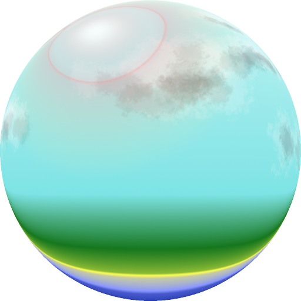
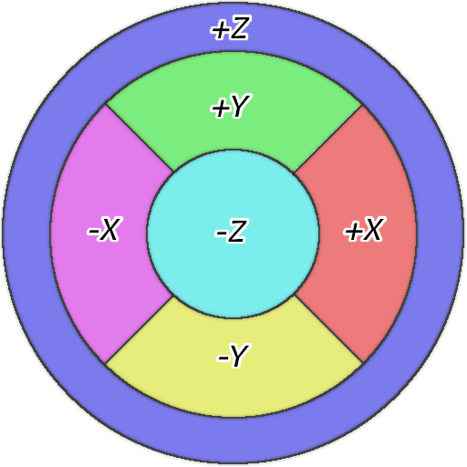
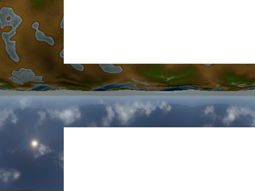
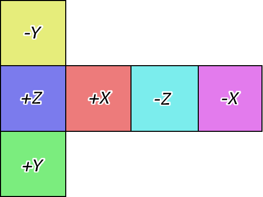
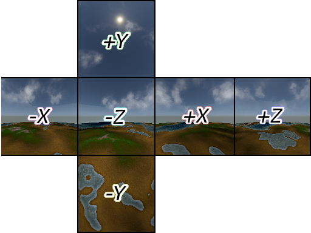
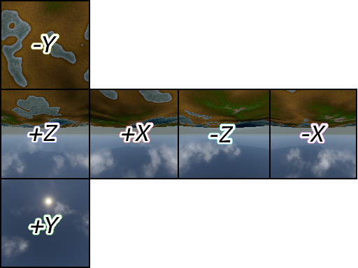

[OpenGL 3D 2019 後期 第04回]

# 鏡の国のテレイン

<br>

## 目標

* キューブテクスチャの作り方を学習する。
* 反射ベクトルの計算を学習する。

## 1. 環境マッピング

### 1.1 映り込みを再現するには

金属や水といった物質の表面には、鏡のように周囲の物体が映り込みます。コンピューターグラフィックスでこのような物質を表現するには、光の反射方向を計算し、反射先にある物体の色を取得して表示すればよいわけです。しかし、反射先の物体を探す処理には多くの計算が必要となります。そのため、2019年現在のコンピューターを持ってしても、リアルタイムで計算するのは難しいのです。

代替案として、「ある地点から見た周囲の風景をテクスチャとして用意しておき、法線によってマッピングする」という方法が考案されました。この方法は「環境マッピング」と呼ばれています。環境マッピングは、テクスチャ・マッピング機能を持つあらゆるハードウェアで高速に実行可能です。ただし、映り込みは不正確なものにならざるを得ません。例えば、カメラが移動したり、周囲にある物体が移動した場合でも、それらが画像に反映されることはありません。

### 1.2 さまざまな環境マッピング

環境マッピングには「球面マッピング」、「双放物面マッピング」、「キューブマッピング」の３種類の方法があります。以下は、比較的よく使われる「球面マッピング」と「キューブマッピング」の例です。

<div style="text-align: center;width: 100%;">


<div style="white-space: pre;">[球面マッピング用テクスチャ(左)と配置(右)]</div>
</div>

<br>

<div style="text-align: center;width: 100%;">


<div style="white-space: pre;">[キューブマッピング用テクスチャ(左)と配置(右)]</div>
</div>

球面マッピングは1枚のテクスチャに全ての方向の画像を書き込みます。このため、特に+Z方向の画像は大きく歪み、解像度が不足しがちになります。この問題は、視点が動かない限りは大きな問題にはなりません。しかし、視点が180度反対を向くと、歪みとボケが非常に大きくなってしまいます。また、球面マッピング用テクスチャの作成には特殊な変形を必要とするため、リアルタイムで作成するには向きません。

キューブマッピングでは各方向に1枚ずつ、合計6枚のテクスチャを使って周囲の映り込みを表現します。この複雑さから、初期のGPUではキューブマッピングを扱うことが難しく、もっぱら球面マッピングや双放物面マッピングが使われていました。しかし、現代のGPUでは十分にサポートされており、球面マッピングや双放物面マッピングと比較して非常に歪みが少ないことから主流になっています。また、カメラを6方向に向けて描画するだけで作成可能なため、リアルタイムで作成することにも向いています。

本講義では、「キューブマッピング」を使って水面を表示していきます。

>［補足］双放物面マッピングは球面マッピングの+Z部分をなくし、+Z側と-Z側のそれぞれの方向から写した2枚のテクスチャを使います。これには同時に複数のテクスチャを扱う機能が必要となりますが、ほぼ同時期にキューブマッピング機能も追加されたことで、あまり利用されることはなく、より性能の高いキューブマッピングに置き換わっていきました。

### 1.3 キューブマッピング用テクスチャを扱うクラスを定義する

キューブマッピング用テクスチャ(以後は「キューブマップ」と呼びます)は、6枚の画像をひとつのテクスチャとして登録する作業が必要です。そこで、この作業を行うキューブマップ用のクラスを追加します。Texture.hを開き、次のプログラムを追加してください。

```diff
 #include <glm/glm.hpp>
 #include <vector>
 #include <memory>
+#include <string>

 namespace Texture {

 class Interface;
 using InterfacePtr = std::shared_ptr<Interface>;
 class Image2D;
 using Image2DPtr = std::shared_ptr<Image2D>;
 class Image2DArray;
 using Image2DArrayPtr = std::shared_ptr<Image2DArray>;
 class Buffer;
 using BufferPtr = std::shared_ptr<Buffer>;
+class Cube;
+using CubePtr = std::shared_ptr<Cube>;

 /**
 * 画像データ.
```

次に、Bufferクラスの定義の下に、次のプログラムを追加してください。

```diff
   GLuint id = 0;
   BufferObject bo;
 };
+
+/**
+* キューブマップ・テクスチャ.
+*/
+class Cube : public Interface
+{
+public:
+  static CubePtr Create(const std::vector<std::string>&);
+  Cube() = default;
+  virtual ~Cube();
+
+  virtual bool IsNull() const override { return !id; }
+  virtual GLuint Get() const override { return id; }
+  virtual GLint Width() const override { return width; }
+  virtual GLint Height() const override { return height; }
+  virtual GLenum Target() const override { return GL_TEXTURE_CUBE_MAP; }
+
+private:
+  GLuint id = 0;
+  GLint width = 0;
+  GLint height = 0;
+};

 } // namespace Texture
```

Cube(きゅーぶ)クラスはキューブマップを扱うためのクラスです。

### 1.4 Cube::Create関数を定義する

続いてメンバ関数を定義しましょう。最初はキューブマップを作成するCube::Create関数です。Texture.cppを開き、Buffer::BufferSubData関数の定義の下に、次のプログラムを追加してください。

```diff
   return bo.BufferSubData(offset, size, data);
 }
+
+/**
+* キューブマップ・テクスチャを作成する.
+*
+* @param pathList キューブマップ用画像ファイル名のリスト.
+*
+* @return 作成したテクスチャオブジェクト.
+*/
+CubePtr Cube::Create(const std::vector<std::string>& pathList)
+{
+  if (pathList.size() < 6) {
+    std::cerr << "[エラー] " << __func__ << "キューブマップには6枚の画像が必要ですが" <<
+      pathList.size() << "枚しか指定されていません\n";
+    for (size_t i = 0; i < pathList.size(); ++i) {
+      std::cerr << "  pathList[" << i << "]=" << pathList[i] << "\n";
+    }
+    return nullptr;
+  }
+
+  std::vector<ImageData> imageDataList;
+  imageDataList.resize(6);
+  for (int i = 0; i < 6; ++i) {
+    if (!LoadImage2D(pathList[i].c_str(), &imageDataList[i])) {
+      return nullptr;
+    }
+  }
+
+  GLuint id;
+  glGenTextures(1, &id);
+  glBindTexture(GL_TEXTURE_CUBE_MAP, id);
+  for (int i = 0; i < 6; ++i) {
+    const ImageData& image = imageDataList[i];
+    glTexImage2D(GL_TEXTURE_CUBE_MAP_POSITIVE_X + i, 0, GL_RGBA8,
+      image.width, image.height, 0, image.format, image.type, image.data.data());
+    const GLenum result = glGetError();
+    if (result != GL_NO_ERROR) {
+      std::cerr << "[エラー] " << pathList[i] << "の読み込みに失敗("
+        << std::hex << result << ").\n";
+      glDeleteTextures(1, &id);
+      return nullptr;
+    }
+  }
+
+  // テクスチャのパラメーターを設定する.
+  glTexParameteri(GL_TEXTURE_CUBE_MAP, GL_TEXTURE_MAX_LEVEL, 0);
+  glTexParameteri(GL_TEXTURE_CUBE_MAP, GL_TEXTURE_MIN_FILTER, GL_LINEAR);
+  glTexParameteri(GL_TEXTURE_CUBE_MAP, GL_TEXTURE_MAG_FILTER, GL_LINEAR);
+  glTexParameteri(GL_TEXTURE_CUBE_MAP, GL_TEXTURE_WRAP_S, GL_CLAMP_TO_EDGE);
+  glTexParameteri(GL_TEXTURE_CUBE_MAP, GL_TEXTURE_WRAP_T, GL_CLAMP_TO_EDGE);
+  glBindTexture(GL_TEXTURE_CUBE_MAP, 0);
+
+  CubePtr p = std::make_shared<Cube>();
+  p->id = id;
+  p->width = imageDataList[0].width;
+  p->height = imageDataList[0].height;
+  return p;
+}

 } // namespace Texture
```

キューブマップには6枚の画像が必要なので、std::vectorに含まれているファイル名が6つに満たない場合はnullptrを返します。次にLoadImage2D関数で6枚の画像を読み込みます。いずれかの読み込みに失敗したら、キューブマップを作れないのでnullptrを返します。読み込みに成功したらキューブマップを作成します。キューブマップの作成方法は、バインディング・ポイントがGL_TEXTURE_CUBE_MAP(じーえる・てくすちゃ・きゅーぶ・まっぷ)になっている以外は他のテクスチャと同様ですが、データをGPUへコピーする方法が少し変わっています。キューブマップのコピーには専用のバインディング・ポイントが用意されているのです。

GL_TEXTURE_CUBE_MAP_POSITIVE_X(じーえる・てくすちゃ・きゅーぶ・まっぷ・ぽじてぃぶ・えっくす)、GL_TEXTURE_CUBE_MAP_NEGATIVE_X(じーえる・てくすちゃ・きゅーぶ・まっぷ・ねがてぃぶ・えっくす)、といったように、XYZのそれぞれにプラス方向とマイナス方向の2種類が存在します。これらはGL_TEXTURE_CUBE_MAP_POSITIVE_Xから順番に番号が振られているため、インデックスを加算することで6種類全てのバインディング・ポイントを指定することが可能です。

なお、これらのバインディング・ポイントはコピーのときにしか使えません。コピー以外の操作では、GL_TEXTURE_CUBE_MAPを使用しなければなりません。

### 1.5 Cubeクラスのデストラクタを定義する

次にデストラクタを定義します。Cube::Create関数の定義の下に、次のプログラムを追加してください。

```diff
   p->width = imageDataList[0].width;
   p->height = imageDataList[0].height;
   return p;
 }
+
+/**
+* デストラクタ.
+*/
+Cube::~Cube()
+{
+  glDeleteTextures(1, &id);
+}

 } // namespace Texture
```

これでCubeクラスの定義は完了です。

### 1.6 水面用のシェーダーを作成する

キューブマップを使って水面を描画するシェーダーを作成しましょう。Resフォルダに「Water.frag」というファイルを追加してください。水面は、基本的には地形と同じ方法で描画していきます。追加したファイルを開き、Terrain.fragの内容を全て「コピー＆貼り付け」してください。

貼り付けが済んだら、水面用に改造していきましょう。まずは先頭のコメントを変更します。

```diff
 /**
-* @file Terrain.frag
+* @file Water.frag
 */
 #version 430
```

キューブマップを読み込むときは`samplerCube`(さんぷらー・きゅーぶ)という型を使います。また、反射方向の計算には視点の座標が必要となるので、これもユニフォーム変数として定義します。`texSpotLightIndex`変数の定義の下に、次のプログラムを追加してください。

```diff
 uniform isamplerBuffer texPointLightIndex;
 uniform isamplerBuffer texSpotLightIndex;
+
+uniform vec3 cameraPosition;
+uniform samplerCube texCubeMap;
+uniform float time;

const ivec2 mapSize = ivec2(200, 200);
```

水は単一の物質で、地面のようにさまざまな物質で構成されているわけではありません。そこで、水の色にはテクスチャを使わず、シェーダーで指定することにします。

```diff
 /**
-* Terrain fragment shader.
+* Water fragment shader.
 */
 void main()
 {
-  vec4 ratio = texture(texColorArray[0], inTexCoord);
-  float baseRatio = max(0, 1.0 - ratio.r - ratio.g);
-  vec2 uv = inTexCoord * 10;
-  fragColor.rgb = texture(texColorArray[1], uv).rgb * baseRatio;
-  fragColor.rgb += texture(texColorArray[2], uv).rgb * ratio.r;
-  fragColor.rgb += texture(texColorArray[3], uv).rgb * ratio.g;
-  fragColor.a = 1;
+  vec4 waterColor = vec4(0.15, 0.20, 0.3, 0.6); // 水の色と不透明度.
+  fragColor = waterColor;

   mat3 matTBN = mat3(normalize(inTBN[0]), normalize(inTBN[1]), normalize(inTBN[2]));
-  vec3 normal = (texture(texNormalArray[0], uv).rgb * 2.0 - 1.0) * baseRatio;
-  normal += (texture(texNormalArray[1], uv).rgb * 2.0 - 1.0) * ratio.r;
-  normal += (texture(texNormalArray[2], uv).rgb * 2.0 - 1.0) * ratio.g;
-  normal = normalize(matTBN * normal);
+  vec4 uv = inTexCoord.xyxy * vec4(11.0, 11.0, 5.0, 5.0);
+  vec4 scroll = vec4(-0.01, -0.01, 0.005, 0.005) * time;
+  vec3 normalS = texture(texNormalArray[0], uv.xy + scroll.xy).rgb * 2.0 - 1.0;
+  vec3 normalL = texture(texNormalArray[0], uv.zw + scroll.zw).rgb * 2.0 - 1.0;
+  vec3 normal =  normalS * 0.5 + normalL;
+  normal = normalize(matTBN * normal);

   vec3 lightColor = ambientLight.color.rgb;
```

ノーマルマップは一枚だけ使います。ただし、同じノーマルマップを縮尺を変えて2回読み込むようにしています。縮尺の大きいほうはおおまかな凹凸を表し、小さいほうは細かな凹凸を表します。縮尺を変えて重ね合わせることでより複雑な凹凸を生み出すことができるわけです。このとき、縮尺の小さい方の影響力を小さくすると見た目が自然になります。ですから、normalS変数に0.5を掛けているわけです。

また、1枚だけだと繰り返しによるパターンが見えてしまいますが、重ね合わせることでパターンが見えにくくなります。縮尺の最小公倍数がパターンの長さになるからです。ただし、縮尺が違いすぎると不自然に見えてしまうので注意してください。

time変数はノーマルマップをスクロールさせるために使用します。あとでtime変数には経過時間を設定しますが、そうすることで、時間が進むごとにノーマルマップが少しずつずれて表示されます。また、縮尺ごとにずらす方向と速度を変えているので、ノーマルマップの重なり方が時間によって変化し、それがアニメーションになります。

最後に、反射の計算を行ってキューブマップを読み込みます。ライトの明るさを乗算するプログラムの下に、次のプログラムを追加してください。

```diff
       lightColor += spotLight[id].color.rgb * cosTheta * intensity * cutOff;
     }
   }

   fragColor.rgb *= lightColor;
+
+  vec3 cameraVector = normalize(cameraPosition - inPosition);
+  vec3 reflectionVector =
+    2.0 * max(dot(cameraVector, normal), 0.0) * normal - cameraVector;
+  vec3 environmentColor = texture(texCubeMap, reflectionVector).rgb;
+  fragColor.rgb += environmentColor;
 }
```

反射ベクトルの計算方法については下記の図を見てください。

<div style="text-align: center;width: 100%;">

<div style="white-space: pre;">[反射ベクトル]</div>
</div>

カメラベクトル`C`と法線ベクトル`N`の内積を計算すると、結果は「CをNに射影した長さ」になります。`N`にこの長さを掛けたものが上図の`d`というベクトルです。この`d`を`C`から引くと、緑色のベクトルが得られます。

ここで反射ベクトルについて考えてみると、反射ベクトル`R`は「緑色のベクトル`C-d`の方向に逆向きにして`d`を足したもの」になります。つまり、

`R = -(C - d) + d`

です。これを変形すると、

`R = -C + d + d = 2d - C`

となり、上記のプログラムの式が得られます。

キューブマップからピクセルを取得するには、こうして計算した反射ベクトルを第2引数として指定するだけです。あとは、反射先の色をピクセルカラーに加算しておしまいです。

### 1.7 Shader::Programクラスにユニフォーム変数を操作する機能を追加する

水面シェーダーには3つのユニフォーム変数を追加しました。これらをShader::Programクラス経由で扱えるようにしていきます。Shader.hを開き、Programクラスに次のプログラムを追加してください。

```diff
   void SetPointLightIndex(int count, const int* indexList);
   void SetSpotLightIndex(int count, const int* indexList);
+  void SetCameraPosition(const glm::vec3&);
+  void SetTime(float);

   /// プログラムIDを取得する.
   GLuint Get() const { return id; }

 private:
   GLuint id = 0; //プログラムID

   //// uniform変数の位置
   GLint locMatMVP = -1;
   GLint locMatModel = -1;
   GLint locPointLightCount = -1;
   GLint locPointLightIndex = -1;
   GLint locSpotLightCount = -1;
   GLint locSpotLightIndex = -1;
+  GLint locCameraPosition = -1;
+  GLint locTime = -1;

   glm::mat4 matVP = glm::mat4(1); //ビュー・プロジェクション行列
```

次にShader.cppを開き、Program::Reset関数に以下のプログラムを追加してください。

```diff
     locSpotLightIndex = -1;
+    locCameraPosition = -1;
+    locTime = -1;
     return;
   }

   locMatMVP = glGetUniformLocation(id, "matMVP");
   locMatModel = glGetUniformLocation(id, "matModel");
   locPointLightCount = glGetUniformLocation(id, "pointLightCount");
   locPointLightIndex = glGetUniformLocation(id, "pointLightIndex");
   locSpotLightCount = glGetUniformLocation(id, "spotLightCount");
   locSpotLightIndex = glGetUniformLocation(id, "spotLightIndex");
   locSpotLightCount = glGetUniformLocation(id, "spotLightCount");
   locSpotLightIndex = glGetUniformLocation(id, "spotLightIndex");
+  locCameraPosition = glGetUniformLocation(id, "cameraPosition");
+  locTime = glGetUniformLocation(id, "time");

   glUseProgram(id);
   const GLint texColorLoc = glGetUniformLocation(id, "texColor");
```

Reset関数にはもう一箇所追加します。スポットライトインデックスの位置を取得するプログラムの下に、次のプログラムを追加してください。

```diff
   const GLint locTexSpotLightIndex = glGetUniformLocation(id, "texSpotLightIndex");
   if (locTexSpotLightIndex >= 0) {
     glUniform1i(locTexSpotLightIndex, 5);
   }
+  const GLint locTexCubeMap = glGetUniformLocation(id, "texCubeMap");
+  if (locTexCubeMap >= 0) {
+    glUniform1i(locTexCubeMap, 6);
+  }
   glUseProgram(0);
 }
```

キューブマップが使用するバインディング・ポイントですが、ライトインデックス用のテクスチャが4番と5番を使用しているので、その次の6番を割り当てました。マテリアルにキューブマップを設定するときは、6番目のテクスチャとして設定することになります。

続いて、カメラ座標と経過時間を設定するメンバ関数を定義します。Program::SetSpotLightIndex関数の定義の下に、次のプログラムを追加してください。

```diff
   if (locSpotLightIndex >= 0 && count > 0) {
     glUniform1iv(locSpotLightIndex, count, indexList);
   }
 }
+
+/**
+* カメラ座標を設定する.
+*
+* @param pos カメラ座標.
+*/
+void Program::SetCameraPosition(const glm::vec3& pos)
+{
+  if (locCameraPosition >= 0) {
+    glUniform3fv(locCameraPosition, 1, &pos.x);
+  }
+}
+
+/**
+* 総経過時間を設定する.
+*
+* @param time 総経過時間.
+*/
+void Program::SetTime(float time)
+{
+  if (locTime >= 0) {
+    glUniform1f(locTime, time);
+  }
+}

 /**
 * プログラムオブジェクトを作成する.
```

### 1.8 Mesh::Bufferクラスで水面シェーダーを読み込む

水面シェーダーはMesh::Bufferクラスに読み込ませることにします。Mesh.hを開き、Mesh::Bufferクラスに次のプログラムを追加してください。

```diff
   FilePtr GetFile(const char* name) const;
   void SetViewProjectionMatrix(const glm::mat4&) const;
+  void SetCameraPosition(const glm::vec3&) const;
+  void SetTime(double) const;

   void AddCube(const char* name);

   // スケルタル・アニメーションに対応したメッシュの読み込みと取得.
   bool LoadSkeletalMesh(const char* path);
   SkeletalMeshPtr GetSkeletalMesh(const char* meshName) const;

   const Shader::ProgramPtr& GetStaticMeshShader() const { return progStaticMesh; }
   const Shader::ProgramPtr& GetTerrainShader() const { return progTerrain; }
+  const Shader::ProgramPtr& GetWaterShader() const { return progWater; }

 private:
   BufferObject vbo;
   BufferObject ibo;
   GLintptr vboEnd = 0;
   GLintptr iboEnd = 0;
   std::unordered_map<std::string, FilePtr> files;
   Shader::ProgramPtr progStaticMesh;
   Shader::ProgramPtr progTerrain;
+  Shader::ProgramPtr progWater;

   // スケルタル・アニメーションに対応したメッシュを保持するメンバ変数.
   Shader::ProgramPtr progSkeletalMesh;
```

それでは、水面シェーダーを読み込みましょう。Mesh.cppを開き、Buffer::Init関数に次のプログラムを追加してください。

```diff
   progTerrain = Shader::Program::Create("Res/Terrain.vert", "Res/Terrain.frag");
   if (progTerrain->IsNull()) {
     return false;
   }
+  progWater = Shader::Program::Create("Res/Terrain.vert", "Res/Water.frag");
+  if (progWater->IsNull()) {
+    return false;
+  }

   vboEnd = 0;
   iboEnd = 0;
   files.reserve(100);
```

水面シェーダーは地形用のフラグメントシェーダーを改造したものでした。in変数はなにも変更しなかったので、地形と同じ頂点シェーダーを使うことができます。

### 1.9 水面シェーダーにVP行列を設定する

Buffer::SetViewProjectionMatrix関数に、次のプログラムを追加してください。

```diff
 void Buffer::SetViewProjectionMatrix(const glm::mat4& matVP) const
 {
   progStaticMesh->Use();
   progStaticMesh->SetViewProjectionMatrix(matVP);
   progSkeletalMesh->Use();
   progSkeletalMesh->SetViewProjectionMatrix(matVP);
   progTerrain->Use();
   progTerrain->SetViewProjectionMatrix(matVP);
+  progWater->Use();
+  progWater->SetViewProjectionMatrix(matVP);
   glUseProgram(0);
 }
```

これで水面シェーダーにもビュー・プロジェクション行列が設定されます。

### 1.10 シェーダーにカメラ座標を設定する

次に、水面シェーダーで追加したカメラ座標を設定する関数を定義します。Buffer::SetViewProjectionMatrix関数の定義の下に、次のプログラムを追加してください。

```diff
   progWater->Use();
   progWater->SetViewProjectionMatrix(matVP);
   glUseProgram(0);
 }
+
+/**
+* シェーダーにカメラのワールド座標を設定する.
+*
+* @param pos カメラのワールド座標.
+*/
+void Buffer::SetCameraPosition(const glm::vec3& pos) const
+{
+  progStaticMesh->Use();
+  progStaticMesh->SetCameraPosition(pos);
+  progSkeletalMesh->Use();
+  progSkeletalMesh->SetCameraPosition(pos);
+  progTerrain->Use();
+  progTerrain->SetCameraPosition(pos);
+  progWater->Use();
+  progWater->SetCameraPosition(pos);
+  glUseProgram(0);
+}

 /**
 * メッシュを描画する.
```

### 1.11 シェーダーに経過時間を設定する

続いて、経過時間を設定する関数を定義します。Buffer::SetCameraPosition関数の定義の下に、次のプログラムを追加してください。

```diff
   progWater->Use();
   progWater->SetCameraPosition(pos);
   glUseProgram(0);
 }
+
+/**
+* シェーダーにアプリが起動してからの経過時間を設定する.
+*
+* @param time アプリが起動してからの経過時間(秒).
+*/
+void Buffer::SetTime(double time) const
+{
+  const float ftime = static_cast<float>(std::fmod(time, 24 * 60 * 60));
+  progStaticMesh->Use();
+  progStaticMesh->SetTime(ftime);
+  progSkeletalMesh->Use();
+  progSkeletalMesh->SetTime(ftime);
+  progTerrain->Use();
+  progTerrain->SetTime(ftime);
+  progWater->Use();
+  progWater->SetTime(ftime);
+  glUseProgram(0);
+}

 /**
 * メッシュを描画する.
```

### 1.12 GLFWEW::Windowクラスに総経過時間を取得する機能を追加する

ところで、経過時間はどうやって測ればいいのでしょう。更新ごとの間隔はdeltaTimeとして取得できますが、ゲームが開始してからの経過時間を取得する機能はまだありませんでした。これはGLFWから取得可能なので、GLFWEW::Windowクラスに機能を追加しようと思います。GLFWEW.hを開き、Windowクラスに次のプログラムを追加してください。

```diff
   void InitTimer();
   void UpdateTimer();
   double DeltaTime() const;
+  double Time() const;
   bool IsKeyPressed(int key) const;
   const GamePad& GetGamePad() const;
   int Width() const { return width; }
   int Height() const { return height; }
```

続いて、GLFWEW.cppを開き、Window::DeltaTime関数の定義の下に、次のプログラムを追加してください。

```diff
   return deltaTime;
 }
+
+/**
+* 総経過時間を取得する.
+*
+* @return GLFWが初期化されてからの経過時間(秒).
+*/
+double Window::Time() const
+{
+  return glfwGetTime();
+}

 /**
 * ゲームパッドの状態を取得する.
```

総経過時間の取得には`glfwGetTime`関数を使います。この関数は「glfwInitが実行されてからの経過時間」を返します。通常、glfwInit関数はゲーム起動直後に実行されるので、これは「ゲーム開始からの経過時間」と同じと考えて構わないでしょう。

### 1.13 水面メッシュを作成する

今度は水面シェーダーを適用するための水面メッシュを作っていきます。水面は地形の一部だと考えられるため、この機能はHeightMapクラスに追加することにしました。

それでは、Terrain.hを開き、HeightMapクラス定義に次のプログラムを追加してください。

```diff
   bool CreateMesh(Mesh::Buffer& meshBuffer,
     const char* meshName, const char* texName = nullptr) const;
+  bool CreateWaterMesh(Mesh::Buffer& meshBuffer,
+    const char* meshName, float waterLevel) const;
   void UpdateLightIndex(const ActorList& lights);

 private:
   std::string name;                ///< 元になった画像ファイル名.
```

続いてTerrain.cppを開き、HeightMap::CreateMesh関数の定義の下に、次のプログラムを追加してください。

```diff
   m.program = meshBuffer.GetTerrainShader();
   meshBuffer.AddMesh(meshName, p, m);

   return true;
 }
+
+/**
+* 水面メッシュを作成する.
+*
+* @param meshBuffer メッシュ作成先となるメッシュバッファ.
+* @param meshName   作成するメッシュの名前.
+* @param waterLevel 水面の高さ.
+*
+* @retval true  メッシュの作成に成功.
+* @retval false メッシュを作成できなかった.
+*/
+bool HeightMap::CreateWaterMesh(Mesh::Buffer& meshBuffer, const char* meshName,
+  float waterLevel) const
+{
+  // 頂点データを作成.
+  Mesh::Vertex v;
+  std::vector<Mesh::Vertex> vertices;
+  vertices.reserve(size.x * size.y);
+  for (int z = 0; z < size.y; ++z) {
+    for (int x = 0; x < size.x; ++x) {
+      // テクスチャ座標は上がプラスなので、向きを逆にする必要がある.
+      v.position = glm::vec3(x, waterLevel, z);
+      v.texCoord = glm::vec2(x, (size.y - 1) - z) / (glm::vec2(size) - 1.0f);
+      v.normal = glm::vec3(0, 1, 0);
+      vertices.push_back(v);
+    }
+  }
+  const size_t vOffset =
+    meshBuffer.AddVertexData(vertices.data(), vertices.size() * sizeof(Mesh::Vertex));
+
+  // インデックスデータを作成.
+  std::vector<GLuint> indices;
+  indices.reserve(size.x * size.y);
+  for (int z = 0; z < size.y - 1; ++z) {
+    for (int x = 0; x < size.x - 1; ++x) {
+      const GLuint a = (z + 1) * size.x + x;
+      const GLuint b = (z + 1) * size.x + (x + 1);
+      const GLuint c = z       * size.x + (x + 1);
+      const GLuint d = z       * size.x + x;
+      indices.push_back(a);
+      indices.push_back(b);
+      indices.push_back(c);
+
+      indices.push_back(c);
+      indices.push_back(d);
+      indices.push_back(a);
+    }
+  }
+  const size_t iOffset =
+    meshBuffer.AddIndexData(indices.data(), indices.size() * sizeof(GLuint));
+
+  // 頂点データとインデックスデータからメッシュを作成.
+  Mesh::Primitive p =
+    meshBuffer.CreatePrimitive(indices.size(), GL_UNSIGNED_INT, iOffset, vOffset);
+  Mesh::Material m = meshBuffer.CreateMaterial(glm::vec4(1), nullptr);
+  m.texture[4] = lightIndex[0];
+  m.texture[5] = lightIndex[1];
+  std::vector<std::string> cubeMapFiles;
+  cubeMapFiles.reserve(6);
+  cubeMapFiles.push_back("Res/cubemap_px.tga");
+  cubeMapFiles.push_back("Res/cubemap_nx.tga");
+  cubeMapFiles.push_back("Res/cubemap_py.tga");
+  cubeMapFiles.push_back("Res/cubemap_ny.tga");
+  cubeMapFiles.push_back("Res/cubemap_pz.tga");
+  cubeMapFiles.push_back("Res/cubemap_nz.tga");
+  m.texture[6] = Texture::Cube::Create(cubeMapFiles);
+  m.texture[8] = Texture::Image2D::Create("Res/Terrain_Water_Normal.tga");
+  m.program = meshBuffer.GetWaterShader();
+  meshBuffer.AddMesh(meshName, p, m);
+
+  return true;
+}

 /**
 * ライトインデックスを更新する.
```

キューブマップは6番目のテクスチャとして設定します。なぜなら、Program::Reset関数を修正したとき、キューブマップのバインディング・ポイントを6番にしたからです(このことを覚えていない、あるいは思い出せない場合はReset関数を再確認してください。番号を間違えているかもしれませんよ)。

### 1.14 水面用のキューブマップとノーマルマップを用意する

キューブマップを作るためには6方向ぶんの画像を用意する必要があります。これはちょっと面倒な作業です。とりあえず以下のサイトから好きな背景をダウンロードするのが簡単です。

`http://www.custommapmakers.org/skyboxes.php`

あるいは`Terragen 4`のような景観作成ソフトウェアを使って生成することもできます。`Terragen 4`は以下のサイトから無料版をダウンロードできます。

`https://planetside.co.uk/`

使い方については`terragen 4 キューブマップ`などで検索して調べてください。

さて、ダウンロードした画像は画像形式がPNGやJPGになっていることが多いので、一度Visual Studioで開いてファイルメニューから「名前をつけて？？？を保存」を選択することでTGA形式に変換しなければなりません。また、保存する前に、画像の上下と左右の両方を反転させるようにしてください。

なぜ画像の上下左右を反転しなければならないのか？　それは、OpenGLのキューブマップの仕様が、DirectXからそのまま持ち込まれたものだからです。

<div style="text-align: center;width: 100%;">


<div style="white-space: pre;">[DirectXのキューブマップ]    [OpenGLのキューブマップ]</div>
</div>

DirectXは左手座標系でテクスチャ座標原点は左上です。対してOpenGLは右手座標系でテクスチャ座標原点は左下です。そして、キューブマップを読み込む処理はDirectXの仕様で動作します。しかし、テクスチャはOpenGLの仕様で作らなければならないのです。そのため、キューブマップは右手座標系と左手座標系の違いを吸収するために左右反転し、テクスチャ座標系の違いを吸収するために上下反転する必要があるわけです。

上下左右の反転を終えたら、の図を参考にして名前を`cubemap_px.tga`、`cubemap_nx.tga`、`cubemap_py.tga`、`cubemap_ny.tga`、`cubemap_pz.tga`、`cubemap_nz.tga`のように変更し、Resフォルダにコピーしてください。

>［補足］当初、このおかしなキューブマップの仕様は、当初はNVIDIA社が自社GPU専用の拡張仕様としてOpenGLに持ち込まれました。そのときは拡張仕様ということで問題はなかったのです。この仕様はOpenGL用の調整が不要なため、DirectX用のGPUをメインに作っていた他社にとっても都合がよいものでした。結果として、大きな反対もなくそのまま標準仕様に昇格してしまったのです。

水面のノーマルマップの作成にはPhotoShopやGIMPなどの画像作成ツールが利用できます。あるいは以下の画像をダウンロードして使ってください。

`https://github.com/tn-mai/OpenGL3D2019_2nd/blob/master/Res/Terrain_Water_Normal.tga`

水面のノーマルマップは`Terrain_Water_Normal.tga`という名前を付けてResフォルダにコピーしてください。

### 1.14 水面を設定する

それでは水面を表示してみましょう。MainGameScene.cppを開き、MainGameScene::Initialize関数に次のプログラムを追加してください。

```diff
   if (!heightMap.CreateMesh(meshBuffer, "Terrain")) {
     return false;
   }
+  if (!heightMap.CreateWaterMesh(meshBuffer, "Water", -15)) { // 水面の高さは要調整.
+    return false;
+  }

   lightBuffer.Init(1);
   lightBuffer.BindToShader(meshBuffer.GetStaticMeshShader());
   lightBuffer.BindToShader(meshBuffer.GetTerrainShader());
+  lightBuffer.BindToShader(meshBuffer.GetWaterShader());

   glm::vec3 startPos(100, 0, 100);
   startPos.y = heightMap.Height(startPos);
```

次に、カメラ座標と経過時間をシェーダーに設定します。MainGameScene::Render関数に次のプログラムを追加してください。

```diff
   const glm::mat4 matProj =
     glm::perspective(glm::radians(30.0f), aspectRatio, 1.0f, 1000.0f);
   meshBuffer.SetViewProjectionMatrix(matProj * matView);
+  meshBuffer.SetCameraPosition(camera.position);
+  meshBuffer.SetTime(window.Time());

   glm::vec3 cubePos(100, 0, 100);
   cubePos.y = heightMap.Height(cubePos);
```

最後に水面を描画しましょう。MainGameScene::Render関数に次のプログラムを追加してください。

```diff
   objects.Draw();

   glm::vec3 treePos(110, 0, 110);
   treePos.y = heightMap.Height(treePos);
   const glm::mat4 matTreeModel =
     glm::translate(glm::mat4(1), treePos) * glm::scale(glm::mat4(1), glm::vec3(3));
   Mesh::Draw(meshBuffer.GetFile("Res/red_pine_tree.gltf"), matTreeModel);
+
+  Mesh::Draw(meshBuffer.GetFile("Water"), glm::mat4(1));

   fontRenderer.Draw(screenSize);
 }

 /**
 * お地蔵様に触れたときの処理.
```

水面のような半透明のメッシュは、できるだけ最後に描画する必要があります。

プログラムが書けたらビルドして実行してください。水面が表示され、アニメーションしていたら成功です。

<div style="page-break-after: always"></div>

## 2. フレネル反射

### 2.1 角度による見え方の違いをシミュレートする

静かな水面を真上から見ると水底まで見通せますが、かすめるような角度から見るとほとんど水の中が見えなくなります。このような反射特性を表す「フレネル方程式」というものが存在します。

フレネル方程式を使うと、このような水の振る舞いを正しく表現することがかのうになります。ただし、フレネル方程式は重い処理なので、そのまま使うと処理に時間がかかりすぎます。そこで、微妙な違いはあるものの、ほぼ同じ反射特性を表現できる「近似式(きんじしき)」が考案されています。今回はこの近似式を使ってフレネル方程式をシミューレートすることにします。この近似式は、発見者の名前をとって「シュリック(Schlick)の近似式」と呼ばれています。

それでは、Water.fragを開き、ライトのユニフォームブロックの定義の下に、次のプログラムを追加してください。

```diff
  PointLight pointLight[100];
  SpotLight spotLight[100];
};
+
+const float iorAir = 1.000293; // 空気の屈折率.
+const float iorWater = 1.333; // 水の屈折率.
+
+const float eta = iorAir / iorWater;
+const float f0 = (1.0 - eta) * (1.0 - eta) / ((1.0 + eta) * (1.0 + eta));
+
+/**
+* シュリック近似式によってフレネル係数を計算する.
+*
+* @param v  カメラベクトル.
+* @param n  法線ベクトル.
+*
+* @return フレネル係数.
+*/
+float GetFresnelFactor(vec3 v, vec3 n)
+{
+  return f0 + (1.0 - f0) * pow(1.0 - dot(v, n), 5.0);
+}

/**
* Water fragment shader.
```

上記の`f0`は「光が垂直に入射するときの反射率」です。これは2つの物質の屈折率から計算することができます。

### 2.2 フレネル係数を使って水面の色と不透明度を計算する

それではフレネル係数を計算し、それを適用しましょう。Water.fragのmain関数の末尾を次のように変更してください。

```diff
   vec3 reflectionVector =
     2.0 * max(dot(cameraVector, normal), 0.0) * normal - cameraVector;
   vec3 environmentColor = texture(texCubeMap, reflectionVector).rgb;
-  fragColor.rgb += environmentColor;
+
+  float brightness = 5.0; // 環境マップの明るさ補正値.
+  vec3 yuv = mat3(
+    0.299,-0.169, 0.500,
+    0.587,-0.331,-0.419,
+    0.114, 0.500,-0.081) * environmentColor;
+  yuv.r *= GetFresnelFactor(cameraVector, normal) * brightness;
+  fragColor.rgb *= fragColor.a;
+  fragColor.rgb += mat3(
+    1.000, 1.000, 1.000,
+    0.000,-0.344, 1.772,
+    1.402,-0.714, 0.000) * yuv;
+  fragColor.a += yuv.r;
 }
```

上記のプログラムの「brightness(ぶらいとねす)」変数は、反射光の明るさを表しています。フレネル係数を導入すると反射される光の強さがかなり少なくなってしまうので、キューブマップの明るさを5倍するようにしてみました(数値に根拠はなく、それらしく見える明るさをいくつか試して決めました)。

その下がフレネル係数の処理です。フレネル係数の計算自体は簡単ですが、その結果を適切に表示するためには、係数の意味を考慮したプログラムを書かなければなりません。例えば、フレネル係数は反射光の明るさを変化させますが、係数を直接RGBカラーに掛けても正しい明るさにはなりません。人間の目は光の波長によって明るさの感度が異なるため、RGBを均等に変化させると色味が変わって見えてしまいます。

そこで、明るさを数値化できる「YUV(わい・ゆー・ぶい)」という形式を使います。YUVカラーは「Y=明るさ、U=色味その1、V=色味その2」という色表現形式です。明るさパラメータが独立しているため、画像の色味は維持しつつ明るさだけを変えることができます。詳しくは`https://ja.wikipedia.org/wiki/YUV`を参照してください。yuv変数には、RGBカラーをYUVカラーに変換した値が格納されます。YUVカラーへの変換にはwikipediaに載っている3x3行列を使用しています。次にYUVカラーのY(明るさ)要素に、フレネル係数とbrightness変数を掛け、明るさを変化させます。

明るさを変更したら、再び3x3行列を利用してRGBカラーに戻し、出力カラーに加算します。その前に不透明度を掛けていますが、これは後で「色の混ぜ合わせ方」を設定するときに都合がいいからです。

最後に、不透明度を計算します。水は高い透明度を持ちますが、晴天の昼間のように反射光が十分に強くなる環境では、水底の色は反射光にまぎれてほとんど見えません。この状況は、より不透明になったと考えることができるでしょう。そこで、水自体の不透明度に反射光の明るさ(YUVのY)を加算しています。

これでフレネル反射のシェーダーは完成です。

### 2.3 色の混ぜ合わせ方を設定する

水面の色は、水中で散乱して水面から出てきた光(散乱光)と、水底の物質で反射してきた光を合成したものです。それにさらに反射光を加えると、実際の目にうつる水面の色になるわけです。これを式で表すと次のようになるでしょう。

`水面の色 = 散乱光 * 不透明度 + 水底の色 * (1 - 不透明度) + 反射光`

これを変形すると以下の式が得られます。

`水面の色 = (散乱光 * 不透明度 + 反射光) + 水底の色 * (1 - 不透明度)`

このうち`散乱光 * 不透明度 + 反射光`の部分と`不透明度`の値はシェーダーで計算済みです。あとはこの式になるように、OpenGLのアルファ合成方法を変更するだけです。

OpenGLの色の混ぜ合わせ方は次の式のとおりです。

`最終カラー = (出力カラー * 係数Ｓ) + (フレームバッファカラー * 係数Ｄ`

OpenGLではこの式のうち、係数Ｓと係数Ｄを選択することで、さまざまな混ぜ合わせ方を作り出すことができます。今回の場合は、係数Ｓに「1」、係数Ｄに「1 - 不透明度」を設定することになります。これらはそれぞれ「GL_ONE(じーえる・わん)」、「GL_ONE_MINUS_SRC_ALPHA(じーえる・わん・まいなす・そーす・あるふぁ)」という定数に相当します。

それでは、2つの係数を設定しましょう。係数を指定するには「glBlendFunc(じーえる・ぶれんど・ふぁんく)」関数を使います。MainGameScene.cppを開き、MainGameScene::Render関数の水面を描画するプログラム付近に、次のプログラムを追加してください。

```diff
   const glm::mat4 matTreeModel =
     glm::translate(glm::mat4(1), treePos) * glm::scale(glm::mat4(1), glm::vec3(3));
   Mesh::Draw(meshBuffer.GetFile("Res/red_pine_tree.gltf"), matTreeModel);

+  glBlendFunc(GL_ONE, GL_ONE_MINUS_SRC_ALPHA);
   Mesh::Draw(meshBuffer.GetFile("Water"), glm::mat4(1));

   fontRenderer.Draw(screenSize);
 }

 /**
 * お地蔵様に触れたときの処理.
```

プログラムが書けたらビルドして実行してください。水面の透明度が高くなり、水底がよく見えていたら成功です。

>［補足1］水の色や不透明度、反射光の明るさは、実際の水面と近い見た目になるように適当に決めたものです。これらの値は自由に変更することができます。澄んだ水を表現したいときは不透明度を0.3など低めの数値に、にごった泥水などを表現したい場合は水の色を茶色にして、不透明度には0.9程度の高い数値を設定することが考えられます。これらの変数をユニフォーム変数に変更し、C++プログラムから操作できるようにしても面白いでしょう。

<br>

>［補足2］フレネル係数は、視線が水面と平行に近づくほど高くなります。カメラの位置を調整して、水面の見え方の違いを確かめてみてください。

<div style="page-break-after: always"></div>

## C言語練習問題

1. 標準入力から「数値 演算子 数値」の順でデータを読み取り、計算結果を出力するプログラムがある。`/* 1 */`から`/* 6 */`を適切なプログラムに置き換えてプログラムを完成させなさい。<br>数値は「整数」です。演算子は`+`, `-`, `*`, `/`のいずれか1文字です。

```c++
#include <stdio.h>

int main()
{
  /* 1 */ a, b;
  /* 2 */ op;
  scanf(/* 3 */, &a, &op, &b);

  int result = 0;
  if (op == '+') {
    result = a + b;
  } else if (op == '-') {
    result = /* 4 */;
  } else if (op == '*') {
    result = a * b;
  } else if (/* 5 */) {
    result = a / b;
  }
  printf("%d\n", /* 6 */);
}
```

2. 標準入力から英数および記号からなる文字列を読み取り、8文字ごとに改行して表示するプログラムを書きなさい。<br>入力文字列は最小1文字から最大200文字で、途中に空白は含まれない。

<div style="page-break-after: always"></div>

[解答用紙]

[クラス]<br>[氏名]

A1.1:

A1.2:

A1.3:

A1.4:

A1.5:

A1.6:

A2:


