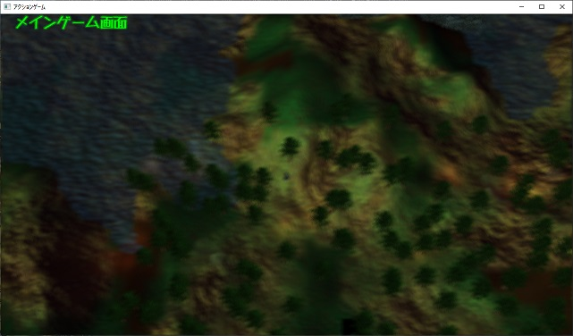
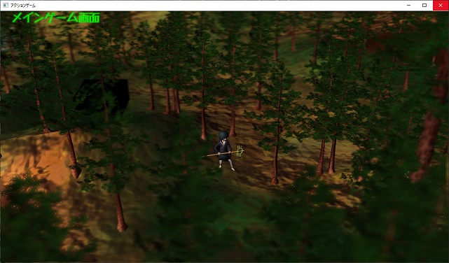
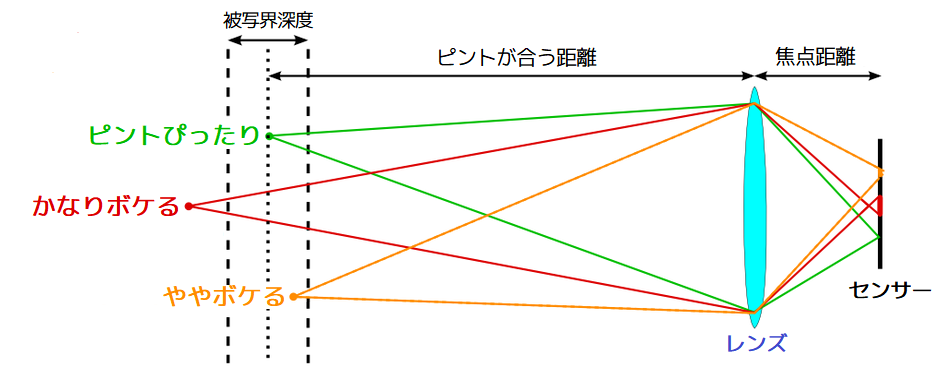
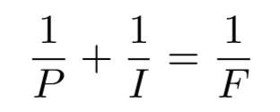
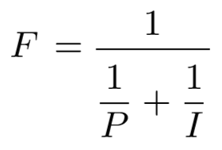
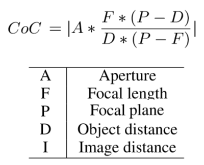

[OpenGL 3D 2019 後期 第05回]

# ＦＢＯ<br> - Background Render -

<br>

## 目標

* フレームバッファオブジェクト(FBO)について理解する.
* 被写界深度について理解する.

## 1. フレームバッファオブジェクト(FBO)

### 1.1 FBOとは

「フレームバッファオブジェクト(Frame Buffer Object, FBO)」は、テクスチャに描画するための機能です。FBOを使うと、演出効果やよりリッチな絵作りを行うために、描画した画像を再利用することができます。FBOは「オフスクリーン・バッファ」と呼ばれることがあります。これは、FBOを表示に使うことはできないためです。「オフスクリーン・バッファ」とは、画面に表示されないフレームバッファの総称です(広い意味ではバックバッファもオフスクリーンバッファです)。

### 1.2 CreateImage2D関数を深度バッファに対応させる

FBOには色を書き込むための「カラーバッファ」と、ピクセルの奥行きを書き込むための「深度バッファ」を割り当てることができます。テクスチャの作成はTexture::CreateImage2D関数を使えばよいのですが、現在この関数には深度バッファを作成する能力がありません。まずは深度バッファを作成できるようにしましょう。

Texture.hを開き、次のプログラムを追加してください。

```diff
 GLuint CreateImage2D(GLsizei width, GLsizei height, const GLvoid* data,
   GLenum format, GLenum type);
+GLuint CreateImage2D(GLsizei width, GLsizei height, const GLvoid* data,
+  GLenum format, GLenum type, GLenum internalFormat);
 GLuint LoadImage2D(const char* path);
 bool LoadImage2D(const char* path, ImageData* imageData);
```

これはで、CreateImage2D関数では、GPU側のデータ形式を`GL_RGBA8`に決め打ちしていました。しかし、深度バッファのGデータ形式には`GL_DEPTH_COMPONENT(じーえる・でぷす・こんぽーねんと)`という形式を指定しなくてはなりません。そこで、GPU側のデータ形式を設定できるタイプのCreateImage2D関数を追加します。

続いて関数を定義します。方針として、既存のプログラムに引数を追加して新しい関数として書き換えることにします。そして、古い関数は新しい関数を呼び出す形にしましょう。それでは、Texture.cppを開き、CreateImage2D関数を次のように変更してください。

```diff
 GLuint CreateImage2D(GLsizei width, GLsizei height, const GLvoid* data,
   GLenum format, GLenum type)
 {
+ return CreateImage2D(width, height, data, format, type, GL_RGBA8);
+}
+
+GLuint CreateImage2D(GLsizei width, GLsizei height, const GLvoid* data,
+  GLenum format, GLenum type, GLenum internalFormat)
 {
   GLuint id;
   glGenTextures(1, &id);
   glBindTexture(GL_TEXTURE_2D, id);
   glPixelStorei(GL_UNPACK_ALIGNMENT, 1);
   glTexImage2D(GL_TEXTURE_2D,
-    0, GL_RGBA8, width, height, 0, format, type, data);
+    0, internalFormat, width, height, 0, format, type, data);
   glPixelStorei(GL_UNPACK_ALIGNMENT, 4);
   const GLenum result = glGetError();
```

これでCreateImage2D関数の修正は完了です。

### 1.3 FramebufferObjectクラスを定義する

続いて、FBOを扱うためのクラスを作ります。Srcフォルダに「FramebufferObject.h」というファイルを追加してください。追加したファイルを開き、次のプログラムを追加してください。

>［注意］OpenGLにおいて、フレームバッファの表記は`Framebuffer`です(`b`が小文字)。`B`が大文字の`FrameBuffer`もよく使われる単語ですが、少なくともOpenGLの仕様では「`b`は小文字」になっています。本テキストはOpenGLの学習用なので、OpenGLの作法にならって`Framebuffer`表記を採用しました。

```c++
/**
* @file FramebufferObject.h
*/
#ifndef FRAMEBUFFEROBJECT_H_INCLUDED
#define FRAMEBUFFEROBJECT_H_INCLUDED
#include <GL/glew.h>
#include "Texture.h"
#include <memory>

class FramebufferObject;
typedef std::shared_ptr<FramebufferObject> FramebufferObjectPtr;

/**
* フレームバッファオブジェクト.
*/
class FramebufferObject
{
public:
  static FramebufferObjectPtr Create(int w, int h);
  FramebufferObject() = default;
  ~FramebufferObject();

  GLuint GetFramebuffer() const;
  const Texture::Image2DPtr& GetColorTexture() const;
  const Texture::Image2DPtr& GetDepthTexture() const;

private:
  Texture::Image2DPtr texColor; ///< カラーバッファ用テクスチャ.
  Texture::Image2DPtr texDepth; ///< 深度バッファ用テクスチャ.
  GLuint id = 0; ///< FBOのID.
};

#endif // FRAMEBUFFEROBJECT_H_INCLUDED
```

「フレームバッファオブジェクト」はフレームバッファであり、かつテクスチャでもあります。そのため、フレームバッファを取得するメンバ関数と、テクスチャを取得するメンバ関数の両方を持っています。

### 1.4 FramebufferObject::Create関数を定義する

ここからはFramebufferObjectクラスのメンバ関数を定義していきます。最初はFramebufferObjectを作成するCreate関数です。SrcフォルダにFramebufferObject.cppというファイルを追加してください。追加したファイルを開き、次のプログラムを追加してください。

```c++
/**
* @file FramebufferObject.cpp
*/
#include "FramebufferObject.h"

/**
* フレームバッファオブジェクトを作成する.
*
* @param w フレームバッファオブジェクトの幅(ピクセル単位).
* @param h フレームバッファオブジェクトの高さ(ピクセル単位).
*
* @return 作成したフレームバッファオブジェクトへのポインタ.
*/
FramebufferObjectPtr FramebufferObject::Create(int w, int h)
{
  FramebufferObjectPtr fbo = std::make_shared<FramebufferObject>();
  if (!fbo) {
    return nullptr;
  }

  return fbo;
}
```

まずはヘッダーファイルをインクルードして、関数の雛形を定義しました。

それでは、少しずつ機能を追加していきましょう。最初に追加するのはテクスチャの作成です。これには、つい先ほど追加したCreateImage2D関数を使います。fbo作成判定のif文の下に、次のプログラムを追加してください。

```diff
   if (!fbo) {
     return nullptr;
   }
+
+  // テクスチャを作成する.
+  fbo->texColor = std::make_shared<Texture::Image2D>(Texture::CreateImage2D(
+    w, h, nullptr, GL_RGBA, GL_UNSIGNED_BYTE));
+  fbo->texDepth = std::make_shared<Texture::Image2D>(Texture::CreateImage2D(
+    w, h, nullptr, GL_DEPTH_COMPONENT, GL_FLOAT, GL_DEPTH_COMPONENT32F));

   return fbo;
 }
```

深度バッファの作成には「GL_DEPTH_COMPONENT(じーえる・でぷす・こんぽーねんと)」を使います。また、深度バッファの種類は「GL_FLOAT(じーえる・ふろーと)」、ビット数は32ビットとしました。

深度バッファの形式には大きく整数と浮動小数点数の2つがあり、さらに整数では有効ビット数を指定できます。OpenGLの仕様では以下の4つの組み合わせが使えることになっています。

|種類|ビット数|GPU用データ型|
|:-:|:-:|:--|
|GL_UNSIGNED_INT|16|GL_DEPTH_COMPONENT16|
|GL_UNSIGNED_INT|24|GL_DEPTH_COMPONENT24|
|GL_UNSIGNED_INT|32|GL_DEPTH_COMPONENT32|
|GL_FLOAT|32|GL_DEPTH_COMPONENT32F|

>［補足］「ステンシル・バッファ」という第3のバッファを加えた「GL_DEPTH24_STENCIL8」といった形式も存在します。

続いてFBOを作成し、作成したテクスチャをつなぎます。テクスチャを作成するプログラムの下に、次のプログラムを追加してください。

```diff
   fbo->texDepth = std::make_shared<Texture::Image2D>(
     Texture::CreateImage2D(w, h, nullptr, GL_DEPTH_COMPONENT, GL_FLOAT, GL_DEPTH_COMPONENT32F));
+
+  // フレームバッファを作成する.
+  glGenFramebuffers(1, &fbo->id);
+  glBindFramebuffer(GL_FRAMEBUFFER, fbo->id);
+  glFramebufferTexture2D(GL_FRAMEBUFFER, GL_COLOR_ATTACHMENT0,
+    fbo->texColor->Target(), fbo->texColor->Get(), 0);
+  glFramebufferTexture2D(GL_FRAMEBUFFER, GL_DEPTH_ATTACHMENT,
+    fbo->texDepth->Target(), fbo->texDepth->Get(), 0);
+  glBindFramebuffer(GL_FRAMEBUFFER, 0);

   return fbo;
 }
```

FBOの作成には「glGenFramebuffers(じーえる・じぇん・ふれーむばっふぁーず)」という関数を使います。これまでに出てきたglGenBuffersやglGenTexturesと同じく、作成するオブジェクトの数とIDを格納する配列へのポインタが引数です。

「glBindFramebuffer(じーえる・ばいんど・ふれーむばっふぁ)」は、FBOをOpenGLコンテキストにバインドする関数です。OpenGLはバインドされたFBOに対してのみ描画やその他の操作を行います。このあたりの事情はバッファ・オブジェクトやテクスチャ・オブジェクトと同じですね。ターゲットに指定できるのは「GL_DRAW_FRAMEBUFFER(じーえる・どろー・ふれーむばっふぁ)」、「GL_READ_FRAMEBUFFER(じーえる・りーど・ふれーむばっふぁ)」、「GL_FRAMEBUFFER(じーえる・ふれーむばっふぁ)」のいずれかだけです。

GL_DRAW_FRAMEBUFFERとGL_READ_FRAMEBUFFERは、「glBlitFramebuffer(じーえる・ぶりっと・ふれーむばっふぁ)」という、あるFBOから別のFBOに画像をコピーする関数を使う場合に指定します。また、GL_READ_FRAMEBUFFERにバインドされたFBOからは、「glReadPixels(じーえる・りーど・ぴくせるず)」という関数を使ってカラーバッファを読み出すことができます。GL_FRAMEBUFFERは前の2つの両方にバインドされます。描画先にすることも、読み出し元にすることもできるわけです。

「glFramebufferTexture2D(じーえる・ふれーむばっふぁ・てくすちゃ・つーでぃ)」は、カラーバッファあるいは深度バッファを、フレームバッファに接続する関数です。

最初の引数は処理対象で、(これまで見てきた他の関数と同様に)直前のglBindFramebufferに指定したものと同じ定数を指定します。

2つめの引数はフレームバッファの割り当て先です。カラーバッファとして接続する場合は「GL_COLOR_ATTACHMENT0(じーえる・からー・あたっちめんと・ぜろ)」を、深度バッファとして接続する場合は「GL_DEPTH_ATTACHMENT(じーえる・でぷす・あたっちめんと)」を指定します。カラーバッファのほうは最後にゼロが必要なことに注意してください。これはカラーバッファの番号です。フレームバッファには複数のカラーバッファを接続することができるため、このように番号の指定がついているのです。

3つめの引数には割り当てるテクスチャの種類を指定します。この値は、実際に割り当てるテクスチャを作成したときの値と一致していなければなりません。テクスチャの種類はImage2D::Target関数で取得できますので、その戻り値を渡すだけでO.K.です。

最後の引数は接続するミップマップのレベルです。テクスチャにミップマップが存在する場合、どのレベルのミップマップを割り当てるかを指定します。今回はミップマップを使わないのでレベル0を選択しています。

テクスチャの接続が終わったら、glBindFramebuffer関数の第2引数に0を指定して、FBOのバインドを解除します。結果として、OpenGLが最初から用意してくれている(つまりデフォルトの)フレームバッファがバインドされた状態に戻ります。

>［補足］0を指定するとデフォルトのフレームバッファがバインドされるため、OpenGLでは「フレームバッファをバインドしていない状態」を作ることはできません。

### 1.5 デストラクタを定義する

次はFramebufferObjectのデストラクタを定義します。FramebufferObject::Create関数の定義の下に、次のプログラムを追加してください。

```diff
   return fbo;
 }
+
+/**
+* デストラクタ.
+*/
+FramebufferObject::~FramebufferObject()
+{
+  if (id) {
+    glDeleteFramebuffers(1, &id);
+  }
+}
```

デストラクタでは「glDeleteFramebuffers(じーえる・でりーと・ふれーむばっふぁーず)」関数を使ってFBOを破棄します。

### 1.6 FramebufferObject::GetFramebuffer関数を定義する

続いて、FBOのIDを取得する関数を定義しましょう。デストラクタの定義の下に、次のプログラムを追加してください。

```diff
     glDeleteFramebuffers(1, &id);
   }
 }
+
+/**
+* FBOのIDを取得する.
+*
+* @return FBOのID.
+*/
+GLuint FramebufferObject::GetFramebuffer() const
+{
+  return id;
+}
```

この関数は単にidメンバ変数を返すだけです。

### 1.7 テクスチャを取得する関数を定義する

最後に、テクスチャを取得する関数を定義します。カラーバッファ用と深度バッファ用の2つがありますが、中身はほとんど同じなので一気に低疑義してしまいましょう。GetFramebuffer関数の定義の下に、次のプログラムを追加してください。

```diff
   return id;
 }
+
+/**
+* カラーバッファ用テクスチャを取得する.
+*
+* @return カラーバッファ用テクスチャ.
+*/
+const Texture::Image2DPtr& FramebufferObject::GetColorTexture() const
+{
+  return texColor;
+}
+
+/**
+* 深度バッファ用テクスチャを取得する.
+*
+* @return 深度バッファ用テクスチャ.
+*/
+const Texture::Image2DPtr& FramebufferObject::GetDepthTexture() const
+{
+  return texDepth;
+}
```

テクスチャの取得も、対応するメンバ関数を返しているだけです。

これでFramebufferObjectクラスは完成です。

<div style="page-break-after: always"></div>

## 2. FBOを使う

### 2.1 FBOを描画するには

FBOに描画することができても、それを表示用、つまりデフォルトのフレームバッファに書き写すことができなければなんにもなりません。また、書き写すだけならglBlitFramebuffer関数が使えますが、それではただ書き写す手間を増やすだけで終わってしまいます。そこで、FBOをテクスチャとして扱い、シェーダーを使ってさまざまな効果を付与したうえで、デフォルトのフレームバッファへ書き込むようにします。

画像を描画するにはプリミティブを用意して、シェーダーを用意して、頂点アトリビュートを設定して…とさまざまな準備が必要です。しかし、それらを新しく作るのは手間がかかります。そこで、メッシュの描画機能を流用することにしましょう。

### 2.2 平面メッシュを作成する

まずは描画用のメッシュを作成します。Mesh.hを開き、Mesh::Bufferクラスの定義に次のプログラムを追加してください。

```diff
   void SetTime(double) const;

   void AddCube(const char* name);
+  FilePtr AddPlane(const char* name);

   // スケルタル・アニメーションに対応したメッシュの読み込みと取得.
   bool LoadSkeletalMesh(const char* path);
```

続いてMesh.cppを開き、Mesh::Buffer::AddCube関数の定義の下に、次のプログラムを追加してください。

```diff
   const Material m = CreateMaterial(glm::vec4(1), nullptr);
   AddMesh(name, p, m);
 }
+
+/**
+* 平面を追加する.
+*
+* @param name 平面のメッシュ名.
+*/
+FilePtr Buffer::AddPlane(const char* name)
+{
+  const Vertex v[] = {
+    {{-1,-1, 0 }, { 0, 0 }, { 0, 0, 1 }},
+    {{ 1,-1, 0 }, { 1, 0 }, { 0, 0, 1 }},
+    {{ 1, 1, 0 }, { 1, 1 }, { 0, 0, 1 }},
+    {{-1, 1, 0 }, { 0, 1 }, { 0, 0, 1 }},
+  };
+  const GLubyte i[] = { 0, 1, 2, 2, 3, 0 };
+
+  const size_t vOffset = AddVertexData(v, sizeof(v));
+  const size_t iOffset = AddIndexData(i, sizeof(i));
+  const Primitive p = CreatePrimitive(6, GL_UNSIGNED_BYTE, iOffset, vOffset);
+  const Material m = CreateMaterial(glm::vec4(1), nullptr);
+  AddMesh(name, p, m);
+  return GetFile(name);
+}
  
 /**
 * シェーダにビュー・プロジェクション行列を設定する.
```

AddPlane関数は、(0, 0)を中心としてXY方向にプラスマイナス1m、つまり2x2mの大きさの平面メッシュを作成します。

### 2.3 頂点シェーダーを定義する

次にシェーダー・プログラムを追加しましょう。今回作成するのは「被写界深度(ひしゃかい・しんど)シェーダー」です。「被写界深度」とは、カメラのピントが合う範囲のことです。範囲外にある物体はピンぼけで表示されるので、その効果をシェーダーで作り出そうというわけです。

まず頂点シェーダーを作ります。Resフォルダに「DepthOfField.vert」という名前のファイルを追加してください。追加したファイルを開き、次のプログラムを追加してください。

```c++
/**
* @file DepthOfField.vert
*/
#version 430

layout(location=0) in vec3 vPosition;
layout(location=1) in vec2 vTexCoord;

layout(location=0) out vec2 outTexCoord;

/**
* 被写界深度シェーダー.
*/
void main()
{
  outTexCoord = vTexCoord;
  gl_Position = vec4(vPosition, 1.0);
}
```

頂点シェーダーの仕事は、受け取った頂点データをフラグメントシェーダーへと出力することだけです。ほとんどの作業はフラグメントシェーダーで行うからです。

### 2.4 フラグメントシェーダーを定義する

続いて、フラグメントシェーダーを作ります。Resフォルダに「DepthOfField.frag」という名前のファイルを追加してください。追加したファイルを開き、次のプログラムを追加してください。

```c++
/**
* @file DepthOfField.frag
*/
#version 430

layout(location=0) in vec2 inTexCoord;

out vec4 fragColor;

uniform sampler2D texColorArray[2]; // 0:カラー 1:深度

// ポアソンディスクサンプリングのための座標リスト.
const int poissonSampleCount = 12;
const vec2 poissonDisk[poissonSampleCount] = {
  { -0.326, -0.406 }, { -0.840, -0.074 }, { -0.696,  0.457 },
  { -0.203,  0.621 }, {  0.962, -0.195 }, {  0.473, -0.480 },
  {  0.519,  0.767 }, {  0.185, -0.893 }, {  0.507,  0.064 },
  {  0.896,  0.412 }, { -0.322, -0.933 }, { -0.792, -0.598 }
};

/**
* 被写界深度シェーダー.
*/
void main()
{
  float focalPlane = 0.935;
  float centerZ = texture(texColorArray[1], inTexCoord).r;
  float scale = (centerZ - focalPlane) * 0.1;
  fragColor.rgb = texture(texColorArray[0], inTexCoord).rgb;
  for (int i = 0; i < poissonSampleCount; ++i) {
    vec2 uv = inTexCoord + poissonDisk[i] * scale;
    fragColor.rgb += texture(texColorArray[0], uv).rgb;
  }
  fragColor.rgb = fragColor.rgb / float(poissonSampleCount + 1);
  fragColor.a = 1.0;
}
```

フラグメントシェーダーでは、ピクセルの奥行きデータからピンぼけ度合いを計算し、その度合いに応じて周辺のピクセルを読み取って合成します。読み取る周辺ピクセルの数は12個で、中心のピクセルと合わせて合計13ピクセルが読み出されます。そして、その平均が実際の色となります。

読み取る周辺ピクセルの座標は「ポアソン・ディスク・サンプリング」という方法に従って選びました。ポアソン・ディスク・サンプリングは、ポアソンさんが考え出した「他の点から一定以上離れた均一な点の集まり」を作り出す方法です。詳しい説明は省きますが、ある範囲の平均の色を求めるときにポアソン・ディスク・サンプリングを使うと、規則的な座標や単にランダムな座標を使うのと比べて、より少ない座標数で同くらいきれいな結果が得られるのです。

### 2.5 FBOを作成する

FBO、メッシュ、シェーダーの用意ができたので、実際に組み込んでいきます。まずはFBOを作成しましょう。MainGameScene.hを開き、次のプログラムを追加してください。

```diff
 #include "PlayerActor.h"
 #include "JizoActor.h"
 #include "Light.h"
+#include "FramebufferObject.h"
 #include <random>
 #include <vector>
```

次は、FBOを格納するためのメンバ変数を追加しましょう。MainGameSceneクラス定義に次のプログラムを追加してください。

```diff
   LightBuffer lightBuffer;
   ActorList lights;

+  FramebufferObjectPtr fboMain;
 };

 #endif // MAINGAMESCENE_H_INCLUDED
```

続いてFBOを作成します。MainGameScene.cppを開き、MainGameScene::Initialize関数に次のプログラムを追加してください。

```diff
   meshBuffer.LoadSkeletalMesh("Res/oni_small.gltf");
   meshBuffer.LoadMesh("Res/wall_stone.gltf");
+
+  // FBOを作成する.
+  const GLFWEW::Window& window = GLFWEW::Window::Instance();
+  fboMain = FramebufferObject::Create(window.Width(), window.Height());
+  Mesh::FilePtr rt = meshBuffer.AddPlane("RenderTarget");
+  if (rt) {
+    rt->materials[0].program = Shader::Program::Create(
  +    "Res/DepthOfField.vert", "Res/DepthOfField.frag");
+    rt->materials[0].texture[0] = fboMain->GetColorTexture();
+    rt->materials[0].texture[1] = fboMain->GetDepthTexture();
+  }
+  if (!rt || !rt->materials[0].program) {
+    return false;
+  }

  // ハイトマップを作成する.
  if (!heightMap.LoadFromFile("Res/Terrain.tga", 50.0f, 0.5f)) {
```

これでFBOの作成は完了です。

### 2.6 FBOをバインドする

続いて、デフォルトのフレームバッファに代わって、作成したFBOに描画されるようにします。MainGameScene::Render関数に次のプログラムを追加してください。

```diff
  lightBuffer.Upload();
  lightBuffer.Bind();
+
+  // FBOに描画.
+  glBindFramebuffer(GL_FRAMEBUFFER, fboMain->GetFramebuffer());
+  glClearColor(0.5f, 0.6f, 0.8f, 1.0f);
+  glClear(GL_COLOR_BUFFER_BIT | GL_DEPTH_BUFFER_BIT);
+  glEnable(GL_DEPTH_TEST);
+  glEnable(GL_CULL_FACE);
+  glEnable(GL_BLEND);

  const glm::mat4 matView = glm::lookAt(camera.position, camera.target, camera.up);
```

フレームバッファのバインドには`glBindFramebuffer`関数を使うのでした。

glClear関数は、バインドされているフレームバッファにのみ影響します。そのため、フレームバッファごとに個別に実行しなければなりません。glClearColor関数やglEnable関数はOpenGLコンテキストに紐付いているので、フレームバッファを切り替えても変化しません。しかし、一般的に描画設定はフレームバッファごとに異なります。ですから、前のフレームバッファと異なる描画設定を使う場合、それらも忘れずに変更しなければなりません。簡単な方法は「フレームバッファを切り替えたときは、必要な設定を全て行う」ことです。そうすれば、前の設定がどうなっていたかを覚えておく必要はありません。

### 2.7 デフォルトのフレームバッファに描画する

最後に、描画したFBOの内容をデフォルトのフレームバッファに描画しましょう。水面を描画するプログラムの下に、次のプログラムを追加してください。

```diff
   Mesh::Draw(meshBuffer.GetFile("Water"), glm::mat4(1));

-  fontRenderer.Draw(screenSize);
+  // デフォルトのフレームバッファに描画.
+  {
+    glBindFramebuffer(GL_FRAMEBUFFER, 0);
+    glClearColor(0.5f, 0.5f, 0.5f, 1.0f);
+    glClear(GL_COLOR_BUFFER_BIT | GL_DEPTH_BUFFER_BIT);
+    glDisable(GL_DEPTH_TEST);
+    glDisable(GL_CULL_FACE);
+    glDisable(GL_BLEND);
+
+    Mesh::FilePtr mesh = meshBuffer.GetFile("RenderTarget");
+    Mesh::Draw(mesh, glm::mat4(1));
+
+    fontRenderer.Draw(screenSize);
+  }
 }
```

フォントの描画はデフォルトのフレームバッファに行うほうがよいので、最後に実行するようにします。

プログラムが書けたらビルドして実行してください。ゲームを開始すると、やたらとボケた画面が表示されたら成功(?)です。

<div style="text-align: center;width: 100%;">

<div style="white-space: pre;">[盛大にボケた画面]</div>
</div>

### 2.8 ピントを合わせる

さきほどのは、いくらなんでもボケすぎでした。適切なボケを得るにはピントが合わせる必要がありますから、カメラの位置を調整しましょう。MainGameScene::Update関数を次のように変更してください。

```diff
   // カメラの状態を更新.
   {
     camera.target = player->position;
-    camera.position = camera.target + glm::vec3(0, 50, 25);
+    camera.position = camera.target + glm::vec3(0, 8, 13);
   }
```

カメラの位置を調整したら、ビルドして実行してください。カメラがプレイヤーキャラクターの近くに移動し、キャラクターの周囲がはっきりと表示され、距離が離れるにつれてボケが強くなっていれば成功です。

<div style="text-align: center;width: 100%;">

<div style="white-space: pre;">[ピントを合わせた画面]</div>
</div>

<div style="page-break-after: always"></div>

## 3. 正しいボケを作る

### 3.1 カメラパラメータを追加する

一応はそれらしいボケ具合になりましたが、普段見慣れている写真や映像とくらべたときに違和感を感じるかもしれません。これは、ボケ具合の計算が、現実の眼球やカメラの仕組みとまったく違うからです。

そのため、現実感のあるボケ具合を作り上げることは困難です。また、ボケ具合を調整するためにカメラの距離や画角を調整する、というカメラの基本的なテクニックがまったく役に立ちません。このことも、思い通りの映像を作り上げることを難しくします。

そこで、画面やカメラのパラメーターから適切なボケ具合を計算する仕組みを作ることにしましょう。まずはカメラのパラメータを追加します。MainGameScene.hを開き、Camera構造体に次のプログラムを追加してください。

```diff
   struct Camera {
     glm::vec3 target = glm::vec3(100, 0, 100);
     glm::vec3 position = glm::vec3(100, 50, 150);
     glm::vec3 up = glm::vec3(0, 1, 0);
     glm::vec3 velocity = glm::vec3(0);
+
+    // 画面パラメータ.
+    float width = 1280; ///< 画面の幅(ピクセル数).
+    float height = 720; ///< 画面の高さ(ピクセル数).
+    float near = 1;     ///< 最小Z値(メートル).
+    float far = 500;    ///< 最大Z値(メートル).
+
+    // カメラパラメータ.
+    float fNumber = 1.4f;            ///< エフ・ナンバー = カメラのF値.
+    float fov = glm::radians(60.0f); ///< フィールド・オブ・ビュー = カメラの視野角(ラジアン).
+    float sensorSize = 36.0f;        ///< センサー・サイズ = カメラのセンサーの横幅(ミリ).
+
+    // Update関数で計算するパラメータ.
+    float focalLength = 50.0f;   ///< フォーカル・レングス = 焦点距離(ミリ).
+    float aperture = 20.0f;      ///< アパーチャ = 開口(ミリ).
+    float focalPlane = 10000.0f; ///< フォーカル・プレーン = ピントの合う距離.
+
+    void Update(const glm::mat4& matView);
   };
```

一般的に、カメラのパラメータは「焦点距離 = フォーカル・レングス」と「F値 = エフ・ナンバー」で制御します。焦点距離というのは「センサーまでの距離」を表す数値で、F値というのは受光量を表しています。しかし、今回は「焦点距離」のかわりに「視野角 = フィールド・オブ・ビュー」で制御するようにします。カメラの焦点距離の扱いに慣れていない人にとっては、「どれくらいの角度が画面に入るか」という数値のほうが分かりやすいのではないか、と考えたからです。また、センサーサイズも変更可能なパラメータですが、今回は36mmで固定します。これは一般的に使われている35mmカメラのセンサーサイズだからです。センサーサイズを変えると焦点距離やF値にも影響するので、必要がなければ固定するのがいいでしょう。

>［補足］「35mmカメラなのに実際の数値が36mmなのは何故か」を調べてはみたのですが、よく分かりませんでした。映画の35mmフィルムから来ているのは間違いないようですが…。

<div style="text-align: center;width: 100%;">

<div style="white-space: pre;">[被写界深度、ピントが合う距離、焦点距離]</div>
</div>

### 3.2 カメラパラメータを計算する

続いてカメラのパラメータを計算する関数を定義します。MainGameScene.cppを開き、MainGameScene::HandleJizoEffects関数の定義の下に、次のプログラムを追加してください。

```diff
     enemies.Add(p);
   }
   return true;
 }
+
+/**
+* カメラのパラメータを更新する.
+*
+* @param matView 更新に使用するビュー行列.
+*/
+void MainGameScene::Camera::Update(const glm::mat4& matView)
+{
+  const glm::vec4 pos = matView * glm::vec4(target, 1);
+  focalPlane = pos.z * -1000.0f;
+
+  const float imageDistance = sensorSize * 0.5f / glm::tan(fov * 0.5f);
+  focalLength = 1.0f / ((1.0f / focalPlane) + (1.0f / imageDistance));
+
+  aperture = focalLength / fNumber;
+}
```

まずfocalPlaneを計算します。これはtargetまでの距離なので、matViewとtargetを掛けてZ値を見れば分かります。ただし、カメラのパラメータは「ミリメートル単位」です。ゲーム内の単位はメートル単位なので1000倍する必要があります。また、OpenGLの座標系では前方はマイナスの向きです。カメラパラメータの計算では前方がプラスなので、Z値に`-1000`を掛けたものが目的の値になるわけです。

次に、レンズからセンサーまでの距離(imageDistance(いめーじ・でぃすたんす))を計算します。これは視野角とセンサーサイズから計算できます。視野角とセンサーサイズは直径なので、1/2倍しなければならないことに注意します。そして、「焦点距離(F)」は「センサーまでの距離(I)」と「ピントの合う距離(P)」から以下の式で求められます。

<div style="text-align: center;width: 100%;">

</div>

この両辺に`F`を掛け、次に両辺を`1/P + 1/I`で割ると、

<div style="text-align: center;width: 100%;">

</div>

となって、プログラムに書かれている焦点距離(focalLength)を求める式になります。

最後に、焦点距離をF値(fNumber)で割ると開口(aperture)が得られます。

### 3.3 プロジェクション行列の計算にカメラパラメータを使う

プロジェクション行列とカメラパラメータが一致しないと、正しい見た目が得られません。そこで、行列の計算にカメラパラメータを使うように変更します。MainGameScene::Render関数のプロジェクション行列の計算を、次のように変更してください。

```diff
   const float aspectRatio =
     static_cast<float>(window.Width()) / static_cast<float>(window.Height());
   const glm::mat4 matProj =
-    glm::perspective(glm::radians(30.0f), aspectRatio, 1.0f, 1000.0f);
+    glm::perspective(camera.fov * 0.5f, aspectRatio, camera.near, camera.far);
   meshBuffer.SetViewProjectionMatrix(matProj * matView);
   meshBuffer.SetCameraPosition(camera.position);
```

### 3.4 被写界深度シェーダーでカメラパラメータを使う

次に、被写界深度シェーダーの計算を、カメラパラメータを使うように変更します。まず、カメラパラメータをユニフォーム変数として受け取れるようにします。DepthOfField.fragを開き、次のプログラムを追加してください。

```diff
 out vec4 fragColor;

 uniform sampler2D texColorArray[2]; // 0:カラー 1:深度
+
+/**
+* 画面の情報.
+*
+* x: 1.0 / ウィンドウの幅(ピクセル単位)
+* y: 1.0 / ウィンドウの高さ(ピクセル単位)
+* x: near(m単位)
+* y: far(m単位)
+*/
+uniform vec4 viewInfo;
+
+/**
+* カメラの情報.
+*
+* x: 焦平面(ピントの合う位置のレンズからの距離. mm単位).
+* y: 焦点距離(光が1点に集まる位置のレンズからの距離. mm単位).
+* z: 開口(光の取入口のサイズ. mm単位).
+* w: センサーサイズ(光を受けるセンサーの横幅. mm単位).
+*/
+uniform vec4 cameraInfo;

// ポアソンディスクサンプリングのための座標リスト.
 const int poissonSampleCount = 12;
 const vec2 poissonDisk[poissonSampleCount] = {
```

カメラパラメータは`viewInfo`と`cameraInfo`という2つのvec4型のユニフォーム変数で受け取ります。各要素に格納されるパラメータはコメントのとおりです。`viewInfo.xy`には逆数が送られることに注意してください。これは、コンピュータにとって除算は時間のかかる処理だからです。そこで、大量に実行されるシェーダーの中ではなく、CPU側で逆数に変換してから送るようにします。

次に、深度バッファの深度値を変換する関数を定義します。というのは、深度バッファに書き込まれる深度値は、実際のZ値ではないからです。poissonDisk配列の定義の下に、次のプログラムを追加してください。

```diff
   {  0.896,  0.412 }, { -0.322, -0.933 }, { -0.792, -0.598 }
 };
+
+/**
+* 深度バッファの深度値をビュー座標系の深度値に変換する.
+*
+* @param w 深度バッファの深度値.
+*
+* @return wをビュー座標系の深度値に変換した値.
+*/
+float ToRealZ(float w)
+{
+  float near = viewInfo.z;
+  float far = viewInfo.w;
+  float n = 2.0 * w - 1.0;
+  return -2.0 * near * far / (far + near - n * (far - near));
+}

/**
* 被写界深度シェーダー.
```

深度バッファに格納されているZ値は、まず手前にある物体ほどより細かく距離を判定できるように非線形に変換されます。さらにOpenGLの深度バッファの範囲は-1から+1なので、変換後の値を2倍して1を引きます。そうして得られた値が格納されているのです。非線形の値は深度バッファとしては効率的なのですが、ボケ具合の計算には使えません。そこで、逆の計算を行って本来のZ値に戻してやる必要があるのです。ということで、ToRealZ(とぅー・りある・ぜっと)関数ではその逆変換を行っているわけです。

次に、ボケ具合を計算する関数を定義します。ボケ具合は光学系の用語では「錯乱円(さくらんえん)」と言います。錯乱円は英語では「Circle of Confusion(さーくる・おぶ・こんふゅーじょん)」と言うので、省略して「CoC(しー・おー・しー)」と書くことにします。

それでは、ToRealZ関数の定義の下に、次のプログラムを追加してください。

```diff
   return -2.0 * near * far / (far + near - n * (far - near));
 }
+
+/**
+* 錯乱円の半径を計算する.
+*
+* @param objectDistance 対象ピクセルのカメラ座標系におけるZ座標.
+*
+* @return 錯乱円の半径(ピクセル単位).
+*/
+vec2 CalcCoC(float objectDistance)
+{
+  float focalPlane = cameraInfo.x;
+  float focalLength = cameraInfo.y;
+  float aperture = cameraInfo.z;
+  float sensorSize = cameraInfo.w;
+  float mmToPixel = 1.0 / (sensorSize * viewInfo.x);
+
+  objectDistance *= -1000.0; // mm単位に変換し、値を正にする.
+  return abs(aperture * (focalLength * (focalPlane - objectDistance)) /
+    (objectDistance * (focalPlane - focalLength))) * mmToPixel * viewInfo.xy;
+}

/**
* 被写界深度シェーダー.
```

CaclCoC(かるく・しー・おー・しー)関数の引数は実際のZ値です。計算式には以下の式をそのまま使っています。

<div style="text-align: center;width: 100%;">

</div>

この計算式で得られるのはミリメートル単位の大きさです。テクスチャ座標の補正値として使うには、これをピクセル数に変換し、さらにテクスチャ座標に変換しなければなりません。それを行っているのが`* mmToPixel * viewInfo.xy`の部分です。mmToPixelは名前のとおりミリメートルをピクセル数に変換するための係数です。センサーの横幅を画面のピクセル数で除算すると、mm単位のピクセルの幅が分かります。mm単位のCoCをこの数値で割ればピクセル数が得られるというわけです。また、1ピクセルに相当するテクスチャ座標の大きさは`1.0 / ビューサイズ`で計算でき、これは既にviewInfo.xyとして計算済みです。

これで必要な部品が揃いましたので、main関数を書き換えていきましょう。DepthOfField.fragのmain関数を次のように変更してください。

```diff
 * 被写界深度シェーダー.
 */
 void main()
 {
-  float focalPlane = 0.935;
-  float centerZ = texture(texColorArray[1], inTexCoord).r;
-  float scale = (centerZ - focalPlane) * 0.1;
+  float centerZ = ToRealZ(texture(texColorArray[1], inTexCoord).r);
+  vec2 coc = CalcCoC(centerZ);
   fragColor.rgb = texture(texColorArray[0], inTexCoord).rgb;
   for (int i = 0; i < poissonSampleCount; ++i) {
-    vec2 uv = inTexCoord + poissonDisk[i] * scale;
+    vec2 uv = inTexCoord + coc * poissonDisk[i];
     fragColor.rgb += texture(texColorArray[0], uv).rgb;
   }
   fragColor.rgb = fragColor.rgb / float(poissonSampleCount + 1);
   fragColor.a = 1.0;
 {
```

これでシェーダーの変更は完了です。

### 3.5 Shader::Programクラスにカメラパラメータ転送機能を追加する

ユニフォーム変数を追加したので、CPU側のShader::Progarmクラスでそれらを扱えるようにしなければなりません。Shader.hを開き、次のプログラムを追加してください。

```diff
   void SetCameraPosition(const glm::vec3&);
   void SetTime(float);
+  void SetViewInfo(float w, float h, float near, float far);
+  void SetCameraInfo(float focalPlane, float focalLength, float aperture,
+    float sensorSize);

   /// プログラムIDを取得する.
   GLuint Get() const { return id; }

 private:
   GLuint id = 0; //プログラムID

   //// uniform変数の位置
   GLint locMatMVP = -1;
   GLint locMatModel = -1;
   GLint locPointLightCount = -1;
   GLint locPointLightIndex = -1;
   GLint locSpotLightCount = -1;
   GLint locSpotLightIndex = -1;
   GLint locCameraPosition = -1;
   GLint locTime = -1;
+  GLint locViewInfo = -1;
+  GLint locCameraInfo = -1;

   glm::mat4 matVP = glm::mat4(1); //ビュー・プロジェクション行列
 };
```

### 3.7 viewInfoとcameraInfoのロケーションを取得する

次に、ユニフォーム変数のロケーションを取得します。Shader.cppを開き、Program::Reset関数に次のプログラムを追加してください。

```diff
     locCameraPosition = -1;
     locTime = -1;
+    locViewInfo = -1;
+    locCameraInfo = -1;
     return;
   }

   locMatMVP = glGetUniformLocation(id, "matMVP");
   locMatModel = glGetUniformLocation(id, "matModel");
   locPointLightCount = glGetUniformLocation(id, "pointLightCount");
   locPointLightIndex = glGetUniformLocation(id, "pointLightIndex");
   locSpotLightCount = glGetUniformLocation(id, "spotLightCount");
   locSpotLightIndex = glGetUniformLocation(id, "spotLightIndex");
   locCameraPosition = glGetUniformLocation(id, "cameraPosition");
   locTime = glGetUniformLocation(id, "time");
+  locViewInfo = glGetUniformLocation(id, "viewInfo");
+  locCameraInfo = glGetUniformLocation(id, "cameraInfo");

   if (GLenum error = glGetError()) {
```

### 3.8 Program::SetViewInfo関数を定義する

それでは、viewInfoに値を送る関数を定義しましょう。Program::SetTime関数の定義の下に、次のプログラムを追加してください。

```diff
     glUniform1f(locTime, time);
   }
 }
+
+/**
+* 画面の情報を設定する.
+*
+* @param w    ウィンドウの幅(ピクセル単位).
+* @param h    ウィンドウの高さ(ピクセル単位).
+* @param near 最小Z距離(m単位).
+* @param far  最大Z距離(m単位).
+*/
+void Program::SetViewInfo(float w, float h, float near, float far)
+{
+  if (locViewInfo >= 0) {
+    glUniform4f(locViewInfo, 1.0f / w, 1.0f / h, near, far);
+  }
+}

 /**
 * プログラムオブジェクトを作成する.
```

先に説明したとおり、幅と高さは逆数にして送り込むようにしています。

### 3.9 Program::SetCameraInfo関数を定義する

つづいて、cameraInfoに値を送る関数を定義します。Program::SetViewInfo関数の定義の下に、次のプログラムを追加してください。

```diff
     glUniform4f(locViewInfo, 1.0f / w, 1.0f / h, near, far);
   }
 }
+
+/**
+* カメラの情報を設定する.
+*
+* @param focalPlane  焦平面(ピントの合う位置のレンズからの距離. mm単位).
+* @param focalLength 焦点距離(光が1点に集まる位置のレンズからの距離. mm単位).
+* @param aperture    開口(光の取入口のサイズ. mm単位).
+* @param sensorSize  センサーサイズ(光を受けるセンサーの横幅. mm単位).
+*/
+void Program::SetCameraInfo(float focalPlane, float focalLength, float aperture,
+  float sensorSize)
+{
+  if (locCameraInfo >= 0) {
+    glUniform4f(locCameraInfo, focalPlane, focalLength, aperture, sensorSize);
+  }
+}

 /**
 * プログラムオブジェクトを作成する.
```

こちらは何もせず素直に値を送っているだけです。

### 3.10 カメラパラメータをGPUにコピーする

最後はカメラパラメータをGPUに送り込みます。MainGameScene.cppを開き、MainGameScene::Render関数に次のプログラムを追加してください。

```diff

   Mesh::Draw(meshBuffer.GetFile("Water"), glm::mat4(1));

   // デフォルトのフレームバッファに描画.
   {
     glBindFramebuffer(GL_FRAMEBUFFER, 0);
     glClearColor(0.5f, 0.5f, 0.5f, 1.0f);
     glClear(GL_COLOR_BUFFER_BIT | GL_DEPTH_BUFFER_BIT);
     glDisable(GL_DEPTH_TEST);
     glDisable(GL_CULL_FACE);
     glDisable(GL_BLEND);
+
+    camera.Update(matView);

     Mesh::FilePtr mesh = meshBuffer.GetFile("RenderTarget");
+    Shader::ProgramPtr prog = mesh->materials[0].program;
+    prog->Use();
+    prog->SetViewInfo(static_cast<float>(window.Width()),
+      static_cast<float>(window.Height()), camera.near, camera.far);
+    prog->SetCameraInfo(camera.focalPlane, camera.focalLength,
+      camera.aperture, camera.sensorSize);
     Mesh::Draw(mesh, glm::mat4(1));

     fontRenderer.Draw(screenSize);
   }
 }
```

これでカメラパラメータの値に従ったボケ具合で描画できるようになっているはずです。プログラムが書けたらビルドして実行してください。以前より控えめなボケ具合になっていたら成功です。

<div style="page-break-after: always"></div>

## C言語練習問題

1. 標準入力から2つの整数を受け取り、2進数に変換して足し算を行うプログラムがある。<br>`/* 1 */`から`/* 5 */`を適切なプログラムに置き換えてプログラムを完成させなさい。<br>入力できる数値は0～255の範囲に限ります。(各2点)

```c++
#include <stdio.h>

// 整数を2進数に変換.
void set(int* p, int n) {
  for (int i = 0; i < 8; ++i) {
    p[i] = n % 2;
    n /= 2;
  }
}

// 2進数の加算.
int add(const int* a, const int* b, int* c) {
  int carry = 0; // 繰り上がり.
  for (/* 1 */) {
    int n = a[i] + b[i] + carry;
    carry = n / 2;
    c[i] = /* 2 */;
  }
  return carry;
}

// 2進数を上位桁から下位桁の順に表示.
void show(const char* name, const int* p) {
  printf("%s=", name);
  for (int i = 0; i < 8; ++i) {
    printf("%d", /* 3 */);
  }
  printf(/* 4 */);
}

int main()
{
  int r0[8], r1[8], r2[8];

  int a, b;
  scanf("%d %d", &a, /* 5 */);
  set(r0, a);
  set(r1, b);
  int carry = add(r0, r1, r2);
  show("r0", r0);
  show("r1", r1);
  show("r2", r2);
  printf("carry=%d\n", carry);
}
```

<br>

2. `1`のプログラムを参考に、2進数の減算を行う`sub`関数を定義しなさい。<br>戻り値として、最上位ビットの桁借りが起これば1、起こらなければ0を返すこと。(3点)

```c++
int sub(const int* a, const int* b, int* c) {

}
```

<br>

3. `1.`のプログラムに`sub`関数をによる計算とその結果を表示するプログラムを追加しなさい。(2点)

<div style="page-break-after: always"></div>

<br>

<div style="page-break-after: always"></div>

［OpenGL 2019後期 第05回 C言語練習問題 解答用紙］

クラス：<br>氏名：

A1.1:

A1.2:

A1.3:

A1.4:

A1.5:

A1.6:

A2:

<br>

<br>

<br>

<br>

A3:
