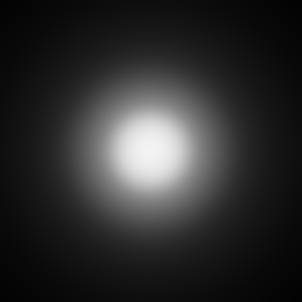
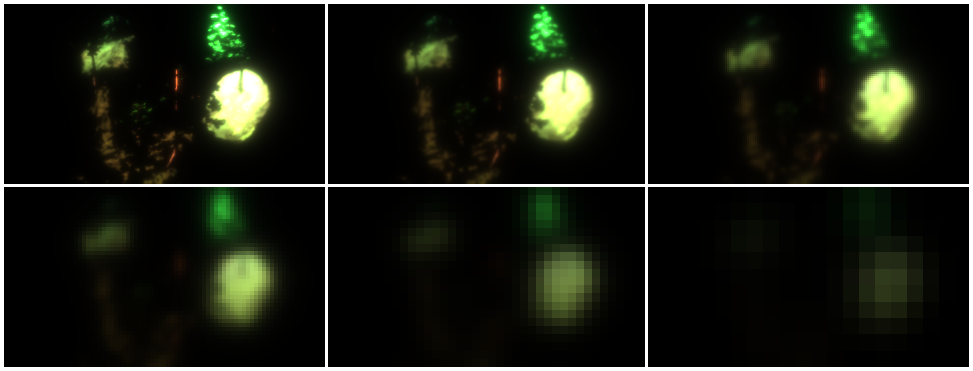
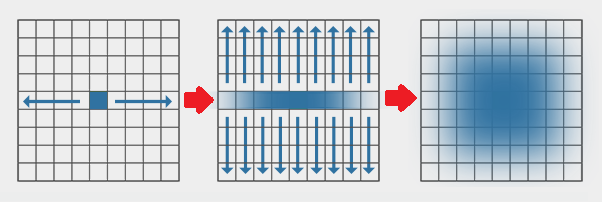

[OpenGL 3D 2019 後期 第07回]

# The SHiNiNG

<br>

## 目標

* 縮小バッファ技法について理解する
* ブルーム・エフェクトの実装を通じて、C++プログラムとシェーダーの連携について理解する

## 1 拡散光

### 1.1 ブルーム・エフェクト

「ブルーム・エフェクト(Bloom Effect)」(または「グレア(Glare)」、「グロー(Glow)」とも)は、カメラのレンズや、空間中の微小な粒子による光の散乱を模倣する技法のひとつです。光には波としての側面があるため、人間の瞳孔やカメラのレンズのような開口部を通過するときに回折(かいせつ)が起こります。これは「完璧なレンズが作れたとしても、光を1点に収束させることはできず、周囲に光がもれる」ことを意味します。また、周囲の微粒子に反射して、間接的に視界に到達する光もあります。

これらの散乱光は、距離が離れるにしたがって急速に弱くなります。そのため、通常はほとんど目に見えませんが、実際には散乱は非常に広い範囲に及びます。暗い屋内から明るい窓を見るときや、もやの濃い夜に信号機を見るときのように、明暗の差が激しい場合、明るい領域からの散乱光は、暗い部分よりも十分に明るくなります。そのようなシーンでは、これらの散乱光の広がりをはっきりと見ることができます。

### 1.2 光の回折をガウス関数で近似する

光の回折による散乱は、次のように同心円状に広がります。もっとも、実際のカメラにはレンズの微妙な歪みがあったり、複数のレンズを組み合わせていることから、ここまできれいな同心円状の模様が見られることはありません。

<div style="text-align: center;width: 100%;">

<div style="white-space: pre;">[回折による光の散乱]</div>
</div>

この散乱は計算で求めることができますが、リアルタイムで計算するには少々時間がかかりすぎます。代わりに「ガウス関数」という計算式を用いて、よく似た散乱を作り出すことにします。ガウス関数によって作成される散乱は次のようになります。

<div style="text-align: center;width: 100%;">

<div style="white-space: pre;">[ガウス関数による近似]</div>
</div>

随分違うように見えますね…。でも、明るい部分が針のように細いということはまずありません。そのため、同心円状の散乱光が重なり合うことになり、結果として全体にぼやけた映像が作られます。そうしてできた映像は、ガウス関数による散乱と十分に似たものになります。

もうひとつの、微粒子による散乱のでは、ガウス関数による散乱とよく似たものになります。微粒子による散乱は、微粒子の濃度と光源からの距離によって決まるからです。

ガウス関数は次の式であらわされます。ガウス関数によって、「ある座標からxだけ離れた位置の明るさの影響度合い」を求めることができます。

`a * e^(-(x - b)^2 / (2 * c^2))`

ここで`x`は座標を表します。また`a`は曲線の高さ、`b`は曲線の中心座標、`c`は曲線の幅を制御する任意の実数です。a, b, cの値は自由に決められますが、今回は、「標準正規分布」と呼ばれる曲線となる値を設定することにします。標準正規分布は以下の式で表されます。

`√(2π) * e^(-x^2 / 2)`

標準正規分布は、ガウス関数の`a`を`√(2π)`に、`b`を`0`に、`c`を`1`にしたものです。`-b`と`c^2`が消えたことで、式がすこしだけ簡単になっていることが分かると思います。そして、これが標準正規分布を選んだ理由です。

### 1.3 縮小バッファ

ガウス関数は「画像をぼかす」ことで、光の散乱を表現します。散乱は非常に広範囲に及ぶため、読み込むピクセルも膨大な数になります。例えば散乱光が30ピクセルまで広がると仮定すると、読み込む必要があるピクセル数は`30*30*π`から約3000個になります。これを画面に表示するすべてのピクセルに行わなければならないとすると、リアルタイムで計算するのは到底不可能です。

そこで、「縮小バッファ」という技法を使います。

縮小バッファ技法の原理は簡単で、次の手順で行います。

1. 元の画像を縮小コピーすることを繰り返し、1/2サイズ、1/4サイズ、1/8サイズ、…の画像を作る。
2. それらすべてに対して標準正規分布を適用してぼかす。
3. 全てを元の画像の大きさに拡大して合成する。

画像を縮小すると、より少ないピクセル数で広い範囲をカバーできるようになります。例えば、元の画像で30ピクセル離れていた位置は、1/16サイズならばたった2ピクセルの距離です。読み込む必要のあるピクセル数は`2*2*π`から約12個です。つまり、元画像であれば3000個のピクセルを読み込まなければならなかったところを、1/16に縮小された画像ならたった12個読み込むだけでほぼ同じ結果が得られるのです。

<div style="text-align: center;width: 100%;">

<div style="white-space: pre;">[縮小バッファ]</div>
</div>

さらに、2次元のガウス関数は、縦と横の2つの1次元ガウス関数に分離して計算できることが知られています。分離した場合は`2(半径)*2(直径に変換)*2(縦と横)`となり、8個のピクセルを読み取るだけで済ませられます。

<div style="text-align: center;width: 100%;">

<div style="white-space: pre;">[2つの1Dガウスぼかしによる2Dガウスぼかし]</div>
</div>

>［補足］本当にリアルタイムでは不可能なんでしょうか？　気になるので計算してみましょう。2019年現在、GPUは1.5GHz(秒間15億回)で駆動し、一度に32個以上のピクセルを読み取ることが可能です。1フレームが1/60秒だとすると、1フレームで読み取れるピクセル数は`32*15億/60=8億個`となります。対して、読み込む必要のあるピクセル数は、画面解像度が1280x720とすると`1280*720*3000=27億6480万個`です。うん、やっぱり不可能ですね！

<div style="page-break-after: always"></div>

## 2 ブルーム・シェーダー

### 2.1 縮小コピーに使うシェーダーを作成する

それではブルーム・エフェクトを実現するための一連のシェーダーを書いていきましょう。最初に縮小コピーのためのシェーダーを定義します。ResフォルダにSimple.vertという名前のファイルを追加してください。追加したファイルを開き、次のプログラムを追加してください。

```c++
/**
* @file Simple.vert
*/
#version 430

layout(location=0) in vec3 vPosition;
layout(location=1) in vec2 vTexCoord;

layout(location=1) out vec2 outTexCoord;

uniform mat4 matMVP;
uniform mat4 matModel;

/**
* Simple Vertex Shader.
*/
void main()
{
  outTexCoord = vTexCoord;
  gl_Position = matMVP * matModel * vec4(vPosition, 1.0);
}
```

Simple.vertは、テクスチャ座標と行列によって変換した頂点座標を出力するだけの、簡単な頂点シェーダーです。

次に、ResフォルダにSimple.fragという名前のファイルを追加してください。追加したファイルを開き、次のプログラムを追加してください。

```c++
/**
* @file Simple.frag
*/
#version 430

layout(location=1) in vec2 inTexCoord;

out vec4 fragColor;

uniform sampler2D texColor;

void main()
{
  fragColor = texture(texColor, inTexCoord);
}
```

Simple.fragはテクスチャの色をそのまま出力するだけの、簡単なフラグメントシェーダーです。

### 2.2 明るい部分だけを残すシェーダーを作成する

ブルーム・エフェクトでは、散乱光が目に見える程度に明るい部分を抽出します。これは簡単で、ピクセルの明るさから1.0を引くだけです。Resフォルダに「BrightPassFilter.frag(ぶらいと・ぱす・ふぃるたー・ふらぐ)」というファイルを追加してください。そして追加したファイルを開き、次のプログラムを追加してください。

```c++
/**
* @file BrightPassFilter.frag
*/
#version 430

layout(location=1) in vec2 inTexCoord;

out vec4 fragColor;

uniform sampler2D texColor;

void main()
{
  fragColor = texture(texColor, inTexCoord);
  float brightness = max(fragColor.r, max(fragColor.g, fragColor.b));
  float contribution = max(brightness - 1.0, 0.0);
  fragColor.rgb *= contribution / max(brightness, 0.000001);
}
```

明るさを計算する方法はいくつかありますが、今回は「RGBのうち最も明るい色を明るさとする」方法を使いました。まず、max関数によって赤、緑、青のうち最も大きい数値のものを選びだし、brightness(ぶらいとねす)変数に代入します。次に、明るさから1.0を引いた値をcontribution(こんとりびゅーしょん)という変数に代入します。これが拡散光に影響する度合いになります。ただ、明るさが1.0未満の場合、この影響度合いが負の値になることがあります。負の影響度合いは物理的にありえないので、max関数を用いて最小値が0.0となるようにしています。

最後に、影響度合い(contribution)を明るさ(brightness)で割り、それを元のRGBに掛ければ拡散光の明るさが得られます。

なお、頂点シェーダーはSimple.vertを流用するので作成しません。

>［補足］明るさの計算方法には、YUVカラーに変換する方法も存在します。ただ、YUVカラーは人間の目の特性を再現したもので、光学的な明るさとはあまり関係がありません。max関数を使う方法も光学的な正確性は微妙なのですが、赤緑青の明るさが平等に扱われる点で優れています。

### 2.3 ぼかしシェーダーを作成する

続いて、標準正規分布を使って画像をぼかすシェーダーを作成します。ResフォルダにNormalBlur.fragという名前のファイルを追加してください。追加したファイルを開き、次のプログラムを追加してください。

```c++
/**
* @file NormalBlur.frag
*/
#version 430

layout(location=1) in vec2 inTexCoord;

out vec4 fragColor;

uniform sampler2D texColor;
uniform vec2 blurDirection;

void main()
{
  vec2 off1 = vec2(1.3846153846) * blurDirection;
  vec2 off2 = vec2(3.2307692308) * blurDirection;
  fragColor = texture2D(texColor, inTexCoord) * 0.2270270270;
  fragColor += texture2D(texColor, inTexCoord + off1) * 0.3162162162;
  fragColor += texture2D(texColor, inTexCoord - off1) * 0.3162162162;
  fragColor += texture2D(texColor, inTexCoord + off2) * 0.0702702703;
  fragColor += texture2D(texColor, inTexCoord - off2) * 0.0702702703;
}
```

中心から離れたピクセルが、明るさにどの程度寄与するかは、ガウス関数のxに距離を入れることで計算できます。そこで、上記のプログラムでは、ピクセル座標と重みの数値は事前に計算して、それを直接書いています。`blurDirection`にはぼかし方向のピクセルサイズを設定します。

頂点シェーダーはSimple.vertを流用するので作成しません。

### 2.4 画面外のピクセルを想像する

ガウス関数のように広い範囲のピクセルを取り扱う場合、画面の端に近い座標では、取り扱う範囲が画面外にまで広がります。フレームバッファにはなんの情報もありませんが、実際には画面外にも風景が続いています。だから、もしそこに明るい部分があれば、その影響は画面内に及ぶはずです。

「描画されていないものはどうしようもない」というわけにもいかないので、それらしい情報をでっちあげる方法を考えましょう。かといって、GPUに余分な作業をさせたくはありません。そこで、テクスチャの繰り返し方法を選択する「テクスチャ・ラップ・モード」を活用することにします。

風景はつながっているので、画面のすぐ外側のピクセルは、隣接する画面内のピクセルと同じ、少なくともよく似た色をしている可能性が高いです。テクスチャ・ラップ・モードでは、これは「GL_CLAMP_TO_EDGE(じーえる・くらんぷ・とぅ・えっじ)」になります。

あるいは、多くの物体の形状に対称性が見られることから、鏡像を仮定するのも悪くない考えです。これは「GL_MIRRORED_REPEAT(じーえる・みらーど・りぴーと)」になります。

広い範囲といっても限度があるため、どちらのラップ・モードを選んでも大きな違いはありません。とはいえ、一般的には「GL_CLAMP_TO_EDGE」のほうが使われていますので、本講義でもこれを採用することにします。

### 2.5 テクスチャ・ラップ・モードを指定できるようにする

それでは、テクスチャ・ラップ・モードを指定する機能を追加します。Texture.hを開き、Interfaceクラスの定義に次のプログラムを追加してください。

```diff
 class Interface
 {
 public:
   Interface() = default;
   virtual ~Interface() = default;
   virtual bool IsNull() const = 0;
   virtual GLuint Get() const = 0;
   virtual GLint Width() const = 0;
   virtual GLint Height() const = 0;
   virtual GLenum Target() const = 0;
+
+  void SetWrapMode(GLenum mode);
 };
```

次にTexture.cppを開き、LoageImage2D関数の下に、次のプログラムを追加してください。

```diff
   imageData->data.swap(buf);
   return true;
 }
+
+/**
+* テクスチャ・ラップ・モードを設定する.
+*
+* @param mode  設定するテクスチャ・ラップ・モード.
+*
+* 横と縦の両方に同じラップモードを設定する.
+*/
+void Interface::SetWrapMode(GLenum mode)
+{
+  const GLuint id = Get();
+  if (!id) {
+      std::cerr << "[警告]" << __func__ << ":テクスチャが設定されていません.\n";
+  }
+  const GLenum target = Target();
+  glBindTexture(target, Get());
+  glTexParameteri(target, GL_TEXTURE_WRAP_S, mode);
+  glTexParameteri(target, GL_TEXTURE_WRAP_T, mode);
+  glBindTexture(target, 0);
+  const GLenum error = glGetError();
+  if (error) {
+    std::cerr << "[エラー]" << __func__ << "テクスチャ・ラップ・モードの設定に失敗(" <<
+      std::hex << error << ")\n";
+  }
+}

/**
* コンストラクタ
*
* @param texId テクスチャ・オブジェクトのID.
```

テクスチャの繰り返しは、縦と横で別々に指定することができます。しかし、多くの場合は同じ方法を指定するので、このSetWwapMode関数でも一括で指定するようにしています。

### 2.6 FBOの種類を指定できるようにする

標準正規分布によるぼかし処理には、FBOを利用します。しかし、こういった処理では深度バッファは必要ありません。そこで、FBOを作成するときに「カラーバッファのあり・なし」と「深度バッファのあり・なし」を指定できるようにします。さらに、フレームバッファのピクセル・フォーマットも指定できるようにします。

FramebufferObject.hを開き、次のプログラムを追加してください。

```diff
 class FrameBufferObject;
 typedef std::shared_ptr<FrameBufferObject> FrameBufferObjectPtr;
+
+/**
+* フレームバッファの種類.
+*/
+enum class FrameBufferType {
+  colorAndDepth,
+  colorOnly,
+  depthOnly,
+};

 /**
 * フレームバッファオブジェクト.
 */
 class FrameBufferObject
 {
 public:
-  static FrameBufferObjectPtr Create(int w, int h);
+  static FrameBufferObjectPtr Create(int w, int h,
+    GLenum internalFormat = GL_RGBA8, FrameBufferType type = FrameBufferType::colorAndDepth);
   FrameBufferObject() = default;
   ~FrameBufferObject();
```

続いてFramebufferObject.cppを開き、FramebufferObject::Create関数を次のように変更してください。

```diff
 * @param w フレームバッファオブジェクトの幅(ピクセル単位).
 * @param h フレームバッファオブジェクトの高さ(ピクセル単位).
+* @param internalFormat カラーバッファのピクセル・フォーマット.
+* @param type           フレームバッファの種類.
 *
 * @return 作成したフレームバッファオブジェクトへのポインタ.
 */
-FrameBufferObjectPtr FrameBufferObject::Create(int w, int h)
+FrameBufferObjectPtr FrameBufferObject::Create(int w, int h, GLenum internalFormat, FrameBufferType type)
 {
   FrameBufferObjectPtr fbo = std::make_shared<FrameBufferObject>();
   if (!fbo) {
     return nullptr;
   }

   // テクスチャを作成する.
+  if (type != FrameBufferType::depthOnly) {
+    GLenum imageType = GL_UNSIGNED_BYTE;
+    if (internalFormat == GL_RGBA16F) {
+      imageType = GL_HALF_FLOAT;
+    } else if (internalFormat == GL_RGBA32F) {
+      imageType = GL_FLOAT;
+    }
     fbo->texColor = std::make_shared<Texture::Image2D>(Texture::CreateImage2D(
-      w, h, nullptr, GL_RGBA, GL_UNSIGNED_BYTE));
+      w, h, nullptr, GL_RGBA, imageType, internalFormat));
+    fbo->texColor->SetWrapMode(GL_CLAMP_TO_EDGE);
+  }
+  if (type != FrameBufferType::colorOnly) {
     fbo->texDepth = std::make_shared<Texture::Image2D>(Texture::CreateImage2D(
       w, h, nullptr, GL_DEPTH_COMPONENT, GL_FLOAT, GL_DEPTH_COMPONENT32F));
+    fbo->texDepth->SetWrapMode(GL_CLAMP_TO_EDGE);
+  }

   // フレームバッファを作成する.
   glGenFramebuffers(1, &fbo->id);
   glBindFramebuffer(GL_FRAMEBUFFER, fbo->id);
+  if (fbo->texColor) {
     glFramebufferTexture2D(GL_FRAMEBUFFER, GL_COLOR_ATTACHMENT0, fbo->texColor->Target(), fbo->texColor->Get(), 0);
+  }
+  if (fbo->texDepth) {
     glFramebufferTexture2D(GL_FRAMEBUFFER, GL_DEPTH_ATTACHMENT, fbo->texDepth->Target(), fbo->texDepth->Get(), 0);
+  }
   glBindFramebuffer(GL_FRAMEBUFFER, 0);

   return fbo;
 }
```

これでカラーバッファのみ、あるいは深度バッファのみのFBOを作れるようになりました。

### 2.7 ぼかし方向を設定する関数を定義する

ぼかし方向はuniform変数なので、Shader::Programクラスにぼかし方向設定関数を追加しましょう。Shader.hを開き、次のプログラムを追加してください。

```diff
   void SetCameraInfo(float focalPlane, float focalLength, float aperture, float sensorSize);
+  void SetBlurDirection(float x, float y);

   /// プログラムIDを取得する.
   GLuint Get() const { return id; }

 private:
   GLuint id = 0; //プログラムID

   //// uniform変数の位置
   GLint locMatMVP = -1;
   GLint locMatModel = -1;
   GLint locPointLightCount = -1;
   GLint locPointLightIndex = -1;
   GLint locSpotLightCount = -1;
   GLint locSpotLightIndex = -1;
   GLint locCameraPosition = -1;
   GLint locTime = -1;
   GLint locViewInfo = -1;
   GLint locCameraInfo = -1;
+  GLint locBlurDirection = -1;

   glm::mat4 matVP = glm::mat4(1); // ビュー・プロジェクション行列
```

次に、Shader.cppを開き、Program::Reset関数に次のプログラムを追加してください。

```diff
   locViewInfo = glGetUniformLocation(id, "viewInfo");
   locCameraInfo = glGetUniformLocation(id, "cameraInfo");
+  locBlurDirection = glGetUniformLocation(id, "blurDirection");

   if (GLenum error = glGetError()) {
     std::cout << "[エラー]" << std::hex << error << "\n";
   }
```

続いて、Program::SetCameraInfo関数の定義の下に、次のプログラムを追加してください。

```diff
     glUniform4f(locCameraInfo, focalPlane, focalLength, aperture, sensorSize);
   }
 }
+
+/**
+* ぼかし方向を設定する.
+*
+* @param x  左右のぼかし方向にテクセルサイズを掛けた値.
+* @param y  上下のぼかし方向にテクセルサイズを掛けた値.
+*/
+void Program::SetBlurDirection(float x, float y)
+{
+  if (locBlurDirection >= 0) {
+    glUniform2f(locBlurDirection, x, y);
+  }
+}

 /**
 * プログラムオブジェクトを作成する.
```

これで、ブルーム・エフェクトに必要は部品はすべて作成しました。

### 2.8 FBOを追加する

ここまでに作成してきた部品を組み合わせて、ブルーム・エフェクトを描画しましょう。まずはFBO用のメンバ変数追加します。MainGameScene.hを開き、MainGameSceneクラスの定義に次のプログラムを追加してください。

```diff
   ActorList lights;

   FrameBufferObjectPtr fboMain;
+  FrameBufferObjectPtr fboDepthOfField;
+  FrameBufferObjectPtr fboBloom[6][2];
 };

 #endif // MAINGAMESCENE_H_INCLUDED
```

次に、FBOを変更・作成します。<br>現在のfboMainは「RGBA各色8ビットの符号なし整数」で作られていますが、このピクセルフォーマットは、0.0～1.0しか表わせません。しかし、ブルーム・エフェクトのために明るい部分を選別するには、1.0を超える明るさを扱えなければなりません。そこで、ピクセルフォーマットを「RGBA各色16ビットの浮動小数点数」に変更します。MainGameScene.cppを開き、MainGameScene::Initialize関数を次のように変更してください。

```diff
   // FBOを作成する.
   const GLFWEW::Window& window = GLFWEW::Window::Instance();
-  fboMain = FrameBufferObject::Create(window.Width(), window.Height());
+  fboMain = FrameBufferObject::Create(window.Width(), window.Height(), GL_RGBA16F);
   Mesh::FilePtr rt = meshBuffer.AddPlane("RenderTarget");
   if (rt) {
     rt->materials[0].program = Shader::Program::Create("Res/DepthOfField.vert", "Res/DepthOfField.frag");
     rt->materials[0].texture[0] = fboMain->GetColorTexture();
     rt->materials[0].texture[1] = fboMain->GetDepthTexture();
   }
```

続いてFBOを作成します。fboMainを作成するプログラムの下に、次のプログラムを追加してください。

```diff
   if (!rt || !rt->materials[0].program) {
     return false;
   }
+
+  // DoF描画用のFBOを作る.
+  fboDepthOfField = FrameBufferObject::Create(window.Width(), window.Height(), GL_RGBA16F);
+
+  // 元解像度の縦横1/2(面積が1/4)の大きさのブルーム用FBOを作る.
+  int w = window.Width();
+  int h = window.Height();
+  for (int j = 0; j < sizeof(fboBloom) / sizeof(fboBloom[0]); ++j) {
+    w /= 2;
+    h /= 2;
+    for (int i = 0; i < sizeof(fboBloom[0]) / sizeof(fboBloom[0][0]); ++i) {
+      fboBloom[j][i] = FrameBufferObject::Create(w, h, GL_RGBA16F, FrameBufferType::colorOnly);
+      if (!fboBloom[j][i]) {
+        return false;
+      }
+    }
+  }
+
  // ハイトマップを作成する.
  if (!heightMap.LoadFromFile("Res/Terrain.tga", 50.0f, 0.5f)) {
```

`fboDepthOfField`は、被写界深度エフェクトを適用した画像の書き込み先です。これまではデフォルト・フレームバッファに直接書き込んでいましたが、デフォルト・フレームバッファはテクスチャとして参照することができません。被写界深度エフェクト適用後の画像をブルーム・エフェクトの種として使うためには、画像をテクスチャとして扱える必要があるので、書き込み先をFBOにしなければならないわけです。

その下では、for文を使って、縮小バッファ技法によるぼかしを行うためのFBOを作成しています。作成するごとに縦横のサイズを1/2にして、縦と横に分けてぼかしをかけるために、同じ大きさのFBOを2つずつ作成しているのがポイントです。

### 2.9 エフェクト描画用の平面メッシュを作成する

被写界深度と同じく、ブルーム・エフェクトの描画には平面メッシュを使用します。FBOを作成するプログラムの下に、次のプログラムを追加してください。

```diff
       if (!fboBloom[j][i]) {
         return false;
       }
     }
   }

+  // ブルーム・エフェクト用の平面ポリゴンメッシュを作成する.
+  if (Mesh::FilePtr mesh = meshBuffer.AddPlane("BrightPassFilter")) {
+    Shader::ProgramPtr p = Shader::Program::Create("Res/Simple.vert", "Res/BrightPassFilter.frag");
+    p->Use();
+    p->SetViewProjectionMatrix(glm::mat4(1));
+    mesh->materials[0].program = p;
+  }
+  if (Mesh::FilePtr mesh = meshBuffer.AddPlane("NormalBlur")) {
+    Shader::ProgramPtr p = Shader::Program::Create("Res/Simple.vert", "Res/NormalBlur.frag");
+    p->Use();
+    p->SetViewProjectionMatrix(glm::mat4(1));
+    mesh->materials[0].program = p;
+  }
+  if (Mesh::FilePtr mesh = meshBuffer.AddPlane("Simple")) {
+    Shader::ProgramPtr p = Shader::Program::Create("Res/Simple.vert", "Res/Simple.frag");
+    p->Use();
+    p->SetViewProjectionMatrix(glm::mat4(1));
+    mesh->materials[0].program = p;
+  }
+  if (glGetError()) {
+    std::cout << "[エラー]" << __func__ << ": ブルーム用メッシュの作成に失敗.\n";
+    return false;
+  }

  // ハイトマップを作成する.
  if (!heightMap.LoadFromFile("Res/Terrain.tga", 50.0f, 0.5f)) {
```

通常、ビュープロジェクション行列はカメラなどのパラメータによって変化するため、毎フレーム描画するタイミングで作成します。しかし、全画面にかかるエフェクトのパラメータは常に同じなので、作成時に設定しておきます。

>［補足］」`std::cout`がエラーになる場合は`iostream`ヘッダをインクルードしてください。

### 2.10 ビューポートを設定する

OpenGLでは、フレームバッファの描画範囲を指定することができます。この描画範囲のことを「ビューポート」と呼びます。初期化直後のビューポートはデフォルト・フレームバッファの大きさに設定されています。注意が必要なのは、大きさの異なるフレームバッファを使い分けるときです。なぜなら、フレームバッファの大きさが変わっても、ビューポートは全く変化しないからです。そのため、大きさの異なるフレームバッファを切り替える際は、常にビューポートも設定しなければなりません。

そういうわけで、まずはfboMainのためのビューポートを設定します。MainGameScene::Render関数に、次のプログラムを追加してください。

```diff
   glBindFramebuffer(GL_FRAMEBUFFER, fboMain->GetFramebuffer());
+  const auto texMain = fboMain->GetColorTexture();
+  glViewport(0, 0, texMain->Width(), texMain->Height());

   const GLFWEW::Window& window = GLFWEW::Window::Instance();
   const glm::vec2 screenSize(window.Width(), window.Height());
```

ビューポートを設定するには「glViewport(じーえる・びゅーぽーと)」関数を使います。最初の2つの引数は、ビューポートの左下のX, Y座標です(原点はフレームバッファの左下隅)。残りの2つはビューポートの幅と高さです。

フレームバッファのサイズは、FBOに割り当てたテクスチャのサイズと同じです。そこで、ビューポートにはfboMainのカラーテクスチャの幅と高さを設定します。

### 2.11 被写界深度エフェクトの描画先をFBOに変更する

ブルーム・エフェクトで使えるように、被写界深度エフェクトの描画先をFBOに変更します。MainGameScene::Render関数を次のように変更してください。

```diff
   Mesh::Draw(meshBuffer.GetFile("Water"), glm::mat4(1));

-  // デフォルトのフレームバッファに描画.
+  // 被写界深度エフェクト.
   {
-    glBindFramebuffer(GL_FRAMEBUFFER, 0);
+    glBindFramebuffer(GL_FRAMEBUFFER, fboDepthOfField->GetFramebuffer());
+    const auto tex = fboDepthOfField->GetColorTexture();
+    glViewport(0, 0, tex->Width(), tex->Height());
+
     glClearColor(0.5f, 0.5f, 0.5f, 1.0f);
     glClear(GL_COLOR_BUFFER_BIT | GL_DEPTH_BUFFER_BIT);
     glDisable(GL_DEPTH_TEST);
     glDisable(GL_CULL_FACE);
     glDisable(GL_BLEND);

     Mesh::FilePtr mesh = meshBuffer.GetFile("RenderTarget");
     Mesh::Draw(mesh, glm::mat4(1));

     fontRenderer.Draw(screenSize);
   }
```

### 2.12 明るい部分を抽出する

ここから、ようやくブルーム・エフェクトの描画を作っていきます。ブルーム・エフェクトは何度も描画を行うので、少しずつ作成していきましょう。被写界深度エフェクトを描画するプログラムの下に、次のプログ楽を追加してください。

```diff
     Mesh::FilePtr mesh = meshBuffer.GetFile("RenderTarget");
     Mesh::Draw(mesh, glm::mat4(1));
+  }
+
+  // ブルーム・エフェクト.
+  {
+    // 明るい部分を取り出す.
+    {
+      auto tex = fboBloom[0][0]->GetColorTexture();
+      glBindFramebuffer(GL_FRAMEBUFFER, fboBloom[0][0]->GetFramebuffer());
+      glViewport(0, 0, tex->Width(), tex->Height());
+      glClear(GL_COLOR_BUFFER_BIT);
+      Mesh::FilePtr mesh = meshBuffer.GetFile("BrightPassFilter");
+      mesh->materials[0].texture[0] = fboDepthOfField->GetColorTexture();
+      Mesh::Draw(mesh, glm::mat4(1));
+    }
+  }
+
+  {
     fontRenderer.Draw(screenSize);
   }
```

このプログラムによって、`fboDepthOfField`に書き込まれたピクセルのうち、明るさが1.0以上の部分だけが`fboBloom[0][0]`にコピーされます。

### 2.13 FBOを縮小コピーする

次に、取り出した明るい部分を、より小さいFBOへ縮小コピーしていきます。「明るい部分を取り出す」プログラムの下に、次のプログラムを追加してください。

```diff
       mesh->materials[0].texture[0] = fboBloom[i][0]->GetColorTexture();
       Mesh::Draw(mesh, glm::mat4(1));
     }
+
+    // 縮小コピー.
+    Mesh::FilePtr simpleMesh = meshBuffer.GetFile("Simple");
+    for (int i = 0; i < sizeof(fboBloom) / sizeof(fboBloom[0]) - 1; ++i) {
+      auto tex = fboBloom[i + 1][0]->GetColorTexture();
+      glBindFramebuffer(GL_FRAMEBUFFER, fboBloom[i + 1][0]->GetFramebuffer());
+      glViewport(0, 0, tex->Width(), tex->Height());
+      glClear(GL_COLOR_BUFFER_BIT);
+      simpleMesh->materials[0].texture[0] = fboBloom[i][0]->GetColorTexture();
+      Mesh::Draw(simpleMesh, glm::mat4(1));
+    }
   }

   {
     fontRenderer.Draw(screenSize);
```

### 2.14 画像をぼかす

縮小コピーが済んだら、標準正規分布のガウス関数を使ってそれらをぼかします。「縮小コピー」するプログラムの下に、次のプログラムを追加してください。

```diff
       simpleMesh->materials[0].texture[0] = fboBloom[i][0]->GetColorTexture();
       Mesh::Draw(simpleMesh, glm::mat4(1));
     }
+
+    // ガウスぼかし.
+    Mesh::FilePtr blurMesh = meshBuffer.GetFile("NormalBlur");
+    Shader::ProgramPtr progBlur = blurMesh->materials[0].program;
+    for (int i = sizeof(fboBloom) / sizeof(fboBloom[0]) - 1; i >= 0; --i) {
+      auto tex = fboBloom[i][0]->GetColorTexture();
+      glBindFramebuffer(GL_FRAMEBUFFER, fboBloom[i][1]->GetFramebuffer());
+      glViewport(0, 0, tex->Width(), tex->Height());
+      glClear(GL_COLOR_BUFFER_BIT);
+      progBlur->Use();
+      progBlur->SetBlurDirection(1.0f / static_cast<float>(tex->Width()), 0.0f);
+      blurMesh->materials[0].texture[0] = fboBloom[i][0]->GetColorTexture();
+      Mesh::Draw(blurMesh, glm::mat4(1));
+
+      glBindFramebuffer(GL_FRAMEBUFFER, fboBloom[i][0]->GetFramebuffer());
+      glClear(GL_COLOR_BUFFER_BIT);
+      progBlur->Use();
+      progBlur->SetBlurDirection(0.0f, 1.0f / static_cast<float>(tex->Height()));
+      blurMesh->materials[0].texture[0] = fboBloom[i][1]->GetColorTexture();
+      Mesh::Draw(blurMesh, glm::mat4(1));
+    }
   }

   {
     fontRenderer.Draw(screenSize);
```

ガウス関数によるぼかしは、縦と横で2回描画する必要があります。同じ大きさのFBOは、ぼかし処理を交互に行うためのものです。

### 2.15 画像を合成する

ぼかした画像を合成します。「ガウスぼかし」を行うプログラムの下に、次のプログラムを追加してください。

```diff
       blurMesh->materials[0].texture[0] = fboBloom[i][1]->GetColorTexture();
       Mesh::Draw(blurMesh, glm::mat4(1));
     }
+
+    // 拡大＆加算合成.
+    glEnable(GL_BLEND);
+    glBlendFunc(GL_ONE, GL_ONE);
+    for (int i = sizeof(fboBloom) / sizeof(fboBloom[0]) - 1; i > 0; --i) {
+      auto tex = fboBloom[i - 1][0]->GetColorTexture();
+      glBindFramebuffer(GL_FRAMEBUFFER, fboBloom[i - 1][0]->GetFramebuffer());
+      glViewport(0, 0, tex->Width(), tex->Height());
+      simpleMesh->materials[0].texture[0] = fboBloom[i][0]->GetColorTexture();
+      Mesh::Draw(simpleMesh, glm::mat4(1));
+    }
   }

   {
     fontRenderer.Draw(screenSize);
```

最もサイズの小さいFBOから開始して、一段大きいサイズのFBOへコピーすることを繰り返します。このようにすることで、ピクセルの読み込み回数を少なくすることができます。

長かったですが、これで`fboBloom[0][0]`に拡散光が描画されました。

### 2.16 通常の画像と拡散光を合成する

最後に、被写界深度画像と拡散光の画像をデフォルト・フレームバッファに描画します。

```diff
+      simpleMesh->materials[0].texture[0] = fboBloom[i][0]->GetColorTexture();
+      Mesh::Draw(simpleMesh, glm::mat4(1));
+    }
   }

+  // 全てをデフォルト・フレームバッファに合成描画.
   {
+    glBindFramebuffer(GL_FRAMEBUFFER, 0);
+    glViewport(0, 0, window.Width(), window.Height());
+
+    const glm::vec2 screenSize(window.Width(), window.Height());
+    spriteRenderer.Draw(screenSize);
+
+    // 被写界深度エフェクト適用後の画像を描画.
+    glDisable(GL_BLEND);
+    Mesh::FilePtr simpleMesh = meshBuffer.GetFile("Simple");
+    simpleMesh->materials[0].texture[0] = fboDepthOfField->GetColorTexture();
+    Mesh::Draw(simpleMesh, glm::mat4(1));
+
+    // 拡散光を描画.
+    glEnable(GL_BLEND);
+    glBlendFunc(GL_ONE, GL_ONE);
+    simpleMesh->materials[0].texture[0] = fboBloom[0][0]->GetColorTexture();
+    Mesh::Draw(simpleMesh, glm::mat4(1));

    fontRenderer.Draw(screenSize);
  }
```

これで、明るい部分から光があふれだす表現ができるようになりました。とはいえ、現在のシーンはそれほど明るくないため、実行しても見た目の違いは分からないでしょう。それでもプログラムが書けたら、とりあえずはビルドして実行してください。十分に明るいライトを表示している場合は、そのライトに照らされた部分がぼんやりと輝いていると思います。明るさが1.0前後のライトしかない場合は、特に変わりのないメインゲーム画面が表示されるでしょう。また、水面がかなり強い拡散光に覆われると思います。これについては、のちほど調整をかけていきます。

<div style="page-break-after: always"></div>

## 3 明るい部分を作る

### 3.1 ライトの明るさと距離

ブルーム・エフェクトは「明るさが1.0より大きい」部分にだけ働きます(この1.0という値は変更可能です。BrightPassFilter.fragを調べてみてください)。TGAファイルから作られるテクスチャは、RGB8やRGBA8といった8ビット形式でこれらの明るさは0.0～1.0の範囲しか表わせません。実際問題、現実世界の物質で明るさが1.0を超えるのは、自分で光るものだけです。明るさが1.0を超えるということは、受けた光より多くの光を放射することを意味するからです。こういった理由から、基本的には、ブルームはライトによって引き起こされます。

さて、本講義で作成してきたプログラムでは、ポイント・ライトとディレクショナル・ライトの明るさを、以下の式で計算しています。StaticMesh.fragやTerrain.fragを開き、この式が使われていることを確認してください。

`明るさ = 1.0 / (1.0 + 距離)^2`

この式によると、ライトの明るさは中心点で最大になります。そして、ライトが物体を照らす明るさは距離の2乗に反比例します。本テキストでは距離の単位を1mとしていますから、ライトから1m離れた位置にあるピクセルは、1/4の明るさで照らされることになります。つまり、このピクセルにブルームを発生させるためには、ライトの明るさを4.0より大きくする必要があるわけです。

例えば、地面から5mの高さにライトを配置したとします。このライトが地面を照らす明るさは、ライトの中心の1/36になってしまいます。照らされた地面にブルームを発生させるためには、ライトの明るさを36.0より大きくしなければなりません。角度による減少もあるため、実際には40.0～60.0程度の明るさが必要でしょう。

例外として、アンビエント・ライトとディレクショナル・ライトは距離による影響を受けません。設定した明るさがそのまま反映されます。

<br><br><br><br>

### 3.2 ライトの明るさを変更する

ライトの明るさを変更して、ブルームの効果を確かめてみましょう。MainGameScene.cppを開き、MainGameScene::Initialize関数にあるライトの配置プログラムを、次のように変更してください。

```diff
   // ライトを配置
   const int lightRangeMin = 80;
   const int lightRangeMax = 120;
-  lights.Add(std::make_shared<DirectionalLightActor>("DLight", glm::vec3(0.15f, 0.25f, 0.2f), glm::normalize(glm::vec3(1, -1, -1))));
+  lights.Add(std::make_shared<DirectionalLightActor>("DLight", glm::vec3(1.0f, 0.94f, 0.91f), glm::normalize(glm::vec3(1, -1, -1))));
   for (int i = 0; i < 30; ++i) {
-    glm::vec3 color(1, 0.8f, 0.5f);
+    glm::vec3 color = glm::vec3(1, 0.8f, 0.5f) * 20.0f;
     glm::vec3 position(0);
     position.x = static_cast<float>(std::uniform_int_distribution<>(lightRangeMin, lightRangeMax)(rand));
     position.z = static_cast<float>(std::uniform_int_distribution<>(lightRangeMin, lightRangeMax)(rand));
-    position.y = heightMap.Height(position) + 1;
+    position.y = heightMap.Height(position) + 5;
     lights.Add(std::make_shared<PointLightActor>("PointLight", color, position));
   }
   for (int i = 0; i < 30; ++i) {
-    glm::vec3 color(1, 2, 3);
-    glm::vec3 direction(glm::normalize(glm::vec3(0.5f, -1, 0.5f)));
+    glm::vec3 color = glm::vec3(1, 2, 3) * 25.0f;
+    glm::vec3 direction(glm::normalize(glm::vec3(0.25f, -1, 0.25f)));
     glm::vec3 position(0);
     position.x = static_cast<float>(std::uniform_int_distribution<>(lightRangeMin, lightRangeMax)(rand));
     position.z = static_cast<float>(std::uniform_int_distribution<>(lightRangeMin, lightRangeMax)(rand));
-    position.y = heightMap.Height(position) + 2;
+    position.y = heightMap.Height(position) + 5;
     lights.Add(std::make_shared<SpotLightActor>("SpotLight", color, position, direction
       , glm::radians(20.0f), glm::radians(15.0f)));
   }
```

3.1節の計算では36倍の明るさが必要でした。しかし、複数のライトに照らされたピクセルは、すべてのライトの明るさを合計した明るさになります。そのため、より弱い明るさでも、十分なブルームが発生します。

ポイント・ライトとは異なり、スポット・ライトは照らす向きが決まっているため、角度に応じてライトの明るさを調整する必要があります。

プログラムが書けたら、ビルドして実行してください。ライトに照らされた部分にぼんやりとした拡散光が発生していたら成功です。

### 3.3 水面の反射を調整する

3.1節で説明したように、TGAファイルから作成したテクスチャは0.0～1.0の明るさしか表わせません。しかし、ちょっとした工夫をすることで、1.0以上の明るさを表現することが可能です。

単純なアイデアとして「テクスチャの明るさをN倍する」という方法があります。実際に、Watar.fragでは環境マップの明るさを5倍しています。これによって、0.0～5.0の明るさを表現できるようになります。

N倍する方法の問題点は、中間の明るさを表現することが難しくなることです。どういうことかというと、元々は0.0～1.0の範囲を256段階で表すことができていたのに、0.0～5.0を256段階で表すようにすると、0.0～1.0の範囲にはわずか51段階しか使えなくなってしまうのです。ここまで段階が少なくなると、なめらかなグラデーションなどとても表現できません。

というわけで、中間の明るさ不足への対策として、さらに工夫を重ねます。重要なのはN倍したあとで0.0～1.0になる範囲に多くの段階を割り当てることです。十分に明るい部分は、それほど段階を割り当てなくても見た目の違いはあまり分かりません。そこで、累乗を付け加えることにします。つまり「テクスチャの明るさをX乗してからN倍する」ということです。

例えば、テクスチャの明るさを3乗するとしましょう。結果は、明るさ0.1が0.001、0.3が0.027、0.5が0.125、0.7が0.343、0.9が0.729となります。これを5倍すると、0.0～1.0にはおおよそ150段階が割り当てられる計算になります。256段階よりは少ないですが、51段階よりははるかにましになりました。

この変更はシェーダーに対して行います。Water.fragを開き、次のプログラムを追加してください。

```diff
   float brightness = 5.0; // 環境マップの明るさ補正値.
   vec3 yuv = mat3(
     0.299,-0.169, 0.500,
     0.587,-0.331,-0.419,
     0.114, 0.500,-0.081) * environmentColor;
+  yuv.r = pow(yuv.r, 3.0);
   yuv.r *= GetFresnelFactor(cameraVector, normal) * brightness;
   fragColor.rgb *= fragColor.a;
```

プログラムが書けたらビルドして実行してください。水面の眩しさが落ち着いていたら成功です。

### 3.4 波の強さを調節する

水面の波は、ノーマルマップ・テクスチャによって作成しています。ただ、このテクスチャはかなり高低差があるので、荒れた印象を受けてしまいます。そこで、ノーマルマップの法線の角度を調整して、もっと静かな水面を表示してみましょう。

Water.fragを開き、法線の計算を次のように変更してください。

```diff
   vec3 normalS = texture(texNormalArray[0], uv.xy + scroll.xy).rgb * 2.0 - 1.0;
   vec3 normalL = texture(texNormalArray[0], uv.zw + scroll.zw).rgb * 2.0 - 1.0;
+  float roughness = 0.05; // 水面の荒れ具合.
-  vec3 normal =  normalS * 0.5 + normalL;
+  vec3 normal =  (normalS * 0.5 + normalL) * vec3(roughness, roughness, 1.0);
   normal = normalize(matTBN * normal);
```

プログラムが書けたらビルドして実行してください。環境マップの画像が分かる程度に波が落ち着いていたら成功です。

>［補足］環境マップの明るさ補正値や累乗の数値、水面の荒れ具合は、環境マップ・テクスチャの画像やカメラの視点によって適切な数値が違ってきます。キレイに見えるように数値をいじってみてください。

<div style="page-break-after: always"></div>

### C++言語練習問題

RPGの敵キャラクターのアイテム使用判定について、以下の仕様とプログラムを読んで設問に答えなさい。

1. 回復アイテムを持っていない場合は使わない。
2. 既に死んでいたら(HPが0以下なら)使わない。
3. 仲間に回復役がいない場合、HPが最大HPの1/2(端数切捨て)以下になったら回復アイテムを使う。
4. ただし、1ターンに受けるダメージの予測値が、回復アイテムによって増加するHPの量より大きい場合は使わない。
5. 仲間に回復役がいる場合、HPが最大HPの1/4(端数切捨て)以下になったら回復アイテムを使う。1ターンに受けるダメージの予測値は考慮しない。

```c++
#include <stdio.h>

// 敵キャラクター.
struct enemy {
  int maxhp; // 最大HP
  int hp;    // 現在HP
  int herbs; // 回復アイテム数
};

const int herb_healing_point = 20; // 回復アイテムのHP回復量

/**
* 回復アイテムを使うかどうか.
*
* @param e                敵キャラクター.
* @param predicted_damage 1ターンに受けるダメージの予測値.
* @param has_healer       仲間に回復役がいたらtrue. いなければfalse.
*
* @retval true  使う.
* @retval false 使わない.
*/
bool use_healing_item(const enemy* e, int predicted_damage, bool has_healer) {
  if (e->hp <= 0) { // ①
    return false;
  }

  if (e->herbs <= 0) { // ②
    return false;
  }

  if (has_healer) {
    return e->hp <= e->maxhp / 4; // ③
  }

  if (e->hp <= e->maxhp / 2) { // ④
    if (predicted_damage <= herb_healing_point) { // ⑤
      return true;
    }
  }
  return false;
}

// テストプログラム.
int main() {
  enemy e{ 100, 100, 3 };
  const int hp_test_values[] = { 100, 51, 50, 49, 26, 25, 24, 1, 0};
  /* Ａ */ for (int herbs = 0; herbs < 2; ++herbs) {
    e.herbs = herbs;
    /* Ｂ */ for (int has_healer = 0; has_healer < 2; ++has_healer) {
      printf("\n---- アイテム:%d 回復役:%d ----\n", e.herbs, has_healer);
      /* Ｃ */ for (auto hp : hp_test_values) {
        e.hp = hp;
        /* Ｄ */ for (int predicted_damage = 19; predicted_damage < 21; ++predicted_damage) {
            printf("HP:%d/%d ダメージ予測値:%d ... ", e.hp, e.maxhp, predicted_damage);
            if (use_healing_item(&e, predicted_damage, has_healer)) { // ⑥
              printf("使う\n");
            } else {
              printf("使わない\n");
            }
          }
        }
        printf("--------\n");
      }
    }
  }
}
```

<div style="page-break-after: always"></div>

［OpenGL 2019後期 第07回 C言語練習問題 解答用紙］

クラス：<br>氏名：

<br>

問１. 1～5の仕様に対応するif文を、末尾のコメントに書かれた番号で答えなさい。

仕様1.______________________________

仕様2.______________________________

仕様3.______________________________

仕様4.______________________________

仕様5.______________________________

<br>

問２. Ａ～Ｄのfor文は、それぞれある仕様をテストするためのものです。各for文がテストしている仕様の番号を答えなさい。

Ａ.______________________________

Ｂ.______________________________

Ｃ.______________________________

Ｄ.______________________________

<br>

問３. テストされていない仕様の番号を答えなさい。

A.______________________________
