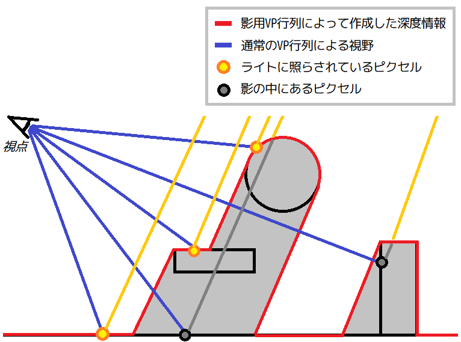
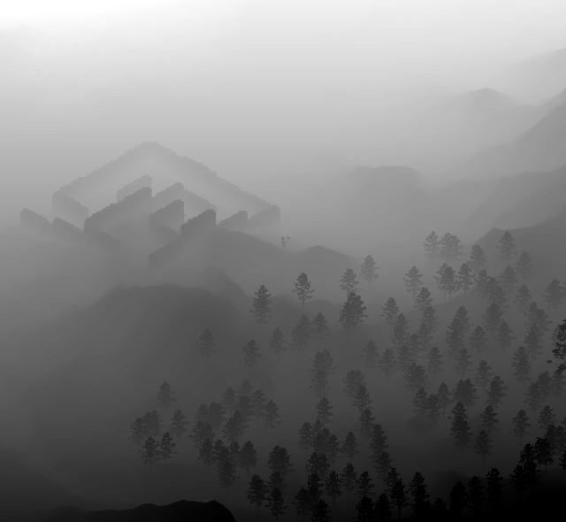
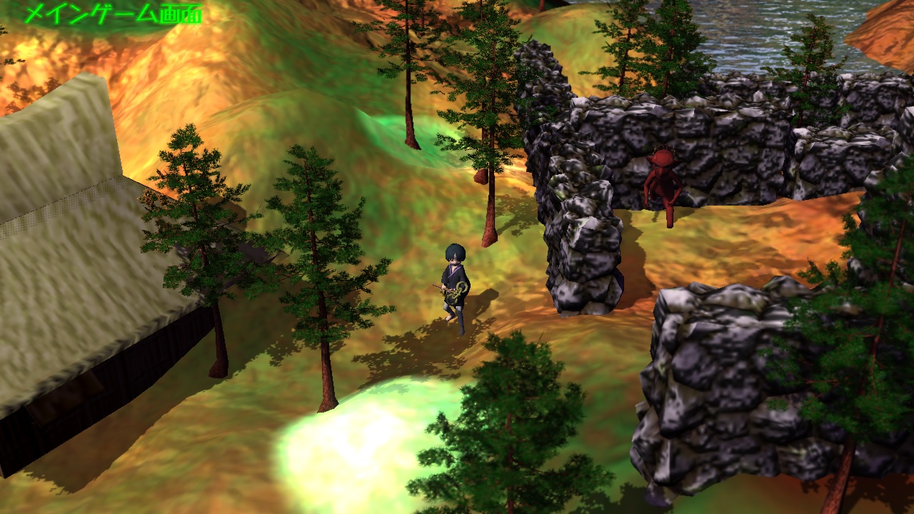

[OpenGL 3D 2019 後期 第08回]

# 光あるところに影があり

<br>

## 目標

* デプスシャドウ技法について理解する.

## 1. 影を描画する

### 1.1 影の歴史

コンピューター・グラフィックス、特にゲームにおいて、適切な影を描画することは、長らく困難な問題でした。ゲームに使われるコンピューターは価格による性能限界があること、また、1/60～1/20秒という短い時間で描画を完了しなくてはならないことがその理由です。現在に至っても、真に適切な影を描画することは、非常に難易度の高い作業であることに変わりはありません。

コンピューター・ゲームにおける初期の影は、単にキャラクターの足元に、物体の影を模した黒い画像を表示するだけのものでした。自動車や飛行機のように形状が変化しないものはその形がそのまま影の画像にも使われましたが、人間のようにさまざまなアクションをするキャラクターの影は、丸型や楕円形が一般的でした。

しかし、この影はただの画像に過ぎないため、地形に沿って影が落ちることはありませんでした。例えばキャラクターが崖から身を乗り出すように立ったとき、本来であれば影は崖の上と崖の下に落ちるはずです。しかし、この手法では影が崖からはみ出して空中に表示されます。

このような問題があったとはいえ、画像を表示するタイプの影は、処理が単純なことから、2Dゲーム時代を通じて使われました。3Dゲームが主流となった現在においても、このタイプの影を採用しているゲームを見つけることができます。

3Dゲームでは、よりリアルな表現が可能になり、影についてもリアルさが要求されるようになっていきます。例えば、セガの「バーチャ・ファイター」では、キャラクターの骨格を模した影モデルを描画することで、キャラクターの動作と一致する形状の影を表示しています。この方法は、プレイステーションからプレイステーション2の初期のゲームでは、人物の影描画の標準的な方法のひとつでした。

続いて、光源方向からキャラクターのシルエットを描画し、その画像をテクスチャとして地形に貼り付ける方法が考えられました。この方法は「投影テクスチャマッピング」と呼ばれ、「投影対象が制限される(多くの場合、地形にしか影が落ちない)」という問題は残るものの、影が宙に浮くことはなくなりました。投影テクスチャマッピングは、プレイステーション2の初期から登場し、処理負荷と品質のバランスが良いことから比較的多くのタイトルで使われました。

その後、「ステンシル・シャドウ」という技法が発展します。この方法では、影領域を示す「シャドウ・ボリューム」というメッシュを「ステンシル・バッファ」というバッファに描画して、影になるピクセルだけを抜き出します。ステンシル・シャドウは投影テクスチャマッピングにおける「投影対象が制限される」という問題を解決しました。しかし、影の形状をメッシュで定義する都合上、複雑な形状を反映することが難しく、また、ぼんやりとした影も表現しにくいことから、影の見た目の品質は他の技法に及びませんでした。この技法を使った代表的なタイトルに「DOOM3(どぅーむ・すりー)」があります。

こうした紆余曲折を経て、現在主流となっているのが「デプス・シャドウ・マッピング」という方法です。この方法では、まずライトの位置から見たシーンを「影用の深度バッファ」に描画しておきます。そして、視点からの(通常の)描画では、描画するピクセルごとにライトの位置からの深度を計算します。その値が「影用の深度バッファ」に書き込まれた値より奥にあるのなら、影の中にいると分かるわけです。

<div style="text-align: center;width: 100%;">

<div style="white-space: pre;">[デプス・シャドウ・マッピング]</div>
</div>

本講義では、この「デプス・シャドウ・マッピング」をプログラムしていきます。

>［補足］デプス・シャドウ・マッピングにも解像度などの制限があります。そのため、現在は「レイ・トレーシング」という方法が研究されており、既にいくつかのタイトルで採用されています。

### 1.2 メッシュの描画を関数にまとめる

ところで、デプス・シャドウ・マッピングでは、ライトの位置から見たものと、通常のものとで、メッシュを2回描画しなければなりません。ただ、今後描画するものが増減するたびに2箇所を修正するというのは面倒ですし、なによりミスが起こりやすいものです。そこで、メッシュの描画を関数にしてしまいましょう。

まずはメンバ関数を宣言します。MainGameScene.hを開き、MainGameSceneクラスの定義に、次のプログラムを追加してください。

```diff
   bool HandleJizoEffects(int id, const glm::vec3& pos);

 private:
+  void RenderMesh();

   std::mt19937 rand;
   int jizoId = -1; ///< 現在戦闘中のお地蔵様のID.
```

それではメンバ関数の定義をしていきましょう。MainGameScene.cppを開き、MainGameScene::Camera::Update関数の定義の下に、次のプログラムを追加してください。

```diff
   focalLength = 1.0f / ((1.0f / focalPlane) + (1.0f / imageDistance));
   aperture = focalLength / fNumber;
 }
+
+/**
+* メッシュを描画する.
+*/
+void MainGameScene::RenderMesh()
+{
+}
```

次に、MainGameScene::Render関数からメッシュを描画しているプログラムを切り取ります。

```diff
   meshBuffer.SetCameraPosition(camera.position);
   meshBuffer.SetTime(window.Time());

-  glm::vec3 cubePos(100, 0, 100);
-  cubePos.y = heightMap.Height(cubePos);
-  const glm::mat4 matModel = glm::translate(glm::mat4(1), cubePos);
-  Mesh::Draw(meshBuffer.GetFile("Cube"), matModel);
-  Mesh::Draw(meshBuffer.GetFile("Terrain"), glm::mat4(1));
-
-  player->Draw();
-  enemies.Draw();
-  trees.Draw();
-  objects.Draw();
-
-  glm::vec3 treePos(110, 0, 110);
-  treePos.y = heightMap.Height(treePos);
-  const glm::mat4 matTreeModel =
-    glm::translate(glm::mat4(1), treePos) * glm::scale(glm::mat4(1), glm::vec3(3));
-  Mesh::Draw(meshBuffer.GetFile("Res/red_pine_tree.gltf"), matTreeModel);
-
-  glBlendFunc(GL_ONE, GL_ONE_MINUS_SRC_ALPHA);
-  Mesh::Draw(meshBuffer.GetFile("Water"), glm::mat4(1));

   // 被写界深度.
   {
     glBindFramebuffer(GL_FRAMEBUFFER, fboDepthOfField->GetFramebuffer());
```

そして、切り取ったプログラムをMainGameScene::RenderMesh関数に貼り付けてください。

```diff
 void MainGameScene::RenderMesh()
 {
+  glm::vec3 cubePos(100, 0, 100);
+  cubePos.y = heightMap.Height(cubePos);
+  const glm::mat4 matModel = glm::translate(glm::mat4(1), cubePos);
+  Mesh::Draw(meshBuffer.GetFile("Cube"), matModel);
+  Mesh::Draw(meshBuffer.GetFile("Terrain"), glm::mat4(1));
+
+  player->Draw();
+  enemies.Draw();
+  trees.Draw();
+  objects.Draw();
+
+  glm::vec3 treePos(110, 0, 110);
+  treePos.y = heightMap.Height(treePos);
+  const glm::mat4 matTreeModel =
+    glm::translate(glm::mat4(1), treePos) * glm::scale(glm::mat4(1), glm::vec3(3));
+  Mesh::Draw(meshBuffer.GetFile("Res/red_pine_tree.gltf"), matTreeModel);
+
+  glBlendFunc(GL_ONE, GL_ONE_MINUS_SRC_ALPHA);
+  Mesh::Draw(meshBuffer.GetFile("Water"), glm::mat4(1));
 }
```

最後に、MainGameScene::Render関数に次のプログラムを追加してください。

```diff
   meshBuffer.SetCameraPosition(camera.position);
   meshBuffer.SetTime(window.Time());

+  RenderMesh();

   // 被写界深度.
   {
     glBindFramebuffer(GL_FRAMEBUFFER, fboDepthOfField->GetFramebuffer());
```

プログラムが書けたら、ビルドして実行してください。メッシュの描画を関数にする前と、まったく同じように表示されたら成功です。

### 1.3 デプス・シャドウ・マッピング用のFBOを作成する

それでは「デプス・シャドウ・マッピング」を組み込んでいきましょう。最初の一歩は、ライトの位置から見た深度バッファ、つまり「影用深度バッファ」を描画することです。影用深度バッファは、カメラの位置をライトの位置に、カメラの向きをライトが照らす方向に合わせてFBOに描画することで得られます。

とりあえず、影用のFBOを追加しましょう。MainGameScene.hを開き、MainGameSceneクラスの定義に次のプログラムを追加してください。

```diff
   FrameBufferObjectPtr fboMain;
   FrameBufferObjectPtr fboDepthOfField;
   FrameBufferObjectPtr fboBloom[6][2];
+  FrameBufferObjectPtr fboShadow;
 };

 #endif // MAINGAMESCENE_H_INCLUDED
```

続いてFBOを初期化します。MainGameScene.cppを開き、MainGameScene::Initialize関数に、次のプログラムを追加してください。

```diff
     std::cout << "[エラー]" << __func__ << ":ブルーム用メッシュの作成に失敗.\n";
     return false;
   }
+
+  // デプスシャドウマッピング用のFBOを作成する.
+  {
+    fboShadow = FrameBufferObject::Create(
+      4096, 4096, GL_NONE, FrameBufferType::depthOnly);
+    if (glGetError()) {
+      std::cout << "[エラー]" << __func__ << ":シャドウ用FBOの作成に失敗.\n";
+      return false;
+    }
+  }

   // ハイトマップを作成する.
   if (!heightMap.LoadFromFile("Res/Terrain.tga", 50.0f, 0.5f)) {
```

デプス・シャドウ・マッピング用のFBOに必要なのは、深度バッファのみで、カラーバッファは使いません。そこで、depthOnly(でぷす・おんりー)を指定して深度バッファだけのFBOを作成しています。

### 1.4 影用の深度バッファに描画する

それでは影用のFBOにメッシュを描画しましょう。影を落とすライトにはさまざまなものがありますが、今回はもっとも簡単な並行光源(ディレクショナル・ライト)を使います。MainGameScene::Render関数に、次のプログラムを追加してください。

```diff
 void MainGameScene::Render()
 {
   const GLFWEW::Window& window = GLFWEW::Window::Instance();
+
+  // 影用FBOに描画.
+  {
+    glBindFramebuffer(GL_FRAMEBUFFER, fboShadow->GetFramebuffer());
+    auto tex = fboShadow->GetDepthTexture();
+    glViewport(0, 0, tex->Width(), tex->Height());
+    glClear(GL_DEPTH_BUFFER_BIT);
+    glEnable(GL_DEPTH_TEST);
+    glEnable(GL_CULL_FACE);
+    glDisable(GL_BLEND);
+
+    // ディレクショナル・ライトの向きから影用のビュー行列を作成.
+    // 視点は、カメラの注視点からライト方向に100m移動した位置に設定する.
+    glm::vec3 direction(0, -1, 0);
+    for (auto e : lights) {
+      if (auto p = std::dynamic_pointer_cast<DirectionalLightActor>(e)) {
+        direction = p->direction;
+        break;
+      }
+    }
+    const glm::vec3 position = camera.target - direction * 100.0f;
+    const glm::mat4 matView = glm::lookAt(position, camera.target, glm::vec3(0, 1, 0));
+
+    // 平行投影によるプロジェクション行列を作成.
+    const float width = 100; // 描画範囲の幅.
+    const float height = 100; // 描画範囲の高さ.
+    const float near = 10.0f // 描画範囲の手前側の境界.
+    const float far = 200.0f // 描画範囲の奥側の境界.
+    const glm::mat4 matProj =
+      glm::ortho<float>(-width / 2, width / 2, -height / 2, height / 2, near, far);
+
+    // ビュー・プロジェクション行列を設定してメッシュを描画.
+    meshBuffer.SetViewProjectionMatrix(matProj * matView);
+    RenderMesh();
+  }

  glBindFramebuffer(GL_FRAMEBUFFER, fboMain->GetFramebuffer());
  auto texMain = fboMain->GetColorTexture();
```

ディレクショナル・ライトには「位置」という概念がないため、カメラの注視点から100m離れた位置を、影用のカメラの位置としています。

また、全てに対して平行に光が当たるので、プロジェクション行列には平行投影行列を使うことにしました。平行投影作成にはglm::ortho(じーえるえむ・おるそー)関数を使います。描画される範囲は変数width(うぃす)、height(はいと)、near(にあ)、far(ふぁー)の4つの変数で設定できるようにしてあります。上記のプログラムでは、カメラの前方10mから200m、縦横100mの範囲になります。この範囲内にあるメッシュだけが影を落とします。

### 1.5 深度テクスチャを確認する

実際に描画できたかどうかを確認しましょう。MainGameScene::Render関数の末尾に、次のプログラムを追加してください。

```diff
     simpleMesh->materials[0].texture[0] = fboBloom[0][0]->GetColorTexture();
     Mesh::Draw(simpleMesh, glm::mat4(1));

     fontRenderer.Draw(screenSize);
   }
+
+  // デバッグのために、影用の深度テクスチャを表示する.
+  {
+    glDisable(GL_BLEND);
+    Mesh::FilePtr simpleMesh = meshBuffer.GetFile("Simple");
+    simpleMesh->materials[0].texture[0] = fboShadow->GetDepthTexture();
+    glm::mat4 m = glm::scale(glm::translate(
+      glm::mat4(1), glm::vec3(-0.45f, 0, 0)), glm::vec3(0.5f, 0.89f, 1));
+    Mesh::Draw(simpleMesh, m);
+  }
 }

 /**
 * お地蔵様に触れたときの処理.
```

プログラムが書けたらビルドして実行してください。画面の左側に、次のような深度テクスチャが表示されたら成功です。

<div style="text-align: center;width: 100%;">

<div style="white-space: pre;">[影用の深度テクスチャ]</div>
</div>

GLMライブラリでプロジェクション行列を作成している限り、深度テクスチャの値は近い側が0.0、遠い側が1.0の値を取ります。そのため、近くにあるものほど黒っぽく、遠くにあるものほど白っぽくひょうじされるのです。

深度テクスチャに描画されていることを確認したら、プリプロセッサ・ディレクティブを使ってデバッグ用の表示を無効化してください。

```diff
     fontRenderer.Draw(screenSize);
   }
+#if 0
   // デバッグのために、影用の深度テクスチャを表示する.
   {
     glDisable(GL_BLEND);
     Mesh::FilePtr simpleMesh = meshBuffer.GetFile("Simple");
     simpleMesh->materials[0].texture[0] = fboShadow->GetDepthTexture();
     glm::mat4 m = glm::scale(glm::translate(
       glm::mat4(1), glm::vec3(-0.45f, 0, 0)), glm::vec3(0.5f, 0.89f, 1));
     Mesh::Draw(simpleMesh, m);
   }
+#endif
 }
```

プログラムが書けたらビルドして実行してください。深度テクスチャが表示されなければ成功です。

<div style="page-break-after: always"></div>

## 2. 影を描画する

### 2.1 Terrain.vertに影の描画プログラムを追加する

描画するピクセルが影の中にあることを判定、判定に必要なユニフォーム変数をフラグメント・シェーダーで判定します。手始めに、地形シェーダーに影の処理を追加しましょう。Terrain.vertを開き、次のプログラムを追加してください。

```diff
 layout(location=0) out vec3 outPosition;
 layout(location=1) out vec2 outTexCoord;
 layout(location=2) out vec3 outTBN[3];
 layout(location=5) out vec3 outRawPosition;
+layout(location=6) out vec3 outShadowPosition;

 uniform mat4 matMVP;
 uniform mat4 matModel;
+uniform mat4 matShadow;

 /**
 * Terrain vertex shader.
 */
 void main()
 {
   mat3 matNormal = transpose(inverse(mat3(matModel)));
   vec3 n = matNormal * vNormal;
   vec3 b = matNormal * vec3(0.0, 0.0, -1.0);
   vec3 t = normalize(cross(b, n));
   b = normalize(cross(t, n));
   outTBN[0] = t;
   outTBN[1] = b;
   outTBN[2] = n;

   outTexCoord = vTexCoord;

   outPosition = vec3(matModel * vec4(vPosition, 1.0));
+  outShadowPosition = vec3(matShadow * vec4(outPosition, 1.0)) * 0.5 + 0.5;
   outRawPosition = vPosition;
   gl_Position = matMVP * (matModel * vec4(vPosition, 1.0));
 }
```

「outShadowPosition(あうと・しゃどう・ぽじしょん)」出力変数は、ライトの位置から見た頂点の座標の書き込み先となります。「matShadow(まっと・しゃどう)」ユニフォーム変数には、影を描画するときに使ったビュー・プロジェクション行列が格納されます。

ライトの位置から見た頂点座標は「matShadow * outPosition」という式で計算できます。ただし、このままだと、意図したとおりに影用の深度テクスチャを参照することはきません。ビュー・プロジェクション行列を掛けた結果は-1.0～1.0の範囲になりますが、テクスチャ座標は0.0～1.0の範囲だからです。

そこで、-1.0～1.0を0.0～1.0に変換する必要があります。といっても、これはとても簡単です。0.5を掛けてから、0.5を足すだけです。<br>-1.0～1.0に0.5を掛けると-0.5～0.5になります。<br>そして、-0.5～0.5に0.5を足すと0.0～1.0となるわけです。

### 2.2 Terrain.fragに影の描画プログラムを追加する

続いて、フラグメント・シェーダーを修正しましょう。フラグメント・シェーダーでは、入力変数としてライトの位置から見た座標を受け取り、影用深度テクスチャと値を比較することで影の中にあるかどうかを判定します。それでは、Terrain.fragに次のプログラムを追加してください。

```diff
 layout(location=0) in vec3 inPosition;
 layout(location=1) in vec2 inTexCoord;
 layout(location=2) in vec3 inTBN[3];
 layout(location=5) in vec3 inRawPosition;
+layout(location=6) in vec3 inShadowPosition;

 out vec4 fragColor;

 uniform sampler2D texColorArray[4];
 uniform sampler2D texNormalArray[3];
 uniform isamplerBuffer texPointLightIndex; // use texelFetch
 uniform isamplerBuffer texSpotLightIndex; // use texelFetch
+uniform sampler2DShadow texShadow;

 const ivec2 mapSize = ivec2(200, 200);
```

影用深度テクスチャを読み込む場合、「sampler2D」の代わりに「sampler2DShadow(さんぷらー・つーでぃ・しゃどう)」を使います。sampler2DShadowは、値の取得と比較までをまとめて行い、その結果を0.0～1.0の値として返してくれる、便利なサンプラーになっています。値の意味は、0.0が影の中、1.0が影の外になります。

次に、処理中のフラグメントが影の中にあるかどうかを判定します。Terrain.fragの、ディレクショナル・ライトの明るさを計算するプログラムを、次のように変更してください。

```diff
   normal = normalize(matTBN * normal);

   vec3 lightColor = ambientLight.color.rgb;
   float power = max(dot(normal, -directionalLight.direction.xyz), 0.0);
-  lightColor += directionalLight.color.rgb * power;
+  float shadow = texture(texShadow, inShadowPosition); // 影の比率を取得.
+  lightColor += directionalLight.color.rgb * power * shadow;

   int offset = int(inRawPosition.z) * mapSize.x + int(inRawPosition.x);
   ivec4 pointLightIndex = texelFetch(texPointLightIndex, offset);
```

影用深度テクスチャはディレクショナル・ライトから作成されたので、影が影響するのもディレクショナル・ライトだけです。

>［補足］ポイント・ライトやスポット・ライトによる影を表現する場合、それぞれのライトの位置を視点にし、透視投影行列を使って深度テクスチャを作成します。また、ポイント・ライトは全周を照らすので、深度テクスチャにはキューブマップなどの全周を表現できるテクスチャを使います。スポット・ライトが広い範囲を照らす場合も同様です。

### 2.3 sampler2DShadowの比較方法を設定する

sampler2DShadowは深度の比較まで行ってくれる便利なサンプラーですが、初期状態では比較機能が無効化されています。そこで、比較機能を有効化しましょう。MainGameScene::Initialize関数の影用FBOを作成するプログラムに、次のプログラムを追加してください。

```diff
   // デプスシャドウマッピング用のFBOを作成する.
   {
     fboShadow = FrameBufferObject::Create(
       4096, 4096, GL_NONE, FrameBufferType::depthOnly);
     if (glGetError()) {
       std::cout << "[エラー]" << __func__ << ":シャドウ用FBOの作成に失敗.\n";
       return false;
     }
+    // sampler2DShadowの比較モードを設定する.
+    glBindTexture(GL_TEXTURE_2D, fboShadow->GetDepthTexture()->Get());
+    glTexParameteri(GL_TEXTURE_2D, GL_TEXTURE_COMPARE_MODE, GL_COMPARE_REF_TO_TEXTURE);
+    glTexParameteri(GL_TEXTURE_2D, GL_TEXTURE_COMPARE_FUNC, GL_LEQUAL);
+    glBindTexture(GL_TEXTURE_2D, 0);
   }

   // ハイトマップを作成する.
```

比較機能はテクスチャ・パラメーターのひとつになっています。パラメーターは2つあり、ひとつが「GL_TEXTURE_COMPARE_MODE(じーえる・てくすちゃ・こんぺあ・もーど)」、もうひとつは「GL_TEXTURE_COMPARE_FUNC(じーえる・てくすちゃ・こんぺあ・ふぁんく)」です。

比較機能を有効にするには、GL_TEXTURE_COMPARE_MODEパラメーターに「GL_COMPARE_REF_TO_TEXTURE(じーえる・こんぺあ・れふ・とぅ・てくすちゃ)」を設定します。このパラメーターの初期値は「GL_NONE(じーえる・のん)」になっていて、そのせいで比較機能が働かないわけです。このパラメーターに設定できるのはGL_NONEとGL_COMPARE_REF_TO_TEXTUREのいずれかのみです。

>［補足］比較を有効にする値は、OpenGL 2.xでは「GL_COMPARE_R_TO_TEXTURE」という名前でしたが、OpenGL 3.0から「GL_COMPARE_REF_TO_TEXTURE」という名前に変更されました。

残るGL_TEXTURE_COMPARE_FUNCは、比較方法を指定するパラメーターです。深度テクスチャの値は遠くになるほど大きくなるので、値が同じか大きければ影の中にいると判定できます。「同じか大きい」という比較をするには「GL_LEQUAL(じーえる・れす・いこーる)」を指定します。他にどのような値を設定できるかは「GL_TEXTURE_COMPARE_FUNC」で検索すると見つかるでしょう。

### 2.4 Shader::Programクラスに深度テクスチャを設定する機能を追加する

シェーダーに深度テクスチャ粗設定できるようにしていきます。Shader.hを開き、Programクラスの定義に次のプログラムを追加してください。

```diff
   void SetCameraInfo(
     float focalPlane, float focalLength, float aperture, float sensorSize);
   void SetBlurDirection(float x, float y);
+  void SetShadowViewProjectionMatrix(const glm::mat4&);
+  static const GLint shadowTextureBindingPoint = 16;

   /// プログラムIDを取得する.
   GLuint Get() const { return id; }

 private:
   GLuint id = 0; //プログラムID

   //// uniform変数の位置
   GLint locMatMVP = -1;
   GLint locMatModel = -1;
   GLint locPointLightCount = -1;
   GLint locPointLightIndex = -1;
   GLint locSpotLightCount = -1;
   GLint locSpotLightIndex = -1;
   GLint locCameraPosition = -1;
   GLint locTime = -1;
   GLint locViewInfo = -1;
   GLint locCameraInfo = -1;
   GLint locBlurDirection = -1;
+  GLint locMatShadow = -1;

  glm::mat4 matVP = glm::mat4(1); //ビュー・プロジェクション行列
```

「shadowTextureBindingPoint(しゃどう・てくすちゃ・ばいんでぃんぐ・ぽいんと)」という変数は、影用の深度テクスチャのバインディング・ポイントを示します。メッシュの描画に使うテクスチャが最大16枚なので、バインディング・ポイントは0～15までが使われます。深度テクスチャがそれらを上書きしてしまうことがないように、16という数値を設定しているわけです。

次にShader.cppを開き、Program::Reset関数の定義に、次のプログラムを追加してください。

```diff
   locMatMVP = glGetUniformLocation(id, "matMVP");
   locMatModel = glGetUniformLocation(id, "matModel");
+  locMatShadow = glGetUniformLocation(id, "matShadow");
   locPointLightCount = glGetUniformLocation(id, "pointLightCount");
   locPointLightIndex = glGetUniformLocation(id, "pointLightIndex");
```

それともう一つ、同じくProgram::Reset関数の定義に、テクスチャ・バインディング・ポイントを設定する、次のプログラムを追加してください。

```diff
   if (locTexCubeMap >= 0) {
     glUniform1i(locTexCubeMap, 6);
   }
+  const GLint locTexShadow = glGetUniformLocation(id, "texShadow");
+  if (locTexShadow >= 0) {
+    glUniform1i(locTexShadow, shadowTextureBindingPoint);
+  }

   glUseProgram(0);
   if (GLenum error = glGetError()) {
```

続いて、影用のビュープロジェクション行列を設定するプログラムを定義します。Program::SetViewProjectionMatrix関数の定義の下に、次のプログラムを追加してください。

```diff
     glUniformMatrix4fv(locMatMVP, 1, GL_FALSE, &matVP[0][0]);
   }
 }
+
+/**
+* 影の描画に使われるビュープロジェクション行列を設定する.
+*
+* @param m 設定する影用ビュープロジェクション行列.
+*/
+void Program::SetShadowViewProjectionMatrix(const glm::mat4& m)
+{
+  if (locMatShadow >= 0) {
+    glUniformMatrix4fv(locMatShadow, 1, GL_FALSE, &m[0][0]);
+  }
+}

 /**
 * 描画に使われるモデル行列を設定する.
```

### 2.5 Mesh::Bufferクラスに深度テクスチャを設定する機能を追加する

シェーダーの多くはMesh::Bufferクラスが管理しています。このクラスから、Shader::Programクラスの深度テクスチャを設定機能を呼び出すようにします。

Mesh.hを開き、Mesh::Bufferクラスの定義に次のプログラムを追加してください。

```diff
   FilePtr GetFile(const char* name) const;
   void SetViewProjectionMatrix(const glm::mat4&) const;
+  void SetShadowViewProjectionMatrix(const glm::mat4&) const;
   void SetCameraPosition(const glm::vec3&) const;
   void SetTime(double) const;
+  void BindShadowTexture(const Texture::InterfacePtr&);
+  void UnbindShadowTexture();

   void AddCube(const char* name);
   FilePtr AddPlane(const char* name);
```

もうひとつ、同様にMesh::Bufferクラスの定義に、次のプログラムを追加してください。

```diff
   std::unordered_map<std::string, MeshIndex> meshes;
   std::unordered_map<std::string, ExtendedFilePtr> extendedFiles;

+  GLenum shadowTextureTarget = GL_NONE;
 };

 void Draw(const FilePtr&, const glm::mat4& matM);
```

次に、Mesh.cppを開き、Buffer::SetViewProjectionMatrix関数の定義の下に、次のプログラムを追加してください。

```diff
   progWater->SetViewProjectionMatrix(matVP);
   glUseProgram(0);
 }
+
+/**
+* シェーダに影用のビュー・プロジェクション行列を設定する.
+*
+* @param matVP 影用ビュー・プロジェクション行列.
+*/
+void Buffer::SetShadowViewProjectionMatrix(const glm::mat4& matVP) const
+{
+  progStaticMesh->Use();
+  progStaticMesh->SetShadowViewProjectionMatrix(matVP);
+  progSkeletalMesh->Use();
+  progSkeletalMesh->SetShadowViewProjectionMatrix(matVP);
+  progTerrain->Use();
+  progTerrain->SetShadowViewProjectionMatrix(matVP);
+  progWater->Use();
+  progWater->SetShadowViewProjectionMatrix(matVP);
+  glUseProgram(0);
+}

/**
* シェーダーにカメラのワールド座標を設定する.
```

続いて、Buffer::SetTime関数の定義の下に、次のプログラムを追加してください。

```diff
   progWater->SetTime(ftime);
   glUseProgram(0);
 }
+
+/**
+* 影用の深度テクスチャをGLコンテキストに割り当てる.
+*
+* @param tex  影用の深度テクスチャ.
+*/
+void Buffer::BindShadowTexture(const Texture::InterfacePtr& texture)
+{
+  shadowTextureTarget = texture->Target();
+  glActiveTexture(GL_TEXTURE0 + Shader::Program::shadowTextureBindingPoint);
+  glBindTexture(shadowTextureTarget, texture->Get());
+}
+
+/**
+* 影用テクスチャの割り当てを解除する.
+*/
+void Buffer::UnbindShadowTexture()
+{
+  if (shadowTextureTarget != GL_NONE) {
+    glActiveTexture(GL_TEXTURE0 + Shader::Program::shadowTextureBindingPoint);
+    glBindTexture(shadowTextureTarget, 0);
+    shadowTextureTarget = GL_NONE;
+  }
+}

 /**
```

### 2.6 影用の深度テクスチャを設定する

それでは、影用の深度テクスチャを設定して描画していきましょう。MainGameScene.cppを開き、MainGameScene::Render関数の影用FBOに描画するプログラムに、次のプログラムを追加してください。

```diff
     const glm::mat4 matProj =
       glm::ortho<float>(-width / 2, width / 2, -height / 2, height / 2, near, far);

     // ビュー・プロジェクション行列を設定してメッシュを描画.
+    meshBuffer.SetShadowViewProjectionMatrix(matProj * matView);
     meshBuffer.SetViewProjectionMatrix(matProj * matView);
     RenderMesh();
```

次に、通常の描画を行うプログラムに、次のプログラムを追加してください。

```diff
   meshBuffer.SetCameraPosition(camera.position);
   meshBuffer.SetTime(window.Time());
+  meshBuffer.BindShadowTexture(fboShadow->GetDepthTexture());

   RenderMesh();

+  meshBuffer.UnbindShadowTexture();

   // 被写界深度.
```

プログラムが書けたらビルドして実行してください。地面に影が表示されていたら成功です。

<div style="text-align: center;width: 100%;">

</div>

### 2.7 シャドウ・アクネ

影を描画すると、ところどころ斜線や点々が現れることがあります。これは「シャドウ・アクネ」と呼ばれています(アクネは「にきび」という意味です)。

影用の深度バッファの1ピクセルのサイズが通常描画されるピクセルより大きい場合、あるピクセルでは影になり、別のピクセルでは日向になる、ということが発生します。これがシャドウ・アクネです。 つまり、シャドウ・アクネが発生する原因は、深度バッファの解像度不足なわけです。

シャドウ・アクネは、深度バッファを大きくすれば解決します。そうはいっても、テクスチャサイズには限界があるうえ、深度バッファを大きくすればするほど描画にかかる時間が長くなってしまいます。

そこで、別の解決方法を取ることにします。最も簡単なのは、「深度バイアス」と呼ばれる定数を追加することです。Terrain.vertを開き、次のプログラムを追加してください。

```diff
   outPosition = vec3(matModel * vec4(vPosition, 1.0));
   outShadowPosition = vec3(matShadow * vec4(outPosition, 1.0)) * 0.5 + 0.5;
+  outShadowPosition.z -= 0.0005; // 深度バイアス.
   outRawPosition = vPosition;
   gl_Position = matMVP * (matModel * vec4(vPosition, 1.0));
```

深度バイアスは、対象ピクセルの座標をわずかに手前に移動させることで、シャドウ・アクネを回避します。

プログラムが書けたらビルドして実行してください。シャドウ・アクネが軽減されていたら成功です。

<div style="border:solid 1px; background:#f0e4cd; margin: 1rem; padding: 1rem; border-radius: 10px">
<strong>［課題01］</strong><br>
StaticMesh.vert, StaticMesh.fragに影を描画するプログラムを追加してください。
</div>

<div style="page-break-after: always"></div>

## 3. 描画負荷を下げる

### 3.1 深度以外を描画しないシェーダーを作成する

「デプス・シャドウ・マッピング」では、ライトの位置から見た深度バッファを作成します。このときに描画するのは深度バッファだけなので、明るさの計算などの結果はすべて捨てられてしまいます。これは、明らかにGPUの無駄づかいです。そこで、明るさなどの計算を一切しないシェーダーを追加して、影用の深度バッファを作成するときはそれを使うことにしましょう。

Resフォルダに「Shadow.frag」という名前のファイルを追加してください。追加したファイルを開き、次のプログラムを追加してください。

```c++
/**
* @file Shadow.frag
*/
#version 430

layout(location=1) in vec2 inTexCoord;

uniform sampler2D texColor;

void main()
{
  // 不透明度が0.5未満のピクセルは破棄する(影を落とさない).
  float a = texture(texColor, inTexCoord).a;
  if (a < 0.5) {
    discard;
  }
}
```

このシェーダーの目的は、明るさなどといった、カラーバッファに書き込むための計算を一切させないことです。そのため、gl_FragColor変数への書き込みは行っていません。また、深度値はgl_FragDepth変数に書き込むことができますが、これはOpenGLが自動的に行ってくれます。つまり、影用のシェーダーでは何かを書く必要はないのです。

そのかわりに、テクスチャのアルファ値を参照して何かを行っています。「discard(でぃすかーど)」というのは、「このフラグメントはフレームバッファに書き込まない」ということを、OpenGLに伝えるためのキーワードです。プログラムがdiscardに到達すると、シェーダーの計算が打ち切られ、フレームバッファには何も書き込まれません。

木の葉のように透明部分があるテクスチャを使っている場合、透明部分も影を落とすと見た目が不自然ですよね。そこで、if文とdiscardキーワードを組み合わせて、ある程度以上に透明だと判断したピクセルは描画しないようにしているのです。

それから、もうひとつ。テクスチャを参照しないシェーダーも作成します。Resフォルダに「NonTexturedShadow.frag(のん・てくすちゃーど・しゃどう)」という名前のファイルを追加してください。そして追加したファイルを開き、次のプログラムを追加してください。

```c++
/**
* @file NonTexturedShadow.frag
*/
#version 430

void main()
{
}
```

こちらは正真正銘、なんにも書いていません。OpenGLによって自動的にgl_FragDepthが書かれる以外は、なにもしないシェーダーです。このシェーダーは、地形の影を描画するために使います。地形のテクスチャは特殊なので、アルファを参照するべきではないからです。

### 3.2 Mesh::Bufferクラスにシェーダー用のメンバ変数を追加する

影用のシェーダーもMesh::Bufferクラスに持たせることにします。Mesh.hを開き、Mesh::Bufferクラスの定義に、次のプログラムを追加してください。

```diff
   const Shader::ProgramPtr& GetTerrainShader() const { return progTerrain; }
   const Shader::ProgramPtr& GetWaterShader() const { return progWater; }
+  const Shader::ProgramPtr& GetSkeletalMeshShader() const { return progSkeletalMesh; }
+  const Shader::ProgramPtr& GetShadowShader() const { return progShadow; }
+  const Shader::ProgramPtr& GetNonTexturedShadowShader() const {
+    return progNonTexturedShadow; }
+  const Shader::ProgramPtr& GetSkeletalShadowShader() const {
+    return progSkeletalShadow; }

 private:
   BufferObject vbo;
   BufferObject ibo;
   GLintptr vboEnd = 0;
   GLintptr iboEnd = 0;
   std::unordered_map<std::string, FilePtr> files;
   Shader::ProgramPtr progStaticMesh;
   Shader::ProgramPtr progTerrain;
   Shader::ProgramPtr progWater;
+
+  // 影用のシェーダー.
+  Shader::ProgramPtr progShadow;
+  Shader::ProgramPtr progNonTexturedShadow;
+  Shader::ProgramPtr progSkeletalShadow;

   // スケルタル・アニメーションに対応したシェーダーを保持するメンバ変数.
   Shader::ProgramPtr progSkeletalMesh;
```

それではシェーダー・プログラム読み込みましょう。Mesh.cppを開き、Buffer::Inirialize関数に次のプログラムを追加してください。

```diff
   progWater = Shader::Program::Create("Res/Terrain.vert", "Res/Water.frag");
   if (progWater->IsNull()) {
     return false;
   }
+
+  // 影描画用のシェーダー・プログラムを作成.
+  progShadow  = Shader::Program::Create("Res/StaticMesh.vert", "Res/Shadow.frag");
+  progNonTexturedShadow  = Shader::Program::Create(
+    "Res/StaticMesh.vert", "Res/NonTexturedShadow.frag");
+  progSkeletalShadow  = Shader::Program::Create(
+    "Res/SkeletalMesh.vert", "Res/Shadow.frag");
+  if (progShadow->IsNull() ||
+    progNonTexturedShadow->IsNull() ||
+    progSkeletalShadow->IsNull()) {
+    return false;
+  }

   vboEnd = 0;
   iboEnd = 0;
```

### 3.3 影用シェーダーにビュー・プロジェクション行列を設定する

影用のシェーダーにもビュー・プロジェクション行列を設定します。Buffer::SetShadowViewProjectionMatrix関数に次のプログラムを追加してください。

```diff
   progWater->Use();
   progWater->SetShadowViewProjectionMatrix(matVP);
+
+  // 影用シェーダーには通常のビュー・プロジェクション行列を設定する.
+  progShadow->Use();
+  progShadow->SetViewProjectionMatrix(matVP);
+  progNonTexturedShadow->Use();
+  progNonTexturedShadow->SetViewProjectionMatrix(matVP);
+  progSkeletalShadow->Use();
+  progSkeletalShadow->SetViewProjectionMatrix(matVP);

   glUseProgram(0);
 }
```

影用のビュー・プロジェクション行列は、影用の深度バッファの描画と通常の描画の両方で使います。しかし、それぞれ使いみちが違っています。そのため、通常のシェーダーに対しては影用のビュー・プロジェクション行列として設定しますが、影用のシェーダーには通常のビュー・プロジェクション行列として設定する必要があるのです。

### 3.4 マテリアル構造体に影用シェーダーを追加する

影用シェーダーはメッシュの種類によって使い分けなければなりません。どのメッシュにどのシェーダーを割り当てるかはMaterial構造体に設定することにします。Mesh.hを開き、Material構造体の定義に次のプログラムを追加してください。

```diff
 struct Material
 {
   glm::vec4 baseColor = glm::vec4(1);
   Texture::InterfacePtr texture[16];
   Shader::ProgramPtr program;
   Shader::ProgramPtr progSkeletalMesh; // スケルタルメッシュ用のシェーダー.
+  Shader::ProgramPtr progShadow; // 影用のシェーダー.
 };
```

次に、progShadowメンバ変数にシェーダーを設定します。Mesh.cppを開き、Buffer::CreateMaterial関数に、次のプログラムを追加してください。

```diff
   Material m;
   m.baseColor = color;
   m.texture[0] = texture;
   m.program = progStaticMesh;
   m.progSkeletalMesh = progSkeletalMesh;
+  m.progShadow = progShadow;
   return m;
 }
```

続いて、地形メッシュのマテリアルにも影用シェーダーを設定しましょう。Terrain.cppを開き、HeightMap::CreateMesh関数に次のプログラムを追加してください。

```diff
   m.texture[10] = Texture::Image2D::Create("Res/Terrain_Plant_Normal.tga");
   m.program = meshBuffer.GetTerrainShader();
+  m.progShadow = meshBuffer.GetNonTexturedShadowShader();
   meshBuffer.AddMesh(meshName, p, m);

   return true;
 }
```

同様に、HeightMap::CreateWaterMesh関数に次のプログラムを追加してください。

```diff
   m.texture[8] = Texture::Image2D::Create("Res/Terrain_Water_Normal.tga");
   m.program = meshBuffer.GetWaterShader();
+  m.progShadow = meshBuffer.GetNonTexturedShadowShader();
   meshBuffer.AddMesh(meshName, p, m);

   return true;
 }
```

もうひとつ、スケルタルメッシュのマテリアルにも影用シェーダーを設定します。SkeletalMesh.cppを開き、Buffer::LoadSkeletalMesh関数のマテリアルを作成している部分に、次のプログラムを追加してください。

```diff
       if (!texturePath.empty()) {
         tex = Texture::Image2D::Create(texturePath.c_str());
       }
-      file.materials.push_back(CreateMaterial(col, tex));
+      Material m = CreateMaterial(col, tex);
+      m.progShadow = GetSkeletalShadowShader();
+      file.materials.push_back(m);
     }
   }

   // ノードツリーを構築.
```

これで、現在使用しているすべての種類のメッシュについて、影用シェーダーを設定できました。

### 3.5 Draw関数に描画タイプを追加する

次に、影を描画するのか、通常の描画を行うのかを、Draw関数の引数で決められるようにします。Mesh::Darw関数の定義を次のように変更してください。

```diff
   GLenum shadowTextureTarget = GL_NONE;
 };

+/**
+* 描画するデータの種類.
+*/
+enum class DrawType {
+  color,  // 通常の描画.
+  shadow, // 影の描画.
+};
-void Draw(const FilePtr&, const glm::mat4& matM);
+void Draw(const FilePtr&, const glm::mat4& matM,
+  DrawType drawType = DrawType::color);

 } // namespace Mesh
```

Draw関数の定義も修正しましょう。Mesh.cppを開き、Draw関数を次のように変更してください。

```diff
 * @param file 描画するファイル.
 * @param matM  描画に使用するモデル行列.
+* @param drawType  描画するデータの種類.
 */
-void Draw(const FilePtr& file, const glm::mat4& matM)
+void Draw(const FilePtr& file, const glm::mat4& matM, DrawType drawType)
 {
   if (!file || file->meshes.empty() || file->materials.empty()) {
     return;
   }

   const Mesh& mesh = file->meshes[0];
   for (const Primitive& p : mesh.primitives) {
     if (p.material < static_cast<int>(file->materials.size())) {
       p.vao->Bind();
       const Material& m = file->materials[p.material];
+      Shader::ProgramPtr program = m.program;
+      if (drawType == DrawType::shadow) {
+        program = m.progShadow;
+      }
-      m.program->Use();
-      m.program->SetModelMatrix(matM);
+      program->Use();
+      program->SetModelMatrix(matM);
-      glActiveTexture(GL_TEXTURE0);

       // テクスチャがあるときは、そのテクスチャIDを設定する. ないときは0を設定する.
       for (int i = 0; i < sizeof(m.texture)/sizeof(m.texture[0]); ++i) {
```

これで、DrawTypeがshadowのときは影用シェーダーが使われるようになりました。

### 3.6 SkeletalMesh::Draw関数に描画タイプを追加する

影の描画はスタティックメッシュだけでなく、スケルタルメッシュでも行わなければなりません。そこで、スケルタルメッシュにも描画タイプによる切り替えプログラムを追加しましょう。SkeletalMesh.hを開き、Drawメンバ関数の宣言を次のように変更してください。

```diff
   SkeletalMesh(const ExtendedFilePtr& f, const Node* n);

   void Update(float deltaTime, const glm::mat4& matModel, const glm::vec4& color);
-  void Draw() const;
+  void Draw(DrawType drawType) const;
   const std::vector<Animation>& GetAnimationList() const;
   const std::string& GetAnimation() const;
```

続いて定義も修正しましょう。SkeletalMesh.cppを開き、SkeletalMesh::Draw関数を次のように変更してください。

```diff
 * スケルタルメッシュを描画する.
+*
+* @param drawType 描画するデータの種類.
 */
-void SkeletalMesh::Draw() const
+void SkeletalMesh::Draw(DrawType drawType) const
 {
   if (!file) {
     return;
   }

   // TODO: シーンレベルの描画に対応すること.
   //std::vector<const Node*> meshNodes;
   //meshNodes.reserve(32);
   //GetMeshNodeList(node, meshNodes);

   SkeletalAnimation::BindUniformData(uboOffset, uboSize);

   const Mesh& meshData = file->meshes[node->mesh];
   GLuint prevTexId = 0;
   for (const auto& prim : meshData.primitives) {
     prim.vao->Bind();

     if (prim.material >= 0 && prim.material < static_cast<int>(file->materials.size())) {
       const Material& m = file->materials[prim.material];
+      Shader::ProgramPtr program = m.progSkeletalMesh;
+      if (drawType == DrawType::shadow) {
+        program = m.progShadow;
+      }
-      if (!m.progSkeletalMesh) {
+      if (!program) {
         continue;
       }
-      m.progSkeletalMesh->Use();
+      program->Use();
       for (int i = 0; i < sizeof(m.texture) / sizeof(m.texture[0]); ++i) {
```

### 3.7 アクタークラスの描画関数関数の宣言に描画タイプを追加する

メッシュの描画は、Actorクラスから間接的に実行されることもあります。そのため、Actorとその派生クラスのDraw関数も、描画タイプを指定できる必要があります。

ということで、まずはActorクラスのDraw関数に描画タイプの引数を追加しましょう。Actor.hを開き、Actorクラスの定義を次のように変更してください。

```diff
   virtual void Update(float);
   virtual void UpdateDrawData(float);

-  virtual void Draw();
+  virtual void Draw(Mesh::DrawType drawType);
   virtual void OnHit(const ActorPtr&, const glm::vec3&) {}
```

同様に、StaticMeshActorクラスのDraw関数の宣言も修正します。

```diff
   virtual ~StaticMeshActor() = default;

-  virtual void Draw() override;
+  virtual void Draw(Mesh::DrawType drawType) override;

   const Mesh::FilePtr& GetMesh() const { return mesh; }
   void SetPointLightList(const std::vector<int>& v);
```

アクターの集合を管理するAdtorListクラスにも、同様の変更を行ってください。

```diff
   void Update(float);
   void UpdateDrawData(float);
-  void Draw();
+  void Draw(Mesh::DrawType drawType);
   bool Empty() const { return actors.empty(); }

   // イテレーターを取得する関数.
   iterator begin() { return actors.begin(); }
```

Actorの派生クラスはもうひとつあります。SkeletalMeshActor.hを開き、SkeletalMeshActorクラスの定義を次のように変更してください。

```diff
   virtual ~SkeletalMeshActor() = default;

   virtual void UpdateDrawData(float) override;
-  virtual void Draw() override;
+  virtual void Draw(Mesh::DrawType drawType) override;

   const Mesh::SkeletalMeshPtr& GetMesh() const { return mesh; }
```

### 3.8 アクタークラスの描画関数関数の定義に描画タイプを追加する

続いて、描画関数の定義を修正していきます。Actor.cppを開き、Actor::Draw関数の定義を次のように変更してください。

```diff
 /**
 * アクターの描画.
+*
+* @param drawType 描画するデータの種類.
 */
-void Actor::Draw()
+void Actor::Draw(Mesh::DrawType)
 {
 }
```

次に、StaticMeshActor::Draw関数の定義を、次のように変更してください。

```diff
 /**
 * 描画.
+*
+* @param drawType 描画するデータの種類.
 */
-void StaticMeshActor::Draw()
+void StaticMeshActor::Draw(Mesh::DrawType drawType)
 {
   if (mesh) {
     const glm::mat4 matT = glm::translate(glm::mat4(1), position);
     const glm::mat4 matR_Y = glm::rotate(glm::mat4(1), rotation.y, glm::vec3(0, 1, 0));
     const glm::mat4 matR_ZY = glm::rotate(matR_Y, rotation.z, glm::vec3(0, 0, -1));
     const glm::mat4 matR_XZY = glm::rotate(matR_ZY, rotation.x, glm::vec3(1, 0, 0));
     const glm::mat4 matS = glm::scale(glm::mat4(1), scale);
     const glm::mat4 matModel = matT * matR_XZY * matS;

     if (!mesh->materials.empty()) {
+      if (drawType == Mesh::DrawType::color) {
         const Shader::ProgramPtr p = mesh->materials[0].program;
         if (p) {
           p->Use();
           p->SetPointLightIndex(pointLightCount, pointLightIndex);
           p->SetSpotLightIndex(spotLightCount, spotLightIndex);
         }
+      }
-      Mesh::Draw(mesh, matModel);
+      Mesh::Draw(mesh, matModel, drawType);
     }
   }
 }
```

続いて、ActorList::Draw関数の定義を、次のように変更してください。

```diff
 /**
 * Actorを描画する.
+*
+* @param drawType 描画するデータの種類.
 */
-void ActorList::Draw()
+void ActorList::Draw(Mesh::DrawType drawType)
 {
   for (const ActorPtr& e : actors) {
     if (e && e->health > 0) {
-      e->Draw();
+      e->Draw(drawType);
     }
   }
 }
```

最後に、SkeletalMeshActor.cppを開き、SkeletalMeshActor::Draw関数の定義を次のように変更してください。

```diff
 /**
 * 描画.
+*
+* @param drawType 描画するデータの種類.
 */
-void SkeletalMeshActor::Draw()
+void SkeletalMeshActor::Draw(Mesh::DrawType drawType)
 {
   if (mesh) {
-    mesh->Draw();
+    mesh->Draw(drawType);
   }
 }
```

これでひととおり描画関数の修正は終わりました。

### 3.9 MainGameScene::RenderMesh関数に描画タイプを追加する

最後の仕上げに、MainGameSceneクラスの描画処理を修正します。MainGameScene.hを開き、MainGameSceneクラスのRenderMesh関数の宣言を、次のように変更してください。

```diff
   bool HandleJizoEffects(int id, const glm::vec3& pos);

 private:
-  void RenderMesh();
+  void RenderMesh(Mesh::DrawType);

   std::mt19937 rand;
   int jizoId = -1; ///< 現在戦闘中のお地蔵様のID.
```

次に、メンバ関数の定義を修正します。MainGameScene.cppを開き、MainGameScene::RenderMesh関数の定義を、次のように変更してください。

```diff
 /**
 * メッシュを描画する.
+*
+* @param drawType 描画するデータの種類.
 */
-void MainGameScene::RenderMesh()
+void MainGameScene::RenderMesh(Mesh::DrawType drawType)
 {
   glm::vec3 cubePos(100, 0, 100);
   cubePos.y = heightMap.Height(cubePos);
   const glm::mat4 matModel = glm::translate(glm::mat4(1), cubePos);
-  Mesh::Draw(meshBuffer.GetFile("Cube"), matModel);
-  Mesh::Draw(meshBuffer.GetFile("Terrain"), glm::mat4(1));
+  Mesh::Draw(meshBuffer.GetFile("Cube"), matModel, drawType);
+  Mesh::Draw(meshBuffer.GetFile("Terrain"), glm::mat4(1), drawType);

-  player->Draw();
-  enemies.Draw();
-  trees.Draw();
-  objects.Draw();
+  player->Draw(drawType);
+  enemies.Draw(drawType);
+  trees.Draw(drawType);
+  objects.Draw(drawType);

   glm::vec3 treePos(110, 0, 110);
   treePos.y = heightMap.Height(treePos);
   const glm::mat4 matTreeModel =
     glm::translate(glm::mat4(1), treePos) * glm::scale(glm::mat4(1), glm::vec3(3));
-  Mesh::Draw(meshBuffer.GetFile("Res/red_pine_tree.gltf"), matTreeModel);
+  Mesh::Draw(meshBuffer.GetFile("Res/red_pine_tree.gltf"), matTreeModel, drawType);

+  if (drawType == Mesh::DrawType::color) {
     glBlendFunc(GL_ONE, GL_ONE_MINUS_SRC_ALPHA);
-    Mesh::Draw(meshBuffer.GetFile("Water"), glm::mat4(1));
+    Mesh::Draw(meshBuffer.GetFile("Water"), glm::mat4(1), drawType);
+  }
 }
```

それから、RenderMeshメンバ関数を呼び出している部分も修正しなければなりません。MainGameScene::Render関数の影用FBOに描画しているプログラムを、次のように変更してください。

```diff
     const glm::mat4 matProj =
       glm::ortho<float>(-width / 2, width / 2, -height / 2, height / 2, near, far);

     // ビュー・プロジェクション行列を設定してメッシュを描画.
     meshBuffer.SetShadowViewProjectionMatrix(matProj * matView);
-    meshBuffer.SetViewProjectionMatrix(matProj * matView);
-    RenderMesh();
+    RenderMesh(Mesh::DrawType::shadow);
   }
```

影用の深度バッファの描画には、影用シェーダーを使うようにしたので、SetViewProjectionMatrix関数は不要になりました。

残るは通常の描画だけです。MainGameScene::Render関数の通常の描画をしているプログラムを、次のように変更してください。

```diff
   meshBuffer.SetTime(window.Time());
   meshBuffer.BindShadowTexture(fboShadow->GetDepthTexture());

-  RenderMesh();
+  RenderMesh(Mesh::DrawType::color);

   meshBuffer.UnbindShadowTexture();
```

これですべての変更は完了です。プログラムが書けたらビルドして実行してください。これまでと同じく影が描画されていたら成功です。

<div style="border:solid 1px; background:#f0e4cd; margin: 1rem; padding: 1rem; border-radius: 10px">
<strong>［課題02］</strong><br>
SkeletalMesh.vert, SkeletalMesh.fragに影を描画するプログラムを追加してください。
</div>
<div style="page-break-after: always"></div>

## 冬休み課題について

1. 寿司打で一定以上の成績をあげること。

* 3000円コースをクリアしていない場合 → 3000円コースをクリアする。
* 3000円コースをクリアしている場合 → 5000円コースをクリアする。

2. 就職作品の制作を各自予定どおりに進めること。
