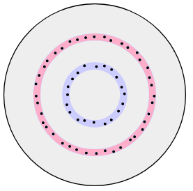
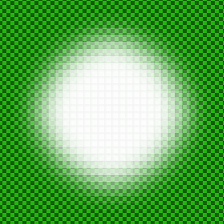
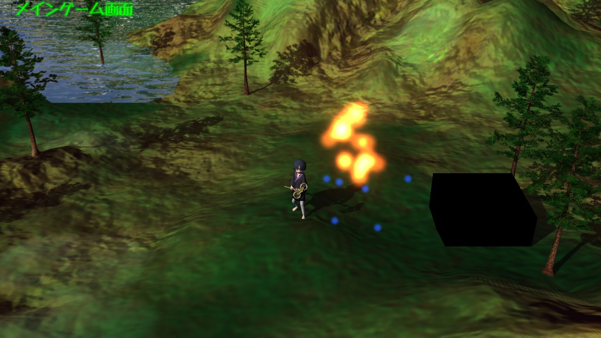
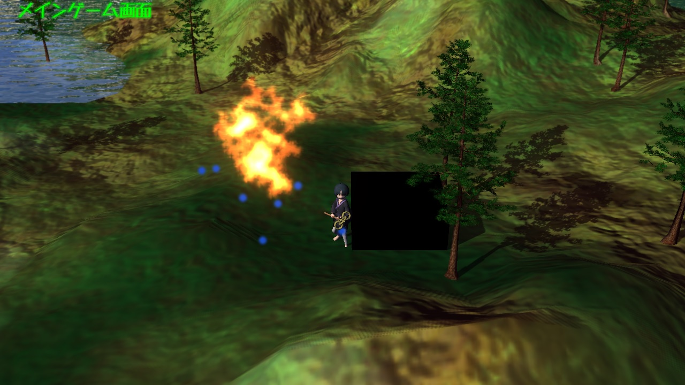

[OpenGL 3D 2019 後期 第09回]

# パーティクル<br>上から見るか 横から見るか

## 目標

* 炎や煙のような、不定形な物体の表現方法を習得する.

## 1. パーティクル

### 1.1 不定形な物体を表すには

現代の3Dグラフィックスでは、三角形(ポリゴン)を組み合わせることで物体を表現します。この方法は、明確に定義された表面を持つ多くの物体を表現できます。しかし、煙や炎のように、表面が不規則で、複雑で、不明確なものを表すことは得意ではありません。

古典的には、そういった不定形の物体はテクスチャに描いておき、四角メッシュに貼り付け、四角メッシュが常にカメラの方を向くように座標を変換する、という方法が使われました。これは現代でも使われている一般的なテクニックになっています。しかし、この四角メッシュを使う方法は万能ではありません。例えば、炎を上から見下ろす、というような場合には使えません。

そこで考え出されたのが、炎や煙を粒子の集合としてとらえ、個々の粒子を四角メッシュで表示する方法です。この方法は、「粒子」を表す英単語「パーティクル(Particle)」から「パーティクル・システム(Particle System)」と呼ばれます。

パーティクル・システムでは、物体の大まかな形状は粒子の配置や動きによって定義されます。個々の粒子は三次元空間に配置されるので、どの方向からでも、それなりに正しい形に見えるのです。

### 1.2 パーティクル・シェーダー

パーティクルの個々の四角メッシュをカメラの方へ向けるため、専用のシェーダーが必要となります。まずはこれを作成しましょう。Resフォルダに「Particle.vert」というファイルを追加してください。追加したファイルを開き、次のプログラムを追加してください。

```c++
/**
* @file Particle.vert
*/
#version 430

layout(location=0) in vec3 vCenter;
layout(location=1) in vec4 vColor;
layout(location=2) in vec2 vTexCoord;
layout(location=3) in vec2 vOffset;

layout(location=0) out vec4 outColor;
layout(location=1) out vec2 outTexCoord;

uniform mat4x4 matMVP;
uniform mat3 matInverseViewRotation;

/**
* Particle vertex shader.
*/
void main()
{
  outColor = vColor;
  outTexCoord = vTexCoord;
  vec3 offset = matInverseViewRotation * vec3(vOffset, 0.0);
  gl_Position = matMVP * vec4(vCenter + offset, 1.0);
}
```

カメラの方へ向けるための計算は、「`matInverseViewRotation`(まっと・いんばーす・びゅー・ろーてーしょん)」という行列を掛けることで行っています。この行列は、ビュー行列の回転要素を打ち消すような行列、つまり、ビュー行列の回転要素の逆行列になります。

また、フラグメントシェーダーは`Sprite.frag`を流用することにします。

### 1.3 Program::SetInverseViewRotation関数を定義する

次に、`Shader::Program`クラスにこの行列を設定する機能を追加します。Shader.hを開き、まず以下のメンバ関数の宣言を追加してください。

```diff
   void Use();
   void BindTexture(GLuint, GLuint);
   void SetViewProjectionMatrix(const glm::mat4&);
+  void SetInverseViewRotationMatrix(const glm::mat4& matView);
   void SetShadowViewProjectionMatrix(const glm::mat4&);
   void SetModelMatrix(const glm::mat4&);
```

続いて、以下のメンバ変数の定義を追加してください。

```diff
   GLint locBlurDirection = -1;
   GLint locMatShadow = -1;
+  GLint locMatInverseViewRotation = -1;

   glm::mat4 matVP = glm::mat4(1); //ビュー・プロジェクション行列
 };
```

今度はShader.cppを開き、Program::Reset関数に、次のプログラムを追加してください。

```diff
   locCameraInfo = glGetUniformLocation(id, "cameraInfo");
   locBlurDirection = glGetUniformLocation(id, "blurDirection");
+  locMatInverseViewRotation = glGetUniformLocation(id, "matInverseViewRotation");

   glUseProgram(id);
   const GLint texColorLoc = glGetUniformLocation(id, "texColor");
```

次に、Program::SetViewProjectionMatrix関数の定義の下に、以下のプログラムを追加してください。

```diff
     glUniformMatrix4fv(locMatMVP, 1, GL_FALSE, &matVP[0][0]);
   }
 }
+
+/**
+* 描画に使われるビュー回転の逆行列を設定する.
+*
+* @param matView 元になるビュー行列.
+*/
+void Program::SetInverseViewRotationMatrix(const glm::mat4& matView)
+{
+  if (locMatInverseViewRotation >= 0) {
+    const glm::mat3 m = glm::inverse(glm::mat3(glm::transpose(glm::inverse(matView))));
+    glUniformMatrix3fv(locMatInverseViewRotation, 1, GL_FALSE, &m[0][0]);
+  }
+}

 /**
 * 影の描画に使われるビュープロジェクション行列を設定する.
```

これでシェーダーの用意は完了です。

<div style="page-break-after: always"></div>

## 2. パーティクル・システム

### 2.1 パーティクル・システムを構成するクラス

今回作成するパーティクル・システムは、３つのクラスから構成されます。ひとつは粒子自身をあらわす「パーティクル(Particle)クラス」、それから、粒子を放出する位置や範囲をあらわす「エミッター(Particle Emitter)クラス」、そして、パーティクルとエミッターを管理する「パーティクル・システム(Particle System)クラス」です。

>［補足］「エミッター(Emitter)」は「放出する」という意味の英単語「Emit(えみっと)」に「～するもの」という意味を付与する「-er」をくっつけて作られた単語です。

パーティクル・システムは複数のエミッターを管理し、そしてエミッターは放出したパーティクルを管理する、という階層構造になります。

プログラムからは、まずパーティクル・システムを作成し、次にそのパーティクル・システムにエミッターを追加していきます。そして、パーティクル・システムの状態を更新すると、管理下にあるエミッターからパーティクルが放出される、という流れになります。

### 2.2 Particle.hの作成

ここからは、パーティクルクラス、エミッタークラス、パーティクル・システム・クラスの順で定義をしていきます。

まず、SrcフォルダにParticle.hというファイルを追加してください。そうしたら、とりあえず必要なヘッダーファイルをインクルードして、クラスの先行宣言を行いましょう。追加したファイルを開き、以下のプログラムを追加してください。

```c++
/**
* @file Particle.h
*/
#ifndef PARTICLE_H_INCLUDED
#define PARTICLE_H_INCLUDED
#include <GL/glew.h>
#include "Texture.h"
#include "BufferObject.h"
#include "Shader.h"
#include "Sprite.h"
#include <glm/glm.hpp>
#include <list>
#include <memory>

// 先行宣言
class Particle;
class ParticleEmitter;
using ParticleEmitterPtr = std::shared_ptr<ParticleEmitter>;
class ParticleSystem;

#endif // PARTICLE_H_INCLUDED
```

### 2.3 ParticleParameter構造体を定義する

次に、パーティクルを初期化するためのパラメーター構造体を定義します。パーティクルを初期化するには、さまざまなパラメータを設定しなければなりません。しかし、それらすべてをコンストラクタの引数に並べてしまうと、書くのが大変面倒です。そこで、それらを構造体としてまとめてしまい、引数にはその構造体を渡す、という形式にします。それでは、先行宣言の下に、次のプログラムを追加してください。

```diff
 using ParticleEmitterPtr = std::shared_ptr<ParticleEmitter>;
 class ParticleSystem;
+
+/**
+* パーティクルのパラメーター.
+*/
+struct ParticleParameter
+{
+  float lifetime = 1;                      // 生存期間.
+  glm::vec3 velocity = glm::vec3(0, 2, 0); // 速度.
+  glm::vec3 acceleration = glm::vec3(0);   // 加速度.
+  glm::vec2 scale = glm::vec2(1);          // 大きさ.
+  float rotation = 0;                      // 回転.
+  glm::vec4 color = glm::vec4(1);          // 色と不透明度.
+};

 #endif // PARTICLE_H_INCLUDED
```

### 2.4 ParticleEmittereParameter構造体を定義する

エミッターの初期化は、パーティクルよりさらにたくさんのパラメーターが必要となります。そのためのパラメーター構造体も定義しましょう。パーティクルのパラメーター構造体の定義の下に、次のプログラムを追加してください。

```diff
   float rotation = 0; // 回転.
   glm::vec4 color = glm::vec4(1); // 色と不透明度.
 };
+
+/**
+* パーティクル・エミッターのパラメーター.
+*/
+struct ParticleEmitterParameter
+{
+  int id = 0;                        // エミッターを識別するためのID.
+  glm::vec3 position = glm::vec3(0); // エミッターの位置.
+  glm::vec3 rotation = glm::vec3(0); // エミッターの向き.
+  float duration = 1.0f;             // パーティクルを放出する秒数.
+  bool loop = true;                  // ループ再生するならtrue、停止するならfalse.
+  float emissionsPerSecond = 5.0f;   // 秒あたりのパーティクル放出数.
+  float angle = glm::radians(15.0f); // 放出方向を定義する円錐の角度.
+  float radius = 0.5f;               // 放出方向を定義する円錐の半径.
+  float gravity = 9.8f;              // パーティクルにかかる重力.
+  std::string imagePath;             // テクスチャ・ファイル名.
+
+  glm::ivec2 tiles = glm::ivec2(1);  // テクスチャの縦と横の分割数.
+  GLenum srcFactor = GL_SRC_ALPHA;
+  GLenum dstFactor = GL_ONE_MINUS_SRC_ALPHA;
+};

 #endif // PARTICLE_H_INCLUDED
```

### 2.5 Particleクラスを定義する

それでは、パーティクルクラスを定義しましょう。このクラスには、とりあえず更新関数と死亡判定関数の2つを用意することにします。もしプログラムでパーティクルの座標などを知りたい、あるいは変更したいとなったら、そのときに必要なメンバ関数を追加すればいいでしょう。それでは、エミッターのパラメーター構造体の定義の下に、次のプログラムを追加してください。

```diff
   float gravity = 9.8f;              // パーティクルにかかる重力.
   std::string imagePath;             // テクスチャ・ファイル名.

   glm::ivec2 tiles = glm::ivec2(1);  // テクスチャの縦と横の分割数.
   GLenum srcFactor = GL_SRC_ALPHA;
   GLenum dstFactor = GL_ONE_MINUS_SRC_ALPHA;
 };
+
+/**
+* パーティクル.
+*/
+class Particle {
+public:
+  friend ParticleSystem;
+  friend ParticleEmitter;
+
+  Particle(const ParticleParameter& pp, const glm::vec3& pos, const Rect& r);
+  virtual ~Particle() = default;
+
+  void Update(float deltatime);
+  bool IsDead() const { return lifetime <= 0; }
+
+private:
+  Rect rect = { glm::vec2(0), glm::vec2(0) }; // テクスチャ表示範囲.
+  glm::vec3 position = glm::vec3(0);       // 位置.
+  float lifetime = 1;                      // 生存期間.
+  glm::vec3 velocity = glm::vec3(0, 2, 0); // 速度.
+  glm::vec3 acceleration = glm::vec3(0);   // 加速度.
+  glm::vec2 scale = glm::vec2(1);          // 大きさ.
+  float rotation = 0;                      // 回転.
+  glm::vec4 color = glm::vec4(1);          // 色と不透明度.
+};

 #endif // PARTICLE_H_INCLUDED
```

### 2.6 ParticleEmitterクラスを定義する

続いて、エミッタークラスを定義します。こちらは、更新関数と死亡判定関数に加えて、描画関数も作ります。パーティクルクラスの定義の下に、次のプログラムを追加してください。

```diff
+  float rotation = 0;                      // 回転.
+  glm::vec4 color = glm::vec4(1);          // 色と不透明度.
+};
+
+/**
+* パーティクル放出クラス.
+*/
+class ParticleEmitter
+{
+public:
+  friend ParticleSystem;
+
+  ParticleEmitter(const ParticleEmitterParameter& ep, const ParticleParameter& pp);
+  ~ParticleEmitter() = default;
+
+  void Update(float deltatime);
+  void Draw();
+
+  // 座標の設定・取得.
+  void Position(const glm::vec3& p) { ep.position = p; }
+  const glm::vec3& Position() const { return ep.position; }
+
+  bool IsDead() const { return !ep.loop && timer >= ep.duration && particles.empty(); }
+
+private:
+  void AddParticle();
+
+  ParticleEmitterParameter ep; // エミッターのパラメーター.
+  ParticleParameter pp;        // パーティクルのパラメーター.
+
+  Texture::Image2DPtr texture; // パーティクル用テクスチャ.
+  float interval = 0;          // パーティクルの発生間隔(秒).
+  float timer = 0;             // 経過時間(秒).
+  float emissionTimer = 0;     // パーティクル発生タイマー(秒).
+
+  size_t count = 0;      // 描画するインデックス数.
+  size_t baseVertex = 0; // 描画の基準となる頂点のオフセット.
+
+  std::list<Particle>  particles; // パーティクルリスト.
+};

 #endif // PARTICLE_H_INCLUDED
```

### 2.7 ParticleSystemクラスを定義する

最後に、パーティクル・システム・クラスを定義します。その名前が示すとおり、パーティクル・システムの中心となるクラスです。このクラスには、パーティクル・システムを初期化したり、エミッターの追加と削除を行うメンバ関数が必要となります。それでは、エミッタークラスの定義の下に、次のプログラムを追加してください。

```diff
   std::list<Particle>  particles; // パーティクルリスト.
 };
+
+/**
+* パーティクル管理クラス.
+*/
+class ParticleSystem
+{
+public:
+  ParticleSystem() = default;
+  ~ParticleSystem() = default;
+
+  bool Init(size_t maxParticleCount);
+  ParticleEmitterPtr Add(
+    const ParticleEmitterParameter& ep, const ParticleParameter& pp);
+  ParticleEmitterPtr Find(int id) const;
+  void Remove(const ParticleEmitterPtr&);
+  void Clear();
+  void Update(float deltatime);
+  void Draw(const glm::mat4& matProj, const glm::mat4& matView);
+
+private:
+  BufferObject vbo;
+  BufferObject ibo;
+  VertexArrayObject vao;
+  Shader::ProgramPtr program;
+  std::list<ParticleEmitterPtr> emitters;
+};

 #endif // PARTICLE_H_INCLUDED
```

これでクラスの定義は完成です。

### 2.8 Particle.cppの作成

次はメンバ関数の定義をしていきましょう。Srcフォルダに`Particle.cpp`というファイルを追加してください。追加したファイルを開き、次のプログラムを追加してください。

```c++
/**
* @file Particle.cpp
*/
#include "Particle.h"
#include <glm/gtc/matrix_transform.hpp>
#include <vector>
#include <algorithm>
#include <random>
#include <numeric>
#include <iostream>
#include <time.h>
```

### 2.9 パーティクル用頂点データを定義する

次に、パーティクル用の頂点データを定義します。time.hのインクルード文の下に、次のプログラムを追加してください。

```diff
 #include <iostream>
 #include <time.h>
+
+namespace /* unnamed */ {
+
+/// パーティクル用の頂点データ型.
+struct Vertex {
+  glm::vec3 center;   // 中心の座標.
+  glm::vec4 color;    // 色.
+  glm::vec2 texCoord; // テクスチャ座標.
+  glm::vec2 offset;   // 中心からの距離.
+};
+
+} // unnamed namespace
```

パーティクルの頂点データはスプライトと似ていますが、position(ぽじしょん)のかわりにcenter(せんたー)とoffset(おふせっと)を使う点が違っています。シェーダーで見たように、オフセットはパーティクルを常にカメラの方へと向かせるために使います。

### 2.10 名前空間について

namespace(ねーむ・すぺーす)というのは、プログラムを管理するための構文のひとつです。これは日本語では「名前空間(なまえくうかん)」と呼ばれています。通常、名前空間は、以下のように適切な名前とともに使用します。

```c++
namespace Sample {
  struct A {};
  void Func() {}
}
```

プログラムでは、「::(ころん・ころん)」を使って`Sample::A`や`Sample::Func()`のように使います。

名前を省略した場合は「無名名前空間」というものになります。

```c++
namespace {
  struct A {};
  void Func() {}
}
```

目に見える名前がないので、プログラムでは通常の構造体や関数と同じように`A`や`Func()`と書きます。まるで名前空間の意義がないように見えますね。しかし、 無名名前空間には、コンパイラが自動的に名前をつけてくれるのです。この名前は、ファイルごとに異なっていて、絶対に他とかぶりません。その結果、無名名前空間のなかにある構造体や関数は、他のファイルからはまったく見えなくなります。

このことが重要なのは、CやC++には、「同じ名前の関数や変数は、プログラム全体でひとつしか定義できない」というルールがあるからです。このルールは「One Definision rule(わん・でぃふぃにしょん・るーる)」、または頭文字を取って「ODR(おー・でぃー・あーる)」と呼ばれています。

ファイル内でしか使わないような名前はできるだけ短いほうが、読むのも書くのも簡単です。しかし、ODRがあるため、例えば`Vertex`という名前はプログラム全体でひとつだけしか定義できません。そのため、いちいち`SpriteVertex`や`ParticleVertex`のように、異なる名前を付ける必要があるのです。しかし、無名名前空間を使えば、「Sprite.cppのVertex」と「Particle.cpp」のVertexは別のものとして扱われます。つまり、ODRに違反せずに短い名前を使うことができるわけです。

>［補足］なお、本プログラムのスプライトの場合は、SpriteRendererクラスのメンバとして定義することで、この問題を回避しています。この場合`SpriteRenderer::Vertex`という名前になるので他とかぶることはまずありません。ただし、頂点データの定義をヘッダーファイルに書かなくてはならず、クラス定義が見づらくなりがちです。<br>無名名前空間を使えばソースファイルに書けるので見やすくなります。<br>スプライトのときは、説明を省くためにクラスのメンバとしました。しかし、`Vertex`構造体のように他のファイルで使う可能性がないものは、無名名前空間を使って定義するほうがよいでしょう。

### 2.11 パーティクル用の乱数を用意する

次に、パーティクル用の乱数を用意します。頂点データの定義の下に、次のプログラムを追加してください。

```diff
   glm::vec2 texCoord; // テクスチャ座標.
   glm::vec2 offset;   // 中心からの距離.
 };
+
+/// パーティクル用の乱数エンジン.
+std::mt19937 randomEngine(static_cast<int>(time(nullptr)));
+
+/**
+* int型の乱数を生成する.
+*
+* @param min 生成する乱数の最小値.
+* @param max 生成する乱数の最大値.
+*/
+int RandomInt(int min, int max)
+{
+  return std::uniform_int_distribution<>(min, max)(randomEngine);
+}
+
+/**
+* float型の乱数を生成する.
+*
+* @param min 生成する乱数の最小値.
+* @param max 生成する乱数の最大値.
+*/
+float RandomFloat(float min, float max)
+{
+  return std::uniform_real_distribution<float>(min, max)(randomEngine);
+}

 } // unnamed namespace
```

毎回`std::uniform_int_distribution<>`などと書くのは長くて大変なので、整数用と浮動小数点数用の2つの関数を用意することにしました。これらも無名名前空間のなかに定義するようにしてください。

### 2.12 Particleコンストラクタを定義する

それでは、メンバ関数を定義していきましょう。まずパーティクルクラスのコンストラクタを定義します。無名名前空間の定義の下に、次のプログラムを追加してください。

```diff
   return std::uniform_real_distribution<float>(min, max)(randomEngine);
 }

 } // unnamed namespace
+
+/**
+* コンストラクタ.
+*
+* @param  pp  パーティクルのパラメーター.
+* @param  pos パーティクルの初期座標.
+* @param  r   パーティクルのテクスチャ表示範囲を示す矩形.
+*/
+Particle::Particle(const ParticleParameter& pp, const glm::vec3& pos, const Rect& r) :
+  rect(r),
+  position(pos),
+  lifetime(pp.lifetime),
+  velocity(pp.velocity),
+  acceleration(pp.acceleration),
+  scale(pp.scale),
+  rotation(pp.rotation),
+  color(pp.color)
+{
+}
```

### 2.13 Particle::Update関数を定義する

続いて、パーティクルの状態を更新する関数を定義します。パーティクルクラスのコンストラクタ定義の下に、次のプログラムを追加してください。

```diff
   rotation(pp.rotation),
   color(pp.color)
 {
 }
+
+/**
+* パーティクルの状態を更新する.
+*
+* @param deltaTime  前回の更新からの経過時間(秒).
+*/
+void Particle::Update(float deltaTime)
+{
+  lifetime -= deltaTime;
+  velocity += acceleration * deltaTime;
+  position += velocity * deltaTime;
+}
```

更新関数では、まず生存時間を減少させたあと、加速度を速度に加算し、速度を位置に加算しています。つまり、等加速度直線運動をさせているわけです。

これでパーティクルクラスのメンバ関数は完成です。

### 2.14 ParticleEmitterコンストラクタを定義する

こんどは、エミッタークラスのメンバ関数を定義していきましょう。`Particle::Update`関数の定義の下に、次のプログラムを追加してください。

```diff
   velocity += acceleration * deltaTime;
   position += velocity * deltaTime;
 }
+
+/**
+* コンストラクタ.
+*
+* @param  ep エミッターの初期化パラメータ.
+* @param  pp パーティクルの初期化パラメータ.
+*/
+ParticleEmitter::ParticleEmitter(
+  const ParticleEmitterParameter& ep, const ParticleParameter& pp) :
+  ep(ep),
+  pp(pp),
+  interval(1.0f / ep.emissionsPerSecond)
+{
+  texture = Texture::Image2D::Create(ep.imagePath.c_str());
+}
```

interval(いんたーばる)メンバ変数には、パーティクルの発生間隔の秒数を記録しておきます。intervalは更新関数で使います。

intervalの計算は更新関数で行ってもいいのですが、コンピューターにとって除算は時間のかかる処理なので、コンストラクタで先に計算しておきます。

>［補足］近い将来、このように除算を事前に計算しておく必要性は薄れるかもしれません。というのは、最新のCPUでは、除算命令の速度が大きく改善されてきているからです。とはいえ、まだまだ加減算や乗算と比較すると遅いですし、原理的に同じ速度になることはないと思います。しかし、これまでより気軽に使えるようになることは確かです。

### 2.15 ParticleEmitter::AddParticle関数を定義する

次に、パーティクルを追加する関数を定義しましょう。エミッタークラスのコンストラクタ定義の下に、次のプログラムを追加してください。

```diff
   texture = Texture::Image2D::Create(ep.imagePath.c_str());
 }
+
+/**
+* パーティクルを追加する.
+*/
+void ParticleEmitter::AddParticle()
+{
+  // 放出位置と速度を求めるための行列を計算.
+  const float rx = std::sqrt(RandomFloat(0, 1)); // X軸方向の放出位置を0～1の範囲で表した値.
+  const float ry = RandomFloat(0, glm::two_pi<float>()); // 0～360度の範囲でY軸回転させる値.
+  const glm::mat4 matRY = glm::rotate(glm::mat4(1), ry, glm::vec3(0, 1, 0));
+
+  // X -> Z -> Yの順でエミッターの回転を適用.
+  const glm::mat4 matRot = glm::rotate(glm::rotate(glm::rotate(glm::mat4(1),
+    ep.rotation.y, glm::vec3(0, 1, 0)),
+    ep.rotation.z, glm::vec3(0, 0, -1)),
+    ep.rotation.x, glm::vec3(1, 0, 0));
+
+  // ベロシティだけ変更したパーティクルの初期化用パラメーターを作成.
+  ParticleParameter tmpPP = pp;
+  const glm::mat4 matAngle = glm::rotate(matRY, rx * ep.angle, glm::vec3(0, 0, -1));
+  tmpPP.velocity = matRot * matAngle * glm::vec4(pp.velocity, 1);
+
+  // テクスチャの表示範囲を作成.
+  Rect rect;
+  rect.origin = glm::vec2(0);
+  if (ep.tiles.x > 1) {
+    const int tx = RandomInt(0, ep.tiles.x - 1);
+    rect.origin.x = static_cast<float>(tx) / static_cast<float>(ep.tiles.x);
+  }
+  if (ep.tiles.y > 1) {
+    const int ty = RandomInt(0, ep.tiles.y - 1);
+    rect.origin.y = static_cast<float>(ty) / static_cast<float>(ep.tiles.y);
+  }
+  rect.size = glm::vec2(1) / glm::vec2(ep.tiles);
+
+  const glm::vec3 offset = matRot * matRY * glm::vec4(rx * ep.radius, 0, 0, 1);
+  Particle p(tmpPP, ep.position + offset, rect);
+  particles.push_back(p);
+}
```

今回作成するエミッターは円錐台の形をしています。そして、パーティクルは円錐台の底面から放出されます。底面のどの位置から放出されるかはランダムです。放出方向は、放出された位置と円錐台の角度(`angle`パラメーター)によって決まります。

上記のプログラムにおいて、`rx`は半径方向の位置を表し、`ry`はそれを回転させる角度を表します。`rx`の計算式は`√(0～1の乱数)`になっていますが、これには理由があります。パーティクルは、円盤のどの位置からも均等な確率で放出されるべきです。これは、以下の図から分かるように、円盤の外側に行くほど多くのパーティクルが放出されることを意味します。詳細ははぶきますが、この確率の変化は平方根によって表すことができるのです。

<div style="text-align: center;width: 100%;">

<div style="white-space: pre;">[外側の円の長さは内側の円の2倍→パーティクルの放出確率が2倍]</div>
</div>

### 2.17 ParticleEmitter::Update関数を定義する

続いて、エミッターを更新する関数を定義します。エミッターの更新関数では、一定時間ごとにAddParticle関数を呼び出してパーティクルを発生させます。また、パーティクルに重力を与え、状態を更新します。さらに、生存を終えたパーティクルを除去することも行います。ParticleEmitter::AddParticle関数の定義の下に、次のプログラムを追加してください。

```diff
   Particle p(tmpPP, ep.position + offset, rect);
   particles.push_back(p);
 }
+
+/**
+* エミッターの管理下にあるパーティクルの状態を更新する.
+*
+* @param deltaTime  前回の更新からの経過時間(秒).
+*/
+void ParticleEmitter::Update(float deltaTime)
+{
+  // タイマー更新.
+  timer += deltaTime;
+  if (timer >= ep.duration) {
+    if (ep.loop) {
+      timer -= ep.duration;
+      emissionTimer -= ep.duration;
+    } else {
+      timer = ep.duration;
+    }
+  }
+
+  // パーティクルを放出.
+  for (; timer - emissionTimer >= interval; emissionTimer += interval) {
+    AddParticle();
+  }
+
+  // パーティクルを更新.
+  for (auto& e : particles) {
+    e.acceleration.y -= ep.gravity * deltaTime;
+    e.Update(deltaTime);
+  }
+
+  // 死亡したパーティクルを削除.
+  particles.remove_if([](const Particle& p) { return p.IsDead(); });
+}
```

`timer`(たいまー)メンバ変数は生存期間を計るため、`emissionTimer`(えみっしょん・たいまー)メンバ変数は、パーティクルの放出間隔を計るため、というように、2つのタイマー変数を使い分けていることに注意してください。

パーティクルの放出処理では「`timer`と`emissionTimer`の差分が`interval`以上だったらパーティクルを放出し、`emissionTimer`を`interval`だけ増やす」ということを行っています。これによって、一定時間つまり`interval`の間隔でパーティクルが放出されるのです。

その後、すべてのパーティクルの加速度に重力を加えてから、パーティクルの状態を更新します。

死亡したパーティクルを消すには、`std::list`クラスの「`remove_if`(りむーぶ・いふ)」というメンバ関数を使います。この関数の引数は「削除するかどうかを決める関数」です。

>［補足］C++標準ライブラリには、通常の関数とメンバ関数で同じ名前がついている場合があります。上記の`remove_if`もその一つで、通常の関数`std::remove_if`に加えて、メンバ関数`std::list::remove_if`があったりします。基本的には、どちらを使っても同じ結果が得られます。にも関わらず、メンバ関数バージョンが存在しているのは「クラスの内部が分かっているなら、より効率的に仕事ができる場合があるから」です。ですから、可能なかぎりメンバ関数バージョンを使うべきです。しかし、「該当するメンバ関数がない」、「リストの一部分だけを扱いたい」といった場合は、通常関数バージョンを使わなくてはなりません。<br>どのクラスにどんなメンバ関数があり、どんなときにどちらのバージョンを使うかは、経験を積んで覚えていかなくてはなりません。

### 2.18 ParticleEmitter::Draw関数を定義する

次は、パーティクルを描画する関数を定義します。ParticleEmitter::Update関数の定義の下に、次のプログラムを追加してください。

```diff
   particles.remove_if([](const Particle& p) { return p.IsDead(); });
 }
+
+/**
+* エミッターの管理下にあるパーティクルを描画する.
+*/
+void ParticleEmitter::Draw()
+{
+  if (count) {
+    glBlendFunc(ep.srcFactor, ep.dstFactor);
+    glBindTexture(GL_TEXTURE_2D, texture->Get());
+    glDrawElementsBaseVertex(GL_TRIANGLES, count, GL_UNSIGNED_SHORT,
+      reinterpret_cast<const GLvoid*>(0), baseVertex);
+  }
+}
```

Draw関数は、描画するパーティクルが存在すれば(つまり、countが0以外であれば)、OpenGLの関数を呼び出してパーティクルを描画します。

### 2.19 ParticleSystem::Init関数を定義する

ここからはパーティクル・システム・クラスのメンバ関数を定義していきます。まず初期化関数を定義します。初期化関数では、VBO(ばーてっくす・ばっふぁー・おぶじぇくと)、IBO(いんでっくす・ばっふぁー・おぶじぇくと)、VAO(ばーてっくす・あれい・おぶじぇくと)をそれぞれ初期化し、パーティクル用のシェーダーを読み込みます。

それでは、ParticleEmitter::Draw関数の定義の下に、次のプログラムを追加してください。

```diff
     glDrawElementsBaseVertex(GL_TRIANGLES, count, GL_UNSIGNED_SHORT,
       reinterpret_cast<const GLvoid*>(0), baseVertex);
   }
 }
+
+/**
+* パーティクル・システムを初期化する.
+*
+* @param maxParticleCount 表示可能なパーティクルの最大数.
+*/
+bool ParticleSystem::Init(size_t maxParticleCount)
+{
+  if (!vbo.Create(GL_ARRAY_BUFFER, sizeof(Vertex) * maxParticleCount * 4,
+    nullptr, GL_STREAM_DRAW)) {
+    std::cerr << "[エラー] パーティクル・システムの初期化に失敗.\n";
+    return false;
+  }
+
+  static const GLushort baseIndices[] = { 0, 1, 2, 2, 3, 0 };
+  std::vector<short> indices;
+  indices.reserve(4000);
+  for (int baseIndex = 0; baseIndex <= std::numeric_limits<GLushort>::max() - 3;
+    baseIndex += 4) {
+    for (auto i : baseIndices) {
+      indices.push_back(static_cast<GLushort>(baseIndex + i));
+    }
+  }
+  if (!ibo.Create(GL_ELEMENT_ARRAY_BUFFER, sizeof(GLushort) * indices.size(),
+    indices.data(), GL_STATIC_DRAW)) {
+    std::cerr << "[エラー] パーティクル・システムの初期化に失敗.\n";
+    return false;
+  }
+
+  if (!vao.Create(vbo.Id(), ibo.Id())) {
+    std::cerr << "[エラー] パーティクル・システムの初期化に失敗.\n";
+    return false;
+  }
+  vao.Bind();
+  vao.VertexAttribPointer(
+    0, 3, GL_FLOAT, GL_FALSE, sizeof(Vertex), offsetof(Vertex, center));
+  vao.VertexAttribPointer(
+    1, 4, GL_FLOAT, GL_FALSE, sizeof(Vertex), offsetof(Vertex, color));
+  vao.VertexAttribPointer(
+    2, 2, GL_FLOAT, GL_FALSE, sizeof(Vertex), offsetof(Vertex, texCoord));
+  vao.VertexAttribPointer(
+    3, 2, GL_FLOAT, GL_FALSE, sizeof(Vertex), offsetof(Vertex, offset));
+  vao.Unbind();
+  const GLenum error = glGetError();
+  if (error != GL_NO_ERROR) {
+    std::cerr << "[エラー] パーティクル・システムの初期化に失敗(" <<
+      std::hex << error << ").\n";
+    return false;
+  }
+
+  program = Shader::Program::Create("Res/Particle.vert", "Res/Sprite.frag");
+  if (!program) {
+    std::cerr << "[エラー] パーティクル・システムの初期化に失敗.\n";
+    return false;
+  }
+  return true;
+}
```

スプライトクラスで既にやったことですが、インデックスバッファの数値は変わらないので、最初にデータを作っておきます。今回は`GLushort`が表現できる最大数である、0～65535の範囲をすべて使うことにしました。これによって、エミッターごとに最大で1万個のパーティクルを発生させることができます。

もちろん、インデックスの型に`GLuint`を使えばもっとたくさんのパーティクルを扱えます。しかし、エミッターを2つ、3つと増やせば表示できる数も2万、3万に増やせます。なにより、現在のプログラムでは、1万個ものパーティクルを処理するだけでもプログラムの動作が遅くなってしまうので、実際にはそれほど多くのパーティクルを表示することは現実的ではありません。こういった理由から、インデックスの型は`GLushort`を使うことに決めました。

上記のプログラムでは、「`GLushort`で表現できる最大の数値」を求めるにあたって、「`std::numeric_limits`(えすてぃーでぃー・にゅーめりっく・りみっつ)」というクラスを使っています。このクラスは、カギカッコの内側に指定した型の情報を調べるためのものです。今回は最大値を調べる「`max`(まっくす)」関数を使っています。名前から想像できるように`std::numeric_limits`クラスは、`numeric`というヘッダーファイルに定義されています。

>［補足」大量のパーティクルを現実的な速度で表示するには、「スレッド」や「コンピュート・シェーダー」といった機能を駆使する必要があります。しかし、これらは基礎を十分に理解したうえで取り組むべきです。そこで、本テキストでは高度な話題には踏み込まず、基礎的なプログラムに注力することにしました。

### 2.20 ParticleSystem::Add関数を定義する

次に、エミッターを追加する関数を定義します。やることは、エミッタークラスのオブジェクトを作成してリストに追加するだけです。`ParticleSystem::Init`関数の定義の下に、次のプログラムを追加してください。

```diff
     std::cerr << "[エラー] パーティクル・システムの初期化に失敗.\n";
     return false;
   }
   return true;
 }
+
+/**
+* エミッターを追加する.
+*
+* @param  ep  エミッターの初期化パラメータ.
+* @param  pp  パーティクルの初期化パラメータ.
+*
+* @return 追加したエミッター.
+*/
+ParticleEmitterPtr ParticleSystem::Add(
+  const ParticleEmitterParameter& ep, const ParticleParameter& pp)
+{
+  ParticleEmitterPtr p = std::make_shared<ParticleEmitter>(ep, pp);
+  emitters.push_back(p);
+  return p;
+}
```

この関数は作成したエミッターへのポインタを返します。例えば、この戻り値をアクターに保存して、Update関数などでアクターの座標をエミッターの座標にコピーすれば、アクターに追随するエミッターが作れるでしょう。

### 2.21 ParticleSystem::Find関数を定義する

続いて、エミッターを検索する関数を定義します。リストから特定の属性を持つオブジェクトを検索するには「`std::find_if`(えすてぃーでぃー・ふぁいんど・いふ)」という関数を使います。この関数は以下の形式になっています。

`std::find_if(検索範囲の先頭, 検索範囲の終端, 条件を調べる関数)`

それでは、`ParticleSystem::Add`関数の定義の下に、次のプログラムを追加してください。

```diff
   ParticleEmitterPtr p = std::make_shared<ParticleEmitter>(ep, pp);
   emitters.push_back(p);
 }
+
+/**
+* 指定されたIDを持つエミッターを検索する.
+*
+* @param id  検索するID.
+*
+* @retval nullptr以外 引数idと一致するIDを持つエミッター.
+* @retval nullptr     一致するエミッターは存在しない.
+*/
+ParticleEmitterPtr ParticleSystem::Find(int id) const
+{
+  auto itr = std::find_if(emitters.begin(), emitters.end(),
+    [id](const ParticleEmitterPtr& p) { return p->Id() == id; });
+  if (itr != emitters.end()) {
+    return *itr;
+  }
+  return nullptr;
+}
```

### 2.22 ParticleSystem::Remove関数を定義する

引き続きエミッターを削除する関数を定義します。`ParticleSystem::Find`関数の定義の下に、次のプログラムを追加してください。

```diff
   if (itr != emitters.end()) {
     return *itr;
   }
   return nullptr;
 }
+
+/**
+* 指定されたエミッターを削除する.
+*/
+void ParticleSystem::Remove(const ParticleEmitterPtr& p)
+{
+  emitters.remove(p);
+}
```

この関数は、`ParticleSystem::Find`関数で見つけたエミッターを、削除するために使います。

### 2.23 ParticleSystem::Clear関数を定義する

続いては、すべてのエミッターを削除する関数を定義します。`ParticleSystem::Remove`関数の定義の下に、次のプログラムを追加してください。

```diff
   emitters.remove(p);
 }
+
+/**
+* すべてのエミッターを削除する.
+*/
+void ParticleSystem::Clear()
+{
+  emitters.clear();
+}
```

すべてのエミッターを削除するには、`clear`(くりあー)メンバ関数を呼び出します。

### 2.24 PaticleSystem::Update関数を定義する

パーティクル・システムを更新する関数を定義しましょう。この関数は`SpriteRenderer::Update`関数と非常によく似ています。というのは、どちらのクラスも、管理下のオブジェクトの状態を更新し、多数の四角メッシュをVBOに追加する、という作業が共通しているからです。この関数を完成させたあとで、2つの関数を見比べてみるとよいでしょう。

さて、パーティクル・システムの更新関数はちょっと長い関数になります。ですから、雛形からすこしずつ完成させていきましょう。`ParticleSystem::Clear`関数の定義の下に、次のプログラムを追加してください。

```diff
   emitters.clear();
 }
+
+/**
+* パーティクルの状態を更新する.
+*
+* @param deltaTime  前回の更新からの経過時間(秒).
+*/
+void ParticleSystem::Update(float deltaTime)
+{
+}
```

最初にエミッターの更新と削除を行います。`ParticleSystem::Udate`関数の先頭に、次のプログラムを追加してください。

```diff
 void ParticleSystem::Update(float deltaTime, const glm::mat4& matView)
 {
+  // エミッターの更新と削除.
+  for (auto& e : emitters) {
+    e->Update(deltaTime);
+  }
+  emitters.remove_if([](const ParticleEmitterPtr& e) { return e->IsDead(); });
 }
```

次に、すべてのエミッターのパーティクルについて、頂点データを作成するためのループを書きます。エミッターの更新と削除を行うプログラムの下に、次のプログラムを追加してください。

```diff
     e->Update(deltaTime);
   }
   emitters.remove_if([](const ParticleEmitterPtr& e) { return e->IsDead(); });
+
+  // すべてのエミッターのパーティクルの頂点データを作成.
+  std::vector<Vertex> vertices;
+  vertices.reserve(10000);
+  for (auto& e : emitters) {
+    e->baseVertex = vertices.size();
+    e->count = 0;
+    for (auto& particle : e.p->particles) {
+    }
+  }
+  vbo.BufferSubData(0, vertices.size() * sizeof(Vertex), vertices.data());
 }
```

作成した頂点データは、ループを終了したあと、`BufferSubData`関数を使ってVBOへと転送されます。

続いて、ループの中で4つの頂点データを作成し、`vertices`変数に追加していきます。この部分は`SpriteRenderer::Update`関数と似ています。内側のfor文の中に、次のプログラムを追加してください。

```diff
   for (auto& e : emitters) {
     e->baseVertex = vertices.size();
     e->count = 0;
     for (auto& particle : e.p->particles) {
+      // 座標変換行列を作成.
+      const glm::mat4 matR =
+        glm::rotate(glm::mat4(1), particle.rotation, glm::vec3(0, 0, 1));
+      const glm::mat4 matS = glm::scale(glm::mat4(1), glm::vec3(particle.scale, 1));
+      const glm::mat4 transform = matR * matS;
+
+      const Rect& rect = particle.rect; // 読みやすくするための参照を定義.
+
+      Vertex v[4];
+
+      v[0].center = particle.position;
+      v[0].color = particle.color;
+      v[0].texCoord = rect.origin;
+      v[0].offset = transform * glm::vec4(-1, -1, 0, 1);
+
+      v[1].center = particle.position;
+      v[1].color = particle.color;
+      v[1].texCoord = glm::vec2(rect.origin.x + rect.size.x, rect.origin.y);
+      v[1].offset = transform * glm::vec4(1, -1, 0, 1);
+
+      v[2].center = particle.position;
+      v[2].color = particle.color;
+      v[2].texCoord = rect.origin + rect.size;
+      v[2].offset = transform * glm::vec4(1, 1, 0, 1);
+
+      v[3].center = particle.position;
+      v[3].color = particle.color;
+      v[3].texCoord = glm::vec2(rect.origin.x, rect.origin.y + rect.size.y);
+      v[3].offset = transform * glm::vec4(-1, 1, 0, 1);
+
+      vertices.insert(vertices.end(), v, v + 4);
+      e->count += 6;
     }
   }
   vbo.BufferSubData(0, vertices.size() * sizeof(Vertex), vertices.data());
 }
```

これで更新関数は完成です。

### 2.25 ParticleSystem::Draw関数を定義する

ようやく最後のメンバ関数まで来ました。このメンバ関数はパーティクルを描画します。これも少し長いので、雛形から書いていきましょう。`ParticleSystem::Update`関数の定義の下に、次のプログラムを追加してください。

```diff
   vbo.BufferSubData(0, vertices.size() * sizeof(Vertex), vertices.data());
 }
+
+/**
+* パーティクルを描画する.
+*
+* @param  matProj 描画に使用するプロジェクション行列.
+* @param  matView 描画に使用するビュー行列.
+*/
+void ParticleSystem::Draw(const glm::mat4& matProj, const glm::mat4& matView)
+{
+  vao.Bind();
+
+  vao.Unbind();
+}
```

まずはパーティクルのための描画設定を行います。パーティクルの描画で特徴的なのは、深度テストは行うものの、深度バッファへの書き込みは行わないことです。パーティクルは半透明部分が多いので、深度値を描き込んでしまうと透明部分が不自然になってしまうからです。それでは、VAOのバインドとアンバインドの間に、次のプログラムを追加してください。

```diff
 void ParticleSystem::Draw(const glm::mat4& matProj, const glm::mat4& matView)
 {
   vao.Bind();
+
+  // 描画設定.
+  glEnable(GL_DEPTH_TEST);
+  glDepthMask(false); // 深度バッファへの書き込みを止める.
+  glDisable(GL_CULL_FACE);
+  glEnable(GL_BLEND);
+  glBlendFunc(GL_SRC_ALPHA, GL_ONE_MINUS_SRC_ALPHA);

   vao.Unbind();
 }
```

次は、シェーダーにパラメーターを設定します。ビュー・プロジェクション行列が必要なのはもちろんですが、パーティクルをカメラへ向けるための「ビュー行列の回転要素の逆行列」の設定が重要です。また、アクティブなテクスチャ・イメージ・ユニットを0番に設定しておきます。これはシェーダーが0番のユニットを使うように設定されているからです。それでは、描画設定の下に、次のプログラムを追加してください。

```diff
   glEnable(GL_BLEND);
   glBlendFunc(GL_SRC_ALPHA, GL_ONE_MINUS_SRC_ALPHA);

+  // シェーダーにパラメーターを設定.
+  program->Use();
+  program->SetInverseViewRotationMatrix(matView);
+  program->SetViewProjectionMatrix(matProj * matView);
+  glActiveTexture(GL_TEXTURE0);

   vao.Unbind();
 }
```

その次は、エミッターを、カメラに遠い順に並べ替えます。パーティクルは深度バッファへの書き込みを行わないため、この作業を行わないと前後関係がおかしくなってしまいます。<br>この整列プログラムは2段階に分けられます。まず、`matView`行列を使ってカメラからの距離を計算し、その距離とエミッターのペアを`A`という構造体にまとめて`sortedList`(そーてっど・りすと)変数に追加していきます。すべてのエミッターを追加したら、`std::sort`(えすてぃーでぃー・そーと)関数を使って並べ替えをします。OpenGLの座標系では、Z座標は手前がプラス、奥がマイナスです。つまり、奥に行くほど値が小さくなることに注意してください。

それでは、プログラムを書きましょう。シェーダーにパラメーターを設定するプログラムの下に、次のプログラムを追加してください。

```diff
   program->SetViewProjectionMatrix(matProj * matView);
   glActiveTexture(GL_TEXTURE0);
+
+  // エミッターをカメラから遠い順に並べる.
+  struct A {
+    float z;
+    ParticleEmitterPtr p;
+  };
+  std::vector<A> sortedList;
+  sortedList.reserve(emitters.size());
+  for (auto& e : emitters) {
+    const glm::vec3 pos = matView * glm::vec4(e->Position(), 1);
+    sortedList.push_back({ pos.z, e });
+  }
+  std::sort(sortedList.begin(), sortedList.end(),
+    [](const A& a, const A& b) { return a.z < b.z; });

   vao.Unbind();
 }
```

続いてエミッターを描画します。カメラから遠い順に並べるプログラムの下に、次のプログラムを追加してください。

```diff
   std::sort(sortedList.begin(), sortedList.end(),
     [](const A& a, const A& b) { return a.z < b.z; });
+
+  // エミッターを描画.
+  for (auto& e : sortedList) {
+    e.p->Draw();
+  }

   vao.Unbind();
 }
```

最後に、描画設定の後始末をしておきます。特に深度バッファへの書き込みは、現在のところ他のプログラムでは触っていないため、ここで元に戻しておかないと大変なことになります。それでは、エミッターを描画するプログラムの下に、次のプログラムを追加してください。

```diff
   for (auto& e : sortedList) {
     e.p->Draw();
   }
+
+  // 描画設定の後始末.
+  glBindTexture(GL_TEXTURE_2D, 0);
+  glUseProgram(0);
+  glDepthMask(true); // 深度バッファへの書き込みを許可.

   vao.Unbind();
 }
```

これでパーティクル・システムは完成です。

<div style="page-break-after: always"></div>

## 3. パーティクル・システムを使う

### 3.1 パーティクル用のテクスチャを追加する

パーティクルはどんなテクスチャを使っても構いません。とりあえず、ちょっとぼやけた円盤状のテクスチャを作りましょう。Resフォルダに`DiskParticle.tga`というファイルを追加してください。

追加したら、幅と高さを32にします。Ctrl+Aを押して全体を選択し、Delete(でりーと)キーを押してすべてを削除してください。次に、左側のツールリストから鉛筆アイコンを選び、画像の中央に12ピクセルくらいの小さな円を描いてください。

仕上げに、ウィンドウ上部ツールバーの一番右の下向き矢印をクリックし、「フィルタ→ぼかし」を選択して画像をぼかします。以下のような画像になると思います。

<div style="text-align: center;width: 100%;">

<div style="white-space: pre;">[パーティクル用テクスチャ]</div>
</div>

作成したあと、保存を忘れないでください。

### 3.2 MainGameSceenクラスにパーティクル・システムを追加する

それでは、パーティクル・システムを使っていきましょう。まずはメインゲームシーンにパーティクル・システムを追加します。MainGameScene.hを開き、次のプログラムを追加してください。

```diff
 #include "Light.h"
 #include "FrameBufferObject.h"
+#include "Particle.h"
 #include <random>
 #include <vector>

 /**
 * メインゲーム画面.
```

次に、MainGameSceneクラスに次のプログラムを追加してください。

```diff
   LightBuffer lightBuffer;
   ActorList lights;

+  ParticleSystem particleSystem;

   FrameBufferObjectPtr fboMain;
   FrameBufferObjectPtr fboDepthOfField;
```

### 3.3 パーティクル・システムを初期化する

それでは、パーティクル・システムを初期化していきましょう。MainGameScene.cppを開き、MainGameScene::Initialize関数に、次のプログラムを追加してください。

```diff
   meshBuffer.LoadSkeletalMesh("Res/oni_small.gltf");
   meshBuffer.LoadMesh("Res/wall_stone.gltf");
+
+  // パーティクル・システムを初期化する.
+  particleSystem.Init(1000);

   // FBOを作成する.
   const GLFWEW::Window& window = GLFWEW::Window::Instance();
   fboMain = FrameBufferObject::Create(window.Width(), window.Height(), GL_RGBA16F);
```

### 3.4 エミッターを追加する

次に、適当にエミッターを置きます。MainGameScene::Initialize関数の、木を配置するプログラムの下に、次のプログラムを追加してください。もし、いろいろと手を加えていてどこに追加していいのか分からない場合、パーティクル・システムと地形を初期化したあとならどこに書いても構いません。

```diff
         glm::vec3(0, 0, 0), glm::vec3(0, 3, 0), 0.5f);
       trees.Add(p);
     }
   }
+
+  // パーティクル・システムのテスト用にエミッターを追加.
+  {
+    // エミッター1個目.
+    ParticleEmitterParameter ep;
+    ep.imagePath = "Res/DiskParticle.tga";
+    ep.position = glm::vec3(96.5f, 0, 95);
+    ep.position.y = heightMap.Height(ep.position);
+    ep.emissionsPerSecond = 20.0f;
+    ep.dstFactor = GL_ONE; // 加算合成.
+    ep.gravity = 0;
+    ParticleParameter pp;
+    pp.scale = glm::vec2(0.5f);
+    pp.color = glm::vec4(0.9f, 0.3f, 0.1f, 1.0f);
+    particleSystem.Add(ep, pp);
+  }
+  {
+    // エミッター2個目.
+    ParticleEmitterParameter ep;
+    ep.imagePath = "Res/DiskParticle.tga";
+    ep.position = glm::vec3(97, 0, 100);
+    ep.position.y = heightMap.Height(ep.position);
+    ep.angle = glm::radians(30.0f);
+    ParticleParameter pp;
+    pp.lifetime = 2;
+    pp.scale = glm::vec2(0.2f);
+    pp.velocity = glm::vec3(0, 3, 0);
+    pp.color = glm::vec4(0.1f, 0.3f, 0.8f, 1.0f);
+    particleSystem.Add(ep, pp);
+  }

   return true;
 }

 /**
 * プレイヤーの入力を処理する.
```

### 3.5 パーティクル・システムを更新する

次に、パーティクルの状態を更新します。MainGameScene::Update関数の、ライトを更新するプログラムの下に、次のプログラムを追加してください。

```diff
     p->SetPointLightList(pointLightIndex);
     p->SetSpotLightList(spotLightIndex);
   }

+  particleSystem.Update(deltaTime);

   // 敵を全滅させたら目的達成フラグをtrueにする.
   if (jizoId >= 0) {
```

### 3.6 パーティクル・システムを描画する

最後に、パーティクルの描画を行います。MainGameScene::Draw関数の、通常のメッシュ描画を行うプログラムの下に、次のプログラムを追加してください。

```diff
   meshBuffer.BindShadowTexture(fboShadow->GetDepthTexture());

   RenderMesh(Mesh::DrawType::color);
+  particleSystem.Draw(matProj, matView);

   meshBuffer.UnbindShadowTexture();

   // 被写界深度.
```

プログラムが書けたら、ビルドして実行してください。パーティクルが表示されたら成功です。

<div style="text-align: center;width: 100%;">

<div style="white-space: pre;">[パーティクルを表示したところ]</div>
</div>

### 3.9 より炎らしくする

本テキストで作成したパーティクル・システムには、1枚のテクスチャに複数の画像を配置して、それをランダムに表示する機能が備わっています。この機能を利用して、より炎らしい表現をしてみましょう。

まず以下のURLから炎パーティクル用の画像をダウンロードして、Resフォルダに追加してください。

`https://github.com/tn-mai/OpenGL3D2019_2nd/blob/master/Res/FireParticle.tga`

次に、エミッター1個目を追加するプログラムを、次のように修正してください。

```diff
     // エミッター1個目.
     ParticleEmitterParameter ep;
-    ep.imagePath = "Res/DiskParticle.tga";
+    ep.imagePath = "Res/FireParticle.tga";
+    ep.tiles = glm::ivec2(2, 2);
     ep.position = glm::vec3(96.5f, 0, 95);
     ep.position.y = heightMap.Height(ep.position);
```

tiles(たいるず)メンバ変数は、テクスチャが縦横いくつの画像を含んでいるかを指定します。FireParticle.tgaは2x2の画像を含んでいるので、縦2個、横2個の値を設定しているわけです。プログラムが書けたらビルドして実行してください。円盤テクススチャのときより炎らしい映像になっていたら成功です。

<div style="text-align: center;width: 100%;">

<div style="white-space: pre;">[前よりは炎っぽい？]</div>
</div>

<div style="border:solid 1px; background:#f0e4cd; margin: 1rem; padding: 1rem; border-radius: 10px">
<strong>［課題01］</strong><br>
既存のエミッターとは異なるパラメーターを使って、新しいエミッター追加してください。
</div>

<div style="border:solid 1px; background:#f0e4cd; margin: 1rem; padding: 1rem; border-radius: 10px">
<strong>［課題02］</strong><br>
敵に攻撃が当たったとき、敵の胸の高さにループしないエミッターを追加してください。ループ以外のパラメーターは自由に設定してください。
</div>

<div style="border:solid 1px; background:#f0e4cd; margin: 1rem; padding: 1rem; border-radius: 10px">
<strong>［課題03］</strong><br>
パーティクルのパラメーターに「終了時の色」を追加し、lifetimeが0になったときその色になるように、パーティクルの色を徐々に変化させる機能を追加してください。
</div>
