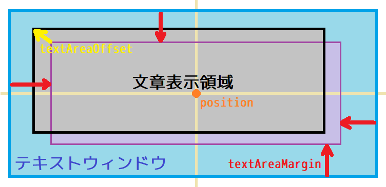
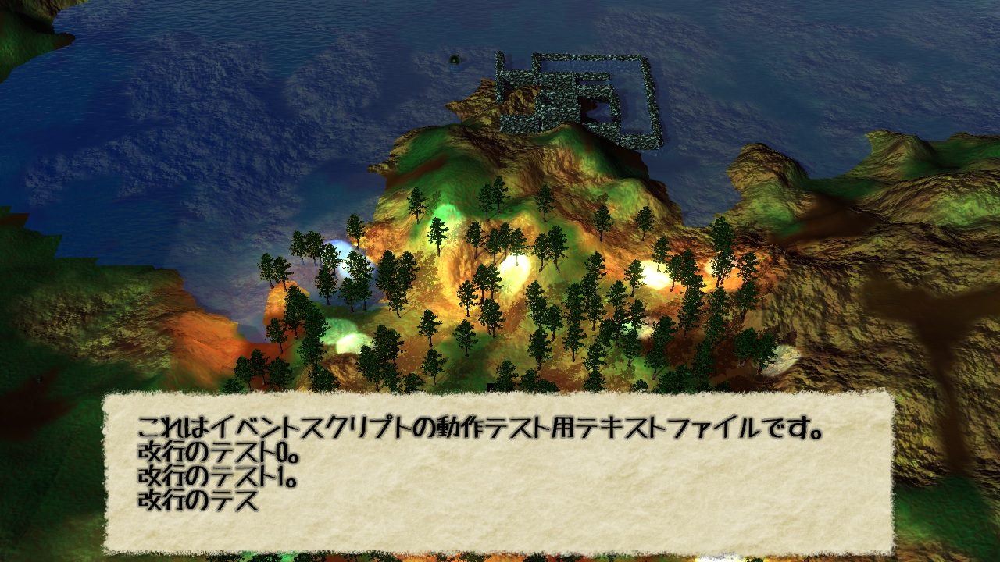

[OpenGL 3D 2019 後期 第10回]

# イベントシーンはぐれ旅

## 目標

* 既存の機能を組み合わせてウィンドウを表示する方法を学ぶ.

## 1. テキストウィンドウ

### 1.1 テキストウィンドウクラスを定義する

コンピューターゲームでは、画面やスピーカーを通じて、様々な情報がプレイヤーに届けられます。そのなかには、文字情報も含まれます。体力や得点のようなものであれば、ゲーム画面に直接表示してもあまり問題はありません。しかし、文章となると、そのままでは読みづらいケースが出てきます。

そこで、文章を見やすくするために、文章の背景に画像を表示することがよくあります。そのような、何らかの背景の上に文字などの情報を表示するやりかたは、「ウィンドウ」と呼ばれます。今回は、文章を表示するための「テキストウィンドウ」を作っていきます。

文章を表示するとき、多くのゲームでは、一度にすべての文字を表示するのではなく、１文字ずつ表示することがよく行われます。これは、人間の発話をイメージさせるために使われています。作成するテキストウィンドウには、この機能も組み込むことにします。

それでは、テキストウィンドウを作成していきましょう。Srcフォルダに「TextWindow.h」というファイルを作成してください。作成したファイルを開き、次のプログラムを追加してください。

```c++
/**
* @file TextWindow.h
*/
#ifndef TEXTWINDOW_H_INCLUDED
#define TEXTWINDOW_H_INCLUDED
#include "Sprite.h"
#include "Font.h"
#include <string>

/**
* テキスト表示用ウィンドウ.
*
* 指定されたテキストを表示する.
*/
class TextWindow
{
public:
  TextWindow() = default;
  ~TextWindow() = default;

  bool Init(const char* imagePath, const glm::vec2& position,
    const glm::vec2& textAreaMargin, const glm::vec2& textAreaOffset);
  void ProcessInput();
  void Update(float deltaTime);
  void Draw();

  void Open(const wchar_t*);
  void SetText(const wchar_t*);
  void Close();
  bool IsFinished() const;

private:
  glm::vec2 position = glm::vec3(0); // ウィンドウの位置.
  glm::vec2 textAreaMargin = glm::vec2(8); // ウィンドウと文字表示領域の間隔.
  glm::vec2 textAreaOffset = glm::vec2(0); // 文字表示領域の位置ずらし量.

  std::wstring text; // 表示する文章.
  int outputCount = 0; // 出力済みの文字数.
  bool isOpen = false; // ウィンドウが開いていたらtrue.
  float interval = 0.1f; // 文字の表示間隔(秒).
  float outputTimer = 0; // 文字表示タイマー(秒).

  FontRenderer fontRenderer;
  SpriteRenderer spriteRenderer;
  Sprite sprBackground;
};

#endif // TEXTWINDOW_H_INCLUDED
```

「TextWindow(てきすと・うぃんどう)」クラスは、名前のとおりテキストウィンドウを表示するためのクラスです。背景の表示にはスプライトクラスを、文章の表示にはフォントクラスを使います。

テキストウィンドウの大きさは、背景となるテクスチャ画像の大きさと同じになります。メンバ変数`position`(ぽじしょん)は、画面におけるウィンドウの中心座標の位置です。`textAreaMargin`(てきすと・えりあ・まーじん)、`textAreaOffset`(てきすと・えりあ・おふせっと)は、ウィンドウ内の文章を表示する領域の大きさと位置を決めます。

<div style="text-align: center;width: 100%;">

<div style="white-space: pre;">[メンバ変数と文章表示領域の関係]</div>
</div>

### 1.2 TextWindow::Init関数を定義する

ここからは、テキストウィンドウクラスのメンバ関数を定義していきます。まずは初期化関数から始めましょう。Srcフォルダに「TextWindow.cpp」という名前のファイルを追加してください。追加したファイルを開き、次のプログラムを追加してください。

```c++
/**
* @file TextWindow.cpp
*/
#include "TextWindow.h"
#include "GLFWEW.h"
#include <iostream>

/**
* テキストウィンドウを初期化する.
*
* @param imagePath      ウィンドウの画像ファイル名.
* @param position       ウィンドウの表示位置(ドット).
* @param textAreaMargin ウィンドウサイズとテキスト表示領域の間隔(ドット).
* @param textAreaOffset テキスト表示領域の位置をずらす値(ドット).
*
* @retval true  初期化成功.
* @retval false 初期化失敗.
*/
bool TextWindow::Init(const char* imagePath, const glm::vec2& position,
  const glm::vec2& textAreaMargin, const glm::vec2& textAreaOffset)
{
  this->position = position;
  this->textAreaOffset = textAreaOffset;
  this->textAreaMargin = textAreaMargin;

  if (!spriteRenderer.Init(10, "Res/Sprite.vert", "Res/Sprite.frag")) {
    std::cerr << "[エラー]" << __func__ << ": テキストウィンドウの初期化に失敗.\n";
    return false;
  }
  sprBackground = Sprite(Texture::Image2D::Create(imagePath));

  if (!fontRenderer.Init(2000)) {
    std::cerr << "[エラー]" << __func__ << ": テキストウィンドウの初期化に失敗.\n";
    return false;
  }
  if (!fontRenderer.LoadFromFile("Res/font.fnt")) {
    std::cerr << "[エラー]" << __func__ << ": テキストウィンドウの初期化に失敗.\n";
    return false;
  }
  return true;
}
```

`TextWindow::Init`(てきすとうぃんどう・いにっと)関数では、まず引数をメンバ変数にコピーします。次に、スプライトとフォントを初期化します。

### 1.3 Font::XAdvance関数を追加する

長い文章は、ウィンドウの幅に収まらないことがあります。ウィンドウ幅をこえたら改行するほうがよいでしょう。しかし、文章の幅が分からないと、改行するべき位置が分かりません。そこで、フォント描画クラスに文字の幅を取得する関数を追加することにします。

関数名は、フォントファイルの横幅パラメーターの名前を取って、`XAdvance`(えっくす・あどばんす)とします。それでは、Font.hを開き、FontRendererクラスの定義に次のプログラムを追加してください。

```diff
   void Draw(const glm::vec2&) const;
   float LineHeight() const;
+  float XAdvance(wchar_t c) const;

   // フォント色の設定と取得.
   void Color(const glm::vec4& c) { color = c; }
   const glm::vec4& Color() const { return color; }

 private:
   SpriteRenderer spriteRenderer;  ///< 描画に使用するスプライトレンダラー.
```

なお、フォントの色の設定は、以前の課題として作っているので、上記のプログラムとは違っていると思います。違っていても特に気にせずに進めてください。

続いてFont.cppを開き、FontRenderer::LineHeight関数の定義の下に、次のプログラムを追加してください。

```diff
 float FontRenderer::LineHeight() const
 {
   return lineHeight;
 }
+
+/**
+* 文字の横幅を取得する.
+*
+* @param c 横幅を調べる文字.
+*
+* @return 文字cの横幅.
+*/
+float FontRenderer::XAdvance(wchar_t c) const
+{
+  if (c < 0 || c >= characterInfoList.size()) {
+    return 0;
+  }
+  return characterInfoList[c].xadvance;
+}
```

これで、文字の幅を調べられるようになりました。

### 1.4 TextWindow::Update関数を定義する

TextWindow.cppに戻り、表示状態を更新する`TextWindow::Update`(てきすとうぃんどう・あっぷでーと)関数を定義します。この関数は以下の手順で処理を行います。

1. ウィンドウが開いているかの確認.
2. 背景画像の更新.
3. 表示済み判定.
4. 表示する文字数の更新.
5. 文章を行単位に分ける.
6. 文章の表示位置を計算.
7. 表示する行の範囲を決定.
8. 文章をフォント・レンダラーに設定.

処理するべきものが多く、ちょっと長い関数になりますので、雛形から書いていきましょう。`TextWindow::Init`関数の定義の下に、次のプログラムを追加してください。

```diff
     std::cerr << "[エラー]" << __func__ << ": テキストウィンドウの初期化に失敗.\n";
     return false;
   }
   return true;
 }
+
+/**
+* テキストウィンドウの状態を更新する.
+*
+* @param deltaTime  前回の更新からの経過時間(秒).
+*/
+void TextWindow::Update(float deltaTime)
+{
+}
```

それでは関数の内容を書いていきます。まずはウィンドウが開いているか確認します。開いていない場合は更新しません。`TextWindow::Upadte`関数の中に、次のプログラムを追加してください。

```diff
 void TextWindow::Update(float deltaTime)
 {
+  // ウィンドウが閉じていたら更新しない.
+  if (!isOpen) {
+    return;
+  }
 }
```

次に、背景を更新します。ウィンドウが開いてるかの判定の下に、次のプログラムを追加してください。

```diff
   // ウィンドウが閉じていたら更新しない.
   if (!isOpen) {
     return;
   }
+
+  // 背景画像の更新.
+  sprBackground.Position(glm::vec3(position, 0));
+  spriteRenderer.BeginUpdate();
+  spriteRenderer.AddVertices(sprBackground);
+  spriteRenderer.EndUpdate();
 }
```

に、フォントの更新が必要かどうかを判定します。背景画像を更新するプログラムの下に、次のプログラムを追加してください。

```diff
   spriteRenderer.AddVertices(sprBackground);
   spriteRenderer.EndUpdate();
+
+  // すべての文字が表示済み(outputCountがテキスト文字数以上)なら
+  // フォントを更新する必要はない.
+  if (outputCount >= static_cast<int>(text.size())) {
+    return;
+  }
 }
```

フォントを更新する必要がありそうなので、表示する文字数を更新します。フォントの更新を判定するプログラムの下に、次のプログラムを追加してください。

```diff
   if (outputCount >= static_cast<int>(text.size())) {
     return;
   }
+
+  // 文字表示間隔が0より大きいなら、1文字ずつ表示する.
+  // 0以下なら一気に全部を表示する.
+  if (interval > 0) {
+    outputTimer += deltaTime;
+    const int n = static_cast<int>(outputTimer / interval);
+    // 表示する文字数が変化しないなら更新不要.
+    if (n == 0) {
+      return;
+    }
+    outputCount += n;
+    outputTimer -= static_cast<float>(n) * interval;
+  } else {
+    outputCount = text.size();
+  }
 }
```

文字数を更新したら、その文字数までの文章を行単位で分けていきます。横の表示範囲を超えたら改行しなければならないので、まずは文章表示範囲を計算しましょう。文字数を更新するプログラムの下に、次のプログラムを追加してください。

```diff
   } else {
     outputCount = text.size();
   }
+
+  // 文章表示領域のサイズを計算.
+  const Texture::Image2DPtr tex = sprBackground.Texture();
+  const glm::vec2 windowSize = glm::vec2(tex->Width(), tex->Height());
+  const glm::vec2 textAreaSize = windowSize - textAreaMargin * 2.0f;
 }
```

次に、行単位に分けます。for文を使って、行ごとにvectorクラスの変数に格納していきます。文章表示範囲を研鑽するプログラムの下に、次のプログラムを追加してください。

```diff
   const glm::vec2 windowSize = glm::vec2(tex->Width(), tex->Height());
   const glm::vec2 textAreaSize = windowSize - textAreaMargin * 2.0f;
+
+  // 現在までに出力するべき文字を行単位で取得.
+  std::vector<std::wstring> rowList;
+  float lineWidth = 0; // 行の横幅.
+  int outputOffset = 0; // 処理済みの文字数.
+  for (int i = 0; i < outputCount; ++i) {
+    lineWidth += fontRenderer.XAdvance(text[i]);
+    // 改行文字か、行の幅が文章表示領域の幅を超えたら1行表示して改行.
+    if (text[i] == L'\n' || lineWidth > textAreaSize.x) {
+      rowList.push_back(text.substr(outputOffset, i - outputOffset));
+      outputOffset = i;
+      lineWidth = 0;
+    }
+  }
+  // 表示すべき文字が残っていたら、それを追加.
+  if (outputOffset < outputCount) {
+    rowList.push_back(text.substr(outputOffset, outputCount - outputOffset));
+  }
 }
```

改行が行われるのは、次の文字が改行文字のとき、または、次の文字を追加すると、行の幅が文章表示領域をこえるとき、です。改行が必要になったら、その手前までの文字を１行として`rowList`(ろー・りすと)変数に追加します。

また、for文が終了した時点では、表示すべき文字が残っていることがあります。その場合、それらも`rowList`に追加します。

次に、文章の表示位置を計算します。表示開始位置は、文章表示領域の左上です。文章を行ごとに分けるプログラムの下に、次のプログラムを追加してください。

```diff
   if (outputOffset < outputCount) {
     rowList.push_back(text.substr(outputOffset, outputCount - outputOffset));
   }
+
+  // 最初に表示する行の位置(offset)を計算.
+  glm::vec2 offset = textAreaSize * glm::vec2(-0.5f, 0.5f);
+  offset += textAreaOffset;
+  offset.y -= fontRenderer.LineHeight();
+  offset += position;
 }
```

行の表示位置が分かったら、次は何行目から表示するかを決めます. 行の表示位置を計算するプログラムの下に、次のプログラムを追加してください。

```diff
   offset += textAreaOffset;
   offset.y -= fontRenderer.LineHeight();
   offset += position;
+
+  // 表示開始行を決める.
+  const int maxLines = static_cast<int>(textAreaSize.y / fontRenderer.LineHeight());
+  int startLine = static_cast<int>(rowList.size()) - maxLines;
+  if (startLine < 0) {
+    startLine = 0;
+  }
 }
```

表示可能な行数は、「文章表示領域の高さ÷行の高さ」で計算できます。行の高さはFontRenderer::LineHeight関数で取得できます。文章が進むにつれて、下の方の行を表示したいので、`rowList`に格納されている行数から表示可能な行数を引いた値が、最初に表示する行の番号になります。

ただ、`rowList`に格納されている行数が、表示可能な行数未満だった場合、行番号がマイナスになってしまいます。そのような行は表示できないため、表示開始行がマイナスのときは強制的に0を設定しておきます。

表示位置を表示開始行が分かったので、ようやくフォントに文章を追加できます。表示開始行を決めるプログラムの下に、次のプログラムを追加してください。その際、以下のプログラムの「文字色を黒にする」というコメントの書かれた行は、みなさん自身のフォント色変更関数で置き換えてください。

```diff
   if (startLine < 0) {
     startLine = 0;
   }
+
+  // 文章をフォント・レンダラーに設定.
+  fontRenderer.BeginUpdate();
+  fontRenderer.Color(glm::vec4(0, 0, 0, 1)); // 文字色を黒にする.
+  for (int i = startLine; i < static_cast<int>(rowList.size()); ++i) {
+    fontRenderer.AddString(glm::vec3(offset, 0), rowList[i].c_str());
+    offset.y -= fontRenderer.LineHeight();
+  }
+  fontRenderer.EndUpdate();
 }
```

これで、テキストウィンドウの更新処理は完成です。残りのメンバ関数は短いものばかりですから、安心してください。

### 1.5 TextWindow::Draw関数を定義する

テキストウィンドウを描画する`TextWindow::Draw`(てきすとうぃんどう・どろー)関数を定義します。まずウィンドウが開いているかどうかを調べ、開いていたらスプライト、フォントの順で描画していきます。TextWindow::Update関数の定義の下に、次のプログラムを追加してください。

```diff
     offset.y -= fontRenderer.LineHeight();
   }
   fontRenderer.EndUpdate();
 }
+
+/**
+* テキストウィンドウを描画する.
+*/
+void TextWindow::Draw()
+{
+  if (!isOpen) {
+    return;
+  }
+  const GLFWEW::Window& window = GLFWEW::Window::Instance();
+  const glm::vec2 screenSize(window.Width(), window.Height());
+  spriteRenderer.Draw(screenSize);
+  fontRenderer.Draw(screenSize);
+}
```

### 1.6 TextWindow::Open関数を定義する

次に、テキストウィンドウを開く`TextWindow::Open`(てきすとうぃんどう・おーぷん)関数を定義します。TextWindow::Draw関数の定義の下に、次のプログラムを追加してください。

```diff
   spriteRenderer.Draw(screenSize);
   fontRenderer.Draw(screenSize);
 }
+
+/**
+* テキストウィンドウを開く.
+*
+* @param str ウィンドウに表示する文章.
+*/
+void TextWindow::Open(const wchar_t* str)
+{
+  SetText(str);
+  isOpen = true;
+}
```

主要な処理は次に定義するSetText関数で行っているので、この関数はとても短いくなっています(もっともSetText関数も短いのですが)。

### 1.7 TextWindow::SetText関数を定義する

続いて、文章を設定・変更する`TextWindow::SetText`(てきすとうぃんどう・せっと・てきすと)関数を定義します。TextWindow::Open関数の定義の下に、次のプログラムを追加してください。

```diff
   SetText(str);
   isOpen = true;
 }
+
+/**
+* テキストを変更する.
+*
+* @param str ウィンドウに表示する文章.
+*/
+void TextWindow::SetText(const wchar_t* str)
+{
+  text = str;
+  outputCount = 0;
+  outputTimer = 0;
+}
```

この関数は、`text`メンバ関数に引数で受け取った文章を設定し、`outputCount`、`outputTimer`を0にリセットします。これによって、次回Update関数が実行されたとき、表示内容が更新されることになります。

### 1.8 TextWindow::Close関数を定義する

次に、Open関数と対になる`TextWindow::Close`(てきすとうぃんどう・くろーず)関数を定義します。TextWindow::SetText関数の定義の下に、次のプログラムを追加してください。

```diff
   outputCount = 0;
   outputTimer = 0;
 }
+
+/**
+* テキストウィンドウを閉じる.
+*/
+void TextWindow::Close()
+{
+  isOpen = false;
+}
```

ウィンドウを閉じるために必要なのは、`isOpen`メンバ関数をfalseに設定することだけです。

### 1.9 TextWindow::IsFinished関数を定義する

最後に定義するメンバ関数は、文章の表示完了を調べる`TextWindow::IsFinished`(てきすとうぃんどう・いず・ふぃにっしゅど)関数です。TextWindow::Close関数の定義の下に、次のプログラムを追加してください。

```diff
   isOpen = false;
 }
+
+/**
+* 文章の表示が完了したか調べる.
+*
+* @retval true  すべて文字を表示した.
+* @retval false まだ表示していない文字がある.
+*/
+bool TextWindow::IsFinished() const
+{
+  return isOpen && (outputCount >= static_cast<int>(text.size()));
+}
```

この関数は、「ウィンドウが開いていて、出力した文字数が文章の文字数以上」だった場合にtrueを返す、つまり、表示が完了したと判断します。

これでテキストウィンドウは完成です。

### 1.10 テキストウィンドウを表示する

作成したテキストウィンドウがうまく動作するか、実際に使ってみましょう。

その前に、テキストウィンドウ用の画像ファイルを用意しなければなりません。以下のURLから「TextWindow.tga」というファイルをダウンロードして、Resフォルダにコピーしてください。

`https://github.com/tn-mai/OpenGL3D2019_2nd/blob/master/Res/TextWindow.tga`

コピーを終えたら、MainGameScene.hを開き、次のようにヘッダーファイルのインクルードを追加してください。

```diff
 #include "Light.h"
 #include "FrameBufferObject.h"
 #include "Particle.h"
+#include "TextWindow.h"
 #include <random>
 #include <vector>

 /**
 * メインゲーム画面.
```

次に、MainGameSceneクラスの定義に、次のプログラムを追加してください。

```diff
   LightBuffer lightBuffer;
   ActorList lights;

   ParticleSystem particleSystem;
+  TextWindow textWindow;

   FrameBufferObjectPtr fboMain;
   FrameBufferObjectPtr fboDepthOfField;
```

続いて、MainGameScene.cppを開き、MainGameScene::Initialize関数に、次のプログラムを追加してください。

```diff
   fontRenderer.Init(1000);
   fontRenderer.LoadFromFile("Res/font.fnt");
+
+  textWindow.Init("Res/TextWindow.tga",
+    glm::vec2(0, -248), glm::vec2(48, 32), glm::vec2(0));
+  textWindow.Open(
+    L"テキストウィンドウの実験\nこれは改行テスト。\n３行目。\n４\n５\n６");

   meshBuffer.Init(1'000'000 * sizeof(Mesh::Vertex), 3'000'000 * sizeof(GLushort));
   meshBuffer.LoadMesh("Res/red_pine_tree.gltf");
```

さらに、MainGameScene::Update関数の末尾に、次のプログラムを追加してください。

```diff
     fontRenderer.AddString(glm::vec2(-32 * 4, 0), L"目的を達成した！");
   }
   fontRenderer.EndUpdate();

+  textWindow.Update(deltaTime);
 }

 /**
 * シーンを描画する.
```

最後に、MainGameScene::Render関数のブルームエフェクトを描画するプログラムの下に、次のプログラムを追加してください。

```diff
     simpleMesh->materials[0].texture[0] = fboBloom[0][0]->GetColorTexture();
     Mesh::Draw(simpleMesh, glm::mat4(1));

+    textWindow.Draw();
     fontRenderer.Draw(screenSize);
   }

 #if 0
   // デバッグ用にブルーム用フレームバッファを表示.
```

これで準備完了です。プログラムが書けたらビルドして実行してください。テキストウィンドウが表示され、文章が1文字ずつ表示されていったら成功です。なお、閉じるテストは入れていないので、表示されっぱなしになりますが、当面はそれで正常です。

<div style="page-break-after: always"></div>

## 2. イベントシーン

### 2.1 スクリプト・ファイルとスクリプト・エンジン

ゲームではさまざまな演出が行われます。しかし、現代の複雑化したゲームにおいて、演出を変更するたびにプログラムをビルドし直すというのは、効率が悪すぎます。そこで、演出の内容をプログラムとは別のファイルに書いておき、プログラムの実行時にその内容に従って演出を行う、という手法が使われます。このような目的で作られたファイルは「スクリプト・ファイル」と呼ばれます。また、スクリプトの内容に従って演出を行うプログラムのことを「スクリプト・エンジン」といいます。

>［補足］「script(スクリプト)」は「脚本・台本」という意味の英単語です。

ゲーム中の演出は、「イベント」と呼ばれることが多いです。そこで、今回作成するスクリプトも「イベント・スクリプト」と呼ぶことにします。

### 2.2 スクリプト・エンジン・クラスを定義する

スクリプト・エンジンは、スクリプト・ファイルを読み込み、そこに書かれているイベント・スクリプトに従って、イベントを制御します。最初から複雑なエンジンを作るのは難しいので、まずは読み込んだスクリプトをテキストウィンドウに表示する機能から作っていきましょう。

Srcフォルダに「EventScript.h」というファイルを追加してください。追加したファイルを開き、次のプログラムを追加してください。

```c++
/**
* @file EventScript.h
*/
#ifndef EVENTSCRIPT_H_INCLUDED
#define EVENTSCRIPT_H_INCLUDED
#include "TextWindow.h"
#include <string>
#include <vector>

/**
* イベントスクリプト制御クラス.
*/
class EventScriptEngine
{
public:
static EventScriptEngine& Instance();

  bool Init();
  bool RunScript(const char* filename);
  void Update(float deltaTime);
  void Draw();

  bool IsFinished() const;
  
private:
  EventScriptEngine() = default;
  ~EventScriptEngine() = default;
  EventScriptEngine(const EventScriptEngine&) = delete;
  EventScriptEngine& operator=(const EventScriptEngine&) = delete;

  std::string filename;
  std::wstring script;

  bool isInitialized = false; // エンジンが初期化されていればtrue.
  bool isFinished = false; // スクリプトの実行が終了したらtrue.

  TextWindow textWindow;
};

#endif // EVENTSCRIPT_H_INCLUDED
```

`EventScriptEngine`(いべんと・すくりぷと・えんじん)クラスは、GLFWEW::WidnwoクラスやSceneStackクラスと同様に、シングルトンクラスとして作成することにしました。

イベント・スクリプトを書くとき、複数のスクリプトから同じ変数を操作したいことがあります。スクリプト・エンジンはひとつだけ、としたほうが、そのような変数を管理しやすいのです(もっとも、今はまだ、変数を操作したりはしませんけど…)。

### 2.3 EventScriptEngine::Instance関数を定義する

それでは、メンバ関数を定義していきましょう。が、その前に、ファイルを準備して、インクルード文を書いていきます。Srcフォルダに「EventScript.cpp」というファイルを追加してください。追加したファイルを開き、次のプログラムを追加してください。

```c++
/**
* @file EventScript.cpp
*/
#define _CRT_SECURE_NO_WARNINGS
#include "EventScript.h"
#include "GLFWEW.h"
#include <fstream>
#include <sstream>
#include <iostream>
#include <locale.h>
#include <stdlib.h>
```

続いて、最初のメンバ関数を定義します。iostreamヘッダーをインクルードするプログラムの下に、次のプログラムを追加してください。

```diff
 #include <sstream>
 #include <iostream>
+
+/**
+* スクリプトエンジンのシングルトン・インスタンスを取得する.
+*
+* @return スクリプトエンジンのシングルトン・インスタンス.
+*/
+EventScriptEngine& EventScriptEngine::Instance()
+{
+  static EventScriptEngine instance;
+  return instance;
+}
```

`EventScriptEngine::Instance`(いべんと・すくりぷと・えんじん・いんすたんす)関数は、ただスタティック変数の参照を返しているだけです。

### 2.4 EventScriptEngine::Init関数を定義する

次に、スクリプトエンジンを初期化する関数を定義します。この関数は、既に初期化されている場合は何もせず、失敗を返します。まだ初期化されていない場合、効率のために`filename`、`scritp`メンバ変数の容量を予約し、テキストウィンドウを初期増します。EventScriptEngine::Instance関数の定義の下に、次のプログラムを追加してください。

```diff
+
+/**
+* スクリプトエンジンを初期化する.
+*
+* @retval true  初期化成功.
+* @retval false 初期化失敗.
+*/
+bool EventScriptEngine::Init()
+{
+  if (isInitialized) {
+    std::cerr << "[エラー] EventScriptEngineは既に初期化されています.\n";
+    return false;
+  }
+
+  filename.reserve(256);
+  script.reserve(2048);
+  if (!textWindow.Init("Res/TextWindow.tga",
+    glm::vec2(0, -248), glm::vec2(48, 32), glm::vec2(0))) {
+    std::cerr << "[エラー]" << __func__ << ":スクリプトエンジンの初期化に失敗.\n";
+    return false;
+  }
+  isInitialized = true;
+  return true;
+}
```

### 2.5 EventScriptEngine::RunScript関数を定義する

初期化関数の次は、スクリプト・ファイルを読み込んで実行を開始する関数を定義します。さほど長い関数ではありませんが、ファイルの読み込みにこれまでとは違う方法を使っているので、説明のため雛形から作っていくことにします。EventScriptEngine::Init関数の定義の下に、次のプログラムを追加してください。

```diff
   isInitialized = true;
   return true;
 }
+
+/**
+* イベント・スクリプトを実行する.
+*
+* @param filename スクリプト・ファイル名.
+*
+* @retval true  実行に成功.
+* @retval false 実行に失敗.
+*/
+bool EventScriptEngine::RunScript(const char* filename)
+{
+}
```

まず初期化済みかどうかを判定します。初期化されていなければ、スクリプトファイルを読み込んでも正しく処理できないからです。それでは、EventScriptEngine::RunScript関数の中に、次のプログラムを追加してください。

```diff
 bool EventScriptEngine::RunScript(const char* filename)
 {
+  if (!isInitialized) {
+    return false;
+  }
 }
```

次に、スクリプトファイルを読み込みます。これには`std::ifstream`(えすてぃーでぃー・あい・えふ・すとりーむ)クラスと、`std::stringstream`(えすてぃーでぃー・すとりんぐ・すとりーむ)クラスを使います。初期化判定プログラムの下に、次のプログラムを追加してください。

```diff
   if (!isInitialized) {
     return false;
   }
+
+  // スクリプトファイルを読み込み、テキストウィンドウ表示のためにwchar_t型に変換する.
+  std::ifstream ifs(filename);
+  if (!ifs) {
+    std::cerr << "[エラー]" << __func__ << ":スクリプトファイル" << filename <<
+      "を読み込めません.\n";
+    return false;
+  }
+  std::stringstream ss;
+  ss << ifs.rdbuf();
+  std::string tmp = ss.str();
 }
```

ファイルを開くには、std::ifstreamクラスのコンストラクタ引数にファイル名を指定します。結果はopen関数を使うのと同じですが、コンストラクタ引数を使うとプログラムを1行減らせます。

ファイルを開くことに成功したかどうかは、std::ifstreamクラスの変数をif文に指定すればわかります。上記のプログラムでは、条件を反転するために`!`を使っています。これは殆どの場合でis_open関数をつかうのとほぼ同じです。しかし、わずかですがプログラムが短くできます。

今回は、ファイルを読み込む処理に`std::stringstream`クラスを使ってみました。ファイル全体を読み込むには、このクラスの変数を作成し、`std::ifstream`クラスのバッファオブジェクト経由でファイルを読み込ませます。この処理には、`std::cout`や`std::cerr`でも使っている左シフト演算子(`<<`)を使います。

変数`ss`に読み込まれたテキストは、`str`メンバ関数を使って参照することができます。

次に、このテキストを、テキストウィンドウに渡せる形に変換しなければなりません。この変換には`mbstowcs`(えむ・びー・えす・とぅ・だぶりゅー・しー・えす、またはマルチ・バイト・ストリング・トゥ・ワイド・キャラクター・ストリング)という関数を使います。また、変換元の言語を指定するために`setlocale`(せっと・ろけーる)という関数も併用します。

スクリプトファイルを読み込むプログラムの下に、次のプログラムを追加してください。

```diff
   std::stringstream ss;
   ss << ifs.rdbuf();
   std::string tmp = ss.str();
+  setlocale(LC_CTYPE, "ja-JP");
+  const size_t size = mbstowcs(nullptr, tmp.c_str(), 0);
+  script.resize(size);
+  mbstowcs(&script[0], tmp.c_str(), size);
 }
```

C言語には、国によって扱いの異なる表示方法(言語、時刻、通貨など)を制御するための「ロケール」と呼ばれる内部パラメータ存在します。setlocale関数は、このロケールを設定する関数です。

setlocale関数の最初の引数には、ロケールの「カテゴリ」と呼ばれるものを指定します。`LC_CTYPE`(える・しー・しー・たいぷ)は文字変換のためのロケールを設定するカテゴリです。

2つめの引数には、表示する国、あるいは言語を表す「ロケールID」を指定します。日本語の場合`ja-JP`という文字列を指定すればO.K.です。このIDの前半は言語名(japanese)の略称、後半は国(JaPan)に略称になっています。こうなっているのは、公用語が複数ある国に対応するためです。

mbstowcs関数は、std::stringなどに含まれる「マルチバイト文字」を、std::wstringなどで扱える「ワイド文字」に変換する関数です。引数は順に、変換先のバッファ、変換元文字列、変換可能な文字数、となっています。また、2番目の引数だけを指定すると、ワイド文字の文字数が返されます。これによって、必要なバッファの大きさが分かるようになっています。

最後に、いくつかのパラメータを設定し、テキストウィンドウに文字列を表示しましょう。テキストを変換するプログラムの下に、次のプログラムを追加してください。

```diff
   const size_t size = mbstowcs(nullptr, tmp.c_str(), 0);
   script.resize(size + 1);
   mbstowcs(&script[0], tmp.c_str(), size);
+
+  // パラメータを設定.
+  isFinished = false;
+  this->filename = filename;
+
+  // テキストウィンドウにスクリプトを表示.
+  textWindow.Open(script.c_str());
+
+  std::cout << "[INFO]" << __func__ << ":スクリプトファイル" << filename << "を実行.\n";
+  return true;
 }
```

これでスクリプトの読み込みは完成です。

<br>

### 2.6 EventScriptEngine::Update関数を定義する

次は、スクリプトの状態を更新する関数を定義します。EventScriptEngine::RunScript関数の定義の下に、次のプログラムを追加してください。

```diff
   std::cout << "[INFO]" << __func__ << ":スクリプトファイル" << filename << "を実行.\n";
   return true;
 }
+
+/**
+* スクリプトエンジンの状態を更新する.
+*
+* @param deltaTime  前回の更新からの経過時間(秒).
+*/
+void EventScriptEngine::Update(float deltaTime)
+{
+  if (!isInitialized) {
+    return;
+  }
+
+  if (textWindow.IsFinished()) {
+    const GamePad gamepad = GLFWEW::Window::Instance().GetGamePad();
+    if (gamepad.buttonDown & (GamePad::A | GamePad::B | GamePad::START)) {
+      textWindow.Close();
+      isFinished = true;
+    }
+  }
+  textWindow.Update(deltaTime);
+}
```

最初に初期化判定を行い、初期化されていない場合は何もせずに終了します。次に、テキストウィンドウが文章の表示を完了したかどうかを調べ、完了していればキー入力を待ちます。キー入力があれば、テキストウィンドウを閉じて、スクリプト終了を示すために`isFinished`メンバ変数にtrueを設定します。

いずれの場合でも、最後にテキストウィンドウの更新を行っています。ウィンドウを閉じた場合は更新の必要はないのですが、更新しても不都合はないので、プログラムを簡単にするためにここに書いています。

### 2.7 EventScriptEngine::Draw関数を定義する

続いて、イベントスクリプトの描画処理を定義します。EventScriptEngine::Update関数の定義の下に、次のプログラムを追加してください。

```diff
   }
   textWindow.Update(deltaTime);
 }
+
+/**
+* スクリプトエンジンを描画する.
+*/
+void EventScriptEngine::Draw()
+{
+  if (!isInitialized) {
+    return;
+  }
+  textWindow.Draw();
+}
```

現在のところ、初期化判定を行い、テキストウィンドウを描画しているだけです。

### 2.8 EventScriptEngine::IsFinished関数を定義する

最後に、イベントスクリプトの実行が完了したかどうかを調べるメンバ関数を定義します。EventScriptEngine::Draw関数の定義の下に、次のプログラムを追加してください。

```diff
     return;
   }
   textWindow.Draw();
 }
+
+/**
+* スクリプトの実行が完了したか調べる.
+*
+* @retval true  実行完了.
+* @retval false 実行中、またはスクリプトが読み込まれていない.
+*/
+bool EventScriptEngine::IsFinished() const
+{
+  return isFinished;
+}
```

この関数は、`isFinished`メンバ変数の値を返すだけです。現在のところ、この関数に初期化判定は不要です。初期化が完了していない場合、`isFinished`メンバ変数が変更されることはありません。その結果、常に初期値のfalseが返されるからです。

これでスクリプト・エンジンは完成です。

### 2.9 スクリプト・エンジンを組み込む

作成したスクリプトエンジンを、プログラムに組み込みます。main関数に、次のプログラムを追加してください。

```diff
   SceneStack& sceneStack = SceneStack::Instance();
   sceneStack.Push(std::make_shared<TitleScene>());

+  EventScriptEngine& scriptEngine = EventScriptEngine::Instance();
+  scriptEngine.Init();

   while (!window.ShouldClose()) {
     const float deltaTime = static_cast<float>(window.DeltaTime());
     window.UpdateTimer();

     // ESCキーが押されたら終了ウィンドウを表示.
     if (window.IsKeyPressed(GLFW_KEY_ESCAPE)) {
       if (MessageBox(nullptr, L"ゲームを終了しますか？", L"終了", MB_OKCANCEL) == IDOK) {
         break;
       }
     }

     // スケルタル・アニメーション用データの作成準備.
     Mesh::SkeletalAnimation::ResetUniformData();

     sceneStack.Update(deltaTime);
+    scriptEngine.Update(deltaTime);

     // スケルタル・アニメーション用データをGPUメモリに転送.
     Mesh::SkeletalAnimation::UploadUniformData();

     // 音声再生プログラムを更新する.
     audioEngine.Update();

     // バックバッファを消去する.
     glClearColor(0.8f, 0.2f, 0.1f, 1.0f);
     glClear(GL_COLOR_BUFFER_BIT | GL_DEPTH_BUFFER_BIT);

     // GLコンテキストのパラメータを設定.
     glEnable(GL_CULL_FACE);
     glEnable(GL_DEPTH_TEST);

     sceneStack.Render();
+    scriptEngine.Draw();
     window.SwapBuffers();
   }
```

これでスクリプトエンジンの組み込みは完了です。

<div style="page-break-after: always"></div>

## 3. イベントシーン

### 3.1 イベントシーンクラスを定義する

この章では、イベントスクリプトを実行するためのシーンを作成します。Srcフォルダに「EventScene.h」というファイルを作成してください。作成したファイルを開き、次のプログラムを追加してください。

```c++
/**
* @file EventScene.h
*/
#ifndef EVENTSCENE_H_INCLUDED
#define EVENTSCENE_H_INCLUDED
#include "Scene.h"
#include "TextWindow.h"
#include <string>

/**
* イベントシーン.
*/
class EventScene : public Scene
{
public:
  explicit EventScene(const char* filename);
  ~EventScene() = default;

  virtual bool Initialize() override;
  virtual void ProcessInput() override {}
  virtual void Update(float) override;
  virtual void Render() override {}
  virtual void Finalize() override {}

private:
  std::string filename;
};

#endif // EVENTSCENE_H_INCLUDED
```

### 3.2 EventSceneコンストラクタを定義する

次に、Srcフォルダに「EventScene.cpp」というファイルを作成してください。作成したファイルを開き、次のプログラムを追加してください。

```c++
/**
* @file EventScene.cpp
*/
#include "EventScene.h"
#include "EventScript.h"
```

イベントシーンはイベントスクリプトを実行するだけのシーンなので、インクルードするのは自分自身のヘッダーとイベントスクリプトのヘッダーだけです。

それでは、コンストラクタを定義しましょう。EventScript.hのインクルード文の下に、次のプログラムを追加してください。

```diff
 #include "EventScene.h"
 #include "EventScript.h"
+
+/**
+* コンストラクタ.
+*
+* @param filename スクリプトファイル名.
+*/
+EventScene::EventScene(const char* filename) :
+  Scene("EventScene"), filename(filename)
+{
+}
```

### 3.3 EventScene::Initialize関数を定義する

続いて、イベントシーンを初期化する関数を定義します。EventSceneコンストラクタの定義の下に、次のプログラムを追加してください。

```diff
+
+/**
+* イベントシーンを初期化する.
+*/
+bool EventScene::Initialize()
+{
+  return EventScriptEngine::Instance().RunScript(filename.c_str());
+}
```

この関数は、スクリプトエンジンのインスタンスを取得し、RunScript関数を使ってスクリプトの実行を開始します。

### 3.4 EventScene::Update関数を定義する

最後に、イベントシーンを更新する関数を定義しましょう。イベントシーンは他のシーンで、シーンスタックにプッシュされて起動することとします。そこで、スクリプトが終了したら、ポップして自分自身を削除させます。それでは、EventScene::Initialize関数の定義の下に、次のプログラムを追加してください。

```diff
   return EventScriptEngine::Instance().RunScript(filename.c_str());
 }
+
+/**
+* イベントシーンの状態を更新する.
+*
+* @param deltaTime  前回の更新からの経過時間(秒).
+*/
+void EventScene::Update(float deltaTime)
+{
+  if (EventScriptEngine::Instance().IsFinished()) {
+    SceneStack::Instance().Pop();
+  }
+}
```

これでイベントシーンは完成です。

### 3.5 イベントスクリプトを書く

イベントシーンのテスト用に、スクリプトファイルを作る必要があります。Resフォルダに「OpeningScript.txt」というファイルを作成し、数行の文章を書いて保存してください。

### 3.6 イベントスクリプトを実行する

それでは、作成したスクリプトファイルを実行させましょう。MainGameScene.cppを開き、次のプログラムを追加してください。

```diff
 * @file MainGameScene.cpp
 */
 #include "GLFWEW.h"
 #include "MainGameScene.h"
 #include "StatusScene.h"
+#include "EventScene.h"
 #include "GameOverScene.h"
 #include "SkeletalMeshActor.h"
```

続いて、MainGameScene::Initialize関数の末尾に、次のプログラムを追加してください。

```diff
       trees.Add(p);
     }
   }
+
+  // オープニングスクリプトを実行.
+  SceneStack::Instance().Push(std::make_shared<EventScene>("Res/OpeningScript.txt"));

   return true;
 }

 /**
 * プレイヤーの入力を処理する.
```

スクリプトファイル名を間違えないように注意してください。プログラムが書けたらビルドして実行してください。メインゲーム画面に入った直後、テキストウィンドウが開き、OpeningScript.txtに書かれた内容が表示されたら成功です。文章がすべて表示されたあと、Enterキーを押してメインゲーム画面に戻ることも確認してください。

<div style="text-align: center;width: 100%;">

<div style="white-space: pre;">[スクリプトが実行されたところ]</div>
</div>
