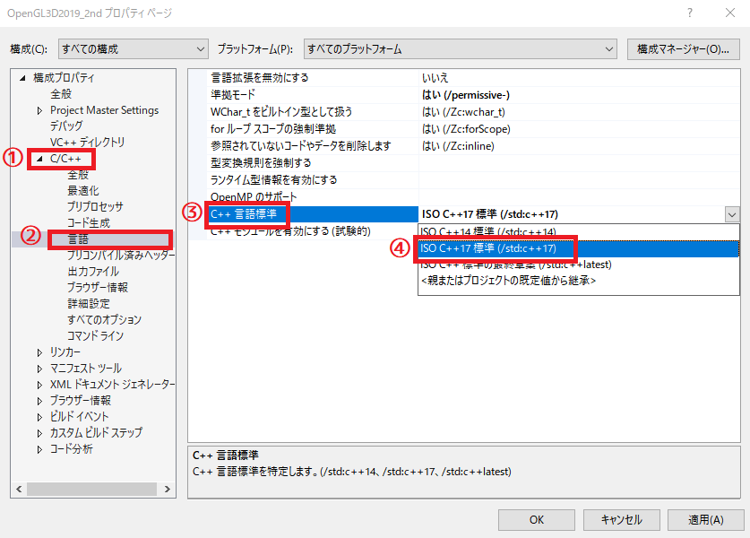

[OpenGL 3D 2019 後期 第11回]

# おお○○！ ゆうしゃＸＸの<br>ちをひくものよ！　そなたの<br>くるのをまっておったぞ！

## 目標

* テキストファイルをスクリプトに変換する方法を学習する.
* スクリプトとゲームを連携させる方法を学習する.

## 1. スクリプト言語

### 1.1 スクリプト言語≒プログラミング言語

スクリプトは「スクリプト言語」で書かれます。「スクリプト言語」というのは、簡単に言うと、「特定の処理を自動化することに特化したプログラミング言語」です。プログラミング言語の分類上の呼び方なわけですね。今回作成するスクリプト言語の場合は、「自作ゲーム内のイベント制御に特化したプログラミング言語」ということになるでしょうか。

>「補足」今回作成するスクリプト言語は「チューリング完全(詳細はインターネットで調べてください)」を目指しません。その点では、狭義の「プログラミング言語」とは呼べないでしょう。しかし、多くのプログラミング言語の目的である「一連の命令によって、様々な種類の出力を生成する」という点は満たしています。広義のプログラミング言語のひとつと考えても差し支えないでしょう。

### 1.2 作成する命令を決める

スクリプト言語もプログラミング言語のひとつである以上、コンピューターを動かすための一連の命令が必要です。作成するのはゲームイベント用のスクリプト言語ですから、どのようなイベントを作るかによって、必要となる命令が決まります。

まずは、「条件によって表示するメッセージが変わる」というイベントを作れるようにしようと思います。

このイベントを作成するには、まず「条件によって処理を切り替える」ことができなくてはなりません。C++における`if`に当たる命令ですね。それから、「メッセージを表示する」という命令も必要です。

また、「条件」については、通常のプログラムと同様に「変数と変数、あるいは変数と定数を比較する」という方法で行うのが簡単でしょう。ということは、当然「変数」を用意しなければなりませんね。そして、変数に値を設定する機能がなくてはなりません。

これらの機能を簡単そうな順番でまとめると、以下のようになります。

* メッセージの表示
* 変数の設定
* 条件比較

まずは、この３つの「命令」を作っていくことにします。
もちろん、思い通りのイベントを作るには、もっとたくさんの命令が必要になるでしょう。しかし、いきなり多くの機能を詰め込むと、なかなか完成しません。ですから、最小限の命令から作っていきます。

それぞれの命令には、対象となるデータや変数を指定できなくてはなりません。そこで、C++言語の関数と同様に、命令ごとに決められた数の引数を渡す形にしましょう。命令と引数の区切り記号は、括弧やカンマなども考えられますが、とりあえず「空白(スペースやタブのこと)」でいいでしょう。というのは、空白はscanf系で簡単に処理できるため、プログラムが書きやすくなると考えたからです。すると、以下の形式になるでしょうか。

`命令(空白)引数１(空白)引数２(空白)引数３`

もちろん、引数の数は命令によって違うでしょう。命令によっては引数を持たなかったり、１個か２個だけだったりすると思います。

### 1.3 命令の名前

スクリプトの中で命令を使うには名前が必要です。命令の名前は日本語でも構いませんが、書きやすさを考慮すると英語のほうが良いと思います。「条件比較」を英語で書く場合は「if(いふ)」で済みますが。日本語だと「もし～ならば」と書かねばなりません。仮に「もし」とだけ書くとしたら以下のようになるでしょう。

`if a < 10`

`もし a < 10`

さらに、今後「else」を導入するとしたら、日本語では「そうでなければ」のように書かなくてはなりません。こうなると、日本語のほうは、意図が伝わりやすいとは言えないように見えます。そういうわけで、命令の名前は英語にします。また、「変数の設定」するという機能は、内部的には命令に違いありません。しかし、書くときは単なる代入式にしたほうが読みやすいでしょう。

ところで、C++言語のif命令では、実行される範囲は「{」と「}」で囲っていました。今回は「if」命令自体を始点として、終端を「endif(えんど・いふ)」で表すことにします。 各命令の書式も含めて、今回作成するスクリプトの機能と表記をまとめると、以下のようになるでしょう。

|機能|スクリプトの表記|
|---|---|
|メッセージ表示|print 表示する文章|
|変数の設定|代入先の変数 = 代入する変数・数値|
|条件分岐|if 左辺の変数・数値 関係演算子 右辺の変数・数値|
|条件分岐の終端|endif|

### 1.4 1行に1命令

C++言語では行の区切りに「；(せみころん)」を使っていました。しかし、今回作成するスクリプトでは、1行にひとつの命令だけ書くことにします。

1行に1命令とすることで、`std::getline`(えすてぃーでぃー・げっと・らいん)関数と`sscanf`(えす・すきゃん・えふ)関数を組み合わせて、簡単に読み込めるようになるからです。

### 1.5 命令と引数を定義する

スクリプト命令は、`Instruction`(いんすとらくしょん)という名前の構造体として表現することにします。`Instruction`は「命令、指示」という意味の英単語です。命令の種類は`InstructionType`(いんすとらくしょん・たいぷ)という列挙型、引数は`Argument`(あーぎゅめんと)型としてusing宣言しておきます。それでは、EventScript.hを開き、EventScriptEngineクラスの定義に、次のプログラムを追加してください。

```diff
   EventScriptEngine(const EventScriptEngine&) = delete;
   EventScriptEngine& operator=(const EventScriptEngine&) = delete;
+
+  // 命令の種類.
+  enum class InstructionType {
+    nop, // 何もしないダミー命令.
+    print, // 文章を表示.
+    assign, // 変数に値を設定.
+    beginif, // if命令の開始.
+    endif, // if命令の終端.
+  };
+
+  // 引数の型.
+  using Argument = std::wstring;
+
+  // スクリプト命令型.
+  struct Instruction {
+    InstructionType type = InstructionType::nop;
+    Argument arguments[4];
+  };
   std::string filename;
-  std::wstring script;
+  std::vector<Instruction> script;
+  size_t programCounter = 0; // 次に実行する命令の位置.

   bool isInitialized = false; // エンジンが初期化されていればtrue.
   bool isFinished = false; // スクリプトの実行が終了したらtrue.
```

最初の命令`nop`は`No OPeration`(のー・おぺれーしょん)の略で、「何もしない」ことを意味します。このプログラムでは、命令の初期値として使うために定義しました。また、引数はとりあえず4個までとします。

### 1.6 print命令を読み込む

次に、print命令を読み込むプログラムを書いていきます。内容は、`std::getline`関数でスクリプトを1行ずつ読み込み、次いで`sscanf`で読み込んだ行を解析する、というものになります。それでは、EventScript.cppを開き、EventScriptEngine::RunScript関数に、次のプログラムを追加してください。

```diff
     std::cerr << "[エラー]" << __func__ << ":スクリプトファイル" << filename << "を読み込めません.\n";
     return false;
   }
-  std::stringstream ss;
-  ss << ifs.rdbuf();
-  std::string tmp = ss.str();
   setlocale(LC_CTYPE, "ja-JP");
-  const size_t size = mbstowcs(nullptr, tmp.c_str(), 0);
-  script.resize(size + 1);
-  mbstowcs(&script[0], tmp.c_str(), size);
+
+  script.clear(); // 以前のスクリプトを消去.
+  size_t lineCount = 0; // 読み込んだ行数.
+  std::string line;
+  char buf[1000];
+  while (std::getline(ifs, line)) {
+    // 先頭の空白を除去する.
+    line.erase(0, line.find_first_not_of(" \t\n"));
+    ++lineCount;
+
+    Instruction inst;
+    // print命令を読み込む.
+    int n = sscanf(line.c_str(), "print %999[^\n]", buf);
+    if (n >= 1) {
+      const size_t size = mbstowcs(nullptr, buf, 0);
+      std::wstring text(size, L'\0');
+      mbstowcs(&text[0], buf, size);
+      inst.type = InstructionType::print;
+      inst.arguments[0] = text;
+      script.push_back(inst);
+      continue;
+    }
+  }
+
+  programCounter = 0;
   this->filename = filename;
   isFinished = false;
-  textWindow.Open(script.c_str());

   std::cout << "[INFO]" << __func__ << ":スクリプトファイル" << filename << "を実行.\n";
   return true;
}
```

行の読み込みは`std::getline`関数で行います。この関数はそれ以上読み込めなくなるとfalseを返すので、while文を使うことですべての行を処理することが可能となります。

また、行の最初には余分な空白が含まれているかもしれません。余分な空白は解析の邪魔になりますから、除去しておきます。空白を除去するには、`erase`(いれーす)関数と`find_first_not_of`(ふぁいんど・ふぁーすと・のっと・ぶ)というやたら長い名前の関数を組み合わせるのが簡単です。

`find_first_not_of`関数は、引数で指定した文字*以外*の文字が見つかったとき、その位置を返します。例えば、文字列"aabbcc"があり、引数に"bc"を指定した場合、戻り値は`2`になります。引数に"ac"を指定した場合は`0`になります。

`erase`関数は、「指定した位置から先の文字を、指定した数だけ削除する」という動作をします。上記のプログラムでは、「空白以外の文字の位置」を空白の個数ととらえ、文字列の先頭(=位置0)から、その個数を消すことで、空白を除去しています。

空白を除去したら、`sscanf`関数を用いて命令の解析を行い、文字列をUTF-16に変換してからスクリプト引数に設定します。そして最後に、作成した`inst`変数を`script`に追加しています。

>［補足］`sscanf`関数の書式指定文字列について、詳しくはWikipediaのscanf関数の説明`https://ja.wikipedia.org/wiki/Scanf`を参考にしてください。

### 1.7 print命令を実行する

読み込んだ命令は、EventScriptEngine::Update関数で実行します。しかし、その前に、テキストウィンドウが開いていることを調べる関数を追加しようと思います。というのは、print命令で、ウィンドウが開いているかどうかを調べたいからです。TextWindow.hを開き、次のプログラムを追加してください。

```diff
   void Close();
   bool IsFinished() const;
+  bool IsOpen() const { return isOpen; }

 private:
   glm::vec2 position = glm::vec3(0); // ウィンドウ左上の位置.
```

ついでに、ウィンドウを開き直したときに前の文章が残っていることがあるので、これも解決しておきましょう。TextWindow.cppを開き、TextWindow::Update関数に、次のプログラムを追加してください。

```diff
 void TextWindow::Update(float deltaTime)
 {
   if (!isOpen) {
+    spriteRenderer.BeginUpdate();
+    spriteRenderer.EndUpdate();
+    fontRenderer.BeginUpdate();
+    fontRenderer.EndUpdate();
     return;
   }
```

それでは、スクリプト命令の作成に戻りましょう。print命令では、ウィンドウが閉じているならテキストを設定してウィンドウを開き、すべての文章が表示されたあと、キー入力があればウィンドウを閉じて命令を終了する、という動作を行います。

EventScriptEngine::Update関数に、次のプログラムを追加してください。

```diff
   if (!isInitialized) {
     return;
   }
+
+  // スクリプト未設定、または実行終了なら何もしない.
+  if (script.empty() || isFinished) {
+    return;
+  }
+
+  // 命令を実行する.
+  // 実行を中断する場合はyield変数にtrueを設定.
+  for (bool yield = false; !yield; ) {
+    // 実行位置(programCounter)がスクリプトの命令数以上なら実行完了.
+    if (programCounter >= script.size()) {
+      isFinished = true;
+      break;
+    }
+
+    const auto& inst = script[programCounter];
+    switch (inst.type) {
+    case InstructionType::print:
+      if (!textWindow.IsOpen()) {
+        // ウィンドウが閉じているので文章を設定.
+        textWindow.Open(inst.arguments[0].c_str());
+      } else {
+        // ウィンドウが開いてたら表示終了を待つ. 表示が終了したら、キー入力を待つ.
+        // キー入力があったら、ウィンドウを閉じて、次の命令の処理へ進む.
         if (textWindow.IsFinished()) {
           const GamePad gamepad = GLFWEW::Window::Instance().GetGamePad();
           if (gamepad.buttonDown & (GamePad::A | GamePad::B | GamePad::START)) {
             textWindow.Close();
-            isFinished = true;
+            ++programCounter;
+            continue;
           }
         }
+      }
+      yield = true;
+      break;
+
+    default:
+      ++programCounter;
+      break;
+    }
+  }
   textWindow.Update(deltaTime);
 }
```

### 1.8 print命令を使う

OpeningScript.txtを、スクリプト命令を使うように変更しましょう。OpeningScript.txtを開き、元のテキストを消して、次のスクリプトを書いてください。

```txt
print これは１ページ目。Enterを押すと次へ進む。
print これは２ページ目。
print これは３ページ目。
```

スクリプトを書き終えたら、プログラムを実行してください。Enterキーを押してページが切り替わったら成功です。

<div style="page-break-after: always"></div>

## 2. 代入命令をつくる

### 2.1 変数を用意する

print命令がうまく動いたら、残りの命令も使えるようにしていきましょう。次は代入命令を扱います。代入命令は「変数に値を設定する」ものなので、まず変数を用意する必要がありますね。EventScript.hを開き、次のプログラムを追加してください。

```diff
     Argument arguments[4];
   };
   std::string filename;
   std::vector<Instruction> script;
+  std::vector<double> variables; // スクリプト変数.
   size_t programCounter = 0;

   bool isInitialized = false; // エンジンが初期化されていればtrue.
   bool isFinished = false; // スクリプトの実行が終了したらtrue.
```

引数は`double`型にしました。スクリプトでは、ある程度どんな数値でも扱えたほうが便利です。double型ならば、小数点以下の値を扱うことができ、また、同じ浮動小数点数型であるfloat型と比べた場合、扱える数値の範囲が大きいので、このような用途にはうってつけです。

>［補足］後述する`std::variant`型を使えば、整数や文字列さえ扱える変数を作ることが可能になります。しかし、多様な型に対応するほど処理が煩雑になっていきます。そのため、今回はdouble型に限定することにしました。

当然のことながら、変数は初期化しなければなりません。EventScript.cppを開き、EventScritpEngine::Init関数に、次のプログラムを追加してください。

```diff
   filename.reserve(256);
   script.reserve(2048);
   if (!textWindow.Init("Res/TextWindow.tga",
     glm::vec2(0, -248), glm::vec2(48, 32), glm::vec2(0))) {
     std::cerr << "[エラー]" << __func__ << ":スクリプトエンジンの初期化に失敗.\n";
     return false;
   }
+  variables.resize(100, 0.0);
   isInitialized = true;
   return true;
```

ひとまず、スクリプト用の変数は100個用意しておきます。もし足りなければ数値を増やしてください。

### 2.2 言語設定をC++17にする

代入命令の引数は「変数」や「数値」です。それらも扱えるように、引数を変更しなければなりません。これには`union`を使うなど、いくつかの方法が考えられますが、C++17で追加された`std::variant`(えすてぃーでぃー・ばりあんと)型を使うのが、最も簡単かつ安全でしょう。

`std::variant`を使うには、C++17でビルドしなければなりません。Visual Studio 2017の初期設定では、C++14になっているので、プロジェクトの言語設定を変更する必要があります。この設定は、プロジェクトのプロパティに存在します。ソリューションエクスプローラーでプロジェクト名を右クリックして、プロパティを開いてください。以下のようなウィンドウが開きます。

<div style="text-align: center;width: 100%;">

<div style="white-space: pre;">[C++言語標準]</div>
</div>

まず、ウィンドウ上部の「構成(C)」が「すべての構成」に、「プラットフォーム(P)」が「すべてのプラットフォーム」になっていることを確認してください。なっていなければ、クリックして「すべての構成」「すべてのプラットフォーム」に変更してください。

構成とプラットフォームを確認・変更したら、以下の手順で言語の設定を変更してください。

1. ウィンドウ左側のリストから「C/C++」の左横にある三角をクリックしてリストを展開。
2. 表示されたリストから「言語」を選ぶ。
3. ウィンドウの右側にある「C++言語標準」をクリック。
4. 右端に下向き矢印が出るので、それをクリックして言語リストを開き「ISO C++17標準(/std:c++17)」をクリック。
5. ウィンドウ下部の「OK」を押す。

これで、ビルド時に使う言語のバージョンがC++17になります。

### 2.3 Argumentをstd::variantを使って書き換える

`std::variant`は「複数の型のいずれかの値を保持する」ことができる「クラステンプレート」です。例えば「文字列と整数のどちらかを保持できる型」は「`std::variant<std::string, int>`」と書きます。型名に続く`<`と`>`の間に、カンマで区切って保持させたい型を並べるわけです。

`std::variant`に値を格納するには、普通に`=`を使って代入します。逆に値を取り出すには`std::get_if<>`(えすてぃーでぃー・げっと・いふ)という「関数テンプレート」を使います。

>［補足］「複数の型うちいずれかの値を保持できる」という点において、`std::variant`は、`union`と同じ機能を持っていると言えます。ただし、`union`は扱いが難しく、言語とコンピューターの仕組みを十分に理解している必要があります。対して`std::variant`は、それらをある程度自動的に処理してくれます。ですから、C++17以降が選択できる場合、基本的には`union`を避けて`std::variant`を使うほうがよいでしょう。

それでは、引数の型を変更していきましょう。EventScript.hを開き、次のように`variant`ヘッダーをインクルードしてください。

```diff
 #ifndef EVENTSCRIPT_H_INCLUDED
 #define EVENTSCRIPT_H_INCLUDED
 #include "TextWindow.h"
 #include <string>
+#include <variant>
 #include <vector>
```

続いて、EventScritpEngineクラスの定義を、次のように変更してください。

```diff
     beginif, // if命令の開始.
     endif, // if命令の終端.
   };

   // 引数の型.
+  using Text = std::wstring; // 文章.
+  using VariableId = int;    // 変数(の番号).
+  using Number = double;     // 数値.
-  using Argument = std::wstring;
+  using Argument = std::variant<Text, VariableId, Number>;

   // スクリプト命令型.
   struct Instruction {
     InstructionType type = InstructionType::nop;
     Argument arguments[4];
```

これで引数を`std::variant`型に置き換えることができました。

### 2.4 print命令の引数をstd::variantに対応させる

`Aegument`を変更したことで、print命令の処理でエラーが起きているはずです。まずはこれを解決しましょう。

`std::variant`型から特定の型のデータを取り出すには、`std::get_if<>`(えすてぃーでぃー・げっと・いふ)という関数を使います。使い方は、`<`と`>`の間に取り出したい型を書くだけです。すると、`std::variant`にその型の値が格納されていれば、値へのポインタが、別の型の値だった場合はnullptrが返されます。

とにかく、やってみましょう。EventScript.cppを開き、EventScriptEngine::Update関数を次のように変更してください。

```diff
     case InstructionType::print:
       if (!textWindow.IsOpen()) {
         // ウィンドウが閉じているので文章を設定.
+        const auto p = std::get_if<Text>(&inst.arguments[0]);
+        if (!p) {
+          std::cerr << "[エラー]" << __func__ <<
+            "print命令の引数はText型でなくてはなりません.\n";
+          ++programCounter;
+          break;
+        }
-        textWindow.Open(inst.arguments[0].c_str());
+        textWindow.Open(p->c_str());
       } else {
         // ウィンドウが開いているので表示終了を待つ. 表示が終了していたら、キー入力を待つ.
         // キー入力があったら、ウィンドウを閉じて、次の命令の処理へ進む.
```

これで大丈夫なはずです。プログラムが書けたらビルドして実行し、エラーがないことを確認してください。

### 2.5 スクリプト引数に値設定する関数を定義する

そういえば、スクリプトで変数を指定する方法を考えていませんでした。例では`var`としていましたが、文章で`var`と書いた場合との違いが分かりません。そこで、文章ではあまり使わない(と思われる)波括弧を用いて、`[1]`のように囲う形式にします。波括弧や`#`、`$`、`\`といった記号も考えてみたのですが、シフトキーを押す必要があり、角括弧より入力ミスを起こしやすいと考えられるため、採用しませんでした。

さて、引数の読み取りは、スクリプトのプログラムでは頻繁に必要となります。例えば代入命令の場合、設定先を示す引数と、設定する値を示す引数の２つが必要となります。また、設定する値には「数値」だけでなく「変数」の場合も考えられます。この判定をいちいち書くのは面倒なので、関数として定義してしまいましょう。EventScript.hを開き、次のプログラムを追加してください。

```diff
   using VariableId = int; // 変数(の番号).
   using Number= double;   // 数値.
   using Argument = std::variant<Text, VariableId, Number>;
+
+  void Set(Argument&, const char*);
+  Number Get(const Argument&) const;

   // スクリプト命令型.
   struct Instruction {
```

Set関数は`Argument`に値を設定する関数です。Get関数は、`Argument`から値を取得する関数です。

それでは、Set関数から定義しましょう。EventScript.cppを開き、iostreamヘッダのインクルード文の下に、次のプログラムを追加してください。

```diff
 #include <sstream>
 #include <iostream>
+
+/**
+* スクリプト命令の引数に値を設定する.
+*
+* @param arg スクリプト命令の引数.
+* @param str 設定する値を含む文字列.
+*/
+void EventScriptEngine::Set(EventScriptEngine::Argument& arg, const char* str)
+{
+  if (str[0] == '[') {
+    VariableId id;
+    if (sscanf(str, "[%d]", &id) >= 1) {
+      arg = id;
+    }
+  } else {
+    Number n;
+    if (sscanf(str, "%lf", &n) >= 1) {
+      arg = n;
+    }
+  }
+}

 /**
 * スクリプトエンジンのシングルトン・インスタンスを取得する.
```

Set関数では、文字列が`[`で始まるなら「変数」、そうでなければ「数値」とみなして値を読み取ります。先に決めたように、スクリプトでは「変数」を`[`と`]`で囲ったものとして書くのでしたね。

### 2.6 スクリプト引数から値を取得する関数を定義する

続いてGet関数を定義します。Set関数の定義の下に、次のプログラムを追加してください。

```diff
     sscanf(s, "%lf", &n);
     arg = n;
   }
 }
+
+/**
+* スクリプト命令の引数から値を取得する.
+*
+* @param arg スクリプト命令の引数.
+*
+* @return 引数から直接・間接に得られた値.
+*/
+EventScriptEngine::Number EventScriptEngine::Get(
+  const EventScriptEngine::Argument& arg) const
+{
+  if (const auto p = std::get_if<VariableId>(&arg)) {
+    return variables[*p];
+  } else if (const auto p = std::get_if<Number>(&arg)) {
+    return *p;
+  }
+  return 0;
+}

 /**
 * スクリプトエンジンのシングルトン・インスタンスを取得する.
```

### 2.7 代入命令を読み込む

スクリプト引数を操作する関数が完成したら、代入命令の読み込みに戻りましょう。まず、スクリプト引数を読み取るための変数を追加します。EventScriptEngine::RunScript関数に、次のプログラムを追加してください。

```diff
   std::string line;
   char buf[1000];
+  char a[20], b[20]; // スクリプト引数用.
   while (std::getline(ifs, line)) {
     // 先頭の空白を除去する.
     line.erase(0, line.find_first_not_of(" \t\n"));
     ++lineCount;
```

変数aとbは、スクリプト引数の読み込み先となります。

続いて、代入命令を読み取ります。print命令を読み取るプログラムの下に、次のプログラムを追加してください。

```diff
       inst.type = InstructionType::print;
       inst.arguments[0] = text;
       script.push_back(inst);
       continue;
     }
+
+    // 代入命令を読み取る.
+    n = sscanf(line.c_str(), "[%19[^]]] = %19s", a, b);
+    if (n >= 2) {
+      inst.type = InstructionType::assign;
+      inst.arguments[0] = static_cast<VariableId>(atoi(a));
+      Set(inst.arguments[1], b);
+      script.push_back(inst);
+      continue;
+    }
   }

   programCounter = 0;
   this->filename = filename;
```

`sscanf`に指定した書式指定文字列ですが、`]`が3つ連続している部分について、いくぶん奇妙に見えるかもしれません。`%`に続く数値は読み取る文字数で、その次の`[`と、2個目の`]`が「文字クラス」を表すペアです。「文字クラス」は、`[`と`]`の内側に書いた文字だけを入力として受け付けます。また、文字クラスの先頭に`^`(きゃれっと)を置くと、書いた文字*以外*を受け付けます。

そして、1個目の`]`は、文字クラスの「入力を許可・禁止する文字」に当たります。文字クラスの特殊ルールとして、「書式指定文字列中で特別扱いされる文字について、文字そのものを表す場合はエスケープが必要。ただし、その文字が、`[`または`[^`の直後にある場合はエスケープしてはならない」という奇妙なルールがあります。このため、通常は`\]`と書く必要があるのですが、上記の場合は`]`とだけ書く必要があるわけです。

そして、3個目の`]`は、スクリプト変数の末尾の`]`記号です。

これで代入命令を読み取れるようになりました。

>［補足］`assign`(あさいん)は「割り当てる」という意味の英単語です。

### 2.8 代入命令を実行する

次に、代入命令を実行するプログラムを書いてきます。EventScritpEngine::Update関数の、print命令を実行するプログラムの下に、次のプログラムを追加してください。

```diff
       yield = true;
       break;
+
+    case InstructionType::assign:
+      if (const auto a = std::get_if<VariableId>(&inst.arguments[0])) {
+        variables[*a] = Get(inst.arguments[1]);
+      }
+      ++programCounter;
+      break;

     default:
       ++programCounter;
       break;
```

代入命令はこれで完成です。

<div style="page-break-after: always"></div>

## 3. if命令をつくる

### 3.1 関係演算子を定義する

次はif命令です。

if命令には「どのような比較を行うか」を決める「関係演算子」が必要です。まずは、関係演算子を定義しましょう。関係演算子は英語で「Relational Operator(りれーしょなる・おぺれーたー」といいます(Relationalは「関係」、Operatorは「演算子」という意味です)。そのままクラス名にするにはちょっと長いですし、他のタイプの演算子を追加したくなったときに困るので、単に`Operator`(おぺれーたー)という名前にしましょう。

それでは、EventScript.hを開き、次のプログラムを追加してください。

```diff
     beginif, // if命令の開始.
     endif, // if命令の終端.
   };
+
+  // 関係演算子.
+  enum class Operator {
+    equal,        // ==
+    notEqual,     // !=
+    less,         // <
+    lessEqual,    // <=
+    greater,      // >
+    greaterEqual, // >=
+  };

   // 引数の型.
   using Text = std::wstring; // 文章.
   using VariableId = int;    // 変数(の番号).
```

関係演算子は、if命令の引数のひとつです。ですから、以下のように`Argument`の定義を修正して、関係演算子を持てるようにしてください。

```diff
   using VariableId = int;    // 変数(の番号).
   using Number = double;     // 数値.
-  using Argument = std::variant<Text, VariableId, Number>;
+  using Argument = std::variant<Text, VariableId, Number, Operator>;

   void Set(Argument&, const char*);
   Number Get(const Argument&) const;
```

関係演算子には結構なバリエーションがあるので、その読み込み処理をあちこちに書くのは好ましくありません。そこで、これも関数にしてしまいます。Set関数の宣言の下に、次のプログラムを追加してください。

```diff
   using Argument = std::variant<Text, VariableId, Number, Operator>;

   void Set(Argument&, const char*);
+  void SetOperator(Argument&, const char*);
   Number Get(const Argument&) const;
```

追加した関数を定義しましょう。EventScript.cppを開き、EventScriptEngine::Set関数の定義の下に、次のプログラムを追加してください。

```diff
     sscanf(s, "%lf", &n);
     arg = n;
   }
 }
+
+/**
+* スクリプト命令の引数に関係演算子を設定する.
+*
+* @param arg スクリプト命令の引数.
+* @param str 設定する値を含む文字列.
+*/
+void EventScriptEngine::SetOperator(Argument& arg, const char* str)
+{
+  if (str[1] == '\0') {
+    switch (str[0]) {
+    case '<': arg = Operator::less; break;
+    case '>': arg = Operator::greater; break;
+    }
+  } else if (str[1] == '=' && str[2] == '\0') {
+    switch (str[0]) {
+    case '=': arg = Operator::equal; break;
+    case '!': arg = Operator::notEqual; break;
+    case '<': arg = Operator::lessEqual; break;
+    case '>': arg = Operator::greaterEqual; break;
+    }
+  }
+}

 /**
 * スクリプト命令の引数から値を取得する.
```

### 3.2 if命令を読み取る

演算子の用意ができたら、スクリプトからif命令を読み取っていきます。

ところで、if命令の条件がfalseだった場合、スクリプトの実行位置をendif命令の直後まで移動させなければなりません。endif命令が見つかるまで、1行ずつ読み飛ばしていくこともできますが、あまり効率的とは言えないでしょう。そこで、`Instruction`のメンバ変数として「移動先」を追加し、スクリプトを読み込んだ時点で移動先を調べて保存するようにします。EventScript.hを開き、`Instruction`構造体の定義に、次のプログラムを追加してください。

```diff
   struct Instruction {
     InstructionType type = InstructionType::nop;
     Argument arguments[4];
+    size_t jump = 0; // if命令のジャンプ先.
   };
   std::vector<Instruction> script;
   std::vector<double> variables;
   size_t programCounter = 0;
```

if命令の読み取りに戻りましょう。関係演算子を読み取るための変数が足りないので、まずはこれを追加しなければなりません。また、endif命令を見つけたとき、対応するif命令にジャンプ先を設定する必要があります。if命令の位置を保存する変数も追加しましょう。EventScript.cppを開き、EventScriptEngine::RunScritp関数に、次のプログラムを追加してください。

```diff
   std::string line;
   char buf[1000];
-  char a[20], b[20]; // スクリプト引数用.
+  char a[20], b[20], op[20]; // スクリプト引数用.
+  std::vector<size_t> jumpStack; // ジャンプ先設定用.
   while (std::getline(ifs, line)) {
     // 先頭の空白を除去する.
     line.erase(0, line.find_first_not_of(" \t\n"));
```

続いて、読み取りプログラムを書いていきます。代入命令を読み取るプログラムの下に、次のプログラムを追加してください。

```diff
       Set(inst.arguments[1], b);
       script.push_back(inst);
       continue;
     }
+
+    // if命令を読み取る.
+    n = sscanf(line.c_str(), " if %19s %19s %19s", a, op, b);
+    if (n >= 3) {
+      inst.type = InstructionType::beginif;
+      Set(inst.arguments[0], a);
+      SetOperator(inst.arguments[1], op);
+      Set(inst.arguments[2], b);
+      script.push_back(inst);
+
+      // ジャンプ先を設定できるようにif命令の位置を記録.
+      jumpStack.push_back(script.size() - 1);
+      continue;
+    }
   }

   programCounter = 0;
   this->filename = filename;
```

### 3.3 endif命令を読み取る

次に、if命令と対になるendif命令を読み取ります。endif命令では、対応するif命令のジャンプ先を設定します。if命令を読み取るプログラムの下に、次のプログラムを追加してください。

```diff
       // ジャンプ先を設定できるようにif命令の位置を記録.
       jumpStack.push_back(script.size() - 1);
       continue;
     }
+
+    // endif命令を読み取る.
+    if (strncmp(line.c_str(), "endif", 5) == 0) {
+      if (jumpStack.empty()) {
+        std::cerr << "[エラー]" << __func__ << "endifが多すぎます(" <<
+          lineCount << "行目).\n";
+        continue;
+      }
+      const size_t p = jumpStack.back();
+      jumpStack.pop_back();
+      script[p].jump = script.size();
+      continue;
+    }
   }

   programCounter = 0;
   this->filename = filename;
```

elseif命令と対になるif命令の位置は、`jumpStack`(じゃんぷ・すたっく)という変数に格納されています。この末尾にあるのが、最も距離の近いif文の位置です。この位置を`script`変数の添字にすることで、対になるif命令に書き込むことができます。ジャンプ先は、次に作成するスクリプト命令の位置、つまり`script.size()`になります。

endif命令自体は、`script`に追加されないことに注意してください。endif命令は、if命令の終端を示す以外には、実際には何もしないからです。

これで、if命令とendif命令の読み込みは完成です。

### 3.4 if命令を実行する

読み取りの次は実行です。２つのスクリプト引数を比較し、結果に応じて次の命令へ進むか、ジャンプ先にジャンプするかを決定します。代入命令を実行するプログラムの下に、次のプログラムを追加してください。

```diff
         variables[*a] = Get(inst.arguments[1]);
       }
       ++programCounter;
       break;
+
+    case InstructionType::beginif:
+      if (const auto op = std::get_if<Operator>(&inst.arguments[1])) {
+        // 引数を取り出す.
+        const Number a = Get(inst.arguments[0]);
+        const Number b = Get(inst.arguments[2]);
+
+        // 引数を比較する.
+        bool result = false;
+        switch (*op) {
+        case Operator::equal: result = a == b; break;
+        case Operator::notEqual: result = a != b; break;
+        case Operator::less: result = a < b; break;
+        case Operator::lessEqual: result = a <= b; break;
+        case Operator::greater: result = a > b; break;
+        case Operator::greaterEqual: result = a >= b; break;
+        }
+
+        // 比較結果がfalseならendifの位置にジャンプ.
+        if (!result) {
+          programCounter = inst.jump;
+          break;
+        }
+      }
+      ++programCounter;
+      break;

     default:
       ++programCounter;
       break;
```

これでif命令が実行できるようになりました。

### 3.5 代入命令とif命令を使う

OpeningScript.txtを、代入命令とif命令を使うように変更しましょう。OpeningScript.txtを開き、テキストを次のように変更してください。

```diff
 print これは１ページ目。Enterを押すと次へ進む。
+[0] = 1
+if [0] == 0
 print これは２ページ目。
+endif
 print これは３ページ目。
```

スクリプトを書き終えたら、プログラムを実行してください。Enterキーを押してページが切り替わったとき、最初に３ページ目が表示されたら成功です。

<div style="border:solid 1px; background:#f0e4cd; margin: 1rem; padding: 1rem; border-radius: 10px">
<strong>［課題01］</strong><br>
OpeningScript.txtのif命令の条件を`!=`に変更して、２ページ目が表示されることを確認してください。
</div>

<div style="border:solid 1px; background:#f0e4cd; margin: 1rem; padding: 1rem; border-radius: 10px">
<strong>［課題02］</strong><br>
OpeningScript.txtに代入命令を追加して、変数1に2を代入してください。そして、if命令を追加して変数0と変数1の比較を行い、すべての演算子が意図したとおりに動作することを確認してください。
</div>

<div style="page-break-after: always"></div>

## 4 四則演算を作る

### 4.1 命令を追加する

変数に値を設定するだけではあまり面白みがありません。少なくとも簡単な計算くらいはできたほうがよいでしょう。そこで、四則演算を追加します。

書式はつぎのとおりです。

`変数 = 変数または数値 (演算子) 変数または数値`

まずは命令を追加します。EventScript.hを開き、`InstructionType`列挙型の定義に、次のプログラムを追加してください。

```diff
   enum class InstructionType {
     nop, // 何もしないダミー命令.
     print, // 文章を表示.
+    expression, // 演算式.
     assign, // 変数に値を設定.
     beginif, // if命令の開始.
```

`expression`(えくすぷれっしょん)は「式」という意味の英単語です。

### 4.2 演算子を追加する

次に四則演算で使う演算子を追加します。`Operator`列挙型の定義に次のプログラムを追加してください。

```diff
     lessEqual,    // <=
     greater,      // >
     greaterEqual, // >=
+
+    add, // +
+    sub, // -
+    mul, // *
+    div, // /
   };

   // 引数の種類.
   using VariableId = int;
```

>［補足］`add`(あど)は「加算する」という英単語です、`sub`（さぶ)は「subtract(さぶとらくと)」という英単語の略で、「減算する」という意味です。`mul`(むる)も「multiply(まるちぷらい)」という英単語の略で、「掛ける」という意味です。最後の`div`(でぃぶ)も「divide(でぃばいど)」の略で、「分ける、割る」という意味です。

続いて、演算子を読み取る関数に、四則演算を追加します。EventScript.cppを開き、EventScriptEngine::SetOperator関数に、次のプログラムを追加してください。

```diff
   if (str[1] == '\0') {
     switch (str[0]) {
     case '<': arg = Operator::less; break;
     case '>': arg = Operator::greater; break;
+    case '+': arg = Operator::add; break;
+    case '-': arg = Operator::sub; break;
+    case '*': arg = Operator::mul; break;
+    case '/': arg = Operator::div; break;
     }
   } else if (str[1] == '=' && str[2] == '\0') {
```

これで四則演算の記号を読み取れるようになりました。

### 4.3 四則演算を読み取る

それでは、四則演算を読み取りましょう。基本的には代入命令と同じやりかたになります。四則演算では、代入先、左辺値、演算子、右辺値、の4つの引数が現れますが、読み取り用の変数が不足しているので、まずは変数を追加しましょう。EventScriptEngine::RunScript関数に、次のプログラムを追加してください。

```diff
   std::string line;
   char buf[1000];
-  char a[20], b[20], op[20]; // スクリプト引数用.
+  char a[20], b[20], c[20], op[20]; // スクリプト引数用.
   std::vector<size_t> jumpStack; // ジャンプ先設定用.
   while (std::getline(ifs, line)) {
     // 先頭の空白を除去する.
     line.erase(0, line.find_first_not_of(" \t\n"));
```

続いて、読み取り部分を書いていきます。同じくEventScriptEngine::RunScript関数の中の、print命令を読み取るプログラムの下に、次のプログラムを追加してください。

```diff
       inst.type = InstructionType::print;
       inst.arguments[0] = text;
       script.push_back(inst);
       continue;
     }
+
+    // 四則演算命令を読み取る.
+    n = sscanf(line.c_str(), "[%19[^]]] = %19[^-=!<>+*/] %19[-=!<>+*/] %19[^-=!<>+*/]",
+      a, b, op, c);
+    if (n >= 4) {
+      inst.type = InstructionType::expression;
+      inst.arguments[0] = static_cast<VariableId>(atoi(a));
+      Set(inst.arguments[1], b);
+      SetOperator(inst.arguments[2], op);
+      Set(inst.arguments[3], c);
+      script.push_back(inst);
+      continue;
+    }

     // 代入命令を読み取る.
     n = sscanf(line.c_str(), "[%19[^]]] = %19s", a, b);
     if (n >= 2) {
```

書式指定文字列がやや難解ですが、ひとつずつ見ていけばそれほど難しくはありません。

まず`=`までは代入命令とまったく同じです。その次は引数を読み取る部分ですが、ここには「変数」または「数値」が来ることになっています。また、直後に演算子が続くことが分かっているので、「演算子に使う記号*以外*の文字だけを受け付ける」文字クラスとしています。

>［`-`記号に注意！］文字クラスにおいて、`-`記号は特別な意味を持ちます。`0-9`のように書くと`0123456789`と書いたのと同じ意味になるのです。つまり、`-`の前の文字から`-`の後ろの文字までの範囲をすべて指定したことになるわけです。この特性のため、`-`記号自体を表したい場合は、`[`または`[^`の直後か、`]`の直前に書く必要があります。

その直後が演算子の読み取りです。この文字クラスは、先の文字クラスから`^`を消しただけです。つまり、「演算子に使う記号だけを受け付ける」わけです。

最後は再び「変数」か「数値」が来るはずの部分ですが、これは2番目の文字クラスと全く同一です。

引数が読み込めだら、あとは前から順番に`arguments`メンバに代入します。最後に、作成した命令を`script`に追加しておしまいです。

### 4.4 四則演算を実行する

四則演算命令を読み込めたら、次は実行です。基本的な作りはif命令の実行と似ています。引数から数値と演算子を取り出し、演算子に従って計算をして(if命令ではここが「比較」でした)、その結果を変数に代入します。

EventScriptEngine::Update関数の、print命令を実行するプログラムの下に、次のプログラムを追加してください。

```diff
       yield = true;
       break;
+
+    case InstructionType::expression:
+      if (const auto a = std::get_if<VariableId>(&inst.arguments[0])) {
+        if (const auto op = std::get_if<Operator>(&inst.arguments[2])) {
+          const Number b = Get(inst.arguments[1]);
+          const Number c = Get(inst.arguments[3]);
+          switch (*op) {
+          case Operator::add: variables[*a] = b + c; break;
+          case Operator::sub: variables[*a] = b - c; break;
+          case Operator::mul: variables[*a] = b * c; break;
+          case Operator::div: variables[*a] = b / c; break;
+          }
+        }
+      }
+      ++programCounter;
+      break;

    case InstructionType::assign:
       if (const auto a = std::get_if<VariableId>(&inst.arguments[0])) {
         variables[*a] = Get(inst.arguments[1]);
```

これで四則演算が実行できるようになりました。

### 4.5 四則演算を使う

OpeningScript.txtに、四則演算命令を追加してみましょう。OpeningScript.txtを開き、テキストを次のように変更してください。

```diff
 print これは１ページ目。Enterを押すと次へ進む。
 [0] = 1
+[1] = [0] + 10
+[0] = [1] - [0]
-if [0] != 0
+if [0] == 10
   print これは２ページ目。
 endif
 print これは３ページ目。
```

スクリプトを書き終えたら、プログラムを実行してください。Enterキーを押してページが切り替わったとき、最初に２ページ目が表示されたら成功です。

### 4.6 スクリプト変数をプログラムから操作する

最後に、作成したスクリプト変数を、プログラムから操作できるようにします。EventScript.hに次のプログラムを追加してください。

```diff

   bool IsFinished() const;
+
+  void SetVariable(int no, double value);
+  double GetVariable(int no) const;

 private:
   EventScriptEngine() = default;
   ~EventScriptEngine() = default;
```

続いてEventScript.cppを開き、EventScriptEngine::IsFinished関数の定義の下に、次のプログラムを追加してください。

```diff
 bool EventScriptEngine::IsFinished() const
 {
   return isFinished;
 }
+
+/**
+* スクリプト変数に値を設定する.
+*
+* @param no    変数番号(0～初期化時に設定した最大数).
+* @param value 設定する値.
+*/
+void EventScriptEngine::SetVariable(int no, double value)
+{
+  if (no < 0 || no >= static_cast<int>(variables.size())) {
+    return;
+  }
+  variables[no] = value;
+}
+
+/**
+* スクリプト変数の値を取得する.
+*
+* @param no 変数番号(0～初期化時に設定した最大数).
+*
+* @return no番の変数に設定されている値.
+*/
+double EventScriptEngine::GetVariable(int no) const
+{
+  if (no < 0 || no >= static_cast<int>(variables.size())) {
+    return 0;
+  }
+  return variables[no];
+}
```

これで、プログラムからスクリプト変数を操作できるようになりました。

<div style="border:solid 1px; background:#f0e4cd; margin: 1rem; padding: 1rem; border-radius: 10px">
<strong>［課題03］</strong><br>
SetVariable関数とGetVariable関数を使って、スクリプトに書いたif命令を制御するプログラムを作成してください。
</div>
